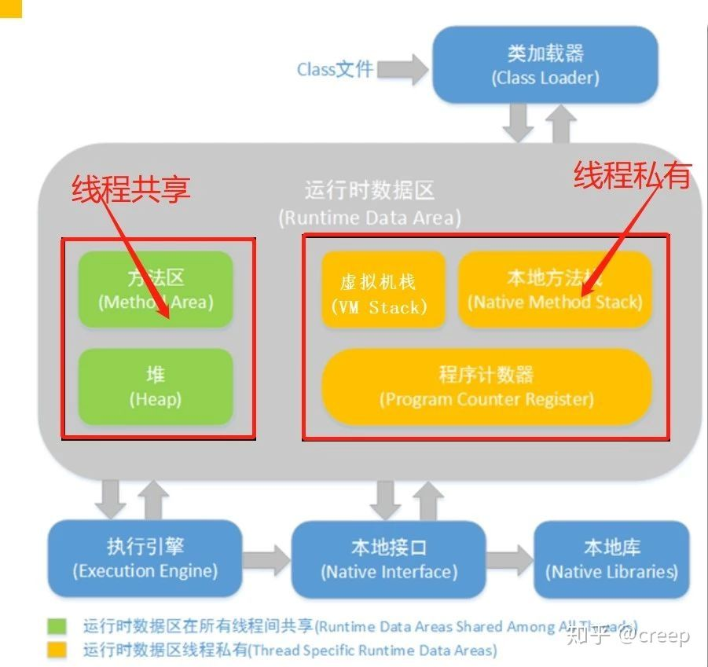
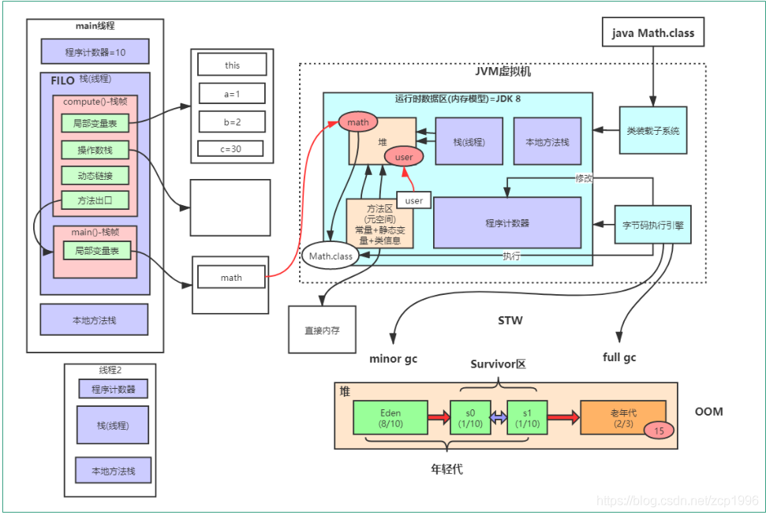
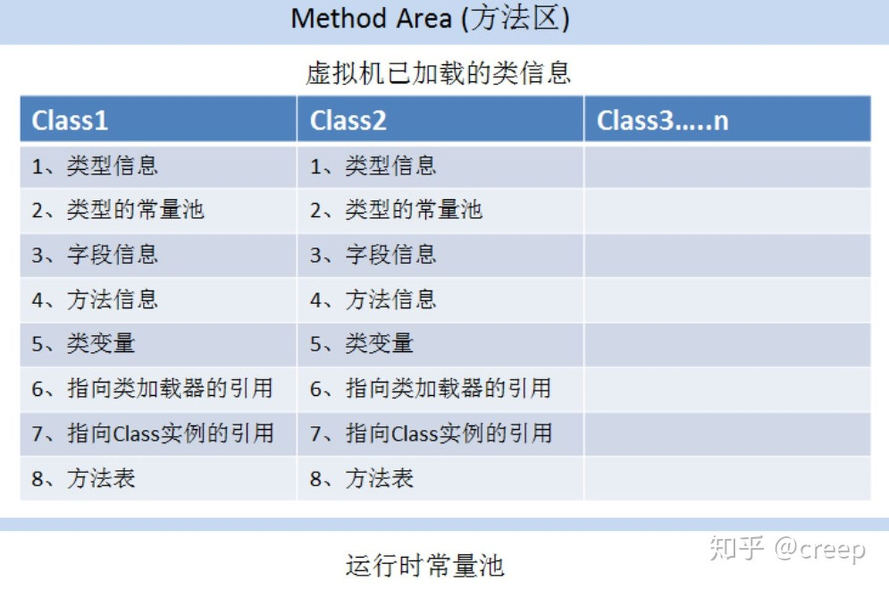
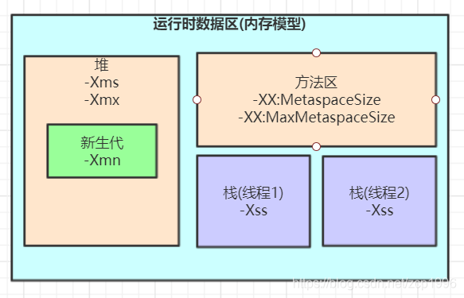

# 1 内存模型图


# 2 内存模块说明
## 2.1 0x01:程序计数器（Program Counter Register）
程序计数器（Program Counter Register）是一块较小的内存空间，它可以看作是当前线程所执行的字节码的行号指示器。在虚拟机概念模型里（概念模型，各种虚拟机可能会通过一些更高效的方式实现），字节码解释器工作时就是通过改变这个计数器的值来选取下一条需要执行的字节码指令：分支、跳转、循环、异常处理、线程恢复等基础操作都会依赖这个计数器来完成。每个线程都有独立的程序计数器，用来在线程切换后能恢复到正确的执行位置，各条线程之间的计数器互不影响，独立存储。所以它是一个“线程私有”的内存区域。此内存区域是唯一一个在JVM规范中没有规定任何OutOfMemoryError情况的区域。
## 2.2 0x02:虚拟机栈（VM Stack）
JVM栈是线程私有的内存区域。它描述的是java方法执行的内存模型，每个方法执行的同时都会创建一个栈帧（Stack Frame）用于存储局部变量表、操作数栈、动态链接、方法出口等信息。每个方法从调用直至完成的过程，都对应着一个栈帧从入栈到出栈的过程。每当一个方法执行完成时，该栈帧就会弹出栈帧的元素作为这个方法的返回值，并且清除这个栈帧，Java栈的栈顶的栈帧就是当前正在执行的活动栈，也就是当前正在执行的方法。就像是组成动画的一帧一帧的图片，方法的调用过程也是由栈帧切换来产生结果。

局部变量表存放了编译器可知的各种基本数据类型（int、short、byte、char、double、float、long、boolean）、对象引用（reference类型，它不等同于对象本身，可能是一个指向对象起始地址的引用指针，也可能是指向一个代表对象的句柄或其他与此对象相关的位置）和returnAddress类型（指向了一跳字节码指令的地址）。

在JVM规范中，对这个区域规定了两种异常情况：如果线程请求的栈深度大于虚拟机允许的深度，将抛出StackOverflowError异常【？方法递归调用自己】；如果虚拟机栈可以动态扩展，在扩展时无法申请到足够的内存，就会抛出OutOfMemoryError异常。
## 2.3 0x03:本地方法栈（ Native Method Stack）
本地方法栈和虚拟机栈所发挥的作用是很相似的，它们之间的区别不过是虚拟机栈为虚拟机执行Java方法（字节码）服务，而本地方法栈则为虚拟机使用到的Native方法服务。Sun HotSpot 直接就把本地方法栈和虚拟机栈合二为一。本地方法栈也会抛出StackOverflowError和OutOfMemoryError异常。
## 2.4 0x04:堆（Heap）
Heap是OOM故障最主要的发源地，它存储着几乎所有的实例对象，堆由垃圾收集器自动回收，堆区由各子线程共享使用【？哪些操作会导致堆异常】；通常情况下，它占用的空间是所有内存区域中最大的，但如果无节制地创建大量对象，也容易消耗完所有的空间；堆的内存空间既可以固定大小，也可运行时动态地调整，通过参数-Xms设定初始值、-Xmx设定最大值。
## 2.5 0x05:方法区（Method Area）
方法区是被所有线程共享的内存区域，用来存储已被虚拟机加载的类信息、常量、静态变量、JIT（just in time,即时编译技术）编译后的代码等数据。运行时常量池是方法区的一部分，用于存放编译期间生成的各种字面常量和符号引用。  
  
通过反射获取到的类型、方法名、字段名称、访问修饰符等信息就是从方法区获取到的。在使用到CGLib对类进行增强时，增强的类越多，就需要越大的方法区类存储动态生成的Class信息，当存放方法区数据的内存溢出时，会报OutOfMemoryError异常。在jdk1.8中也就是Metaspace内存溢出，可以通过参数JVM参数-XX:MetaspaceSize和-XX:MaxMetaspaceSize设置Metaspace的空间大小。jdk1.8后方法区（Method Area）被元空间(Metaspace)代替。

# 3 jvm 参数配置
  
方法区连个参数 -XX:MetaspaceSize, -XX:MaxMetaspaceSize

 **-XX:MaxMetaspaceSize:**  
方法区最大内存空间，如果不设置默认为-1，及不限制大小，或者说是物理机内存大小。

 **-XX:MetaspaceSize:**  
 该参数设置触发full gc的阈值，默认为21M，方法区占用空间超过该值，JVM会触发一次full gc,之后会对该次GC结果进行评估，如果gc过后清理了大部分的类元信息，释放了大量内存，就会动态调整该参数的值，减少该阈值，反之则增加该阈值。如果一个web项目class文件较多（通常情况），且不设置该值，当方法区内存占满21M后会频繁出现full gc ，具体体现就是启动tomcat项目过程很慢。所以一般需要手动设置该参数大小。一般一个8G的服务机器设置成256M合适。

 **-Xss**  
虚拟机栈空间大小设置
java.lang.StackOverflowError 栈空间溢出例子
```
package com.zcp.jvm;
 
/**
 * 线程栈空间测试
 */
public class XssTest {
 
    static int count =0;
 
    static void redo(){
        count++;
        redo();
    }
 
    /**
     * -Xss128K  设置不同栈空间大小测试
     * @param args
     */
    public static void main(String[] args) {
        try {
            redo();
        }catch (Exception e){
            e.printStackTrace();
        }finally {
            System.out.println(count);
        }
    }
}
```
输出结果
```
21644
Exception in thread "main" java.lang.StackOverflowError
	at jvm.test.JvmTest.redo(JvmTest.java:12)
	at jvm.test.JvmTest.redo(JvmTest.java:12)
	at jvm.test.JvmTest.redo(JvmTest.java:12)
	at jvm.test.JvmTest.redo(JvmTest.java:12)
	at jvm.test.JvmTest.redo(JvmTest.java:12)
```
当-Xss值设置的越大，对应count值就越大，体现JVM内存模型中就是 线程栈的栈帧数量越多，虚拟机可分配的线程数就会越小。
# 4 参考
> https://zhuanlan.zhihu.com/p/101495810
> https://blog.csdn.net/zcp1996/article/details/119053604