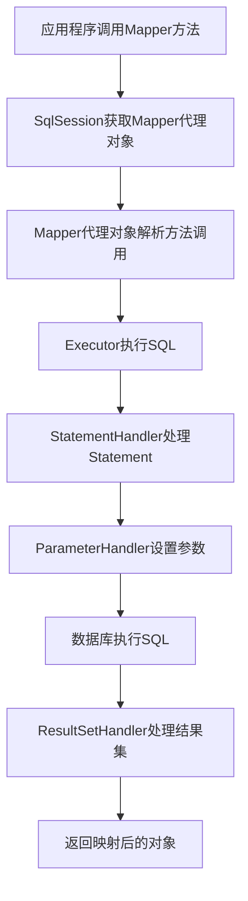
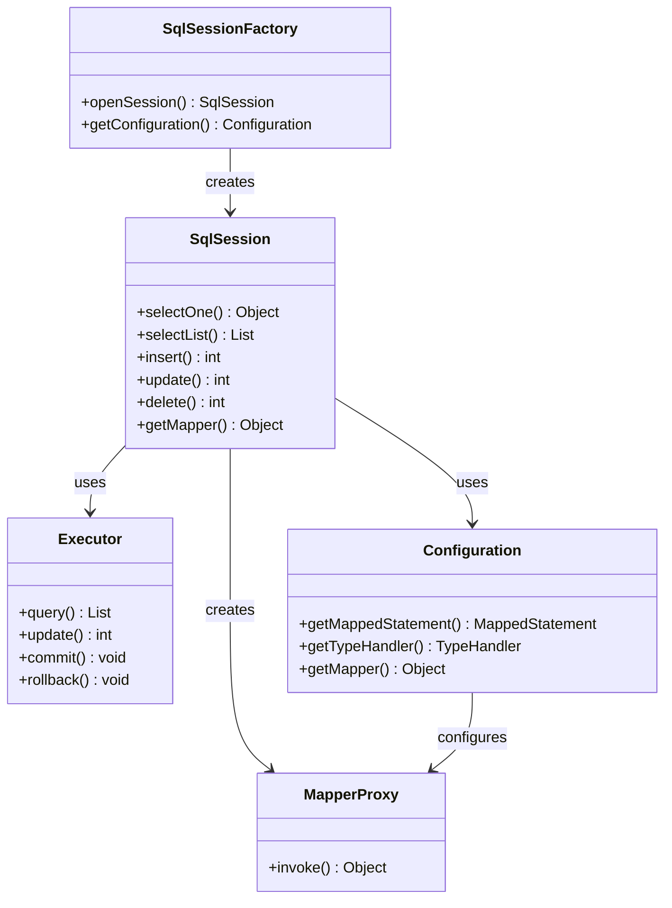

# A01 - MyBatis概念和基础

## 重点内容

- MyBatis的定义和特点
- MyBatis与其他ORM框架的对比
- MyBatis的核心优势和应用场景
- MyBatis的整体架构设计
- MyBatis的发展历史和版本演进

## 1. MyBatis概念介绍

### 1.1 什么是MyBatis

MyBatis是一款优秀的**持久层框架**，它支持自定义SQL、存储过程以及高级映射。MyBatis避免了几乎所有的JDBC代码和手动设置参数以及获取结果集。MyBatis可以使用简单的XML或注解来配置和映射原生信息，将接口和Java的POJOs映射成数据库中的记录。

### 1.2 MyBatis的核心特点

1. **半自动化ORM框架**：MyBatis不是完全的ORM框架，它需要开发者编写SQL语句，但提供了强大的映射功能
2. **灵活的SQL控制**：开发者可以完全控制SQL语句的编写，包括复杂查询、存储过程等
3. **强大的映射功能**：支持一对一、一对多、多对多等复杂关联映射
4. **动态SQL支持**：提供丰富的动态SQL标签，可以根据条件动态生成SQL
5. **插件机制**：支持插件扩展，如分页、性能监控等
6. **缓存机制**：提供一级缓存和二级缓存，提升查询性能

### 1.3 MyBatis与其他ORM框架对比

| 特性 | MyBatis | Hibernate | JPA |
|------|---------|-----------|-----|
| SQL控制 | 完全控制 | 自动生成 | 自动生成 |
| 学习曲线 | 简单 | 复杂 | 中等 |
| 性能 | 优秀 | 一般 | 一般 |
| 灵活性 | 高 | 中等 | 中等 |
| 映射复杂度 | 支持复杂映射 | 支持复杂映射 | 支持复杂映射 |
| 缓存 | 一级+二级 | 多级缓存 | 依赖实现 |

## 2. MyBatis核心原理

### 2.1 整体架构设计

MyBatis的整体架构分为三层：

```
┌─────────────────────────────────────────────────────────────┐
│                    应用层 (Application Layer)                │
├─────────────────────────────────────────────────────────────┤
│  Mapper接口  │  SqlSession  │  配置对象  │  映射文件  │  注解  │
├─────────────────────────────────────────────────────────────┤
│                    核心处理层 (Core Layer)                   │
├─────────────────────────────────────────────────────────────┤
│  Executor  │  StatementHandler  │  ParameterHandler  │  ResultSetHandler  │
├─────────────────────────────────────────────────────────────┤
│                    基础支撑层 (Foundation Layer)             │
├─────────────────────────────────────────────────────────────┤
│  数据源  │  事务管理  │  缓存  │  日志  │  插件  │
├─────────────────────────────────────────────────────────────┤
│                    数据库层 (Database Layer)                 │
└─────────────────────────────────────────────────────────────┘
```

### 2.2 核心执行流程



### 2.3 设计思想

MyBatis的设计思想主要体现在以下几个方面：

1. **简单易用**：提供简单的API，降低学习成本
2. **灵活可控**：开发者可以完全控制SQL，满足复杂业务需求
3. **性能优先**：通过缓存、连接池等技术优化性能
4. **可扩展性**：提供插件机制，支持功能扩展
5. **解耦合**：将SQL与Java代码分离，便于维护

## 3. 关键类分析

### 3.1 核心接口和类

#### 3.1.1 SqlSessionFactory

```java
public interface SqlSessionFactory {
    // 创建SqlSession实例
    SqlSession openSession();
    SqlSession openSession(boolean autoCommit);
    SqlSession openSession(Connection connection);
    SqlSession openSession(TransactionIsolationLevel level);
    SqlSession openSession(ExecutorType execType);
    SqlSession openSession(ExecutorType execType, boolean autoCommit);
    SqlSession openSession(ExecutorType execType, TransactionIsolationLevel level);
    SqlSession openSession(ExecutorType execType, Connection connection);
    
    // 获取配置信息
    Configuration getConfiguration();
}
```

**设计思想**：SqlSessionFactory采用工厂模式，负责创建SqlSession实例。它是线程安全的，通常在整个应用生命周期中只需要一个实例。

#### 3.1.2 SqlSession

```java
public interface SqlSession extends Closeable {
    // 执行查询
    <T> T selectOne(String statement);
    <T> T selectOne(String statement, Object parameter);
    <E> List<E> selectList(String statement);
    <E> List<E> selectList(String statement, Object parameter);
    <E> List<E> selectList(String statement, Object parameter, RowBounds rowBounds);
    
    // 执行更新
    int insert(String statement);
    int insert(String statement, Object parameter);
    int update(String statement);
    int update(String statement, Object parameter);
    int delete(String statement);
    int delete(String statement, Object parameter);
    
    // 事务控制
    void commit();
    void commit(boolean force);
    void rollback();
    void rollback(boolean force);
    
    // 获取Mapper
    <T> T getMapper(Class<T> type);
    
    // 获取配置
    Configuration getConfiguration();
}
```

**设计思想**：SqlSession是MyBatis的核心接口，代表与数据库的一次会话。它不是线程安全的，每个线程都应该有自己的SqlSession实例。

#### 3.1.3 Executor

```java
public interface Executor {
    // 执行查询
    <E> List<E> query(MappedStatement ms, Object parameter, RowBounds rowBounds, 
                      ResultHandler resultHandler, CacheKey key, BoundSql boundSql);
    
    // 执行更新
    int update(MappedStatement ms, Object parameter);
    
    // 事务控制
    void commit(boolean required);
    void rollback(boolean required);
    
    // 缓存操作
    CacheKey createCacheKey(MappedStatement ms, Object parameterObject, 
                           RowBounds rowBounds, BoundSql boundSql);
    boolean isCached(MappedStatement ms, CacheKey key);
    void deferLoad(MappedStatement ms, MetaObject resultObject, String property, 
                   CacheKey key, Class<?> targetType);
    
    // 清理
    void clearLocalCache();
    void setExecutorWrapper(Executor executor);
}
```

**设计思想**：Executor是SQL执行器，负责执行SQL语句并返回结果。它采用策略模式，支持不同的执行策略（Simple、Reuse、Batch）。

### 3.2 核心类图关系



## 4. MyBatis发展历史和版本演进

### 4.1 发展历程

1. **2001年**：iBATIS项目启动，由Clinton Begin创建
2. **2002年**：iBATIS 1.0发布
3. **2004年**：iBATIS 2.0发布，增加了更多功能
4. **2010年**：Apache Software Foundation接管iBATIS项目
5. **2013年**：MyBatis 3.0发布，重命名为MyBatis
6. **2016年**：MyBatis 3.4发布，增加了更多新特性
7. **2020年**：MyBatis 3.5发布，性能优化和功能增强

### 4.2 版本特性对比

| 版本 | 发布时间 | 主要特性 |
|------|----------|----------|
| 1.0 | 2002年 | 基础SQL映射功能 |
| 2.0 | 2004年 | 动态SQL、缓存、插件 |
| 3.0 | 2013年 | 注解支持、类型处理器 |
| 3.4 | 2016年 | 延迟加载、分页插件 |
| 3.5 | 2020年 | 性能优化、新特性 |

## 5. MyBatis核心优势和应用场景

### 5.1 核心优势

1. **SQL完全可控**：开发者可以编写任意复杂的SQL语句
2. **性能优秀**：相比Hibernate等全自动ORM框架，性能更好
3. **学习成本低**：API简单，容易上手
4. **灵活性高**：支持动态SQL、存储过程等
5. **生态丰富**：有大量的插件和扩展

### 5.2 适用场景

1. **复杂查询场景**：需要编写复杂SQL的业务场景
2. **性能敏感场景**：对性能要求较高的系统
3. **遗留系统集成**：需要与现有SQL集成的场景
4. **存储过程调用**：需要调用数据库存储过程的场景
5. **报表查询**：复杂的报表查询和统计功能

### 5.3 不适用场景

1. **简单CRUD**：如果只是简单的增删改查，使用JPA可能更简单
2. **快速原型**：需要快速开发原型的场景
3. **团队技能**：团队更熟悉Hibernate等框架

## 6. 注意事项

1. **SqlSession线程安全**：SqlSession不是线程安全的，每个线程应该有自己的实例
2. **资源管理**：使用完SqlSession后要及时关闭，避免资源泄露
3. **SQL注入**：使用参数化查询，避免SQL注入风险
4. **缓存使用**：合理使用缓存，避免缓存穿透和雪崩
5. **批量操作**：大量数据操作时使用批量执行器提升性能

## 7. 关联的其它知识

- [MyBatis安装配置](A02-MyBatis安装配置.md)
- [MyBatis核心组件](A03-MyBatis核心组件.md)
- [MyBatis XML配置详解](B01-MyBatis%20XML配置详解.md)
- [MyBatis映射文件详解](B02-MyBatis映射文件详解.md)
- [MyBatis执行器机制详解](C01-MyBatis执行器机制详解.md)
- [MyBatis缓存机制详解](C02-MyBatis缓存机制详解.md)
- [Spring Boot集成MyBatis](../200-Spring/Spring%20Boot集成MyBatis.md)
