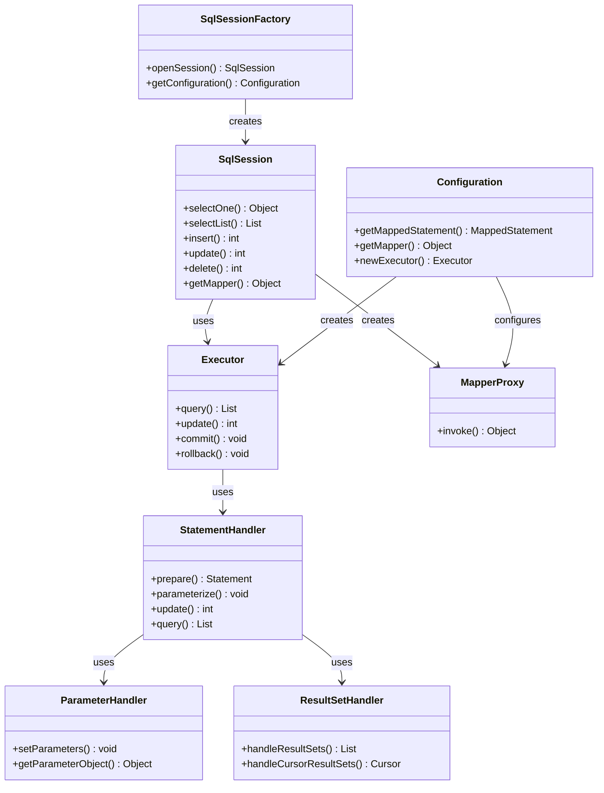
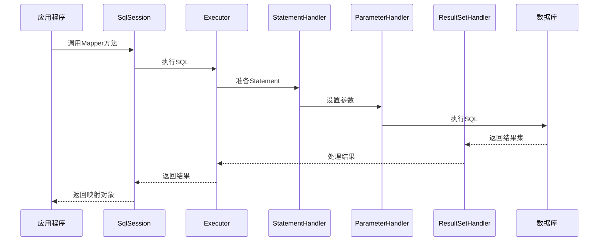

# A03 - MyBatis核心组件

## 重点内容

- SqlSessionFactory的创建和管理
- SqlSession的生命周期管理
- Mapper接口的代理机制
- Executor执行器的类型和选择
- StatementHandler、ResultSetHandler、ParameterHandler的职责

## 1. SqlSessionFactory的创建和管理

### 1.1 SqlSessionFactory接口定义

```java
public interface SqlSessionFactory {
    // 创建SqlSession实例
    SqlSession openSession();
    SqlSession openSession(boolean autoCommit);
    SqlSession openSession(Connection connection);
    SqlSession openSession(TransactionIsolationLevel level);
    SqlSession openSession(ExecutorType execType);
    SqlSession openSession(ExecutorType execType, boolean autoCommit);
    SqlSession openSession(ExecutorType execType, TransactionIsolationLevel level);
    SqlSession openSession(ExecutorType execType, Connection connection);
    
    // 获取配置信息
    Configuration getConfiguration();
}
```

### 1.2 SqlSessionFactoryBuilder构建过程

```java
public class SqlSessionFactoryBuilder {
    
    public SqlSessionFactory build(InputStream inputStream) {
        return build(inputStream, null, null);
    }
    
    public SqlSessionFactory build(InputStream inputStream, String environment) {
        return build(inputStream, environment, null);
    }
    
    public SqlSessionFactory build(InputStream inputStream, String environment, Properties properties) {
        try {
            // 创建XML配置构建器
            XMLConfigBuilder parser = new XMLConfigBuilder(inputStream, environment, properties);
            // 解析配置文件
            Configuration config = parser.parse();
            // 构建SqlSessionFactory
            return build(config);
        } catch (Exception e) {
            throw ExceptionFactory.wrapException("Error building SqlSession.", e);
        } finally {
            ErrorContext.instance().reset();
            try {
                inputStream.close();
            } catch (IOException e) {
                // Intentionally ignore. Prefer previous error.
            }
        }
    }
    
    public SqlSessionFactory build(Configuration config) {
        return new DefaultSqlSessionFactory(config);
    }
}
```

### 1.3 DefaultSqlSessionFactory实现

```java
public class DefaultSqlSessionFactory implements SqlSessionFactory {
    
    private final Configuration configuration;
    
    public DefaultSqlSessionFactory(Configuration configuration) {
        this.configuration = configuration;
    }
    
    @Override
    public SqlSession openSession() {
        return openSessionFromDataSource(configuration.getDefaultExecutorType(), null, false);
    }
    
    @Override
    public SqlSession openSession(boolean autoCommit) {
        return openSessionFromDataSource(configuration.getDefaultExecutorType(), null, autoCommit);
    }
    
    @Override
    public SqlSession openSession(ExecutorType execType) {
        return openSessionFromDataSource(execType, null, false);
    }
    
    @Override
    public SqlSession openSession(TransactionIsolationLevel level) {
        return openSessionFromDataSource(configuration.getDefaultExecutorType(), level, false);
    }
    
    @Override
    public SqlSession openSession(ExecutorType execType, TransactionIsolationLevel level) {
        return openSessionFromDataSource(execType, level, false);
    }
    
    @Override
    public SqlSession openSession(ExecutorType execType, boolean autoCommit) {
        return openSessionFromDataSource(execType, null, autoCommit);
    }
    
    @Override
    public SqlSession openSession(Connection connection) {
        return openSessionFromConnection(configuration.getDefaultExecutorType(), connection);
    }
    
    @Override
    public SqlSession openSession(ExecutorType execType, Connection connection) {
        return openSessionFromConnection(execType, connection);
    }
    
    @Override
    public Configuration getConfiguration() {
        return configuration;
    }
    
    // 从数据源创建SqlSession
    private SqlSession openSessionFromDataSource(ExecutorType execType, TransactionIsolationLevel level, boolean autoCommit) {
        Transaction tx = null;
        try {
            final Environment environment = configuration.getEnvironment();
            final TransactionFactory transactionFactory = getTransactionFactoryFromEnvironment(environment);
            tx = transactionFactory.newTransaction(environment.getDataSource(), level, autoCommit);
            final Executor executor = configuration.newExecutor(tx, execType);
            return new DefaultSqlSession(configuration, executor, autoCommit);
        } catch (Exception e) {
            closeTransaction(tx); // may have fetched a connection so lets call close()
            throw ExceptionFactory.wrapException("Error opening session.  Cause: " + e, e);
        } finally {
            ErrorContext.instance().reset();
        }
    }
    
    // 从连接创建SqlSession
    private SqlSession openSessionFromConnection(ExecutorType execType, Connection connection) {
        try {
            boolean autoCommit;
            try {
                autoCommit = connection.getAutoCommit();
            } catch (SQLException e) {
                // Failover to true, as most poor drivers that don't support the transaction isolation level
                // will also not support autoCommit
                autoCommit = true;
            }
            final Environment environment = configuration.getEnvironment();
            final TransactionFactory transactionFactory = getTransactionFactoryFromEnvironment(environment);
            final Transaction tx = transactionFactory.newTransaction(connection);
            final Executor executor = configuration.newExecutor(tx, execType);
            return new DefaultSqlSession(configuration, executor, autoCommit);
        } catch (Exception e) {
            throw ExceptionFactory.wrapException("Error opening session.  Cause: " + e, e);
        } finally {
            ErrorContext.instance().reset();
        }
    }
}
```

## 2. SqlSession的生命周期管理

### 2.1 SqlSession接口定义

```java
public interface SqlSession extends Closeable {
    // 执行查询
    <T> T selectOne(String statement);
    <T> T selectOne(String statement, Object parameter);
    <E> List<E> selectList(String statement);
    <E> List<E> selectList(String statement, Object parameter);
    <E> List<E> selectList(String statement, Object parameter, RowBounds rowBounds);
    
    // 执行更新
    int insert(String statement);
    int insert(String statement, Object parameter);
    int update(String statement);
    int update(String statement, Object parameter);
    int delete(String statement);
    int delete(String statement, Object parameter);
    
    // 事务控制
    void commit();
    void commit(boolean force);
    void rollback();
    void rollback(boolean force);
    
    // 获取Mapper
    <T> T getMapper(Class<T> type);
    
    // 获取配置
    Configuration getConfiguration();
    
    // 获取连接
    Connection getConnection();
}
```

### 2.2 DefaultSqlSession实现

```java
public class DefaultSqlSession implements SqlSession {
    
    private final Configuration configuration;
    private final Executor executor;
    private final boolean autoCommit;
    private boolean dirty;
    private List<Cursor<?>> cursorList;
    
    public DefaultSqlSession(Configuration configuration, Executor executor, boolean autoCommit) {
        this.configuration = configuration;
        this.executor = executor;
        this.dirty = false;
        this.autoCommit = autoCommit;
    }
    
    @Override
    public <T> T selectOne(String statement) {
        return this.selectOne(statement, null);
    }
    
    @Override
    public <T> T selectOne(String statement, Object parameter) {
        List<T> list = this.selectList(statement, parameter);
        if (list.size() == 1) {
            return list.get(0);
        } else if (list.size() > 1) {
            throw new TooManyResultsException("Expected one result (or null) to be returned by selectOne(), but found: " + list.size());
        } else {
            return null;
        }
    }
    
    @Override
    public <E> List<E> selectList(String statement) {
        return this.selectList(statement, null);
    }
    
    @Override
    public <E> List<E> selectList(String statement, Object parameter) {
        return this.selectList(statement, parameter, RowBounds.DEFAULT);
    }
    
    @Override
    public <E> List<E> selectList(String statement, Object parameter, RowBounds rowBounds) {
        try {
            MappedStatement ms = configuration.getMappedStatement(statement);
            return executor.query(ms, wrapCollection(parameter), rowBounds, Executor.NO_RESULT_HANDLER);
        } catch (Exception e) {
            throw ExceptionFactory.wrapException("Error querying database.  Cause: " + e, e);
        } finally {
            ErrorContext.instance().reset();
        }
    }
    
    @Override
    public int insert(String statement) {
        return insert(statement, null);
    }
    
    @Override
    public int insert(String statement, Object parameter) {
        return update(statement, parameter);
    }
    
    @Override
    public int update(String statement) {
        return update(statement, null);
    }
    
    @Override
    public int update(String statement, Object parameter) {
        try {
            dirty = true;
            MappedStatement ms = configuration.getMappedStatement(statement);
            return executor.update(ms, wrapCollection(parameter));
        } catch (Exception e) {
            throw ExceptionFactory.wrapException("Error updating database.  Cause: " + e, e);
        } finally {
            ErrorContext.instance().reset();
        }
    }
    
    @Override
    public int delete(String statement) {
        return update(statement, null);
    }
    
    @Override
    public int delete(String statement, Object parameter) {
        return update(statement, parameter);
    }
    
    @Override
    public void commit() {
        commit(false);
    }
    
    @Override
    public void commit(boolean force) {
        try {
            executor.commit(isCommitOrRollbackRequired(force));
            dirty = false;
        } catch (Exception e) {
            throw ExceptionFactory.wrapException("Error committing transaction.  Cause: " + e, e);
        } finally {
            ErrorContext.instance().reset();
        }
    }
    
    @Override
    public void rollback() {
        rollback(false);
    }
    
    @Override
    public void rollback(boolean force) {
        try {
            executor.rollback(isCommitOrRollbackRequired(force));
            dirty = false;
        } catch (Exception e) {
            throw ExceptionFactory.wrapException("Error rolling back transaction.  Cause: " + e, e);
        } finally {
            ErrorContext.instance().reset();
        }
    }
    
    @Override
    public <T> T getMapper(Class<T> type) {
        return configuration.getMapper(type, this);
    }
    
    @Override
    public Configuration getConfiguration() {
        return configuration;
    }
    
    @Override
    public Connection getConnection() {
        try {
            return executor.getTransaction().getConnection();
        } catch (SQLException e) {
            throw ExceptionFactory.wrapException("Error getting a new connection.  Cause: " + e, e);
        }
    }
    
    @Override
    public void close() {
        try {
            executor.close(isCommitOrRollbackRequired(false));
            dirty = false;
        } finally {
            ErrorContext.instance().reset();
        }
    }
}
```

### 2.3 SqlSession生命周期管理

```java
// SqlSession生命周期管理示例
public class SqlSessionManager {
    
    private static final ThreadLocal<SqlSession> localSqlSession = new ThreadLocal<>();
    
    public static SqlSession getSqlSession() {
        SqlSession sqlSession = localSqlSession.get();
        if (sqlSession == null) {
            sqlSession = sqlSessionFactory.openSession();
            localSqlSession.set(sqlSession);
        }
        return sqlSession;
    }
    
    public static void closeSqlSession() {
        SqlSession sqlSession = localSqlSession.get();
        if (sqlSession != null) {
            sqlSession.close();
            localSqlSession.remove();
        }
    }
}
```

## 3. Mapper接口的代理机制

### 3.1 MapperProxy代理类

```java
public class MapperProxy<T> implements InvocationHandler, Serializable {
    
    private static final long serialVersionUID = -6424540398559729838L;
    private final SqlSession sqlSession;
    private final Class<T> mapperInterface;
    private final Map<Method, MapperMethod> methodCache;
    
    public MapperProxy(SqlSession sqlSession, Class<T> mapperInterface, Map<Method, MapperMethod> methodCache) {
        this.sqlSession = sqlSession;
        this.mapperInterface = mapperInterface;
        this.methodCache = methodCache;
    }
    
    @Override
    public Object invoke(Object proxy, Method method, Object[] args) throws Throwable {
        try {
            if (Object.class.equals(method.getDeclaringClass())) {
                return method.invoke(this, args);
            } else if (isDefaultMethod(method)) {
                return invokeDefaultMethod(proxy, method, args);
            }
        } catch (Throwable t) {
            throw ExceptionUtil.unwrapThrowable(t);
        }
        final MapperMethod mapperMethod = cachedMapperMethod(method);
        return mapperMethod.execute(sqlSession, args);
    }
    
    private MapperMethod cachedMapperMethod(Method method) {
        MapperMethod mapperMethod = methodCache.get(method);
        if (mapperMethod == null) {
            mapperMethod = new MapperMethod(mapperInterface, method, sqlSession.getConfiguration());
            methodCache.put(method, mapperMethod);
        }
        return mapperMethod;
    }
}
```

### 3.2 MapperRegistry注册器

```java
public class MapperRegistry {
    
    private final Configuration config;
    private final Map<Class<?>, MapperProxyFactory<?>> knownMappers = new HashMap<>();
    
    public MapperRegistry(Configuration config) {
        this.config = config;
    }
    
    @SuppressWarnings("unchecked")
    public <T> T getMapper(Class<T> type, SqlSession sqlSession) {
        final MapperProxyFactory<T> mapperProxyFactory = (MapperProxyFactory<T>) knownMappers.get(type);
        if (mapperProxyFactory == null) {
            throw new BindingException("Type " + type + " is not known to the MapperRegistry.");
        }
        try {
            return mapperProxyFactory.newInstance(sqlSession);
        } catch (Exception e) {
            throw new BindingException("Error getting mapper instance. Cause: " + e, e);
        }
    }
    
    public <T> boolean hasMapper(Class<T> type) {
        return knownMappers.containsKey(type);
    }
    
    public <T> void addMapper(Class<T> type) {
        if (type.isInterface()) {
            if (hasMapper(type)) {
                throw new BindingException("Type " + type + " is already known to the MapperRegistry.");
            }
            boolean loadCompleted = false;
            try {
                knownMappers.put(type, new MapperProxyFactory<>(type));
                // It's important that the type is added before the parser is run
                // otherwise the binding may automatically be attempted by the
                // mapper parser. If the type is already known, it won't try.
                MapperAnnotationBuilder parser = new MapperAnnotationBuilder(config, type);
                parser.parse();
                loadCompleted = true;
            } finally {
                if (!loadCompleted) {
                    knownMappers.remove(type);
                }
            }
        }
    }
}
```

### 3.3 MapperProxyFactory工厂类

```java
public class MapperProxyFactory<T> {
    
    private final Class<T> mapperInterface;
    private final Map<Method, MapperMethod> methodCache = new ConcurrentHashMap<>();
    
    public MapperProxyFactory(Class<T> mapperInterface) {
        this.mapperInterface = mapperInterface;
    }
    
    public Class<T> getMapperInterface() {
        return mapperInterface;
    }
    
    public Map<Method, MapperMethod> getMethodCache() {
        return methodCache;
    }
    
    @SuppressWarnings("unchecked")
    protected T newInstance(MapperProxy<T> mapperProxy) {
        return (T) Proxy.newProxyInstance(mapperInterface.getClassLoader(), new Class[] { mapperInterface }, mapperProxy);
    }
    
    public T newInstance(SqlSession sqlSession) {
        final MapperProxy<T> mapperProxy = new MapperProxy<>(sqlSession, mapperInterface, methodCache);
        return newInstance(mapperProxy);
    }
}
```

## 4. Executor执行器的类型和选择

### 4.1 Executor接口定义

```java
public interface Executor {
    
    ResultHandler NO_RESULT_HANDLER = null;
    
    // 执行查询
    <E> List<E> query(MappedStatement ms, Object parameter, RowBounds rowBounds, 
                      ResultHandler resultHandler, CacheKey key, BoundSql boundSql);
    
    <E> List<E> query(MappedStatement ms, Object parameter, RowBounds rowBounds, 
                      ResultHandler resultHandler);
    
    // 执行更新
    int update(MappedStatement ms, Object parameter);
    
    // 事务控制
    void commit(boolean required);
    void rollback(boolean required);
    
    // 缓存操作
    CacheKey createCacheKey(MappedStatement ms, Object parameterObject, 
                           RowBounds rowBounds, BoundSql boundSql);
    boolean isCached(MappedStatement ms, CacheKey key);
    void deferLoad(MappedStatement ms, MetaObject resultObject, String property, 
                   CacheKey key, Class<?> targetType);
    
    // 清理
    void clearLocalCache();
    void setExecutorWrapper(Executor executor);
    
    // 获取连接
    Connection getConnection();
    
    // 关闭
    void close(boolean forceRollback);
    
    // 是否关闭
    boolean isClosed();
}
```

### 4.2 SimpleExecutor简单执行器

```java
public class SimpleExecutor extends BaseExecutor {
    
    public SimpleExecutor(Configuration configuration, Transaction transaction) {
        super(configuration, transaction);
    }
    
    @Override
    public int doUpdate(MappedStatement ms, Object parameter) throws SQLException {
        Statement stmt = null;
        try {
            Configuration configuration = ms.getConfiguration();
            StatementHandler handler = configuration.newStatementHandler(this, ms, parameter, RowBounds.DEFAULT, null, null);
            stmt = prepareStatement(handler, ms.getStatementLog());
            return handler.update(stmt);
        } finally {
            closeStatement(stmt);
        }
    }
    
    @Override
    public <E> List<E> doQuery(MappedStatement ms, Object parameter, RowBounds rowBounds, ResultHandler resultHandler, BoundSql boundSql) throws SQLException {
        Statement stmt = null;
        try {
            Configuration configuration = ms.getConfiguration();
            StatementHandler handler = configuration.newStatementHandler(wrapper, ms, parameter, rowBounds, resultHandler, boundSql);
            stmt = prepareStatement(handler, ms.getStatementLog());
            return handler.query(stmt, resultHandler);
        } finally {
            closeStatement(stmt);
        }
    }
    
    @Override
    public List<BatchResult> doFlushStatements(boolean isRollback) throws SQLException {
        return Collections.emptyList();
    }
    
    private Statement prepareStatement(StatementHandler handler, Log statementLog) throws SQLException {
        Statement stmt;
        Connection connection = getConnection(statementLog);
        stmt = handler.prepare(connection, transaction.getTimeout());
        handler.parameterize(stmt);
        return stmt;
    }
}
```

### 4.3 ReuseExecutor重用执行器

```java
public class ReuseExecutor extends BaseExecutor {
    
    private final Map<String, Statement> statementMap = new HashMap<>();
    
    public ReuseExecutor(Configuration configuration, Transaction transaction) {
        super(configuration, transaction);
    }
    
    @Override
    public int doUpdate(MappedStatement ms, Object parameter) throws SQLException {
        Configuration configuration = ms.getConfiguration();
        StatementHandler handler = configuration.newStatementHandler(this, ms, parameter, RowBounds.DEFAULT, null, null);
        Statement stmt = prepareStatement(handler, ms.getStatementLog());
        return handler.update(stmt);
    }
    
    @Override
    public <E> List<E> doQuery(MappedStatement ms, Object parameter, RowBounds rowBounds, ResultHandler resultHandler, BoundSql boundSql) throws SQLException {
        Configuration configuration = ms.getConfiguration();
        StatementHandler handler = configuration.newStatementHandler(wrapper, ms, parameter, rowBounds, resultHandler, boundSql);
        Statement stmt = prepareStatement(handler, ms.getStatementLog());
        return handler.query(stmt, resultHandler);
    }
    
    @Override
    public List<BatchResult> doFlushStatements(boolean isRollback) throws SQLException {
        for (Statement stmt : statementMap.values()) {
            closeStatement(stmt);
        }
        statementMap.clear();
        return Collections.emptyList();
    }
    
    private Statement prepareStatement(StatementHandler handler, Log statementLog) throws SQLException {
        Statement stmt;
        BoundSql boundSql = handler.getBoundSql();
        String sql = boundSql.getSql();
        
        if (hasStatementFor(sql)) {
            stmt = getStatement(sql);
            applyTransactionTimeout(stmt);
        } else {
            Connection connection = getConnection(statementLog);
            stmt = handler.prepare(connection, transaction.getTimeout());
            putStatement(sql, stmt);
        }
        
        handler.parameterize(stmt);
        return stmt;
    }
    
    private boolean hasStatementFor(String sql) {
        try {
            return statementMap.keySet().contains(sql) && !statementMap.get(sql).getConnection().isClosed();
        } catch (SQLException e) {
            return false;
        }
    }
    
    private Statement getStatement(String s) {
        return statementMap.get(s);
    }
    
    private void putStatement(String sql, Statement stmt) {
        statementMap.put(sql, stmt);
    }
}
```

### 4.4 BatchExecutor批量执行器

```java
public class BatchExecutor extends BaseExecutor {
    
    public static final int BATCH_UPDATE_RETURN_VALUE = Integer.MIN_VALUE + 1002;
    
    private final List<Statement> statementList = new ArrayList<>();
    private final List<BatchResult> batchResultList = new ArrayList<>();
    private String currentSql;
    private MappedStatement currentStatement;
    
    public BatchExecutor(Configuration configuration, Transaction transaction) {
        super(configuration, transaction);
    }
    
    @Override
    public int doUpdate(MappedStatement ms, Object parameterObject) throws SQLException {
        final Configuration configuration = ms.getConfiguration();
        final StatementHandler handler = configuration.newStatementHandler(this, ms, parameterObject, RowBounds.DEFAULT, null, null);
        final BoundSql boundSql = handler.getBoundSql();
        final String sql = boundSql.getSql();
        final Statement stmt;
        
        if (sql.equals(currentSql) && ms.equals(currentStatement)) {
            int last = statementList.size() - 1;
            stmt = statementList.get(last);
            applyTransactionTimeout(stmt);
            handler.parameterize(stmt);
            BatchResult batchResult = batchResultList.get(last);
            batchResult.addParameterObject(parameterObject);
        } else {
            Connection connection = getConnection(ms.getStatementLog());
            stmt = handler.prepare(connection, transaction.getTimeout());
            handler.parameterize(stmt);
            currentSql = sql;
            currentStatement = ms;
            statementList.add(stmt);
            batchResultList.add(new BatchResult(ms, sql, parameterObject));
        }
        
        handler.batch(stmt);
        return BATCH_UPDATE_RETURN_VALUE;
    }
    
    @Override
    public <E> List<E> doQuery(MappedStatement ms, Object parameterObject, RowBounds rowBounds, ResultHandler resultHandler, BoundSql boundSql) throws SQLException {
        Statement stmt = null;
        try {
            flushStatements();
            Configuration configuration = ms.getConfiguration();
            StatementHandler handler = configuration.newStatementHandler(wrapper, ms, parameterObject, rowBounds, resultHandler, boundSql);
            Connection connection = getConnection(ms.getStatementLog());
            stmt = handler.prepare(connection, transaction.getTimeout());
            handler.parameterize(stmt);
            return handler.query(stmt, resultHandler);
        } finally {
            closeStatement(stmt);
        }
    }
    
    @Override
    public List<BatchResult> doFlushStatements(boolean isRollback) throws SQLException {
        try {
            List<BatchResult> results = new ArrayList<>();
            if (isRollback) {
                return Collections.emptyList();
            }
            for (int i = 0, n = statementList.size(); i < n; i++) {
                Statement stmt = statementList.get(i);
                applyTransactionTimeout(stmt);
                BatchResult batchResult = batchResultList.get(i);
                try {
                    batchResult.setUpdateCounts(stmt.executeBatch());
                    MappedStatement ms = batchResult.getMappedStatement();
                    List<Object> parameterObjects = batchResult.getParameterObjects();
                    KeyGenerator keyGenerator = ms.getKeyGenerator();
                    if (Jdbc3KeyGenerator.class.equals(keyGenerator.getClass())) {
                        Jdbc3KeyGenerator jdbc3KeyGenerator = (Jdbc3KeyGenerator) keyGenerator;
                        jdbc3KeyGenerator.processBatch(ms, stmt, parameterObjects);
                    } else if (!NoKeyGenerator.class.equals(keyGenerator.getClass())) {
                        for (Object parameter : parameterObjects) {
                        keyGenerator.processAfter(this, ms, stmt, parameter);
                    }
                }
                } catch (BatchUpdateException e) {
                    StringBuilder message = new StringBuilder();
                    message.append(batchResult.getMappedStatement().getId()).append(" (batch index #").append(i + 1).append(")");
                    message.append(" failed.");
                    if (i > 0) {
                        message.append(" ").append(i).append(" prior sub executor(s) completed successfully, but will be rolled back.");
                    }
                    throw new BatchExecutorException(message.toString(), e, results, batchResult);
                }
                results.add(batchResult);
            }
            return results;
        } finally {
            for (Statement stmt : statementList) {
                closeStatement(stmt);
            }
            currentSql = null;
            statementList.clear();
            batchResultList.clear();
        }
    }
}
```

## 5. StatementHandler、ResultSetHandler、ParameterHandler的职责

### 5.1 StatementHandler接口

```java
public interface StatementHandler {
    
    // 准备Statement
    Statement prepare(Connection connection, Integer transactionTimeout) throws SQLException;
    
    // 参数化Statement
    void parameterize(Statement statement) throws SQLException;
    
    // 批量操作
    void batch(Statement statement) throws SQLException;
    
    // 执行更新
    int update(Statement statement) throws SQLException;
    
    // 执行查询
    <E> List<E> query(Statement statement, ResultHandler resultHandler) throws SQLException;
    
    // 获取BoundSql
    BoundSql getBoundSql();
    
    // 获取ParameterHandler
    ParameterHandler getParameterHandler();
}
```

### 5.2 PreparedStatementHandler实现

```java
public class PreparedStatementHandler extends BaseStatementHandler {
    
    public PreparedStatementHandler(Executor executor, MappedStatement mappedStatement, Object parameterObject, RowBounds rowBounds, ResultHandler resultHandler, BoundSql boundSql) {
        super(executor, mappedStatement, parameterObject, rowBounds, resultHandler, boundSql);
    }
    
    @Override
    protected Statement instantiateStatement(Connection connection) throws SQLException {
        String sql = boundSql.getSql();
        if (mappedStatement.getKeyGenerator() instanceof Jdbc3KeyGenerator) {
            String[] keyColumnNames = mappedStatement.getKeyColumns();
            if (keyColumnNames == null) {
                return connection.prepareStatement(sql, PreparedStatement.RETURN_GENERATED_KEYS);
            } else {
                return connection.prepareStatement(sql, keyColumnNames);
            }
        } else if (mappedStatement.getResultSetType() != null) {
            return connection.prepareStatement(sql, mappedStatement.getResultSetType().getValue(), ResultSet.CONCUR_READ_ONLY);
        } else {
            return connection.prepareStatement(sql);
        }
    }
    
    @Override
    public void parameterize(Statement statement) throws SQLException {
        parameterHandler.setParameters((PreparedStatement) statement);
    }
    
    @Override
    public int update(Statement statement) throws SQLException {
        PreparedStatement ps = (PreparedStatement) statement;
        ps.execute();
        int rows = ps.getUpdateCount();
        Object parameterObject = boundSql.getParameterObject();
        KeyGenerator keyGenerator = mappedStatement.getKeyGenerator();
        keyGenerator.processAfter(executor, mappedStatement, ps, parameterObject);
        return rows;
    }
    
    @Override
    public void batch(Statement statement) throws SQLException {
        PreparedStatement ps = (PreparedStatement) statement;
        ps.addBatch();
    }
    
    @Override
    public <E> List<E> query(Statement statement, ResultHandler resultHandler) throws SQLException {
        PreparedStatement ps = (PreparedStatement) statement;
        ps.execute();
        return resultSetHandler.handleResultSets(ps);
    }
}
```

### 5.3 ResultSetHandler接口

```java
public interface ResultSetHandler {
    
    // 处理结果集
    <E> List<E> handleResultSets(Statement stmt) throws SQLException;
    
    // 处理游标结果集
    <E> Cursor<E> handleCursorResultSets(Statement stmt) throws SQLException;
    
    // 处理输出参数
    void handleOutputParameters(CallableStatement cs) throws SQLException;
}
```

### 5.4 ParameterHandler接口

```java
public interface ParameterHandler {
    
    // 获取参数对象
    Object getParameterObject();
    
    // 设置参数
    void setParameters(PreparedStatement ps) throws SQLException;
}
```

### 5.5 DefaultParameterHandler实现

```java
public class DefaultParameterHandler implements ParameterHandler {
    
    private final TypeHandlerRegistry typeHandlerRegistry;
    private final MappedStatement mappedStatement;
    private final Object parameterObject;
    private final BoundSql boundSql;
    private final Configuration configuration;
    
    public DefaultParameterHandler(MappedStatement mappedStatement, Object parameterObject, BoundSql boundSql) {
        this.mappedStatement = mappedStatement;
        this.configuration = mappedStatement.getConfiguration();
        this.typeHandlerRegistry = mappedStatement.getConfiguration().getTypeHandlerRegistry();
        this.parameterObject = parameterObject;
        this.boundSql = boundSql;
    }
    
    @Override
    public Object getParameterObject() {
        return parameterObject;
    }
    
    @Override
    public void setParameters(PreparedStatement ps) throws SQLException {
        ErrorContext.instance().activity("setting parameters").object(mappedStatement.getParameterMap().getId());
        List<ParameterMapping> parameterMappings = boundSql.getParameterMappings();
        if (parameterMappings != null) {
            for (int i = 0; i < parameterMappings.size(); i++) {
                ParameterMapping parameterMapping = parameterMappings.get(i);
                if (parameterMapping.getMode() != ParameterMode.OUT) {
                    Object value;
                    String propertyName = parameterMapping.getProperty();
                    if (boundSql.hasAdditionalParameter(propertyName)) {
                        value = boundSql.getAdditionalParameter(propertyName);
                    } else if (parameterObject == null) {
                        value = null;
                    } else if (typeHandlerRegistry.hasTypeHandler(parameterObject.getClass())) {
                        value = parameterObject;
                    } else {
                        MetaObject metaObject = configuration.newMetaObject(parameterObject);
                        value = metaObject.getValue(propertyName);
                    }
                    TypeHandler typeHandler = parameterMapping.getTypeHandler();
                    JdbcType jdbcType = parameterMapping.getJdbcType();
                    if (value == null && jdbcType == null) {
                        jdbcType = configuration.getJdbcTypeForNull();
                    }
                    try {
                        typeHandler.setParameter(ps, i + 1, value, jdbcType);
                    } catch (TypeException | SQLException e) {
                        throw new TypeException("Could not set parameters for mapping: " + parameterMapping + ". Cause: " + e, e);
                    }
                }
            }
        }
    }
}
```

## 6. 核心组件的类图关系



## 7. 组件间的协作机制

### 7.1 执行流程协作



### 7.2 代理模式实现原理

```java
// 代理模式在MyBatis中的应用
public class MapperProxyFactory<T> {
    
    private final Class<T> mapperInterface;
    private final Map<Method, MapperMethod> methodCache = new ConcurrentHashMap<>();
    
    @SuppressWarnings("unchecked")
    protected T newInstance(MapperProxy<T> mapperProxy) {
        // 使用JDK动态代理创建Mapper接口的代理对象
        return (T) Proxy.newProxyInstance(
            mapperInterface.getClassLoader(), 
            new Class[] { mapperInterface }, 
            mapperProxy
        );
    }
    
    public T newInstance(SqlSession sqlSession) {
        final MapperProxy<T> mapperProxy = new MapperProxy<>(sqlSession, mapperInterface, methodCache);
        return newInstance(mapperProxy);
    }
}
```

## 8. 注意事项

1. **SqlSession线程安全**：SqlSession不是线程安全的，每个线程应该有自己的实例
2. **Executor选择**：根据业务场景选择合适的执行器类型
3. **资源管理**：及时关闭Statement和ResultSet，避免资源泄露
4. **缓存使用**：合理使用一级缓存和二级缓存
5. **参数处理**：注意参数类型转换和空值处理
6. **结果映射**：正确配置结果映射，避免映射错误

## 9. 关联的其它知识

- [MyBatis概念和基础](A01-MyBatis概念和基础.md)
- [MyBatis安装配置](A02-MyBatis安装配置.md)
- [MyBatis执行器机制详解](C01-MyBatis执行器机制详解.md)
- [MyBatis缓存机制详解](C02-MyBatis缓存机制详解.md)
- [MyBatis结果映射详解](C05-MyBatis结果映射详解.md)
- [动态代理模式](../500-基础理论/设计模式/动态代理模式.md)
