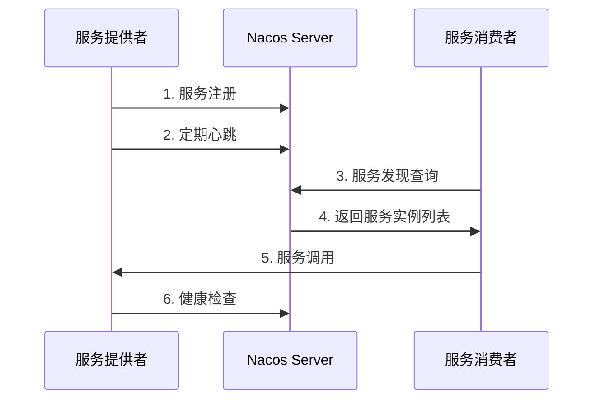
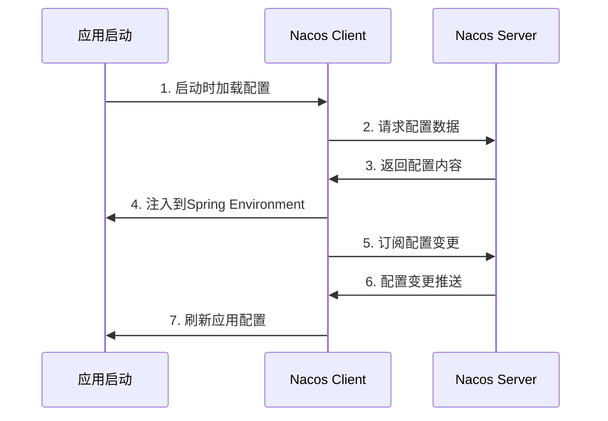

# Nacos 简介与实现原理

## 1. Nacos 概述

Nacos 是阿里巴巴开源的服务注册与发现以及配置管理中心，旨在帮助开发者更高效地构建、交付和管理微服务。

### 核心功能
- **服务发现**：微服务之间的服务注册与发现
- **配置管理**：应用配置的集中管理和动态更新
- **服务管理**：服务健康检查、负载均衡、故障转移

## 2. Nacos 在 Java 项目中的引入

### 2.1 Maven 依赖配置

```xml
<!-- 服务发现依赖 -->
<dependency>
    <groupId>com.alibaba.cloud</groupId>
    <artifactId>spring-cloud-starter-alibaba-nacos-discovery</artifactId>
</dependency>

<!-- 配置管理依赖 -->
<dependency>
    <groupId>com.alibaba.cloud</groupId>
    <artifactId>spring-cloud-starter-alibaba-nacos-config</artifactId>
</dependency>

<!-- Bootstrap 上下文支持 -->
<dependency>
    <groupId>org.springframework.cloud</groupId>
    <artifactId>spring-cloud-starter-bootstrap</artifactId>
</dependency>
```

### 2.2 配置文件设置

#### bootstrap.yml 配置
```yaml
spring:
  application:
    name: your-service-name
  cloud:
    nacos:
      discovery:
        server-addr: localhost:8848
        namespace: your-namespace
        group: DEFAULT_GROUP
      config:
        server-addr: localhost:8848
        namespace: your-namespace
        file-extension: yaml
        shared-configs:
          - dataId: shared-config.yaml
            group: DEFAULT_GROUP
```

### 2.3 应用启动类配置
```java
@SpringBootApplication
@EnableDiscoveryClient  // 启用服务发现
public class Application {
    public static void main(String[] args) {
        SpringApplication.run(Application.class, args);
    }
}
```

## 3. Nacos Discovery 服务发现原理

### 3.1 整体架构
Nacos 服务发现采用**客户端-服务端**架构：
- **Nacos Server**：注册中心，存储服务实例信息
- **Nacos Client**：服务提供者和消费者，与 Server 通信

### 3.2 服务发现流程



### 3.3 核心实现机制

#### 服务注册阶段
1. **应用启动时**：`NacosServiceRegistry` 自动注册服务实例
2. **注册信息**：服务名、IP、端口、健康状态、元数据等
3. **注册策略**：支持临时实例（EPHEMERAL）和持久实例（PERSISTENT）

#### 服务发现阶段
1. **订阅机制**：客户端订阅感兴趣的服务
2. **推送更新**：服务端主动推送服务列表变更
3. **缓存机制**：客户端本地缓存服务实例列表
4. **故障转移**：支持多 Nacos Server 集群

#### 健康检查
1. **客户端心跳**：定期向服务端发送心跳
2. **服务端检查**：服务端检测客户端健康状态
3. **自动摘除**：不健康的实例自动从服务列表中移除

### 3.4 spring-cloud-starter-alibaba-nacos-discovery 内部依赖

| 依赖包 | 版本 | 作用 |
|--------|------|------|
| `spring-cloud-alibaba-commons` | 2023.0.1.0 | Spring Cloud Alibaba 公共模块 |
| `nacos-client` | 2.3.2 | Nacos 客户端核心库 |
| `spring-context-support` | 1.0.11 | Spring 上下文支持 |
| `spring-cloud-commons` | 4.1.2 | Spring Cloud 公共抽象 |
| `spring-cloud-context` | 4.1.2 | Spring Cloud 上下文管理 |

#### 各依赖包的服务发现支持作用

- **nacos-client (2.3.2)**：
  - `NamingService`：服务注册与发现接口
  - `Instance`：服务实例信息封装
  - `ServiceInfo`：服务信息管理
  - 心跳机制、故障检测、负载均衡

- **spring-cloud-commons (4.1.2)**：
  - `ServiceRegistry`：服务注册抽象接口
  - `DiscoveryClient`：服务发现客户端接口
  - `ServiceInstance`：服务实例抽象
  - 负载均衡器集成

- **spring-cloud-context (4.1.2)**：
  - 配置刷新机制
  - 环境上下文管理
  - 服务实例元数据管理

## 4. Nacos Config 配置管理原理

### 4.1 整体架构
Nacos Config 采用**客户端-服务端**架构：
- **Nacos Server**：配置中心，存储和管理配置数据
- **Nacos Client**：应用客户端，获取和监听配置变更

### 4.2 配置获取和刷新流程



### 4.3 核心实现机制

#### 配置获取阶段
1. **启动时加载**：
   - `NacosPropertySourceLocator` 负责定位配置源
   - 根据 `spring.cloud.nacos.config` 配置获取配置数据
   - 支持多种配置格式：properties、yaml、json、xml

2. **配置优先级**：
   ```
   共享配置 (shared-configs) < 扩展配置 (extension-configs) < 应用配置 (application)
   ```

3. **配置合并**：
   - 多个配置源按优先级合并
   - 支持配置覆盖和继承

#### 配置刷新阶段
1. **长轮询机制**：
   - 客户端向服务端发起长轮询请求
   - 服务端保持连接，等待配置变更
   - 配置变更时立即返回变更通知

2. **推送机制**：
   - 服务端主动推送配置变更
   - 支持批量推送和单条推送
   - 保证配置变更的实时性

3. **刷新策略**：
   - `@RefreshScope` 注解标记的Bean会重新创建
   - `@ConfigurationProperties` 自动刷新
   - 支持自定义刷新监听器

### 4.4 spring-cloud-starter-alibaba-nacos-config 内部依赖

| 依赖包 | 版本 | 作用 |
|--------|------|------|
| `spring-cloud-alibaba-commons` | 2023.0.1.0 | Spring Cloud Alibaba 公共模块 |
| `spring-context-support` | 1.0.11 | Spring 上下文支持 |
| `nacos-client` | 2.3.2 | Nacos 客户端核心库 |
| `spring-cloud-commons` | 4.1.2 | Spring Cloud 公共抽象 |
| `spring-cloud-context` | 4.1.2 | Spring Cloud 上下文管理 |
| `slf4j-api` | 2.0.16 | 日志接口 |
| `jakarta.annotation-api` | 2.1.1 | 注解支持 |

#### 各依赖包的配置管理支持作用

- **nacos-client (2.3.2)**：
  - `ConfigService`：配置服务接口
  - `ConfigService.getConfig()`：获取配置数据
  - `ConfigService.addListener()`：添加配置监听器
  - 长轮询机制实现配置变更监听
  - 配置缓存和本地存储

- **spring-cloud-commons (4.1.2)**：
  - `PropertySourceLocator`：属性源定位器接口
  - `Environment`：环境抽象，管理配置属性
  - `BootstrapContext`：引导上下文管理
  - 配置优先级和合并机制

- **spring-cloud-context (4.1.2)**：
  - `RefreshScope`：配置刷新作用域
  - `RefreshEvent`：配置刷新事件
  - `ContextRefresher`：上下文刷新器
  - 配置变更事件发布机制

- **spring-cloud-alibaba-commons (2023.0.1.0)**：
  - `NacosPropertySourceLocator`：Nacos 属性源定位器
  - `NacosConfigProperties`：Nacos 配置属性
  - `NacosConfigAutoConfiguration`：自动配置类
  - Nacos 特定的配置管理实现

## 5. 使用示例

### 5.1 服务发现使用
```java
@RestController
public class ServiceController {
    
    @Autowired
    private DiscoveryClient discoveryClient;
    
    @GetMapping("/services")
    public List<ServiceInstance> getServices() {
        return discoveryClient.getInstances("your-service-name");
    }
}
```

### 5.2 配置管理使用
```java
@Component
@RefreshScope
public class ConfigService {
    
    @Value("${custom.property}")
    private String customProperty;
    
    @EventListener
    public void onRefresh(RefreshEvent event) {
        System.out.println("配置已刷新: " + customProperty);
    }
}
```

### 5.3 Feign 客户端使用
```java
@FeignClient(name = "your-service-name")
public interface YourServiceClient {
    
    @GetMapping("/api/data")
    String getData();
}
```

## 6. 最佳实践

### 6.1 配置管理最佳实践
1. **命名规范**：使用有意义的 DataId 和 Group
2. **环境隔离**：使用不同的 Namespace 隔离环境
3. **配置加密**：敏感配置使用加密存储
4. **配置验证**：使用 `@ConfigurationProperties` 进行配置验证

### 6.2 服务发现最佳实践
1. **健康检查**：确保服务健康检查机制完善
2. **负载均衡**：合理配置负载均衡策略
3. **故障转移**：配置多 Nacos Server 集群
4. **服务治理**：合理使用服务分组和权重

### 6.3 性能优化
1. **连接池**：合理配置 Nacos 客户端连接池
2. **缓存策略**：利用客户端缓存减少网络请求
3. **批量操作**：使用批量接口提高效率
4. **监控告警**：建立完善的监控和告警机制

## 7. 总结

Nacos 通过分层架构设计实现了强大的服务发现和配置管理功能：

1. **底层通信**：`nacos-client` 实现与 Nacos Server 的网络通信
2. **抽象层**：`spring-cloud-commons` 提供服务发现和配置管理的标准抽象
3. **集成层**：`spring-cloud-alibaba-commons` 实现 Nacos 特定的功能逻辑
4. **上下文管理**：`spring-cloud-context` 管理服务实例和配置的生命周期
5. **安全增强**：认证和加密插件保护数据安全
6. **监控支持**：提供完整的监控和度量能力

这种设计使得 Nacos 既能提供强大的微服务治理功能，又能完美集成到 Spring Cloud 生态系统中，是现代微服务架构的重要基础设施。
