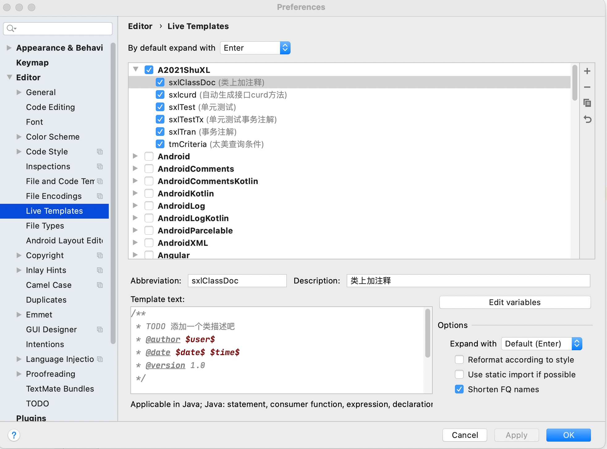

# 1 自定义代码补全
1. 进入目录
Setting > Editor > Live Templates
2. 新建模版


# 2 类注释模版
[参考](https://blog.csdn.net/xiaoliulang0324/article/details/79030752)
1. settings-->Editor-->File and Code Templates-->Files


```
/**    
  * TODO 添加一个类注释  
  * @author ${USER}  
  * @date ${YEAR}-${MONTH}-${DAY}日  
  */
```

# 3 隐藏文件
## 3.1 隐藏.idea文件夹


# 4 自定义快捷键
