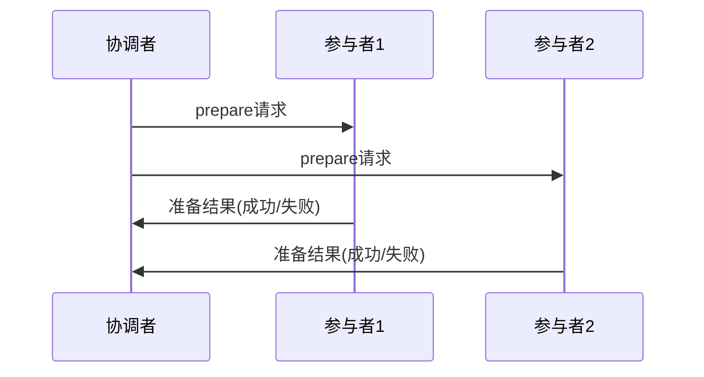
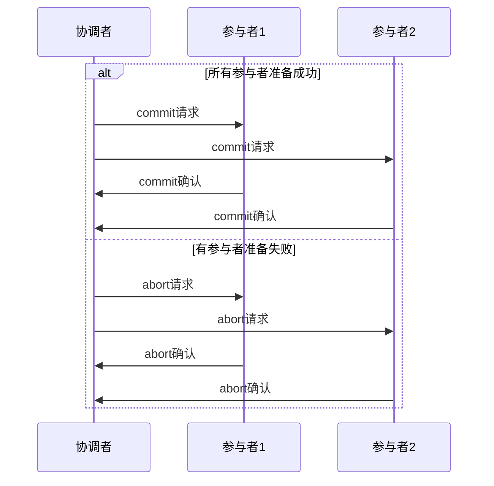

# 1 2PC概念或介绍

2PC（Two-Phase Commit Protocol）是分布式事务中最经典的强一致性协议，通过协调者来协调所有参与者的提交或回滚操作，确保分布式事务的原子性。

## 1.1 本文重点
- 理解2PC的核心思想和执行流程
- 掌握2PC的优缺点和适用场景
- 了解2PC的实现细节和故障处理
- 学会在实际项目中正确使用2PC

# 2 2PC核心思想

## 2.1 基本概念
- **协调者(Coordinator)**：负责协调整个事务的执行
- **参与者(Participant)**：实际执行事务的节点
- **两阶段**：准备阶段(Prepare Phase)和提交阶段(Commit Phase)

## 2.2 设计目标
- **原子性**：要么全部成功，要么全部失败
- **一致性**：所有节点看到的数据状态一致
- **隔离性**：事务执行过程中不被其他事务干扰

# 3 2PC执行流程

## 3.1 第一阶段：准备阶段(Prepare Phase)



**协调者行为**：
1. 向所有参与者发送prepare请求
2. 等待所有参与者的响应
3. 根据响应决定是否进入提交阶段

**参与者行为**：
1. 执行事务操作但不提交
2. 将操作记录到日志
3. 返回准备结果给协调者

## 3.2 第二阶段：提交阶段(Commit Phase)



**协调者行为**：
- 如果所有参与者都准备成功，发送commit请求
- 如果有任何参与者准备失败，发送abort请求

**参与者行为**：
- 收到commit请求：提交事务
- 收到abort请求：回滚事务

# 4 2PC实现细节

## 4.1 状态机设计

```java
public enum TransactionState {
    INITIAL,        // 初始状态
    PREPARING,      // 准备中
    PREPARED,       // 已准备
    COMMITTING,     // 提交中
    COMMITTED,      // 已提交
    ABORTING,       // 回滚中
    ABORTED         // 已回滚
}
```

## 4.2 关键代码示例

```java
public class TwoPhaseCommitCoordinator {
    
    private List<Participant> participants;
    private TransactionState state = TransactionState.INITIAL;
    
    public boolean executeTransaction() {
        // 第一阶段：准备
        if (!preparePhase()) {
            abortPhase();
            return false;
        }
        
        // 第二阶段：提交
        return commitPhase();
    }
    
    private boolean preparePhase() {
        state = TransactionState.PREPARING;
        
        // 向所有参与者发送prepare请求
        for (Participant participant : participants) {
            if (!participant.prepare()) {
                return false;
            }
        }
        
        state = TransactionState.PREPARED;
        return true;
    }
    
    private boolean commitPhase() {
        state = TransactionState.COMMITTING;
        
        // 向所有参与者发送commit请求
        for (Participant participant : participants) {
            if (!participant.commit()) {
                // 这里需要处理部分提交的情况
                return false;
            }
        }
        
        state = TransactionState.COMMITTED;
        return true;
    }
    
    private void abortPhase() {
        state = TransactionState.ABORTING;
        
        // 向所有参与者发送abort请求
        for (Participant participant : participants) {
            participant.abort();
        }
        
        state = TransactionState.ABORTED;
    }
}
```

# 5 2PC优缺点分析

## 5.1 优点

1. **强一致性保证**
   - 确保所有参与者要么全部提交，要么全部回滚
   - 满足ACID特性中的原子性

2. **实现相对简单**
   - 协议逻辑清晰
   - 易于理解和实现

3. **广泛支持**
   - 大多数数据库都支持2PC
   - 有成熟的开源实现

## 5.2 缺点

1. **同步阻塞**
   - 所有参与者必须等待协调者决策
   - 性能较差，响应时间长

2. **单点故障**
   - 协调者故障会导致整个事务失败
   - 需要额外的故障恢复机制

3. **数据不一致风险**
   - 协调者故障时可能出现数据不一致
   - 需要复杂的恢复算法

4. **网络敏感**
   - 对网络延迟和分区敏感
   - 在网络不稳定环境下表现差

# 6 故障处理机制

## 6.1 协调者故障恢复

```java
public class CoordinatorRecovery {
    
    public void recover() {
        // 1. 检查日志，确定事务状态
        TransactionState state = readTransactionState();
        
        // 2. 根据状态执行恢复操作
        switch (state) {
            case PREPARING:
                // 重新发送prepare请求
                resendPrepareRequests();
                break;
            case PREPARED:
                // 重新发送commit请求
                resendCommitRequests();
                break;
            case COMMITTING:
                // 重新发送commit请求
                resendCommitRequests();
                break;
            case ABORTING:
                // 重新发送abort请求
                resendAbortRequests();
                break;
        }
    }
}
```

## 6.2 参与者故障恢复

```java
public class ParticipantRecovery {
    
    public void recover() {
        // 1. 检查本地日志
        TransactionState localState = readLocalState();
        
        // 2. 向协调者查询事务状态
        TransactionState coordinatorState = queryCoordinatorState();
        
        // 3. 根据状态执行相应操作
        if (localState == TransactionState.PREPARED && 
            coordinatorState == TransactionState.COMMITTED) {
            commit();
        } else if (coordinatorState == TransactionState.ABORTED) {
            abort();
        }
    }
}
```

# 7 实际应用场景

## 7.1 适用场景

1. **强一致性要求**
   - 金融交易系统
   - 库存管理系统
   - 订单支付系统

2. **短事务**
   - 事务执行时间短
   - 参与者数量较少

3. **网络稳定环境**
   - 局域网环境
   - 网络延迟低

## 7.2 不适用场景

1. **高并发场景**
   - 性能要求高
   - 响应时间敏感

2. **长事务**
   - 事务执行时间长
   - 容易超时

3. **网络不稳定环境**
   - 网络分区频繁
   - 延迟高

# 8 2PC关联的其它知识

## 8.1 相关协议
- [3PC三阶段提交协议](./3PC三阶段提交协议.md)
- [Paxos算法](../算法/Paxos算法.md)
- [Raft算法](../算法/Raft算法.md)

## 8.2 实际应用
- [Spring事务管理](../../100-java/200-Spring/0401-事务基础概念.md)
- [数据库事务](../数据库/事务管理.md)
- [分布式系统](../通用计算机知识/分布式系统理论.md) 