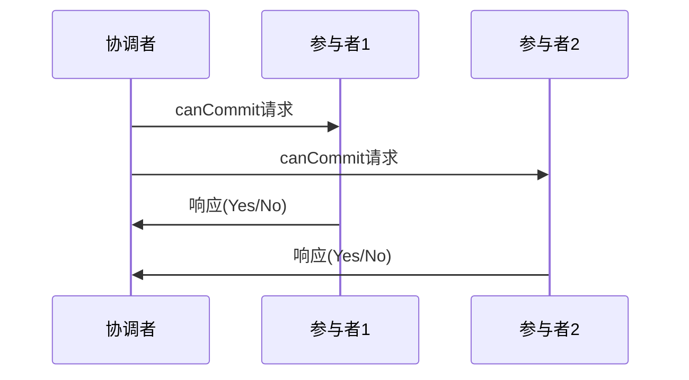
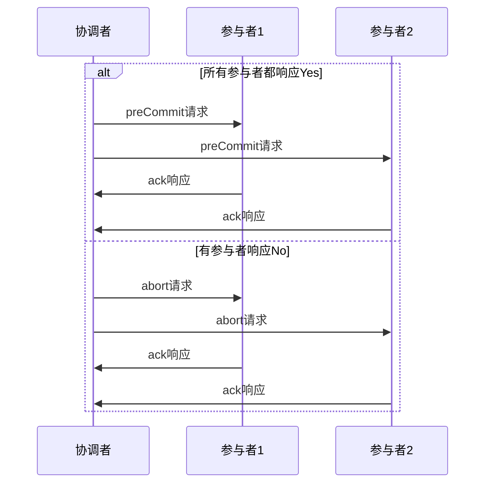
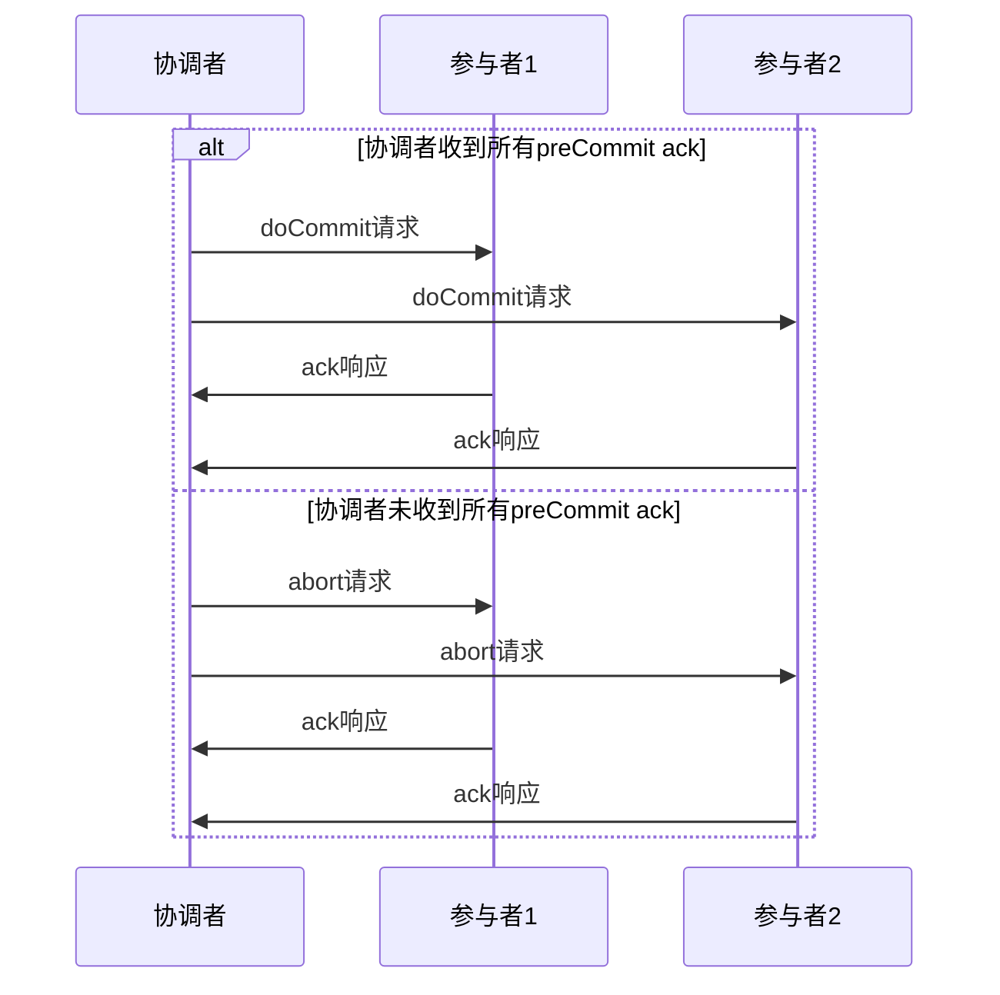

# 1 3PC概念或介绍

3PC（Three-Phase Commit Protocol）是2PC的改进版本，通过增加预提交阶段来减少阻塞时间，提高分布式事务的性能和可用性。3PC在2PC的基础上引入了CanCommit阶段，使得系统在网络分区时能够更快地恢复。

## 1.1 本文重点
- 理解3PC的核心思想和三个阶段的作用
- 掌握3PC相比2PC的改进点和优势
- 了解3PC的实现细节和故障处理机制
- 学会在实际项目中正确使用3PC

# 2 3PC核心思想

## 2.1 基本概念
- **CanCommit阶段**：协调者询问参与者是否可以提交
- **PreCommit阶段**：协调者发送预提交请求，参与者准备提交
- **DoCommit阶段**：协调者发送提交请求，参与者实际提交

## 2.2 设计目标
- **减少阻塞时间**：通过预提交阶段减少参与者等待时间
- **提高可用性**：在网络分区时能够更快恢复
- **保持一致性**：确保分布式事务的原子性
- **改善性能**：相比2PC有更好的性能表现

# 3 3PC执行流程

## 3.1 第一阶段：CanCommit阶段



**协调者行为**：
1. 向所有参与者发送canCommit请求
2. 等待所有参与者的响应
3. 根据响应决定是否进入下一阶段

**参与者行为**：
1. 检查是否可以执行事务
2. 返回Yes或No响应
3. 不执行任何实际的事务操作

## 3.2 第二阶段：PreCommit阶段



**协调者行为**：
- 如果所有参与者都响应Yes，发送preCommit请求
- 如果有任何参与者响应No，发送abort请求

**参与者行为**：
- 收到preCommit：执行事务但不提交，返回ack
- 收到abort：取消事务，返回ack

## 3.3 第三阶段：DoCommit阶段



**协调者行为**：
- 如果收到所有preCommit ack，发送doCommit请求
- 如果未收到所有preCommit ack，发送abort请求

**参与者行为**：
- 收到doCommit：提交事务，返回ack
- 收到abort：回滚事务，返回ack

# 4 3PC实现原理

## 4.1 状态机设计

```java
public enum ThreePhaseState {
    INITIAL,        // 初始状态
    CAN_COMMITTING, // CanCommit阶段
    PRE_COMMITTING, // PreCommit阶段
    DO_COMMITTING,  // DoCommit阶段
    COMMITTED,      // 已提交
    ABORTING,       // 回滚中
    ABORTED         // 已回滚
}

public enum ParticipantState {
    INITIAL,        // 初始状态
    CAN_COMMIT_YES, // CanCommit阶段响应Yes
    CAN_COMMIT_NO,  // CanCommit阶段响应No
    PRE_COMMITTED,  // PreCommit阶段已确认
    DO_COMMITTED,   // DoCommit阶段已确认
    ABORTED         // 已回滚
}
```

## 4.2 核心接口设计

```java
public interface ThreePhaseParticipant {
    
    /**
     * CanCommit阶段：检查是否可以提交
     * @param transactionId 事务ID
     * @return 是否可以提交
     */
    boolean canCommit(String transactionId);
    
    /**
     * PreCommit阶段：预提交
     * @param transactionId 事务ID
     * @return 预提交结果
     */
    boolean preCommit(String transactionId);
    
    /**
     * DoCommit阶段：实际提交
     * @param transactionId 事务ID
     * @return 提交结果
     */
    boolean doCommit(String transactionId);
    
    /**
     * 回滚事务
     * @param transactionId 事务ID
     * @return 回滚结果
     */
    boolean abort(String transactionId);
}
```

## 4.3 具体实现示例

```java
@Component
public class AccountThreePhaseParticipant implements ThreePhaseParticipant {
    
    @Autowired
    private AccountRepository accountRepository;
    
    @Autowired
    private TransactionLogRepository transactionLogRepository;
    
    @Override
    @Transactional
    public boolean canCommit(String transactionId) {
        try {
            // 1. 检查事务是否已经存在
            if (transactionLogRepository.existsByTransactionId(transactionId)) {
                return false;
            }
            
            // 2. 检查账户状态
            Account account = getAccountFromContext();
            if (account == null || account.getBalance().compareTo(getAmountFromContext()) < 0) {
                return false;
            }
            
            // 3. 记录事务日志
            TransactionLog log = new TransactionLog();
            log.setTransactionId(transactionId);
            log.setState(ParticipantState.CAN_COMMIT_YES);
            log.setTimestamp(new Date());
            transactionLogRepository.save(log);
            
            return true;
        } catch (Exception e) {
            log.error("CanCommit failed for transaction: " + transactionId, e);
            return false;
        }
    }
    
    @Override
    @Transactional
    public boolean preCommit(String transactionId) {
        try {
            // 1. 检查事务状态
            TransactionLog log = transactionLogRepository.findByTransactionId(transactionId);
            if (log == null || log.getState() != ParticipantState.CAN_COMMIT_YES) {
                return false;
            }
            
            // 2. 执行事务操作但不提交
            Account account = getAccountFromContext();
            BigDecimal amount = getAmountFromContext();
            
            // 冻结余额
            account.setFrozenAmount(account.getFrozenAmount().add(amount));
            accountRepository.save(account);
            
            // 3. 更新事务状态
            log.setState(ParticipantState.PRE_COMMITTED);
            log.setUpdateTime(new Date());
            transactionLogRepository.save(log);
            
            return true;
        } catch (Exception e) {
            log.error("PreCommit failed for transaction: " + transactionId, e);
            return false;
        }
    }
    
    @Override
    @Transactional
    public boolean doCommit(String transactionId) {
        try {
            // 1. 检查事务状态
            TransactionLog log = transactionLogRepository.findByTransactionId(transactionId);
            if (log == null || log.getState() != ParticipantState.PRE_COMMITTED) {
                return false;
            }
            
            // 2. 实际提交事务
            Account account = getAccountFromContext();
            BigDecimal amount = getAmountFromContext();
            
            // 扣减余额
            account.setBalance(account.getBalance().subtract(amount));
            account.setFrozenAmount(account.getFrozenAmount().subtract(amount));
            accountRepository.save(account);
            
            // 3. 更新事务状态
            log.setState(ParticipantState.DO_COMMITTED);
            log.setUpdateTime(new Date());
            transactionLogRepository.save(log);
            
            return true;
        } catch (Exception e) {
            log.error("DoCommit failed for transaction: " + transactionId, e);
            return false;
        }
    }
    
    @Override
    @Transactional
    public boolean abort(String transactionId) {
        try {
            // 1. 检查事务状态
            TransactionLog log = transactionLogRepository.findByTransactionId(transactionId);
            if (log == null) {
                return true; // 事务不存在，直接返回成功
            }
            
            // 2. 根据当前状态执行相应的回滚操作
            switch (log.getState()) {
                case PRE_COMMITTED:
                    // 解冻余额
                    Account account = getAccountFromContext();
                    BigDecimal amount = getAmountFromContext();
                    account.setFrozenAmount(account.getFrozenAmount().subtract(amount));
                    accountRepository.save(account);
                    break;
                case DO_COMMITTED:
                    // 已经提交，无法回滚
                    log.error("Cannot abort committed transaction: " + transactionId);
                    return false;
                default:
                    // 其他状态无需特殊处理
                    break;
            }
            
            // 3. 更新事务状态
            log.setState(ParticipantState.ABORTED);
            log.setUpdateTime(new Date());
            transactionLogRepository.save(log);
            
            return true;
        } catch (Exception e) {
            log.error("Abort failed for transaction: " + transactionId, e);
            return false;
        }
    }
}
```

# 5 3PC协调器实现

## 5.1 协调器核心逻辑

```java
@Component
public class ThreePhaseCommitCoordinator {
    
    @Autowired
    private List<ThreePhaseParticipant> participants;
    
    @Autowired
    private TransactionRepository transactionRepository;
    
    public boolean executeTransaction(String transactionId) {
        try {
            // 第一阶段：CanCommit
            if (!canCommitPhase(transactionId)) {
                abortPhase(transactionId);
                return false;
            }
            
            // 第二阶段：PreCommit
            if (!preCommitPhase(transactionId)) {
                abortPhase(transactionId);
                return false;
            }
            
            // 第三阶段：DoCommit
            return doCommitPhase(transactionId);
            
        } catch (Exception e) {
            log.error("Transaction execution failed", e);
            abortPhase(transactionId);
            return false;
        }
    }
    
    private boolean canCommitPhase(String transactionId) {
        saveTransactionState(transactionId, ThreePhaseState.CAN_COMMITTING);
        
        // 向所有参与者发送canCommit请求
        for (ThreePhaseParticipant participant : participants) {
            if (!participant.canCommit(transactionId)) {
                saveTransactionState(transactionId, ThreePhaseState.ABORTING);
                return false;
            }
        }
        
        return true;
    }
    
    private boolean preCommitPhase(String transactionId) {
        saveTransactionState(transactionId, ThreePhaseState.PRE_COMMITTING);
        
        // 向所有参与者发送preCommit请求
        for (ThreePhaseParticipant participant : participants) {
            if (!participant.preCommit(transactionId)) {
                saveTransactionState(transactionId, ThreePhaseState.ABORTING);
                return false;
            }
        }
        
        return true;
    }
    
    private boolean doCommitPhase(String transactionId) {
        saveTransactionState(transactionId, ThreePhaseState.DO_COMMITTING);
        
        // 向所有参与者发送doCommit请求
        for (ThreePhaseParticipant participant : participants) {
            if (!participant.doCommit(transactionId)) {
                // DoCommit失败，需要手动处理
                handleDoCommitFailure(transactionId);
                return false;
            }
        }
        
        saveTransactionState(transactionId, ThreePhaseState.COMMITTED);
        return true;
    }
    
    private void abortPhase(String transactionId) {
        saveTransactionState(transactionId, ThreePhaseState.ABORTING);
        
        // 向所有参与者发送abort请求
        for (ThreePhaseParticipant participant : participants) {
            try {
                participant.abort(transactionId);
            } catch (Exception e) {
                log.error("Abort failed for participant", e);
            }
        }
        
        saveTransactionState(transactionId, ThreePhaseState.ABORTED);
    }
}
```

# 6 3PC与2PC对比分析

## 6.1 改进点

1. **减少阻塞时间**
   - 2PC：参与者在prepare阶段后一直阻塞
   - 3PC：参与者在preCommit阶段后阻塞时间更短

2. **提高可用性**
   - 2PC：协调者故障时参与者无法确定状态
   - 3PC：通过CanCommit阶段提供更多信息

3. **更好的故障恢复**
   - 2PC：故障恢复复杂
   - 3PC：故障恢复相对简单

## 6.2 性能对比

```java
public class PerformanceComparison {
    
    public void comparePerformance() {
        // 2PC性能特点
        System.out.println("\n2PC性能特点:");
        System.out.println("- 同步阻塞时间长");
        System.out.println("- 网络延迟敏感");
        System.out.println("- 协调者单点故障影响大");
        
        // 3PC性能特点
        System.out.println("\n3PC性能特点:");
        System.out.println("- 减少阻塞时间");
        System.out.println("- 更好的并发性能");
        System.out.println("- 故障恢复更快");
    }
}
```

# 7 3PC优缺点分析

## 7.1 优点

1. **减少阻塞时间**
   - 参与者在preCommit阶段后阻塞时间更短
   - 提高系统并发性能

2. **提高可用性**
   - 在网络分区时能够更快恢复
   - 减少单点故障的影响

3. **更好的故障恢复**
   - 通过CanCommit阶段提供更多状态信息
   - 故障恢复算法相对简单

4. **保持一致性**
   - 仍然保证分布式事务的原子性
   - 满足ACID特性

## 7.2 缺点

1. **实现复杂**
   - 比2PC实现更复杂
   - 需要处理更多的状态转换

2. **网络开销**
   - 增加了一个网络往返
   - 总体网络开销更大

3. **仍然存在一致性问题**
   - 在某些极端情况下仍可能出现不一致
   - 需要额外的恢复机制

4. **协调者单点故障**
   - 协调者仍然是单点故障
   - 需要额外的故障恢复机制

# 8 故障处理机制

## 8.1 协调者故障恢复

```java
public class CoordinatorRecovery {
    
    public void recover() {
        // 1. 检查日志，确定事务状态
        ThreePhaseState state = readTransactionState();
        
        // 2. 根据状态执行恢复操作
        switch (state) {
            case CAN_COMMITTING:
                // 重新发送canCommit请求
                resendCanCommitRequests();
                break;
            case PRE_COMMITTING:
                // 重新发送preCommit请求
                resendPreCommitRequests();
                break;
            case DO_COMMITTING:
                // 重新发送doCommit请求
                resendDoCommitRequests();
                break;
            case ABORTING:
                // 重新发送abort请求
                resendAbortRequests();
                break;
        }
    }
}
```

## 8.2 参与者故障恢复

```java
public class ParticipantRecovery {
    
    public void recover() {
        // 1. 检查本地日志
        ParticipantState localState = readLocalState();
        
        // 2. 向协调者查询事务状态
        ThreePhaseState coordinatorState = queryCoordinatorState();
        
        // 3. 根据状态执行相应操作
        switch (localState) {
            case CAN_COMMIT_YES:
                if (coordinatorState == ThreePhaseState.PRE_COMMITTING) {
                    preCommit();
                } else if (coordinatorState == ThreePhaseState.ABORTING) {
                    abort();
                }
                break;
            case PRE_COMMITTED:
                if (coordinatorState == ThreePhaseState.DO_COMMITTING) {
                    doCommit();
                } else if (coordinatorState == ThreePhaseState.ABORTING) {
                    abort();
                }
                break;
        }
    }
}
```

# 9 实际应用场景

## 9.1 适用场景

1. **对性能要求较高的强一致性场景**
   - 金融交易系统
   - 库存管理系统
   - 订单支付系统

2. **网络环境相对稳定的场景**
   - 局域网环境
   - 云环境中的同区域部署

3. **参与者数量较少的场景**
   - 2-5个参与者
   - 事务执行时间短

## 9.2 不适用场景

1. **高并发场景**
   - 性能要求极高
   - 响应时间敏感

2. **网络不稳定环境**
   - 网络分区频繁
   - 延迟高

3. **参与者数量多的场景**
   - 超过5个参与者
   - 网络开销过大

# 10 3PC最佳实践

## 10.1 设计原则

1. **超时处理**
   ```java
   public boolean canCommit(String transactionId) {
       try {
           // 设置超时时间
           return participant.canCommit(transactionId);
       } catch (TimeoutException e) {
           // 超时处理
           handleTimeout(transactionId);
           return false;
       }
   }
   ```

2. **状态持久化**
   ```java
   @Transactional
   public void saveTransactionState(String transactionId, ThreePhaseState state) {
       Transaction transaction = new Transaction();
       transaction.setTransactionId(transactionId);
       transaction.setState(state);
       transaction.setUpdateTime(new Date());
       
       transactionRepository.save(transaction);
   }
   ```

3. **监控和告警**
   ```java
   @Component
   public class ThreePhaseMonitor {
       
       public void monitorTransaction(String transactionId) {
           // 监控事务状态
           ThreePhaseState state = getTransactionState(transactionId);
           
           // 超时告警
           if (isTimeout(transactionId)) {
               sendAlert("3PC transaction timeout: " + transactionId);
           }
           
           // 异常告警
           if (state == ThreePhaseState.ABORTING) {
               sendAlert("3PC transaction aborted: " + transactionId);
           }
       }
   }
   ```

# 11 3PC关联的其它知识

## 11.1 相关协议
- [2PC两阶段提交协议](./2PC两阶段提交协议.md)
- [Paxos算法](../算法/Paxos算法.md)
- [Raft算法](../算法/Raft算法.md)

## 11.2 实际应用
- [Spring事务管理](../100-java/200-Spring/0401-事务基础概念.md)
- [数据库事务](../数据库/事务管理.md)
- [分布式系统](../通用计算机知识/分布式系统理论.md) 