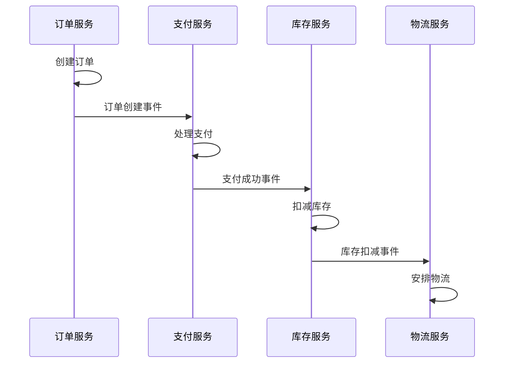
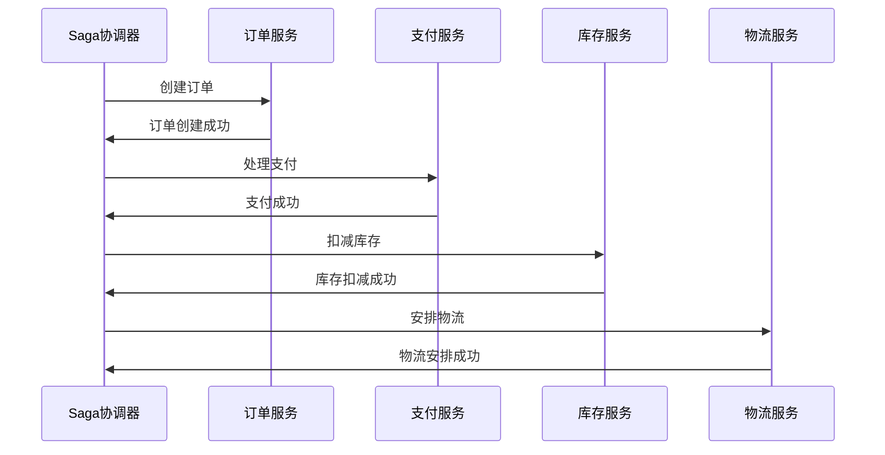

# 1 Saga概念或介绍

Saga模式是一种用于管理长事务的分布式事务模式，通过将长事务分解为多个本地事务，并通过补偿机制来保证最终一致性。Saga特别适用于微服务架构中的跨服务事务处理。

## 1.1 本文重点
- 理解Saga的核心思想和补偿机制
- 掌握Saga的两种实现方式：Choreography和Orchestration
- 了解Saga的优缺点和适用场景
- 学会在实际项目中正确使用Saga

# 2 Saga核心思想

## 2.1 基本概念
- **本地事务**：每个服务内部的事务操作
- **补偿操作**：用于撤销本地事务的操作
- **Saga协调**：管理整个Saga事务的执行流程

## 2.2 设计目标
- **长事务处理**：支持跨多个服务的长时间事务
- **最终一致性**：通过补偿机制保证最终一致性
- **高可用性**：支持部分失败和自动恢复
- **业务友好**：符合业务逻辑的自然流程

# 3 Saga执行方式

## 3.1 Choreography（事件驱动）



**特点**：
- 各服务自主协调
- 通过事件通信
- 松耦合设计
- 难以调试和监控

## 3.2 Orchestration（集中协调）



**特点**：
- 集中式协调
- 易于监控和调试
- 紧耦合设计
- 单点故障风险

# 4 Saga实现原理

## 4.1 状态机设计

```java
public enum SagaState {
    STARTED,        // 已开始
    COMPENSATING,   // 补偿中
    COMPENSATED,    // 已补偿
    COMPLETED,      // 已完成
    FAILED          // 已失败
}

public enum StepState {
    PENDING,        // 待执行
    EXECUTING,      // 执行中
    COMPLETED,      // 已完成
    FAILED,         // 已失败
    COMPENSATING,   // 补偿中
    COMPENSATED     // 已补偿
}
```

## 4.2 核心接口设计

```java
public interface SagaStep {
    
    /**
     * 执行步骤
     * @param context 上下文
     * @return 执行结果
     */
    boolean execute(SagaContext context);
    
    /**
     * 补偿步骤
     * @param context 上下文
     * @return 补偿结果
     */
    boolean compensate(SagaContext context);
    
    /**
     * 获取步骤名称
     * @return 步骤名称
     */
    String getName();
}
```

## 4.3 具体实现示例

```java
@Component
public class CreateOrderStep implements SagaStep {
    
    @Autowired
    private OrderService orderService;
    
    @Override
    @Transactional
    public boolean execute(SagaContext context) {
        String orderId = context.getOrderId();
        OrderRequest request = context.getOrderRequest();
        
        try {
            // 创建订单
            Order order = orderService.createOrder(request);
            context.setOrder(order);
            return true;
        } catch (Exception e) {
            log.error("Create order failed", e);
            return false;
        }
    }
    
    @Override
    @Transactional
    public boolean compensate(SagaContext context) {
        String orderId = context.getOrderId();
        
        try {
            // 取消订单
            orderService.cancelOrder(orderId);
            return true;
        } catch (Exception e) {
            log.error("Cancel order failed", e);
            return false;
        }
    }
    
    @Override
    public String getName() {
        return "CreateOrder";
    }
}
```

# 5 Saga协调器实现

## 5.1 Orchestration协调器

```java
@Component
public class SagaOrchestrator {
    
    @Autowired
    private List<SagaStep> sagaSteps;
    
    @Autowired
    private SagaRepository sagaRepository;
    
    public boolean executeSaga(SagaContext context) {
        String sagaId = generateSagaId();
        context.setSagaId(sagaId);
        
        // 保存Saga状态
        saveSagaState(sagaId, SagaState.STARTED);
        
        List<StepResult> stepResults = new ArrayList<>();
        
        try {
            // 执行所有步骤
            for (SagaStep step : sagaSteps) {
                StepResult result = executeStep(step, context);
                stepResults.add(result);
                
                if (!result.isSuccess()) {
                    // 执行失败，开始补偿
                    compensateSteps(stepResults, context);
                    return false;
                }
            }
            
            // 所有步骤执行成功
            saveSagaState(sagaId, SagaState.COMPLETED);
            return true;
            
        } catch (Exception e) {
            // 异常时执行补偿
            compensateSteps(stepResults, context);
            saveSagaState(sagaId, SagaState.FAILED);
            return false;
        }
    }
    
    private StepResult executeStep(SagaStep step, SagaContext context) {
        String stepName = step.getName();
        
        try {
            // 保存步骤状态
            saveStepState(context.getSagaId(), stepName, StepState.EXECUTING);
            
            // 执行步骤
            boolean success = step.execute(context);
            
            if (success) {
                saveStepState(context.getSagaId(), stepName, StepState.COMPLETED);
                return new StepResult(step, true, null);
            } else {
                saveStepState(context.getSagaId(), stepName, StepState.FAILED);
                return new StepResult(step, false, null);
            }
            
        } catch (Exception e) {
            saveStepState(context.getSagaId(), stepName, StepState.FAILED);
            return new StepResult(step, false, e);
        }
    }
    
    private void compensateSteps(List<StepResult> stepResults, SagaContext context) {
        saveSagaState(context.getSagaId(), SagaState.COMPENSATING);
        
        // 按相反顺序执行补偿
        for (int i = stepResults.size() - 1; i >= 0; i--) {
            StepResult result = stepResults.get(i);
            if (result.isSuccess()) {
                compensateStep(result.getStep(), context);
            }
        }
        
        saveSagaState(context.getSagaId(), SagaState.COMPENSATED);
    }
    
    private void compensateStep(SagaStep step, SagaContext context) {
        String stepName = step.getName();
        
        try {
            saveStepState(context.getSagaId(), stepName, StepState.COMPENSATING);
            
            boolean success = step.compensate(context);
            
            if (success) {
                saveStepState(context.getSagaId(), stepName, StepState.COMPENSATED);
            } else {
                // 补偿失败，需要人工介入
                logCompensationFailure(context.getSagaId(), stepName);
            }
            
        } catch (Exception e) {
            saveStepState(context.getSagaId(), stepName, StepState.FAILED);
            logCompensationFailure(context.getSagaId(), stepName, e);
        }
    }
}
```

## 5.2 Choreography实现

```java
@Component
public class OrderSagaEventHandler {
    
    @Autowired
    private PaymentService paymentService;
    
    @Autowired
    private InventoryService inventoryService;
    
    @EventListener
    public void handleOrderCreated(OrderCreatedEvent event) {
        // 订单创建后，触发支付
        PaymentRequest request = new PaymentRequest();
        request.setOrderId(event.getOrderId());
        request.setAmount(event.getAmount());
        
        paymentService.processPayment(request);
    }
    
    @EventListener
    public void handlePaymentSucceeded(PaymentSucceededEvent event) {
        // 支付成功后，触发库存扣减
        InventoryRequest request = new InventoryRequest();
        request.setOrderId(event.getOrderId());
        request.setItems(event.getItems());
        
        inventoryService.deductInventory(request);
    }
    
    @EventListener
    public void handlePaymentFailed(PaymentFailedEvent event) {
        // 支付失败后，触发订单取消
        orderService.cancelOrder(event.getOrderId());
    }
    
    @EventListener
    public void handleInventoryDeducted(InventoryDeductedEvent event) {
        // 库存扣减成功后，触发物流安排
        LogisticsRequest request = new LogisticsRequest();
        request.setOrderId(event.getOrderId());
        request.setAddress(event.getAddress());
        
        logisticsService.arrangeLogistics(request);
    }
    
    @EventListener
    public void handleInventoryDeductionFailed(InventoryDeductionFailedEvent event) {
        // 库存扣减失败后，触发补偿
        paymentService.refundPayment(event.getOrderId());
        orderService.cancelOrder(event.getOrderId());
    }
}
```

# 6 Saga优缺点分析

## 6.1 优点

1. **长事务支持**
   - 支持跨多个服务的长时间事务
   - 适合复杂的业务流程

2. **高可用性**
   - 支持部分失败
   - 自动补偿机制
   - 故障恢复能力强

3. **业务友好**
   - 符合业务逻辑的自然流程
   - 易于理解和维护

4. **松耦合**
   - 各服务相对独立
   - 易于扩展和修改

## 6.2 缺点

1. **最终一致性**
   - 不能保证强一致性
   - 可能存在短暂的不一致

2. **补偿复杂性**
   - 补偿逻辑复杂
   - 需要考虑各种异常情况

3. **调试困难**
   - 分布式调试困难
   - 问题定位复杂

4. **数据一致性**
   - 补偿可能失败
   - 需要人工介入处理

# 7 实际应用场景

## 7.1 适用场景

1. **电商系统**
   - 订单处理流程
   - 支付处理流程
   - 库存管理流程

2. **金融系统**
   - 转账处理流程
   - 贷款审批流程
   - 风险控制流程

3. **长业务流程**
   - 审批流程
   - 工作流
   - 复杂业务逻辑

## 7.2 不适用场景

1. **强一致性要求**
   - 实时一致性要求高
   - 不能接受最终一致性

2. **简单事务**
   - 单服务事务
   - 简单CRUD操作

3. **短事务**
   - 事务执行时间短
   - 参与者数量少

# 8 Saga最佳实践

## 8.1 设计原则

1. **补偿幂等性**
   ```java
   public boolean compensate(SagaContext context) {
       String orderId = context.getOrderId();
       
       // 检查是否已经补偿过
       if (isCompensated(orderId)) {
           return true;
       }
       
       // 执行补偿逻辑
       return doCompensate(context);
   }
   ```

2. **事件幂等性**
   ```java
   @EventListener
   public void handleOrderCreated(OrderCreatedEvent event) {
       // 检查是否已经处理过
       if (isProcessed(event.getEventId())) {
           return;
       }
       
       // 处理事件
       processOrderCreated(event);
   }
   ```

3. **状态持久化**
   ```java
   @Transactional
   public void saveSagaState(String sagaId, SagaState state) {
       Saga saga = new Saga();
       saga.setSagaId(sagaId);
       saga.setState(state);
       saga.setUpdateTime(new Date());
       
       sagaRepository.save(saga);
   }
   ```

## 8.2 监控和告警

```java
@Component
public class SagaMonitor {
    
    public void monitorSaga(String sagaId) {
        // 监控Saga状态
        SagaState state = getSagaState(sagaId);
        
        // 超时告警
        if (isTimeout(sagaId)) {
            sendAlert("Saga timeout: " + sagaId);
        }
        
        // 补偿失败告警
        if (state == SagaState.COMPENSATING) {
            List<StepState> failedSteps = getFailedSteps(sagaId);
            if (!failedSteps.isEmpty()) {
                sendAlert("Saga compensation failed: " + sagaId);
            }
        }
    }
}
```

# 9 Saga关联的其它知识

## 9.1 相关模式
- [TCC事务模式](./TCC事务模式.md)
- [最终一致性模式](./最终一致性模式.md)
- [事件驱动架构](../架构/事件驱动架构.md)

## 9.2 实际应用
- [微服务架构](../架构/微服务架构.md)
- [Spring事务管理](../100-java/200-Spring/0401-事务基础概念.md)
- [消息队列](../中间件/消息队列.md) 