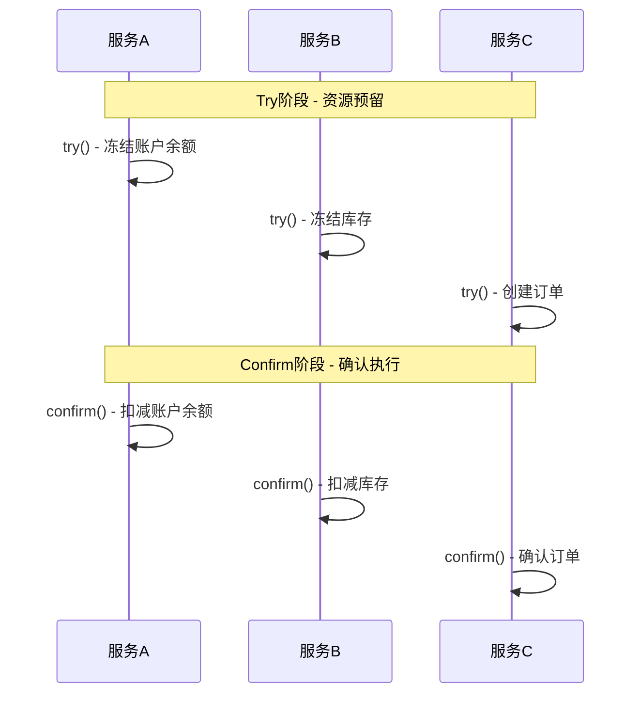
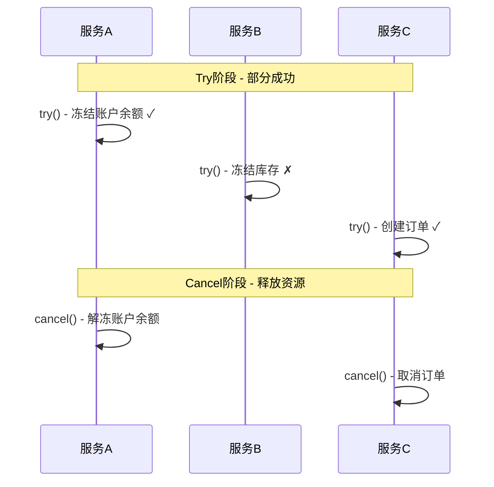

# 1 TCC概念或介绍

TCC（Try-Confirm-Cancel）是一种基于补偿的分布式事务模式，将事务分解为三个阶段：Try（尝试）、Confirm（确认）、Cancel（取消），通过预留资源的方式实现最终一致性。

## 1.1 本文重点
- 理解TCC的核心思想和三个阶段的作用
- 掌握TCC的实现原理和设计模式
- 了解TCC的优缺点和适用场景
- 学会在实际项目中正确使用TCC

# 2 TCC核心思想

## 2.1 基本概念
- **Try阶段**：资源预留，不实际执行业务操作
- **Confirm阶段**：确认执行，实际占用预留的资源
- **Cancel阶段**：取消操作，释放预留的资源

## 2.2 设计目标
- **最终一致性**：通过补偿机制保证最终一致性
- **高性能**：避免长时间锁定资源
- **高可用**：支持部分失败和自动恢复

# 3 TCC执行流程

## 3.1 正常执行流程



## 3.2 异常回滚流程



# 4 TCC实现原理

## 4.1 状态机设计

```java
public enum TCCState {
    INITIAL,        // 初始状态
    TRYING,         // Try阶段执行中
    TRY_SUCCESS,    // Try阶段成功
    TRY_FAILED,     // Try阶段失败
    CONFIRMING,     // Confirm阶段执行中
    CONFIRMED,      // Confirm阶段成功
    CANCELLING,     // Cancel阶段执行中
    CANCELLED       // Cancel阶段成功
}
```

## 4.2 核心接口设计

```java
public interface TCCService {
    
    /**
     * Try阶段：资源预留
     * @param params 业务参数
     * @return 预留结果
     */
    boolean try(TransactionParams params);
    
    /**
     * Confirm阶段：确认执行
     * @param params 业务参数
     * @return 确认结果
     */
    boolean confirm(TransactionParams params);
    
    /**
     * Cancel阶段：取消操作
     * @param params 业务参数
     * @return 取消结果
     */
    boolean cancel(TransactionParams params);
}
```

## 4.3 具体实现示例

```java
@Service
public class AccountTCCService implements TCCService {
    
    @Autowired
    private AccountRepository accountRepository;
    
    @Override
    @Transactional
    public boolean try(TransactionParams params) {
        String accountId = params.getAccountId();
        BigDecimal amount = params.getAmount();
        
        // 1. 检查账户是否存在
        Account account = accountRepository.findById(accountId);
        if (account == null) {
            return false;
        }
        
        // 2. 检查余额是否足够
        if (account.getBalance().compareTo(amount) < 0) {
            return false;
        }
        
        // 3. 冻结余额（预留资源）
        account.setFrozenAmount(account.getFrozenAmount().add(amount));
        accountRepository.save(account);
        
        return true;
    }
    
    @Override
    @Transactional
    public boolean confirm(TransactionParams params) {
        String accountId = params.getAccountId();
        BigDecimal amount = params.getAmount();
        
        // 1. 检查账户是否存在
        Account account = accountRepository.findById(accountId);
        if (account == null) {
            return false;
        }
        
        // 2. 实际扣减余额
        account.setBalance(account.getBalance().subtract(amount));
        account.setFrozenAmount(account.getFrozenAmount().subtract(amount));
        accountRepository.save(account);
        
        return true;
    }
    
    @Override
    @Transactional
    public boolean cancel(TransactionParams params) {
        String accountId = params.getAccountId();
        BigDecimal amount = params.getAmount();
        
        // 1. 检查账户是否存在
        Account account = accountRepository.findById(accountId);
        if (account == null) {
            return false;
        }
        
        // 2. 解冻余额（释放预留资源）
        account.setFrozenAmount(account.getFrozenAmount().subtract(amount));
        accountRepository.save(account);
        
        return true;
    }
}
```

# 5 TCC协调器实现

## 5.1 协调器核心逻辑

```java
@Component
public class TCCCoordinator {
    
    @Autowired
    private List<TCCService> tccServices;
    
    @Autowired
    private TransactionRepository transactionRepository;
    
    public boolean executeTransaction(TransactionParams params) {
        String transactionId = generateTransactionId();
        
        try {
            // 1. Try阶段：所有服务预留资源
            if (!tryPhase(transactionId, params)) {
                cancelPhase(transactionId, params);
                return false;
            }
            
            // 2. Confirm阶段：所有服务确认执行
            return confirmPhase(transactionId, params);
            
        } catch (Exception e) {
            // 异常时执行Cancel
            cancelPhase(transactionId, params);
            return false;
        }
    }
    
    private boolean tryPhase(String transactionId, TransactionParams params) {
        // 记录事务状态
        saveTransactionState(transactionId, TCCState.TRYING);
        
        // 调用所有服务的Try方法
        for (TCCService service : tccServices) {
            if (!service.try(params)) {
                saveTransactionState(transactionId, TCCState.TRY_FAILED);
                return false;
            }
        }
        
        saveTransactionState(transactionId, TCCState.TRY_SUCCESS);
        return true;
    }
    
    private boolean confirmPhase(String transactionId, TransactionParams params) {
        saveTransactionState(transactionId, TCCState.CONFIRMING);
        
        // 调用所有服务的Confirm方法
        for (TCCService service : tccServices) {
            if (!service.confirm(params)) {
                // Confirm失败，需要手动处理
                handleConfirmFailure(transactionId, params);
                return false;
            }
        }
        
        saveTransactionState(transactionId, TCCState.CONFIRMED);
        return true;
    }
    
    private void cancelPhase(String transactionId, TransactionParams params) {
        saveTransactionState(transactionId, TCCState.CANCELLING);
        
        // 调用所有服务的Cancel方法
        for (TCCService service : tccServices) {
            try {
                service.cancel(params);
            } catch (Exception e) {
                // 记录Cancel失败，需要人工介入
                logCancelFailure(transactionId, service, e);
            }
        }
        
        saveTransactionState(transactionId, TCCState.CANCELLED);
    }
}
```

# 6 TCC优缺点分析

## 6.1 优点

1. **高性能**
   - 避免长时间锁定资源
   - 支持并发处理
   - 响应时间短

2. **高可用**
   - 支持部分失败
   - 自动补偿机制
   - 故障恢复能力强

3. **最终一致性**
   - 通过补偿保证最终一致性
   - 适合大多数业务场景

4. **业务友好**
   - 业务逻辑清晰
   - 易于理解和维护

## 6.2 缺点

1. **实现复杂**
   - 需要实现三个接口
   - 状态管理复杂
   - 补偿逻辑复杂

2. **资源浪费**
   - 需要预留资源
   - 可能造成资源浪费

3. **幂等性要求**
   - 所有操作必须幂等
   - 增加实现复杂度

4. **人工介入**
   - 某些异常需要人工处理
   - 运维成本较高

# 7 实际应用场景

## 7.1 适用场景

1. **电商系统**
   - 订单创建
   - 库存扣减
   - 支付处理

2. **金融系统**
   - 转账操作
   - 账户扣款
   - 余额冻结

3. **高并发场景**
   - 秒杀系统
   - 抢购系统
   - 高并发支付

## 7.2 不适用场景

1. **强一致性要求**
   - 实时一致性要求高
   - 不能接受最终一致性

2. **简单事务**
   - 单服务事务
   - 简单CRUD操作

3. **长事务**
   - 事务执行时间长
   - 资源预留成本高

# 8 TCC最佳实践

## 8.1 设计原则

1. **幂等性设计**
   ```java
   // 使用唯一标识确保幂等性
   public boolean confirm(TransactionParams params) {
       String transactionId = params.getTransactionId();
       
       // 检查是否已经确认过
       if (isConfirmed(transactionId)) {
           return true;
       }
       
       // 执行确认逻辑
       return doConfirm(params);
   }
   ```

2. **空回滚设计**
   ```java
   public boolean cancel(TransactionParams params) {
       String transactionId = params.getTransactionId();
       
       // 如果Try阶段没有执行，直接返回成功
       if (!isTried(transactionId)) {
           return true;
       }
       
       // 执行取消逻辑
       return doCancel(params);
   }
   ```

3. **悬挂处理**
   ```java
   public boolean confirm(TransactionParams params) {
       String transactionId = params.getTransactionId();
       
       // 如果Try阶段没有执行，抛出异常
       if (!isTried(transactionId)) {
           throw new TCCException("Try phase not executed");
       }
       
       return doConfirm(params);
   }
   ```

## 8.2 监控和告警

```java
@Component
public class TCCMonitor {
    
    public void monitorTransaction(String transactionId) {
        // 监控事务状态
        TCCState state = getTransactionState(transactionId);
        
        // 超时告警
        if (isTimeout(transactionId)) {
            sendAlert("Transaction timeout: " + transactionId);
        }
        
        // 异常告警
        if (state == TCCState.TRY_FAILED || 
            state == TCCState.CONFIRMING) {
            sendAlert("Transaction failed: " + transactionId);
        }
    }
}
```

# 9 TCC关联的其它知识

## 9.1 相关模式
- [Saga模式](./Saga事务模式.md)
- [最终一致性模式](./最终一致性模式.md)
- [补偿模式](../设计模式/补偿模式.md)

## 9.2 实际应用
- [Spring事务管理](../100-java/200-Spring/0401-事务基础概念.md)
- [微服务架构](../架构/微服务架构.md)
- [分布式系统](../通用计算机知识/分布式系统理论.md) 