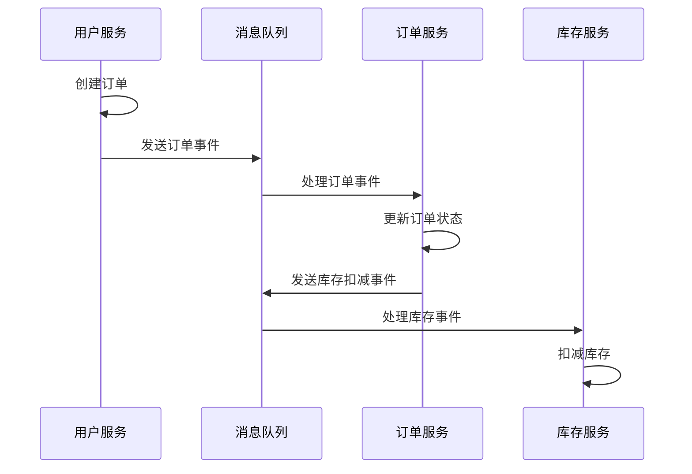
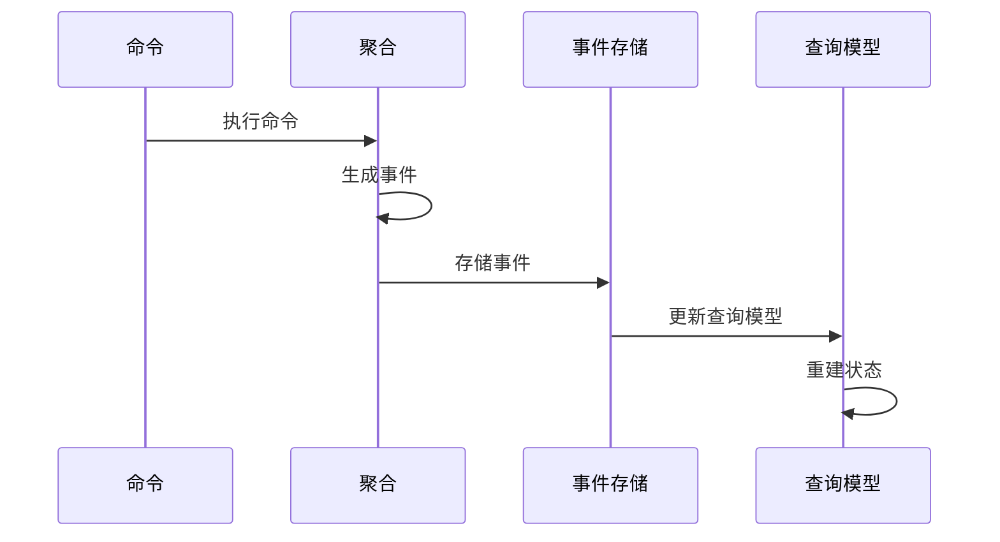
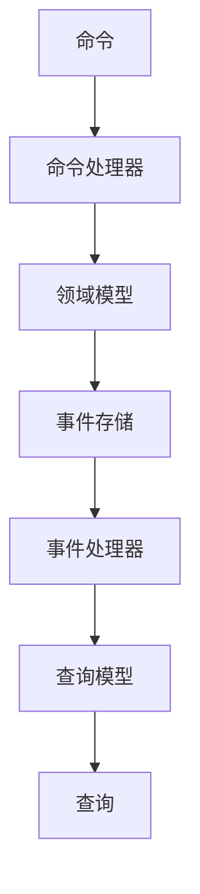

# 1 最终一致性概念或介绍

最终一致性（Eventual Consistency）是分布式系统中的一种一致性模型，允许系统在短时间内不一致，但保证最终会达到一致状态。这种模式通过异步消息传递、事件溯源等方式实现，特别适用于高并发、高可用的分布式系统。

## 1.1 本文重点
- 理解最终一致性的核心思想和实现原理
- 掌握最终一致性的实现方式和设计模式
- 了解最终一致性的优缺点和适用场景
- 学会在实际项目中正确使用最终一致性

# 2 最终一致性核心思想

## 2.1 基本概念
- **最终一致性**：系统最终会达到一致状态，但允许短暂的不一致
- **异步处理**：通过异步消息传递实现数据同步
- **事件驱动**：基于事件进行状态更新和数据传播

## 2.2 设计目标
- **高可用性**：系统在部分节点故障时仍能正常工作
- **高性能**：避免同步阻塞，提高系统吞吐量
- **可扩展性**：支持水平扩展和动态扩容
- **容错性**：支持部分失败和自动恢复

# 3 最终一致性实现方式

## 3.1 消息队列模式



**特点**：
- 异步处理，性能高
- 解耦服务间依赖
- 支持消息重试和死信队列
- 易于扩展和维护

## 3.2 事件溯源模式



**特点**：
- 完整的事件历史
- 支持状态重建
- 审计和追踪能力强
- 支持时间旅行查询

## 3.3 CQRS模式



**特点**：
- 读写分离
- 优化查询性能
- 支持不同的数据模型
- 易于扩展和优化

# 4 最终一致性实现原理

## 4.1 状态机设计

```java
public enum ConsistencyState {
    PENDING,        // 待同步
    SYNCING,        // 同步中
    SYNCED,         // 已同步
    CONFLICT,       // 冲突
    RESOLVED        // 已解决
}

public enum EventType {
    CREATED,        // 创建
    UPDATED,        // 更新
    DELETED,        // 删除
    COMPENSATED     // 补偿
}
```

## 4.2 核心接口设计

```java
public interface EventStore {
    
    /**
     * 存储事件
     * @param event 事件
     * @return 存储结果
     */
    boolean storeEvent(DomainEvent event);
    
    /**
     * 获取事件流
     * @param aggregateId 聚合ID
     * @return 事件列表
     */
    List<DomainEvent> getEvents(String aggregateId);
    
    /**
     * 获取所有事件
     * @param fromVersion 起始版本
     * @return 事件列表
     */
    List<DomainEvent> getAllEvents(long fromVersion);
}

public interface EventHandler {
    
    /**
     * 处理事件
     * @param event 事件
     */
    void handleEvent(DomainEvent event);
    
    /**
     * 获取处理器名称
     * @return 处理器名称
     */
    String getHandlerName();
}
```

## 4.3 具体实现示例

```java
@Component
public class OrderEventStore implements EventStore {
    
    @Autowired
    private EventRepository eventRepository;
    
    @Override
    @Transactional
    public boolean storeEvent(DomainEvent event) {
        try {
            EventEntity entity = new EventEntity();
            entity.setEventId(event.getEventId());
            entity.setAggregateId(event.getAggregateId());
            entity.setEventType(event.getEventType());
            entity.setEventData(JSON.toJSONString(event));
            entity.setVersion(event.getVersion());
            entity.setTimestamp(event.getTimestamp());
            
            eventRepository.save(entity);
            return true;
        } catch (Exception e) {
            log.error("Store event failed", e);
            return false;
        }
    }
    
    @Override
    public List<DomainEvent> getEvents(String aggregateId) {
        List<EventEntity> entities = eventRepository.findByAggregateIdOrderByVersion(aggregateId);
        
        return entities.stream()
                .map(this::convertToEvent)
                .collect(Collectors.toList());
    }
    
    @Override
    public List<DomainEvent> getAllEvents(long fromVersion) {
        List<EventEntity> entities = eventRepository.findByVersionGreaterThanOrderByVersion(fromVersion);
        
        return entities.stream()
                .map(this::convertToEvent)
                .collect(Collectors.toList());
    }
    
    private DomainEvent convertToEvent(EventEntity entity) {
        // 根据事件类型反序列化事件
        Class<?> eventClass = getEventClass(entity.getEventType());
        return JSON.parseObject(entity.getEventData(), eventClass);
    }
}
```

# 5 最终一致性协调器

## 5.1 事件处理器

```java
@Component
public class OrderEventHandler implements EventHandler {
    
    @Autowired
    private OrderRepository orderRepository;
    
    @Autowired
    private InventoryService inventoryService;
    
    @Override
    @Transactional
    public void handleEvent(DomainEvent event) {
        switch (event.getEventType()) {
            case ORDER_CREATED:
                handleOrderCreated((OrderCreatedEvent) event);
                break;
            case ORDER_PAID:
                handleOrderPaid((OrderPaidEvent) event);
                break;
            case ORDER_CANCELLED:
                handleOrderCancelled((OrderCancelledEvent) event);
                break;
            default:
                log.warn("Unknown event type: {}", event.getEventType());
        }
    }
    
    private void handleOrderCreated(OrderCreatedEvent event) {
        Order order = new Order();
        order.setOrderId(event.getOrderId());
        order.setUserId(event.getUserId());
        order.setAmount(event.getAmount());
        order.setStatus(OrderStatus.CREATED);
        
        orderRepository.save(order);
    }
    
    private void handleOrderPaid(OrderPaidEvent event) {
        Order order = orderRepository.findById(event.getOrderId());
        if (order != null) {
            order.setStatus(OrderStatus.PAID);
            order.setPaidTime(event.getPaidTime());
            orderRepository.save(order);
            
            // 触发库存扣减
            inventoryService.deductInventory(order.getOrderId(), order.getItems());
        }
    }
    
    private void handleOrderCancelled(OrderCancelledEvent event) {
        Order order = orderRepository.findById(event.getOrderId());
        if (order != null) {
            order.setStatus(OrderStatus.CANCELLED);
            order.setCancelTime(event.getCancelTime());
            orderRepository.save(order);
        }
    }
    
    @Override
    public String getHandlerName() {
        return "OrderEventHandler";
    }
}
```

## 5.2 消息队列处理器

```java
@Component
public class MessageQueueHandler {
    
    @Autowired
    private List<EventHandler> eventHandlers;
    
    @RabbitListener(queues = "order.events")
    public void handleOrderEvent(String message) {
        try {
            DomainEvent event = JSON.parseObject(message, DomainEvent.class);
            
            // 幂等性检查
            if (isProcessed(event.getEventId())) {
                return;
            }
            
            // 处理事件
            for (EventHandler handler : eventHandlers) {
                if (canHandle(handler, event)) {
                    handler.handleEvent(event);
                }
            }
            
            // 标记为已处理
            markAsProcessed(event.getEventId());
            
        } catch (Exception e) {
            log.error("Handle event failed", e);
            // 发送到死信队列
            sendToDeadLetter(message, e);
        }
    }
    
    private boolean isProcessed(String eventId) {
        // 检查事件是否已经处理过
        return processedEventRepository.existsByEventId(eventId);
    }
    
    private boolean canHandle(EventHandler handler, DomainEvent event) {
        // 检查处理器是否能处理该事件
        return handler.getHandlerName().equals("OrderEventHandler");
    }
    
    private void markAsProcessed(String eventId) {
        ProcessedEvent processedEvent = new ProcessedEvent();
        processedEvent.setEventId(eventId);
        processedEvent.setProcessTime(new Date());
        processedEventRepository.save(processedEvent);
    }
}
```

# 6 最终一致性优缺点分析

## 6.1 优点

1. **高可用性**
   - 系统在部分节点故障时仍能正常工作
   - 支持网络分区和延迟

2. **高性能**
   - 避免同步阻塞
   - 支持高并发处理
   - 响应时间短

3. **可扩展性**
   - 支持水平扩展
   - 易于添加新节点
   - 动态扩容能力强

4. **容错性**
   - 支持部分失败
   - 自动恢复机制
   - 故障隔离能力强

## 6.2 缺点

1. **数据不一致**
   - 存在短暂的数据不一致
   - 不能保证强一致性
   - 需要处理冲突

2. **复杂性**
   - 实现复杂度高
   - 调试困难
   - 需要处理各种异常

3. **延迟**
   - 数据同步有延迟
   - 不能保证实时一致性
   - 需要等待最终一致性

4. **冲突处理**
   - 需要处理数据冲突
   - 冲突解决策略复杂
   - 可能丢失部分更新

# 7 实际应用场景

## 7.1 适用场景

1. **高并发系统**
   - 电商系统
   - 社交网络
   - 内容管理系统

2. **分布式系统**
   - 微服务架构
   - 云原生应用
   - 大规模分布式系统

3. **对一致性要求不高的场景**
   - 用户配置
   - 缓存数据
   - 统计信息

## 7.2 不适用场景

1. **强一致性要求**
   - 金融交易
   - 库存管理
   - 支付系统

2. **实时性要求高**
   - 实时监控
   - 实时计算
   - 实时通信

3. **数据准确性要求高**
   - 医疗系统
   - 安全系统
   - 关键业务系统

# 8 最终一致性最佳实践

## 8.1 设计原则

1. **幂等性设计**
   ```java
   public void handleEvent(DomainEvent event) {
       // 检查是否已经处理过
       if (isProcessed(event.getEventId())) {
           return;
       }
       
       // 处理事件
       processEvent(event);
       
       // 标记为已处理
       markAsProcessed(event.getEventId());
   }
   ```

2. **冲突解决策略**
   ```java
   public void resolveConflict(Conflict conflict) {
       switch (conflict.getType()) {
           case LAST_WRITE_WINS:
               resolveByLastWriteWins(conflict);
               break;
           case MERGE:
               resolveByMerge(conflict);
               break;
           case MANUAL:
               resolveByManual(conflict);
               break;
       }
   }
   ```

3. **监控和告警**
   ```java
   @Component
   public class ConsistencyMonitor {
       
       public void monitorConsistency() {
           // 检查数据一致性
           List<Inconsistency> inconsistencies = checkConsistency();
           
           // 发送告警
           for (Inconsistency inconsistency : inconsistencies) {
               sendAlert("Data inconsistency detected: " + inconsistency);
           }
           
           // 自动修复
           for (Inconsistency inconsistency : inconsistencies) {
               autoRepair(inconsistency);
           }
       }
   }
   ```

## 8.2 性能优化

```java
@Component
public class EventProcessor {
    
    @Async
    public void processEventAsync(DomainEvent event) {
        // 异步处理事件
        handleEvent(event);
    }
    
    @EventListener
    public void handleEventBatch(List<DomainEvent> events) {
        // 批量处理事件
        for (DomainEvent event : events) {
            handleEvent(event);
        }
    }
    
    public void optimizeEventProcessing() {
        // 优化事件处理性能
        // 1. 批量处理
        // 2. 并行处理
        // 3. 缓存优化
        // 4. 索引优化
    }
}
```

# 9 最终一致性关联的其它知识

## 9.1 相关模式
- [TCC事务模式](./TCC事务模式.md)
- [Saga事务模式](./Saga事务模式.md)
- [事件驱动架构](../架构/事件驱动架构.md)

## 9.2 实际应用
- [消息队列](../中间件/消息队列.md)
- [微服务架构](../架构/微服务架构.md)
- [分布式系统](../通用计算机知识/分布式系统理论.md) 