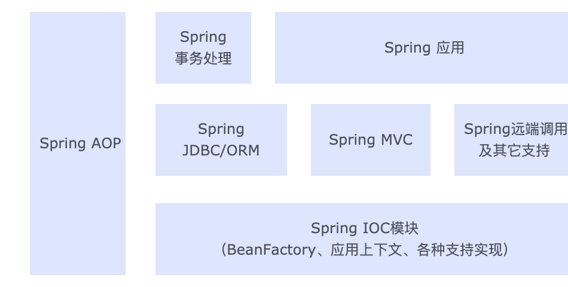

+ Spring的各个子项目
+ Spring的设计目标
+ Spring的整体架构
+ Spring的应用场景
# 1 Srping的各个子项目
+ Spring FrameWork （Core）：Spring项目的核心。
	+ IoC容器，提供依赖反转模式的实现
	+ 集成AOP的功能
	+ 其它Spring的基本模块：MVC，JDBC，事务处理模块的实现
+ Spring Web Flow：原先的Spring Web Flow是一个建立在Spring MVC基础上的Web工作流引擎。是构建在Spring MVC基础上的，是相对于Spring Frameword（Core）独立发展的
+ Spring BlazeDS Integration：这是一个提供 Spring与Adobe Flex技术集成的模块（Flex技术用来做前端展现的渲染的）。
+ Spring Security：是广泛使用的技术 Spring的认证和安全工具，就是先前的Spring社区中久负盛名的Acegi框架。
+ Spring Security OAuth：这个项目为OAuth在Spring上集成提供支持。OAuth是一个第三方模块，提供一个开放的协议的实现，通过这个协议，前端桌面的应用可以对Web应用进行简单而标准的安全调用
+ Spring Dynamic Modules：可以让Spring应用运行在OSGi平台上
+ Spring Batch：提供构建批处理应用和自动化操作的框架，这些应用的特点是不需要与用户交互，重复的操作量大，对于大容量的批数据处理而言，这些操作往往要求较高的可靠性。
+ Spring Integration：体现了“企业集成模式”的具体实现，并为企业的数据集成提供解决方案。为企业数据集成提供了各种适配器，通过这些适配器来转化各种消息格式，并帮助Spring应用完成与企业应用系统的集成
+ Spring AMQP：是为Spring应用更好地使用基础AMQP的消息服务而开发的，使在Spring应用中使用AMQP消息服务器变得更为简单。
+ Spring .NET：帮助在.NET环境使用Spring功能。
+ Spring Android：为Android终端开发应用提供Spring的支持
+ Spring Mobile：基于Spring MVC构建的，为移动终端的服务器应用开发提供支持
+ Spring Social：是Spring框架的扩展，可以帮助Spring应用更方便的使用SNS（Social Networ
k Service），例如FaceBook和Twitter这些服务的使用等。
+ Spring Data：为Spring应用提供使用非关系型数据的能力。
# 2 Spring的设计目标
Spring为开发者提供的是一个一站式的轻量级应用开发框架（平台）。
# 3 Spring的整体架构
Spring架构图

+ Spring IoC：包含了最为基本的IoC容器BeanFactory的接口与实现，也就是说，在这个Spring的核心包中，不仅定义了IoC容器的最基本接口（BeanFactory），以及基于BeanFactory提供的其他扩展。如XmlBeanFactory，SimpleJndiBeanFactory、StaticListableBeanFactory等。
	+ 一个单纯的Ioc容器对于应用开发来说是不够的，为了让应用更方便的使用Ioc容器，还需要在Ioc容器的外围提供其他的支持，这些支持包括Resource访问资源的抽象和定位等，所有这些，都是Spring OoC模块的基本内容。
	+ ApplicationContext应用上下文，IoC容器的高级形态。同时还有FileSystemApplicationContext、ClassPathXmlApplicationContext。对应用来说，是IoC容器中更面相框架的使用方式，同样，为了方便应用开发，像国际化消息元和应用支持事件的这些特征，也都在这个模块中配合Ioc容器来实现，这些功能围绕着IoC基本容器和应用上下文的实现，构成了整个Spring IoC模块设计的主要内容
+ Spring AOP：这也是Spring的核心模块，围绕着AOP的增强功能，Spring集成了AspectJ作为AOP的一个特定实现，同时还在JVM动态代理/CGLIB的基础上，实现了一个AOP框架，作为Spring集成其他模块的工具，比如TransactionProxyFactoryBean声明式事务处理，就是通过AOP集成到Spring中的。在这个模块中，Spring AOP实现了一个完整的建立AOP代理对象，实现AOP拦截器，直至实现各种Advice通知的过程。在对这个模块的分析中可以看到，AOP模块的完整实现是我们熟悉的AOP实现技术的一个不可多得的样本。
+ Spring MVC：以DispatherServlet为核心，实现了MVC模式，包括怎样与Web容器环境的集成，Web请求的拦截、分发、处理和ModelAndView数据的返回，以及如何集成各种UI试图展现和数据表现（如PDF、Excel等），通过这个模块，可以完成Web的前端设计
+ Spring JDBC/Spring ORM：对Java JDBC的封装。Spring JDBC包提供了JdbcTemplate作为模版累，封装了基本的数据库操作方法，如数据的查询、更新等；另外，SpringJDBC还提供了RDBMS的操作对象，这些操作对象可以使应用一更面相对象的方法来使用JDBC，比如可以使用MappingSqlQuery讲数据库记录直接映射到对象集合，类似于一个极为简单的ORM工具。
+ Spring 事务处理：Spring事务处理是一个通过Spring AOP实现自身功能增强的典型模块。在这个模块中，Spring把在企业应用开发中事务处理的主要过程抽象出来，并且简洁的通过AOP的切面增强实现了声明式事务处理的功能。
	+ Spring把在企业应用开发中事务处理的主要过程抽象出来，并且简洁的通过AOP的切面增强实现了声明式事务处理的功能。同时这些事务处理的基本过程和具体的事务处理起实现是无关的，也就是说，应用可以选择不同的具体的事务处理机制，如JTA、JDBC、Hibernate等。
	+ 在这个模块中，可以看到一个通用的实现声明式事务处理的基本过程，比如怎样配置事务处理的拦截器，怎样读入事务配置属性，并结合这些事务配置属性对事务对象进行处理，包括事务的创建、挂起、提交、回滚等基本过程，还可以看到具体的事务处理器（如DataSourceTransactionManager、HibernateTransactionManager、JtaTrasactionManager等）是怎样封装不同的事务处理机制（JDBC、Hibernate、JTA等）的。
+ Spring远端调用：Spring为应用带来的一个好处就是能够将应用解耦。应用解耦，一方面可以降低设计的复杂性，另一方面，可以在解耦以后将应用模块分布式的部署，从而提高系统整体的性能。
+ Spring 应用：被封装的Spring独立应用，如Spring Security OAuth等
# 4 Spring的应用场景
Spring的各个模块除了依赖IoC容器和AOP之外，相互之间并没有很强的耦合性。
Spring的最终模块是简化应用开发的编程模型。它所提供的服务，可以贯穿应用到整个软件中，从最上层的Web UI到底层的数据操作，到其他企业信息数据的集成，再到各种J2EE服务的使用，等等。
Spring的价值
+ Spring是一个非侵入性（non-invasive）框架，其目标是使应用程序代码对框架的依赖最小化，应用代码可以在没有Spring或者其他容器的情况下运行
+ Srping提供了一个一致的编程模型，使迎面直接使用POJO开发，从而可以与运行环境（如应用服务器）隔离开来
+ Spring推动应用的设计风格面向对象及面向接口编程转变，提高了代码的重用性和可测试性
+ Spring改进了体系结构的选择，虽然作为应用平台，Spring可以帮助我们选择不同的技术实现