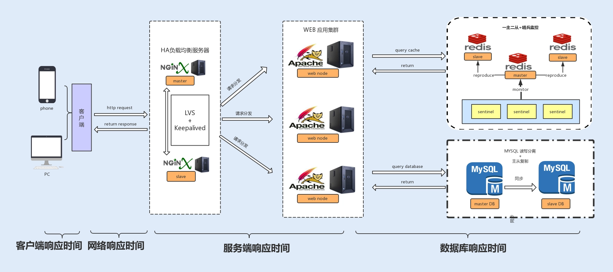

# 什么时候开始介入调优
+ 开发初期不要关心调优，但是可以做到以下几点：减少磁盘 I/O 操作、降低竞争锁的使用以及使用高效的算法
+ 系统编码完成后，对系统进行性能测试。根据产品提供的线上预期数据，进行压测
+ 上线完成后，通过日志观测系统性能问题，对问题进行修复

# 系统性能的影响因素
+ CPU
    - 代码递归导致的无限循环
    - 正则表达式引起的回溯
    - JVM 频繁的 FULL GC
    - 以及多线程编程造成的大量上下文切换
+ 内存
    - JVM
+ 磁盘I/O
+ 网络
+ 异常
    > Java 应用中，抛出异常需要构建异常栈，对异常进行捕获和处理，这个过程非常消耗系统性能。如果在高并发的情况下引发异常，持续地进行异常处理，那么系统的性能就会明显地受到影响。
+ 数据库
+ 锁竞争

# 系统性能的衡量指标
+ 响应时间
    > 一般一个接口的响应时间是在毫秒级。在系统中，我们可以把响应时间自下而上细分为以下几种      
     
    - 数据库响应时间：数据库操作所消耗的时间，往往是整个请求链中最耗时的；
    - 服务端响应时间：服务端包括 Nginx 分发的请求所消耗的时间以及服务端程序执行所消耗的时间；
    - 网络响应时间：这是网络传输时，网络硬件需要对传输的请求进行解析等操作所消耗的时间；
    - 客户端响应时间：对于普通的 Web、App 客户端来说，消耗时间是可以忽略不计的，但如果你的客户端嵌入了大量的逻辑处理，消耗的时间就有可能变长，从而成为系统的瓶颈。
+ 吞吐量/TPS，每秒事务处理量。
    > 因为 TPS 体现了接口的性能，TPS 越大，性能越好。在系统中，我们也可以把吞吐量自下而上地分为两种：磁盘吞吐量和网络吞吐量。
    - 磁盘吞吐量。磁盘性能有两个关键衡量指标。
        1. IOPS（Input/Output Per Second），即每秒的输入输出量（或读写次数），这种是指单位时间内系统能处理的 I/O 请求数量，I/O 请求通常为读或写数据操作请求，关注的是随机读写性能。适应于随机读写频繁的应用，如小文件存储（图片）、OLTP 数据库、邮件服务器
        2. 数据吞吐量，这种是指单位时间内可以成功传输的数据量。对于大量顺序读写频繁的应用，传输大量连续数据，例如，电视台的视频编辑、视频点播 VOD（Video On Demand），数据吞吐量则是关键衡量指标。
    - 网络吞吐量
        > 这个是指网络传输时没有帧丢失的情况下，设备能够接受的最大数据速率。网络吞吐量不仅仅跟带宽有关系，还跟 CPU 的处理能力、网卡、防火墙、外部接口以及 I/O 等紧密关联。而吞吐量的大小主要由网卡的处理能力、内部程序算法以及带宽大小决定
+ 计算机资源分配使用率
    > 通常由 CPU 占用率、内存使用率、磁盘 I/O、网络 I/O 来表示资源使用率。这几个参数好比一个木桶，如果其中任何一块木板出现短板，任何一项分配不合理，对整个系统性能的影响都是毁灭性的
+ 负载承受能力
    > 当系统压力上升时，你可以观察，系统响应时间的上升曲线是否平缓。这项指标能直观地反馈给你，系统所能承受的负载压力极限。例如，当你对系统进行压测时，系统的响应时间会随着系统并发数的增加而延长，直到系统无法处理这么多请求，抛出大量错误时，就到了极限。

