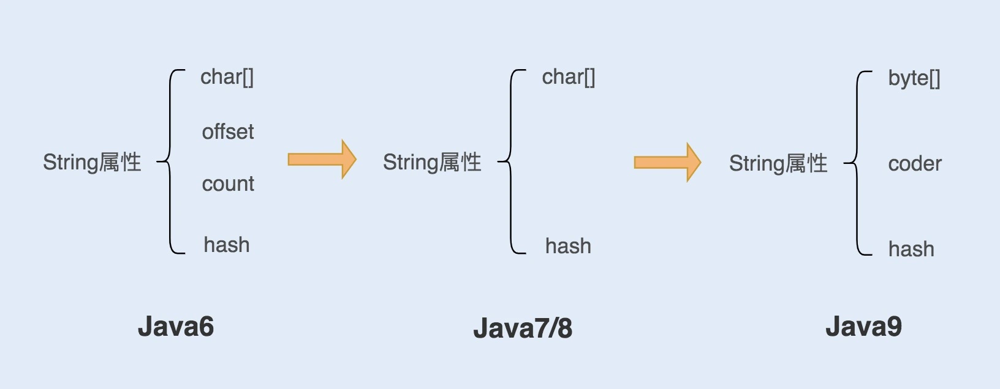

# String的实现方式
## 各个版本的Java对string的实现方式

1. 在 Java6 以及之前的版本中，String 对象是对 char 数组进行了封装实现的对象，主要有四个成员变量：char 数组、偏移量 offset、字符数量 count、哈希值 hash。String 对象是通过 offset 和 count 两个属性来定位 char[]数组，获取字符串。这么做可以高效、快速地共享数组对象，同时节省内存空间，但这种方式很有可能会导致内存泄漏。
2. 从 Java7 版本开始到 Java8 版本，Java 对 String 类做了一些改变。String 类中不再有 offset 和 count 两个变量了。这样的好处是 String 对象占用的内存稍微少了些，同时，String.substring 方法也不再共享 char[]，从而解决了使用该方法可能导致的内存泄漏问题。
3. 从 Java9 版本开始，工程师将 char[]字段改为了 byte[]字段，又维护了一个新的属性 coder，它是一个编码格式的标识  
    **Java9的新设计思路：** 
    如果String只包含了Latin-1（单字节编码），coder属性为0，反之则为1

## 不可变性
+ 不可变性来源：类被final修饰，变量数组char[]也是被final修饰
+ 不可变性优势：
    1. 保证 String 对象的安全性。假设 String 对象是可变的，那么 String 对象将可能被恶意修改。
    2. 保证 hash 属性值不会频繁变更，确保了唯一性，使得类似 HashMap 容器才能实现相应的 key-value 缓存功能。
    3. 可以实现字符串常量池。
        > 在 Java 中，通常有两种创建字符串对象的方式，一种是通过字符串常量的方式创建，如 String str=“abc”；另一种是字符串变量通过 new 形式的创建，如 String str = new String(“abc”)。当代码中使用第一种方式创建字符串对象时，JVM 首先会检查该对象是否在字符串常量池中，如果在，就返回该对象引用，否则新的字符串将在常量池中被创建。这种方式可以减少同一个值的字符串对象的重复创建，节约内存。   
+ 基于不可变性，理解String新建的逻辑。
    > String str = new String(“abc”) 这种方式，首先在编译类文件时，"abc"常量字符串将会放入到常量结构中，在类加载时，“abc"将会在常量池中创建；其次，在调用 new 时，JVM 命令将会调用 String 的构造函数，同时引用常量池中的"abc” 字符串，在堆内存中创建一个 String 对象；最后，str 将引用 String 对象。

# String优化方式
## 结合编译器的优化对String进行优化
+ 常规“+”号的默认优化方式
    - 原始代码
        ```
            String str= "ab" + "cd" + "ef";
        ```
    - 编译器编译后的代码
        ```
            String str= "abcdef";
        ```
+ 循环“+”号的优化方式
    - 原始代码
        ```
            String str = "abcdef";
            for(int i=0; i<1000; i++) {
                str = str + i;
            }
        ```
    - 编译优化后的代码
        ```
            String str = "abcdef";
            for(int i=0; i<1000; i++) {
                str = (new StringBuilder(String.valueOf(str))).append(i).toString();
            }
        ```
        **存在的问题**：循环体内多次新建StringBuilder对象，此类不可以依赖编译器自己优化，需要自己实现。
## 如何使用String.intern节省空间