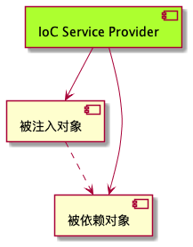

# 1 依赖注入
被注入对象和被依赖对象，有IoC Service Provider来统一管理。被注入对象的依赖对象的取得方式，发生了反转，控制从被注入对象转到了Ioc Service Provider。

依赖注入有三种方式：构造函数方法注入、Setter方法注入、接口注入。
以及spring提供的基于注解的注入。

## 1.1 构造函数方法注入
IoC Service Provider会检查被注入对象的构造方法，取得它所需的依赖对象列表，进行为其注入相应的对象。

同一个对象不可能被构造两次，因此，被注入对象的构造乃至其整个生命周期，应该是有Ioc Service Provider来管理。

构造器注入方式比较直观，对象构造完成后，即进入就绪状态，可以马上使用。

## 1.2 setter方法注入
setter方法不像构造器方法注入，让对象构造完成后就使用，但相对来说更宽松，可以在对象构造完成后再注入。

## 1.3 接口注入
被注入对象如果想要IoC Service Provider 帮期注入，必须实现某个接口。这个接口提供一个方法，用来为其注入依赖对象。IoC Service Provider最终通过这些接口来了解应该为被注入对象注入哪些依赖对象。

接口注入方式，不提倡。因为它强制对象实现不必要的接口，带有侵入性

## 1.4 spring 的注解方式注入
spring还提供了基于注解的注入：

Spring主要提供了@Autowired和@Resource注解模式。

@Autowired 注解，可以对Bean类成员变量、方法及构造函数进行标注，完成依赖注入的自动装配工作。使用@Autowired可以省略Bean类的待依赖注入对象的set方法，@Autowired默认情况下按照依赖注入对象的类型自动进行匹配。加入@Autowired注解的方式是在Bean类依赖注入对象的前面加上@Autowired语句。

@Autowired还提供required的属性，用来处理当注入的Bean实例不存在的情况。required为true时，如果注入的Bean实例不存在，程序会抛出异常；required为false时，如果注入的Bean实例不存在，程序会忽略。由于默认情况下@Autowired是按类型匹配的(byType)，如果需要按名称(byName)匹配，可以使用@Qualifier注解与@Autowired结合。

@Resource注解的功能和@Autowired注解功能相近，@Resource有name和type两个主要的属性。Spring容器对于@Resource注解的name属性解析为bean的名字，type属性则解析为bean的类型。因此使用name属性，则按byName模式的自动注入策略，如果使用type属性则按 byType模式自动注入策略。如果两个属性都未指定，Spring容器将通过反射技术默认按byName模式注入。
