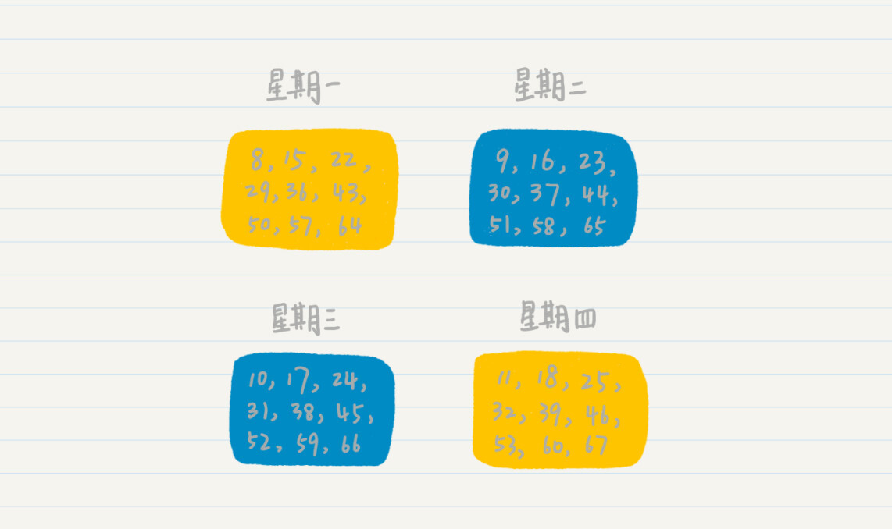
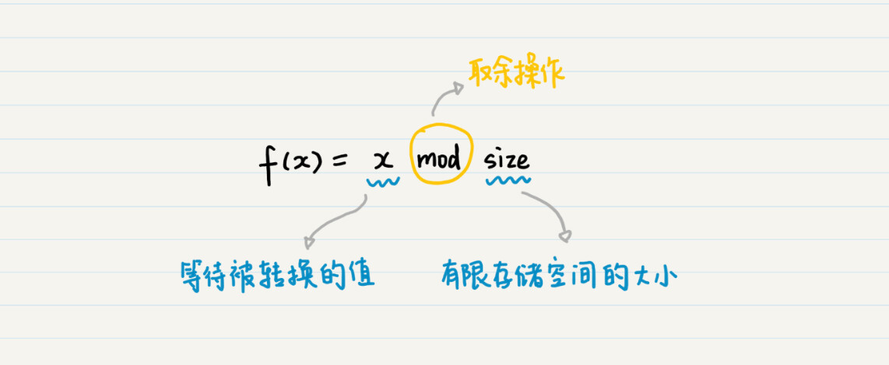
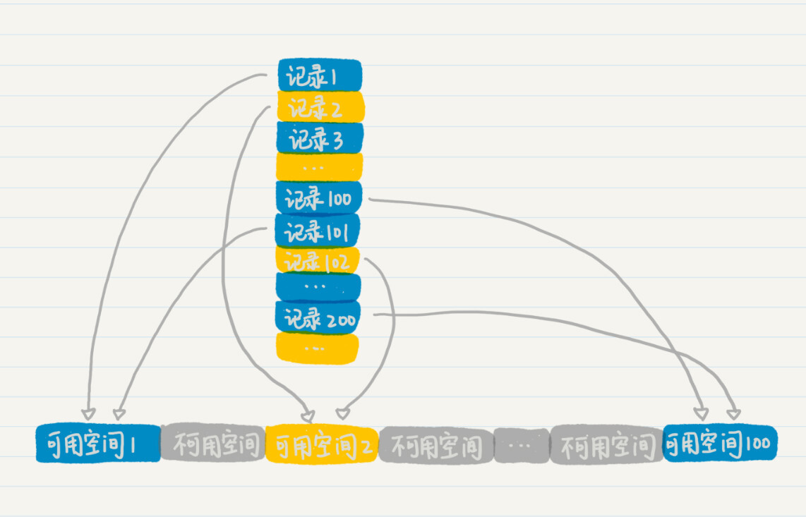

你好，我是黄申。今天我们来聊聊“余数”。

提起余数，我想你肯定不陌生，因为我们生活中就有很多很多与余数相关的例子。

比如说，今天是星期三，你想知道 50 天之后是星期几，那你可以这样算，拿 50 除以 7（因为一个星期有 7 天），然后余 1，最后在今天的基础上加一天，这样你就能知道 50 天之后是星期四了。

再比如，我们做 Web 编程的时候，经常要用到分页的概念。如果你要展示 1123 条数据，每页 10 条，那该怎么计算总共的页数呢？我想你肯定是拿 1123 除以 10，最后得到商是 112，余数是 3，所以你的总页数就是 112+1=113，而最后的余数就是多出来，凑不够一页的数据。

看完这几个例子，不知道你有没有发现，余数总是在一个固定的范围内。

比如你拿任何一个整数除以 7，那得到的余数肯定是在 0～6 之间的某一个数。所以当我们知道 1900 年的 1 月 1 日是星期一，那便可以知道这一天之后的第 1 万天、10 万天是星期几，是不是很神奇？

你知道，整数是没有边界的，它可能是正无穷，也可能是负无穷。但是余数却可以通过某一种关系，让整数处于一个确定的边界内。我想这也是人类发明星期或者礼拜的初衷吧，任你时光变迁，我都是以 7 天为一个周期，“周”而复始地过着确定的生活。因为从星期的角度看，不管你是哪一天，都会落到星期一到星期日的某一天里。

我们再拿上面星期的例子来看。假如今天是星期一，从今天开始的 100 天里，都有多少个星期呢？你拿 100 除以 7，得到商 14 余 2，也就是说这 100 天里有 14 周多 2 天。换个角度看，我们可以说，这 100 天里，你的第 1 天、第 8 天、第 15 天等等，在余数的世界里都被认为是同一天，因为它们的余数都是 1，都是星期一，你要上班的日子。同理，第 2 天、第 9 天、第 16 天余数都是 2，它们都是星期二。

这些数的余数都是一样的，所以被归类到了一起，有意思吧？是的，我们的前人早已注意到了这一规律或者特点，所以他们把这一结论称为同余定理。简单来说，就是两个整数 a 和 b，如果它们除以正整数 m 得到的余数相等，我们就可以说 a 和 b 对于模 m 同余。

也就是说，上面我们说的 100 天里，所有星期一的这些天都是同余的，所有星期二的这些天就是同余的，同理，星期三、星期四等等这些天也都是同余的。

还有，我们经常提到的奇数和偶数，其实也是同余定理的一个应用。当然，这个应用里，它的模就是 2 了，2 除以 2 余 0，所以它是偶数；3 除以 2 余 1，所以它是奇数。2 和 4 除以 2 的余数都是 0，所以它们都是一类，都是偶数。3 和 5 除以 2 的余数都是 1，所以它们都是一类，都是奇数。

你肯定会说，同余定理就这么简单吗，这个定理到底有什么实际的用途啊？其实，我上面已经告诉你答案了，你不妨先自己思考下，同余定理的意义到底是什么。

简单来说，同余定理其实就是用来分类的。你知道，我们有无穷多个整数，那怎么能够全面、多维度地管理这些整数？同余定理就提供了一个思路。

因为不管你的模是几，最终得到的余数肯定都在一个范围内。比如我们上面除以 7，就得到了星期几；我们除以 2，就得到了奇偶数。所以按照这种方式，我们就可以把无穷多个整数分成有限多个类。

这一点，在我们的计算机中，可是有大用途。

哈希（Hash）你应该不陌生，在每个编程语言中，都会有对应的哈希函数。哈希有的时候也会被翻译为散列，简单来说，它就是将任意长度的输入，通过哈希算法，压缩为某一固定长度的输出。这话听着是不是有点耳熟？我们上面的求余过程不就是在做这事儿吗？

举个例子，假如你想要快速读写 100 万条数据记录，要达到高速的存取，最理想的情况当然是开辟一个连续的空间存放这些数据，这样就可以减少寻址的时间。但是由于条件的限制，我们并没有能够容纳 100 万条记录的连续地址空间，这个时候该怎么办呢？

我们可以考察一下，看看系统是否可以提供若干个较小的连续空间，而每个空间又能存放一定数量的记录。比如我们找到了 100 个较小的连续空间，也就是说，这些空间彼此之间是被分隔开来的，但是内部是连续的，并足以容纳 1 万条记录连续存放，那么我们就可以使用余数和同余定理来设计一个散列函数，并实现哈希表的结构。

那这个函数应该怎么设计呢？你可以先停下来思考思考，提醒你下，你可以再想想星期几的那个例子，因为这里面用的就是余数的思想。

下面是我想到的一种方法：

在这个公式中，x 表示等待被转换的数值，而 size 表示有限存储空间的大小，mod 表示取余操作。通过余数，你就能将任何数值，转换为有限范围内的一个数值，然后根据这个新的数值，来确定将数据存放在何处。

具体来说，我们可以通过记录标号模 100 的余数，指定某条记录存放在哪个空间。这个时候，我们的公式就变成了这样：

假设有两条记录，它们的记录标号分别是 1 和 101。我们把这些模 100 之后余数都是 1 的，存放到第 1 个可用空间里。以此类推，将余数为 2 的 2、102、202 等，存放到第 2 个可用空间，将 100、200、300 等存放到第 100 个可用空间里。

这样，我们就可以根据求余的快速数字变化，对数据进行分组，并把它们存放到不同的地址空间里。而求余操作本身非常简单，因此几乎不会增加寻址时间。

除此之外，为了增加数据散列的随机程度，我们还可以在公式中加入一个较大的随机数 MAX，于是，上面的公式就可以写成这样：

我们假设随机数 MAX 是 590199，那么我们针对标号为 1 的记录进行重新计算，最后的计算结果就是 0，而针对标号 101 的记录，如果随机数 MAX 取 627901，对应的结果应该是 2。这样先前被分配到空间 1 的两条记录，在新的计算公式作用下，就会被分配到不同的可用空间中。

你可以尝试记录 2 和 102，或者记录 100 和 200，最后应该也是同样的情况。你会发现，使用了 MAX 这个随机数之后，被分配到同一个空间中的记录就更加“随机”，更适合需要将数据重新洗牌的应用场景，比如加密算法、MapReduce 中的数据分发、记录的高速查询和定位等等。

让我以加密算法为例，在这里面引入 MAX 随机数就可以增强加密算法的保密程度，是不是很厉害？举个例子，比如说我们要加密一组三位数，那我们设定一个这样的加密规则：

先对每个三位数的个、十和百位数，都加上一个较大的随机数。

2 然后将每位上的数都除以 7，用所得的余数代替原有的个、十、百位数；

这就是一个基本的加密变换过程。

假如说，我们要加密数字 625，根据刚才的规则，我们来试试。假设随机数我选择 590127。那百、十和个位分别加上这个随机数，就变成了 590133，590129，590132。然后，三位分别除以 7 求余后得到 5，1，4。最终，我们可以得到加密后的数字就是 415。因为加密的人知道加密的规则、求余所用的除数 7、除法的商、以及所引入的随机数 590127，所以当拿到 415 的时候，加密者就可以算出原始的数据是 625。是不是很有意思？

## 0.1 小结

到这里，余数的所有知识点我们都讲完了。我想在此之前，你肯定是知道余数，也明白怎么求余。但对于余数的应用不知道你之前是否有思考过呢？我们经常说，数学是计算机的基础，在余数这个小知识点里，我们就能找到很多的应用场景，比如我前面介绍的散列函数、加密算法，当然，也还有我们没有介绍到的，比如循环冗余校验等等。

余数只是数学知识中的沧海一粟。你在中学或者大学的时候，肯定接触过很多的数学知识和定理，编程的时候也会经常和数字、公式以及数据打交道，但是真正学懂数学的人却没几个。希望我们可以从余数这个小概念开始，让你认识到数学思想其实非常实用，用好这些知识，对你的编程，甚至生活都有意想不到的作用。

## 0.2 思考题

你可以想想，在生活和编程中，还有哪些地方用到了余数的思想呢？

欢迎在留言区交作业，并写下你今天的学习笔记。你可以点击“请朋友读”，把今天的内容分享给你的好友，和他一起精进。

哈希函数与余数的关系 余数运算本身就是一种哈希函数，通过余数将整数进行分类。哈希函数将任意长度的输入压缩为固定长度的输出，类似于求余过程。利用余数和同余定理设计散列函数和哈希表结构，实现数据存储和快速读写。引入随机数可以增加数据散列的随机程度，适用于加密算法和数据分发。本文介绍了哈希函数的原理和应用，以及利用余数和同余定理设计散列函数的方法。余数的应用不仅限于数学领域，还涉及到编程中的散列函数、加密算法以及循环冗余校验等方面。通过理解余数的思想，读者可以发现数学思想在编程和生活中的实用性，为编程和生活带来意想不到的作用。欢迎读者思考在生活和编程中还有哪些地方用到了余数的思想，并分享学习笔记。