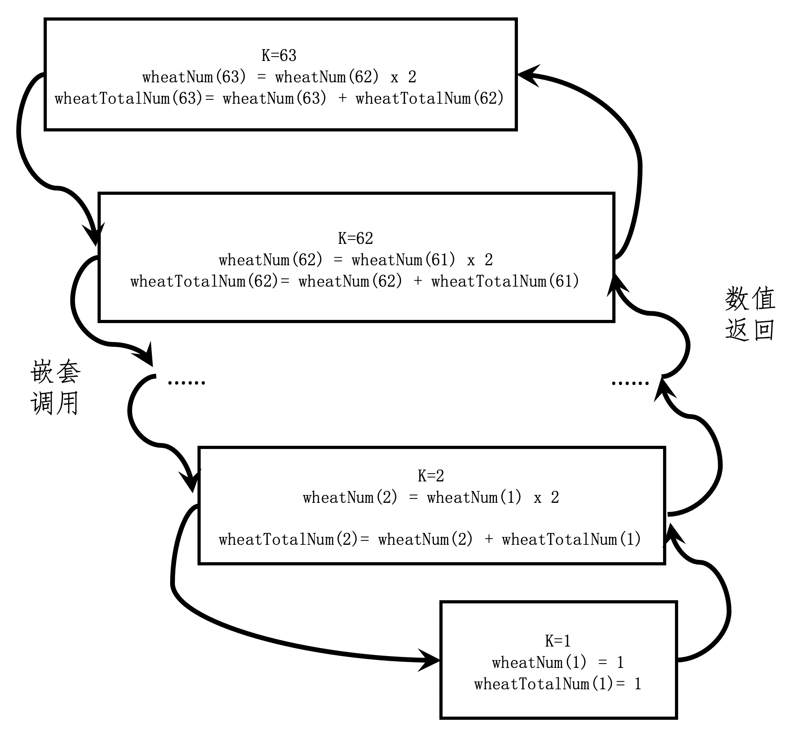

你好，我是黄申。

上次我们聊了迭代法及其应用，并用编程实现了几个小例子。不过你知道吗，对于某些迭代问题，我们其实可以避免一步步的计算，直接从理论上证明某个结论，节约大量的计算资源和时间，这就是我们今天要说的数学归纳法。

平时我们谈的“归纳”，是一种从经验事实中找出普遍特征的认知方法。比如，人们在观察了各种各样动物之后，通过它们的外观、行为特征、生活习性等得出某种结论，来区分哪些是鸟、哪些是猫等等。比如我这里列出的几个动物的例子。

通过上面的表格，我们可以进行归纳，并得出这样的结论：

如果一个动物，身上长羽毛并且会飞，那么就是属于鸟；

如果一个动物，身上长绒毛、不会飞、而且吃小鱼和老鼠，那么就属于猫。

通过观察 个动物样本的 个特征，从而得到某种动物应该具有何种特征，这种方法就是我们平时所提到的归纳法。

我们日常生活中所说的这种归纳法和数学归纳法是不一样的，它们究竟有什么区别呢？具体数学归纳法可以做什么呢？我们接着上一节舍罕王赏麦的故事继续说。

## 什么是数学归纳法？

上节我们提到，在棋盘上放麦粒的规则是，第一格放一粒，第二格放两粒，以此类推，每一小格内都比前一小格多一倍的麦子，直至放满 个格子。

我们假想一下自己穿越到了古印度，正站在国王的身边，看着这个棋盘，你发现第 格到第 格的麦子数分别是：。这个时候，国王想知道总共需要多少粒麦子。我们小时候都玩过“找规律”，于是，我发现了这么一个规律，你看看是不是这样？

根据这个观察，我们是不是可以大胆假设，前 个格子的麦粒总数就是 呢？如果这个假设成立，那么填满 64 格需要的麦粒总数，就是

。

这个假设是否成立，我们还有待验证。但是对于类似这种无穷数列的问题，我们通常可以采用数学归纳法（Mathematical Induction）来证明。

在数论中，数学归纳法用来证明任意一个给定的情形都是正确的，也就是说，第一个、第二个、第三个，一直到所有情形，概不例外。

数学归纳法的一般步骤是这样的：

证明基本情况（通常是 的时候）是否成立；

假设 成立，再证明 也是成立的（ 为任意大于 的自然数）。

只要学过数学，我想你对这个步骤都不陌生。但是，现在你需要牢记这个步骤，然后我们用这个步骤来证明下开头的例子。

为了让你更好地理解，我将原有的命题分为两个子命题来证明。第一个子命题是，第 个棋格放的麦粒数为 。第二个子命题是，前 个棋格放的麦粒数总和为 。

首先，我们来证明第一个子命题。

基本情况：我们已经验证了 的时候，第一格内的麦粒数为 ，和 相等。因此，命题在 的时候成立。

假设第 格的麦粒数为 。那么第 格的麦粒数为第 格的 倍，也就是 。因此，如果命题在 的时候成立，那么在 的时候也成立。

所以，第一个子命题成立。在这个基础之上，我再来证明第二个子命题。

基本情况：我们已经验证了 的时候，所有格子的麦粒总数为 。因此命题在 的时候成立。

假设前 格的麦粒总数为 ，基于前一个命题的结论，第 k 格的麦粒数为 。那么前 格的麦粒总数为 。因此，如果命题在 的时候成立，那么在 的时候也成立。

说到这里，我已经证明了这两个命题都是成立的。和使用迭代法的计算相比，数学归纳法最大的特点就在于“归纳”二字。它已经总结出了规律。只要我们能够证明这个规律是正确的，就没有必要进行逐步的推算，可以节省很多时间和资源。

说到这里，我们也可以看出，数学归纳法中的“归纳”是指的从第一步正确，第二步正确，第三步正确，一直推导到最后一步是正确的。这就像多米诺骨牌，只要确保第一张牌倒下，而每张牌的倒下又能导致下一张牌的倒下，那么所有的骨牌都会倒下。从这里，你也能看出来，这和开篇提到的广义归纳法是不同的。数学归纳法并不是通过经验或样本的观察，总结出事物的普遍特征和规律。

好了，对数学归纳法的概念，我想你现在已经理解了。这里，我对上一节中有关麦粒的代码稍作修改，增加了一点代码来使用数学归纳法的结论，并和迭代法的实现进行了比较，你可以看看哪种方法耗时更长。

public static void main(String\[\] args) {

int grid = 63;

long start, end = 0;

start = System.currentTimeMillis();

System.out.println(String.format("舍罕王给了这么多粒：%d", Lesson3\_1.getNumberOfWheat(grid)));

end = System.currentTimeMillis();

System.out.println(String.format("耗时%d毫秒", (end - start)));

start = System.currentTimeMillis();

System.out.println(String.format("舍罕王给了这么多粒：%d", (long)(Math.pow(2, grid)) - 1));

end = System.currentTimeMillis();

System.out.println(String.format("耗时%d毫秒", (end - start)));

}

在我的电脑上，这段代码运行的结果是：舍罕王给了 粒，耗时 毫秒。舍罕王给了这么多粒：，耗时 毫秒。

你可能已经发现，当 grid= 时，结果差了 个。这个是由于 Math.pow() 函数计算精度导致的误差。正确的结果应该是 。不过，基于数学归纳结论的计算明显在耗时上占有优势。虽然在我的笔记本电脑上只有 4 毫秒的差距，但是在生产项目的实践中，这种点点滴滴的性能差距都有可能累积成明显的问题。

## 递归调用和数学归纳的逻辑是一样的？

我们不仅可以使用数学归纳法从理论上指导编程，还可以使用编程来模拟数学归纳法的证明。如果你仔细观察一下数学归纳法的证明过程，会不会觉得和函数的递归调用很像呢？

这里我通过总麦粒数的命题来示范一下。首先，我们要把这个命题的数学归纳证明，转换成一段伪代码，这个过程需要经过这样两步：

第一步，如果 为 ，那么我们就判断麦粒总数是否为 。同时，返回当前棋格的麦粒数，以及从第 格到当前棋格的麦粒总数。

第二步，如果 为 的时候成立，那么判断 为 的时候是否也成立。此时的判断依赖于前一格 的麦粒数、第 格到 格的麦粒总数。这也是上一步我们所返回的两个值。

你应该看出来了，这两步分别对应了数学归纳法的两种情况。在数学归纳法的第二种情况下，我们只能假设 的时候命题成立。但是，在代码的实现中，我们可以将伪代码的第二步转为函数的递归（嵌套）调用，直到被调用的函数回退到 的情况。然后，被调用的函数逐步返回 时命题是否成立。

如果要写成具体的函数，就类似下面这样：

class Result {

public long wheatNum \= 0;

public long wheatTotalNum \= 0;

}

public class Lesson4\_2 {

\* @Description: 使用函数的递归（嵌套）调用，进行数学归纳法证明

\* @param k-放到第几格，result-保存当前格子的麦粒数和麦粒总数

\* @return boolean-放到第k格时是否成立

\*/

public static boolean prove(int k, Result result) {

if (k == 1) {

if ((Math.pow(2, 1) - 1) == 1) {

result.wheatNum = 1;

result.wheatTotalNum = 1;

return true;

} else return false;

}

else {

boolean proveOfPreviousOne \= prove(k - 1, result);

result.wheatNum \*= 2;

result.wheatTotalNum += result.wheatNum;

boolean proveOfCurrentOne \= false;

if (result.wheatTotalNum == (Math.pow(2, k) - 1)) proveOfCurrentOne = true;

if (proveOfPreviousOne && proveOfCurrentOne) return true;

else return false;

}

}

}

其中，类 Result 用于保留每一格的麦粒数，以及目前为止的麦粒总数。这个代码递归调用了函数 prove(int, Result)。

从这个例子中，我们可以看出来，递归调用的代码和数学归纳法的逻辑是一致的。一旦你理解了数学归纳法，就很容易理解递归调用了。只要数学归纳证明的逻辑是对的，递归调用的逻辑就是对的，我们没有必要纠结递归函数是如何嵌套调用和返回的。

不过，和数学归纳证明稍有不同的是，递归编程的代码需要返回若干的变量，来传递 的状态到 。这里，我使用类 Result 来实现这一点。

这里是一段测试的代码。

public static void main(String\[\] args) {

int grid \= 63;

Result result \= new Result();

System.out.println(Lesson4\_2.prove(grid, result));

}

我们最多测试到 。因为如果测试到第 格，麦粒总数就会溢出 Java 的 long 型数据。

你可以自己分析一下函数的调用和返回。我这里列出了一开始嵌套调用和到递归结束并开始返回值得的几个状态：

从这个图可以看出，函数从 开始调用，然后调用 ，也就是 ，一直到 的时候，嵌套调用结束， 的函数体开始返回值给 的函数体，一直到 的函数体。从 的嵌套调用过程，其实就是体现了数学归纳法的核心思想，我把它称为逆向递推。而从 的值返回过程，和上一篇中基于循环的迭代是一致的，我把它称为正向递推。

## 小结

今天，我介绍了一个编程中非常重要的数学概念：数学归纳法。

上一节我讲了迭代法是如何通过重复的步骤进行计算或者查询的。与此不同的是，数学归纳法在理论上证明了命题是否成立，而无需迭代那样反复计算，因此可以帮助我们节约大量的资源，并大幅地提升系统的性能。

数学归纳法实现的运行时间几乎为 。不过，数学归纳法需要我们能做出合理的命题假设，然后才能进行证明。虽然很多时候要做这点比较难，确实也没什么捷径。你就是要多做题，多去看别人是怎么解题的，自己去积累经验。

最后，我通过函数的递归调用，模拟了数学归纳法的证明过程。如果你细心的话，会发现递归的函数值返回实现了从 开始到 的迭代。说到这里，你可能会好奇：既然递归最后返回值的过程和基于循环的迭代是一致，那为什么还需要使用递归的方法呢？下一节，我们继续聊这个问题。

## 思考题

在你日常工作的项目中，什么地方用到了数学归纳法来提升代码的运行效率？如果没有遇到过，你可以尝试做做实验，看看是否有提升？

欢迎在留言区交作业，并写下你今天的学习笔记。你可以点击“请朋友读”，把今天的内容分享给你的好友，和他一起精进。

数学归纳法在编程中的重要性及应用 文章通过引出数学归纳法的概念，以放置麦粒的问题为例，详细介绍了数学归纳法的基本步骤和应用。通过实例分析，读者可以深入理解数学归纳法的原理和应用，以及其在优化算法和提高代码效率方面的重要性。作者还通过编程模拟数学归纳法的证明过程，展示了递归调用和数学归纳的逻辑相似性。递归调用的代码和数学归纳法的逻辑一致，体现了数学归纳法在编程中的应用。数学归纳法的实现运行时间几乎为零，能够帮助节约资源并提升系统性能。读者被鼓励在日常工作中尝试使用数学归纳法来提升代码的运行效率，并思考其在实际项目中的应用。