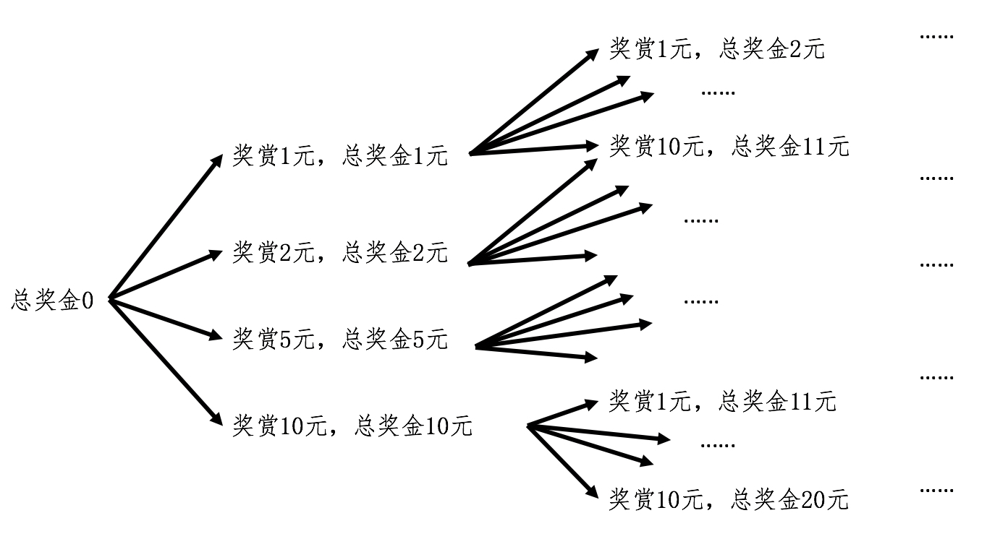

你好，我是黄申。上一节的结尾，我们用递归模拟了数学归纳法的证明。同时，我也留下了一个问题：既然递归的函数值返回过程和基于循环的迭代法一致，我们直接用迭代法不就好了，为什么还要用递归的数学思想和编程方法呢？这是因为，在某些场景下，递归的解法比基于循环的迭代法更容易实现。这是为什么呢？我们继续来看舍罕王赏麦的故事。

## 0.1 如何在限定总和的情况下，求所有可能的加和方式？

舍罕王和他的宰相西萨·班·达依尔现在来到了当代。这次国王学乖了，他对宰相说：“这次我不用麦子奖赏你了，我直接给你货币。另外，我也不用棋盘了，我直接给你一个固定数额的奖赏。”

宰相思考了一下，回答道：“没问题，陛下，就按照您的意愿。不过，我有个小小的要求。那就是您能否列出所有可能的奖赏方式，让我自己来选呢？假设有四种面额的钱币，1 元、2 元、5 元和 10 元，而您一共给我 10 元，那您可以奖赏我 1 张 10 元，或者 10 张 1 元，或者 5 张 1 元外加 1 张 5 元等等。如果考虑每次奖赏的金额和先后顺序，那么最终一共有多少种不同的奖赏方式呢？”

让我们再次帮国王想想，如何解决这个难题吧。这个问题和之前的棋盘上放麦粒有所不同，它并不是要求你给出最终的总数，而是在限定总和的情况下，求所有可能的加和方式。你可能会想，虽然问题不一样，但是求和的重复性操作仍然是一样的，因此是否可以使用迭代法？好，让我们用迭代法来试一下。

我还是使用迭代法中的术语，考虑 k=1,2,3,…,n 的情况。在第一步，也就是当 n=1 的时候，我们可以取四种面额中的任何一种，那么当前的奖赏就是 1 元、2 元、5 元和 10 元。当 n=2 的时候，奖赏的总和就有很多可能性了。如果第一次奖赏了 1 元，那么第二次有可能取 1、2、5 元三种面额（如果取 10，总数超过了 10 元，因此不可能）。

所以，在第一次奖赏 1 元，第二次奖赏 1 元后，总和为 2 元；第一次奖赏 1 元，第二次奖赏 2 元后，总和为 3 元；第一次奖赏 1 元，第二次奖赏 5 元后，总和为 6 元。好吧，这还没有考虑第一次奖赏 2 元和 5 元的情况。我来画个图，从图中你就能发现这种可能的情况在快速地“膨胀”。



你应该能看到，虽然迭代法的思想是可行的，但是如果用循环来实现，恐怕要保存好多中间状态及其对应的变量。说到这里，你是不是很容易就想到计算编程常用的函数递归？

在递归中，每次嵌套调用都会让函数体生成自己的局部变量，正好可以用来保存不同状态下的数值，为我们省去了大量中间变量的操作，极大地方便了设计和编程。

不过，这里又有新的问题了。之前用递归模拟数学归纳法还是非常直观的。可是，这里不是要计算一个最终的数值，而是要列举出所有的可能性。那应该如何使用递归来解决呢？上一节，我只是用递归编程体现了数学归纳法的思想，但是如果我们把这个思想泛化一下，那么递归就会有更多、更广阔的应用场景。

## 0.2 如何把复杂的问题简单化？

首先，我们来看，如何将数学归纳法的思想泛化成更一般的情况？数学归纳法考虑了两种情况：

如果 n=k-1 的时候，命题成立。那么只要证明 n=k 的时候，命题也成立。其中 k 为大于 1 的自然数。

将上述两点顺序更换一下，再抽象化一下，我写出了这样的递推关系：

假设 n=k-1 的时候，问题已经解决（或者已经找到解）。那么只要求解 n=k 的时候，问题如何解决（或者解是多少）；

初始状态，就是 n=1 的时候，问题如何解决（或者解是多少）。

我认为这种思想就是将复杂的问题，每次都解决一点点，并将剩下的任务转化成为更简单的问题等待下次求解，如此反复，直到最简单的形式。回到开头的例子，我们再将这种思想具体化。

假设 n=k-1 的时候，我们已经知道如何去求所有奖赏的组合。那么只要求解 n=k 的时候，会有哪些金额的选择，以及每种选择后还剩下多少奖金需要支付就可以了。

有了这个思路，就不难写出这个问题的递归实现。我这里列一个基本的实现。
```
import java.util.ArrayList;

public class Lesson5\_1 {

public static long\[\] rewards = {1, 2, 5, 10};

\* @Description: 使用函数的递归（嵌套）调用，找出所有可能的奖赏组合

\* @param totalReward-奖赏总金额，result-保存当前的解

\* @return void

\*/

public static void get(long totalReward, ArrayList<Long> result) {

if (totalReward == 0) {

System.out.println(result);

return;

}

else if (totalReward < 0) {

return;

} else {

for (int i \= 0; i < rewards.length; i++) {

ArrayList<Long> newResult = (ArrayList<Long>)(result.clone());

newResult.add(rewards\[i\]);

get(totalReward - rewards\[i\], newResult);

}

}

}

}
```
我们测试一下总金额为 10 元的时候，有多少种解。

public static void main(String\[\] args) {

int totalReward = 10;

Lesson5\_1.get(totalReward, new ArrayList<Long\>());

}

最终，程序运行后大致是这种结果：

\[1, 1, 1, 1, 1, 1, 1, 1, 1, 1\]

\[1, 1, 1, 1, 1, 1, 1, 1, 2\]

\[1, 1, 1, 1, 1, 1, 1, 2, 1\]

\[1, 1, 1, 1, 1, 1, 2, 1, 1\]

\[1, 1, 1, 1, 1, 1, 2, 2\]

...

\[5, 5\]

\[10\]

这里面每一行都是一种可能。例如第一行表示分 10 次奖赏，每次 1 元；第二行表示分 9 次奖赏，最后一次是 2 元；以此类推。最终结果的数量还是挺多的，一共有 129 种可能。试想一下，如果总金额为 100 万的话，会有多少种可能啊！

这个代码还有几点需要留意的地方，我再来解释一下：

1\. 由于一共只有 4 种金额的纸币，所以无论是 n=1 的时候还是 n=k 的时候，我们只需要关心这 4 种金额对组合产生的影响，而中间状态和变量的记录和跟踪这些繁琐的事情都由函数的递归调用负责。

2\. 这个案例的限制条件不再是 64 个棋格，而是奖赏的总金额，因此判断嵌套调用是否结束的条件其实不是次数 k，而是总金额。这个金额确保了递归不会陷入死循环。

3\. 我这里从奖赏的总金额开始，每次嵌套调用的时候减去一张纸币的金额，直到所剩的金额为 0 或者少于 0，然后结束嵌套调用，开始返回结果值。当然，你也可以反向操作，从金额 0 开始，每次嵌套调用的时候增加一张纸币的金额，直到累计的金额达到或超过总金额。

## 0.3 小结

递归和循环其实都是迭代法的实现，而且在某些场合下，它们的实现是可以相互转化的。但是，对于某些应用场景，递归确实很难被循环取代。我觉得主要有两点原因：

第一，递归的核心思想和数学归纳法类似，并更具有广泛性。这两者的类似之处体现在：将当前的问题化解为两部分：一个当前所采取的步骤和另一个更简单的问题。

1\. 一个当前所采取的步骤。这种步骤可能是进行一次运算（例如每个棋格里的麦粒数是前一格的两倍），或者做一个选择（例如选择不同面额的纸币），或者是不同类型操作的结合（例如今天讲的赏金的案例）等等。

2\. 另一个更简单的问题。经过上述步骤之后，问题就会变得更加简单一点。这里“简单一点”，指运算的结果离目标值更近（例如赏金的总额），或者是完成了更多的选择（例如纸币的选择）。而“更简单的问题”，又可以通过嵌套调用，进一步简化和求解，直至达到结束条件。

我们只需要保证递归编程能够体现这种将复杂问题逐步简化的思想，那么它就能帮助我们解决很多类似的问题。

第二，递归会使用计算机的函数嵌套调用。而函数的调用本身，就可以保存很多中间状态和变量值，因此极大的方便了编程的处理。

正是如此，递归在计算机编程领域中有着广泛的应用，而不仅仅局限在求和等运算操作上。在下一节中，我将介绍如何使用递归的思想，进行“分而治之”的处理。


## 0.4 思考题

一个整数可以被分解为多个整数的乘积，例如，6 可以分解为 2x3。请使用递归编程的方法，为给定的整数 n，找到所有可能的分解（1 在解中最多只能出现 1 次）。例如，输入 8，输出是可以是 1x8, 8x1, 2x4, 4x2, 1x2x2x2, 1x2x4, ……

欢迎在留言区交作业，并写下你今天的学习笔记。你可以点击“请朋友读”，把今天的内容分享给你的好友，和他一起精进。


递归与循环都是迭代法的实现，但在某些场景下，递归的解法更容易实现。递归的核心思想类似于数学归纳法，将复杂问题逐步简化，通过函数的嵌套调用保存中间状态和变量值，方便编程处理。本文以舍罕王赏麦和奖赏货币的例子阐述了递归的应用，深入浅出地解释了递归的思想和实际应用。递归在计算机编程领域有广泛应用，不仅局限在求和等运算操作上。读者可以通过文章了解递归的概念和实际应用，以及如何使用递归的思想进行“分而治之”的处理。文章提出了一个思考题，鼓励读者使用递归编程的方法，为给定的整数找到所有可能的分解。这篇文章对于读者快速了解递归的概念和实际应用具有很好的指导意义。