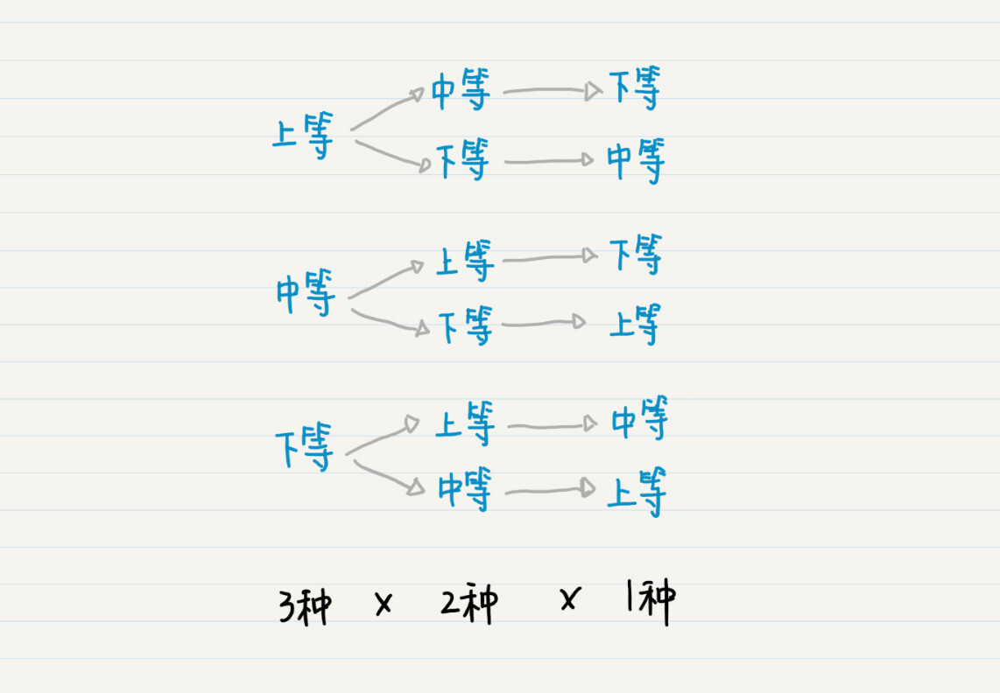

你好，我是黄申。

“田忌赛马”的故事我想你肯定听过吧？田忌是齐国有名的将领，他常常和齐王赛马，可是总是败下阵来，心中非常不悦。孙膑想帮田忌一把。他把这些马分为上、中、下三等。他让田忌用自己的下等马来应战齐王的上等马，用上等马应战齐王的中等马，用中等马应战齐王的下等马。三场比赛结束后，田忌只输了第一场，赢了后面两场，最终赢得与齐王的整场比赛。

孙膑每次都从田忌的马匹中挑选出一匹，一共进行三次，排列出战的顺序。是不是感觉这个过程很熟悉？这其实就是数学中的排列过程。

我们初高中的时候，都学过排列，它的概念是这么说的：从 n 个不同的元素中取出 m（1≤m≤n）个不同的元素，按照一定的顺序排成一列，这个过程就叫排列（Permutation）。当 m=n 这种特殊情况出现的时候，比如说，在田忌赛马的故事中，田忌的三匹马必须全部出战，这就是全排列（All Permutation）。

如果选择出的这 m 个元素可以有重复的，这样的排列就是为重复排列（Permutation with Repetition），否则就是不重复排列（Permutation without Repetition）。

看出来没有？这其实是一个树状结构。从树的根结点到叶子结点，每种路径都是一种排列。有多少个叶子结点就有多少种全排列。从图中我们可以看出，最终叶子结点的数量是 3x2x1=6，所以最终排列的数量为 6。

{上等，中等，下等}

{上等，下等，中等}

{中等，上等，下等}

{中等，下等，上等}

{下等，上等，中等}

{下等，中等，上等}

我用 t1，t2 和 t3 分别表示田忌的上、中、下等马跑完全程所需的时间，用 q1，q2 和 q3 分别表示齐王的上、中、下等马跑全程所需的时间，因此，q1<t1<q2<t2<q3<t3。

如果你将这些可能的排列，仔细地和齐王的上等、中等和下等马进行对比，只有{下等，上等，中等}这一种可能战胜齐王，也就是 t3>q1，t1<q2，t2<q3。

对于最终排列的数量，这里我再推广一下：

对于 n 个元素的全排列，所有可能的排列数量就是 nx(n-1)x(n-2)x…x2x1，也就是 n!；

对于 n 个元素里取出 m(0<m≤n) 个元素的不重复排列数量是 nx(n-1)x(n-2)x…x(n - m + 1)，也就是 n!/(n-m)!。

这两点都是可以用数学归纳法证明的，有兴趣的话你可以自己尝试一下。

## 如何让计算机为田忌安排赛马？

我们刚才讨论了 3 匹马的情况，这倒还好。可是，如果有 30 匹马、300 匹马，怎么办？30 的阶乘已经是天文数字了。更糟糕的是，如果两组马之间的速度关系也是非常随机的，例如 q1<q2<t1<t2<q3<t3， 那就不能再使用“最差的马和对方最好的马比赛”这种战术了。这个时候，人手动肯定是算不过来了，计算机又要帮我们大忙啦！我们使用代码来展示如何生成所有的排列。

如果你细心的话，就会发现在新版舍罕王赏麦的案例中，其实已经涉及了排列的思想，不过那个案例不是以“选取多少个元素”为终止条件，而是以“选取元素的总和”为终止条件。尽管这样，我们仍然可以使用递归的方式来快速地实现排列。

不过，要把田忌赛马的案例，转成计算机所能理解的内容，还需要额外下点功夫。

首先，在不同的选马阶段，我们都要保存已经有几匹马出战、它们的排列顺序、以及还剩几匹马没有选择。我使用变量 result 来存储到当前函数操作之前，已经出战的马匹及其排列顺序。而变量 horses 存储了到当前函数操作之前，还剩几匹马还没出战。变量 new\_result 和 rest\_horses 是分别从 result 和 horses 克隆而来，保证不会影响上一次的结果。

其次，孙膑的方法之所以奏效，是因为他看到每一等马中，田忌的马只比齐王的差一点点。如果相差太多，可能就会有不同的胜负结局。所以，在设置马匹跑完全程的时间上，我特意设置为 q1<t1<q2<t2<q3<t3，只有这样才能保证计算机得出和孙膑相同的结论。

import java.util.ArrayList;

import java.util.Arrays;

import java.util.HashMap;

public class Lesson7\_1 {

public static HashMap<String, Double\> q\_horses\_time = new HashMap<String, Double\>(){

{

put("q1", 1.0);

put("q2", 2.0);

put("q3", 3.0);

}

};

public static HashMap<String, Double\> t\_horses\_time = new HashMap<String, Double\>(){

{

put("t1", 1.5);

put("t2", 2.5);

put("t3", 3.5);

}

};

public static ArrayList<String\> q\_horses = new ArrayList<String\>(Arrays.asList("q1", "q2", "q3"));

\* @Description: 使用函数的递归（嵌套）调用，找出所有可能的马匹出战顺序

\* @param horses\-目前还剩多少马没有出战，result-保存当前已经出战的马匹及顺序

\* @return void

\*/

public static void permutate(ArrayList<String\> horses, ArrayList<String\> result) {

if (horses.size() == 0) {

System.out.println(result);

compare(result, q\_horses);

System.out.println();

return;

}

for (int i = 0; i < horses.size(); i++) {

ArrayList<String\> new\_result = (ArrayList<String\>)(result.clone());

new\_result.add(horses.get(i));

ArrayList<String\> rest\_horses = ((ArrayList<String\>)horses.clone());

rest\_horses.remove(i);

permutate(rest\_horses, new\_result);

}

}

}

另外，我还使用了 compare 的函数来比较田忌和齐王的马匹，看哪方获胜。

public static void compare(ArrayList<String\> t, ArrayList<String\> q) {

int t\_won\_cnt = 0;

for (int i = 0; i < t.size(); i++) {

System.out.println(t\_horses\_time.get(t.get(i)) + " " + q\_horses\_time.get(q.get(i)));

if (t\_horses\_time.get(t.get(i)) < q\_horses\_time.get(q.get(i))) t\_won\_cnt ++;

}

if (t\_won\_cnt > (t.size() / 2)) System.out.println("田忌获胜！");

else System.out.println("齐王获胜！");

System.out.println();

}

下面是测试代码。当然你可以设置更多的马匹，并增加相应的马匹跑完全程的时间。

public static void main(String\[\] args) {

ArrayList<String\> horses = new ArrayList<String\>(Arrays.asList("t1", "t2", "t3"));

Lesson7\_1.permutate(horses, new ArrayList<String\>());

}

在最终的输出结果中，6 种排列中只有一种情况是田忌获胜的。

\[t3, t1, t2\]

3.5 1.0

1.5 2.0

2.5 3.0

田忌获胜！

如果田忌不听从孙膑的建议，而是随机的安排马匹出战，那么他只有 1/6 的获胜概率。

说到这里，我突然产生了一个想法，如果齐王也是随机安排他的马匹出战顺序，又会是怎样的结果？如果动手来实现的话，大体思路是我们为田忌和齐王两方都生成他们马匹的全排序，然后再做交叉对比，看哪方获胜。这个交叉对比的过程也是个排列的问题，田忌这边有 6 种顺序，而齐王也是 6 种顺序，所以一共的可能性是 6x6=36 种。

我用代码模拟了一下，你可以看看。

public static void main(String\[\] args) {

ArrayList<String\> t\_horses = new ArrayList<String\>(Arrays.asList("t1", "t2", "t3"));

Lesson7\_2.permutate(t\_horses, new ArrayList<String\>(), t\_results);

ArrayList<String\> q\_horses = new ArrayList<String\>(Arrays.asList("q1", "q2", "q3"));

Lesson7\_2.permutate(q\_horses, new ArrayList<String\>(), q\_results);

System.out.println(t\_results);

System.out.println(q\_results);

System.out.println();

for (int i = 0; i < t\_results.size(); i++) {

for (int j = 0; j < q\_results.size(); j++) {

Lesson7\_2.compare(t\_results.get(i), q\_results.get(j));

}

}

}

由于交叉对比时只需要选择 2 个元素，分别是田忌的出战顺序和齐王的出战顺序，所以这里使用 2 层循环的嵌套来实现。从最后的结果可以看出，田忌获胜的概率仍然是 1/6。

## 暴力破解密码如何使用排列思想？

聊了这么多，相信你对排列有了更多了解。在概率中，排列有很大的作用，因为排列会帮助我们列举出随机变量取值的所有可能性，用于生成这个变量的概率分布，之后在概率统计篇我还会具体介绍。此外，排列在计算机领域中有着很多应用场景。我这里讲讲最常见的密码的暴力破解。

我们先来看去年网络安全界的两件大事。第一件发生在 2017 年 5 月，新型“蠕虫”式勒索病毒 WannaCry 爆发。当时这个病毒蔓延得非常迅速，电脑被感染后，其中的文件会被加密锁住，黑客以此会向用户勒索比特币。第二件和美国的信用评级公司 Equifax 有关。仅在 2017 年内，这个公司就被黑客盗取了大约 1.46 亿用户的数据。

看样子，黑客攻击的方式多种多样，手段也高明了很多，但是窃取系统密码仍然是最常用的攻击方式。有时候，黑客们并不需要真的拿到你的密码，而是通过“猜”，也就是列举各种可能的密码，然后逐个地去尝试密码的正确性。如果某个尝试的密码正好和原先管理员设置的一样，那么系统就被破解了。这就是我们常说的暴力破解法。

我们可以假设一个密码是由英文字母组成的，那么每位密码有 52 种选择，也就是大小写字母加在一起的数量。那么，生成 m 位密码的可能性就是 52^m 种。也就是说，从 n（这里 n 为 52）个元素取出 m（0<m≤n）个元素的可重复全排列，总数量为 n^m。如果你遍历并尝试所有的可能性，就能破解密码了。

不过，即使存在这种暴力法，你也不用担心自己的密码很容易被人破解。我们平时需要使用密码登录的网站或者移动端 App 程序，基本上都限定了一定时间内尝试密码的次数，例如 1 天之内只能尝试 5 次等等。这些次数一定远远小于密码排列的可能性。

这也是为什么有些网站或 App 需要你一定使用多种类型的字符来创建密码，比如字母加数字加特殊符号。因为类型越多，n^m 中的 n 越大，可能性就越多。如果使用英文字母的 4 位密码，就有 52^4=7311616 种，超过了 700 万种。如果我们在密码中再加入 0～9 这 10 个阿拉伯数字，那么可能性就是 62^4=14776336 种，超过了 1400 万。

同理，我们也可以增加密码长度，也就是用 n^m 中的 m 来实现这一点。如果在英文和阿拉伯数字的基础上，我们把密码的长度增加到 6 位，那么就是 62^6=56800235584 种，已经超过了 568 亿了！这还没有考虑键盘上的各种特殊符号。有人估算了一下，如果用上全部 256 个 ASCII 码字符，设置长度为 8 的密码，那么一般的黑客需要 10 年左右的时间才能暴力破解这种密码。

## 小结

排列可以帮助我们生成很多可能性。由于这种特性，排列最多的用途就是穷举法，也就是，列出所有可能的情况，一个一个验证，然后看每种情况是否符合条件的解。

古代的孙膑利用排列的思想，穷举了田忌马匹的各种出战顺序，然后获得了战胜齐王的策略。现代的黑客，通过排列的方法，穷举了各种可能的密码，试图破坏系统的安全性。如果你所面临的问题，它的答案也是各种元素所组成的排列，那么你就可以考虑，有没有可能排列出所有的可能性，然后通过穷举的方式来获得最终的解。

## 思考题

假设有一个 4 位字母密码，每位密码是 a～e 之间的小写字母。你能否编写一段代码，来暴力破解该密码？（提示：根据可重复排列的规律，生成所有可能的 4 位密码。）

欢迎在留言区交作业，并写下你今天的学习笔记。你可以点击“请朋友读”，把今天的内容分享给你的好友，和他一起精进。

排列在计算机中的应用是一个重要的话题，本文通过“田忌赛马”故事引出排列的概念，并探讨了其在计算机中的应用。作者以“田忌赛马”为例，介绍了排列的树状结构和全排列的数量计算方法，并通过代码示例展示了如何使用递归来生成所有可能的马匹出战顺序。文章还讨论了排列在密码暴力破解中的应用，解释了密码长度和字符类型对破解难度的影响。总体而言，本文生动有趣地引出了排列的概念，并通过实例和代码展示了排列在计算机中的应用，为读者提供了一种有趣的学习方式。文章还提出了一个思考题，鼓励读者尝试编写代码来暴力破解一个4位字母密码，从而加深对排列概念的理解。