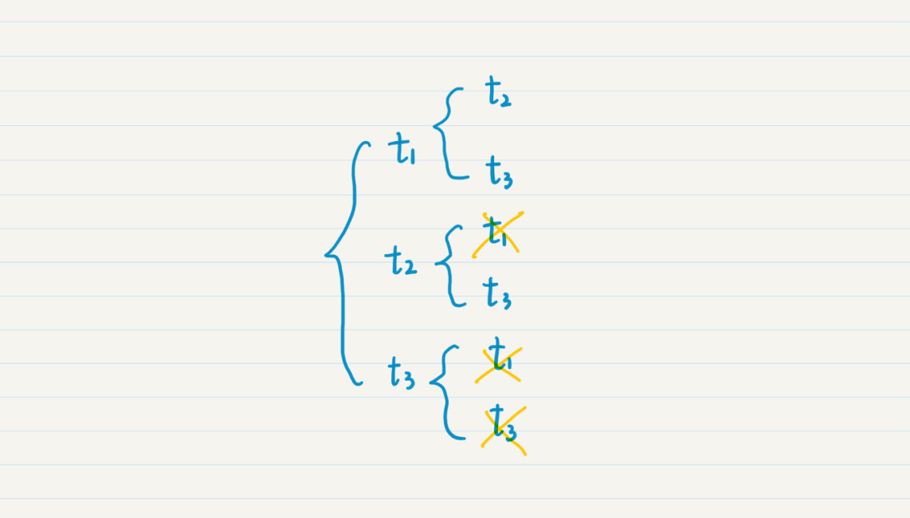
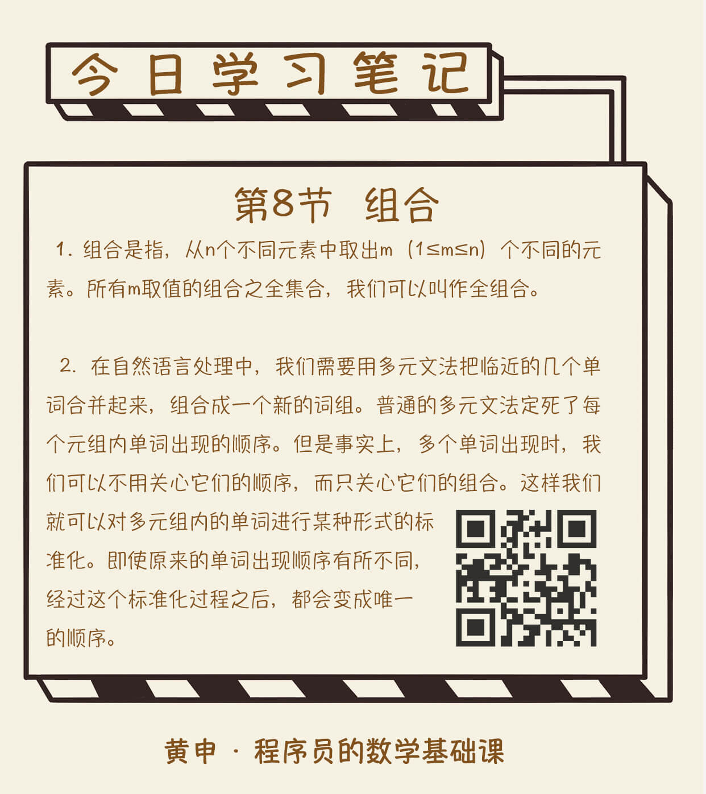

你好，我是黄申。

2018 年足球世界杯结束有半年了，当时激烈的赛况你现在还记忆犹新吧？你知道这场足球盛宴的比赛日程是怎么安排的吗？如果现在你是组委会，你会怎么安排比赛日程呢？我们可以用上一节的排列思想，让全部的 32 支入围球队都和其他球队进行一次主客场的比赛。

自己不可能和自己比赛，因此在这种不可重复的排列中，主场球队有 32 种选择，而客场球队有 31 种选择。那么一共要进行多少场比赛呢？很简单，就是 32x31=992 场！这也太夸张了吧？一天看 2 场，也要 1 年多才能看完！即使球迷开心了，可是每队球员要踢主客场共 62 场，早已累趴下了。

好吧，既然这样，我们是否可以取消主客场制，让任意两个球队之间只要踢 1 场就好啦？取消主客场，这就意味着原来两队之间的比赛由 2 场降为 1 场，那么所有比赛场次就是 992/2=496 场。还是很多，对吧？

是的，这就是为什么要将所有 32 支队伍分成 8 个小组先进行小组赛的原因。一旦分成小组，每个小组的赛事就是 (4x3)/2=6 场。所有小组赛就是 6x8=48 场。

再加上在 16 强阶段开始采取淘汰制，两两淘汰，所以需要 8+4+2+2=16 场淘汰赛（最后一次加 2 是因为还有 3、4 名的决赛），那么整个世界杯决赛阶段就是 48+16=64 场比赛。

当然，说了这么多，你可能会好奇，这两两配对比赛的场次，我是如何计算出来的？让我引出今天的概念，组合（Combination）。

组合可以说是排列的兄弟，两者类似但又有所不同，这两者的区别，不知道你还记得不，上学的时候，老师肯定说过不止一次，那就是，组合是不考虑每个元素出现的顺序的。

从定义上来说，组合是指，从 n 个不同元素中取出 m（1≤m≤n）个不同的元素。例如，我们前面说到的世界杯足球赛的例子，从 32 支球队里找出任意 2 支球队进行比赛，就是从 32 个元素中取出 2 个元素的组合。如果上一讲中，田忌赛马的规则改一下，改为从 10 匹马里挑出 3 匹比赛，但是并不关心这 3 匹马的出战顺序，那么也是一个组合的问题。

对于所有 m 取值的组合之全集合，我们可以叫作全组合（All Combination）。例如对于集合{1, 2, 3}而言，全组合就是{空集, {1}, {2}, {3}, {1, 2}, {1,3} {2, 3}, {1, 2, 3}}。

如果我们安排足球比赛时，不考虑主客场，也就是不考虑这两支球队的顺序，两队只要踢一次就行了。那么从 n 个元素取出 m 个的组合，有多少种可能呢？

我们假设某种运动需要 3 支球队一起比赛，那么 32 支球队就有 32x31x30 种排列，如果三支球队在一起只要比一场，那么我们要抹除多余的比赛。三支球队按照任意顺序的比赛有 3x2x1=6 场，所以从 32 支队伍里取出 3 支队伍的组合是 (32x31x30)/(3x2x1)。基于此，我们可以扩展成以下两种情况。

n 个元素里取出 m 个的组合，可能性数量就是 n 个里取 m 个的排列数量，除以 m 个全排列的数量，也就是 (n! / (n-m)!) / m!。

对于全组合而言，可能性为 2^n 种。例如，当 n=3 的时候，全组合包括了 8 种情况。

这两点都可以用数学归纳法证明，有兴趣的话你可以自己尝试一下。

## 如何让计算机来组合队伍？

上一节，我用递归实现了全排列。全组合就是将所有元素列出来，没有太大意义，所以我这里就带你看下，如何使用递归从 3 个元素中选取 2 个元素的组合。

我们假设有 3 个队伍，t1，t2 和 t3。我还是把递归的选择画成图，这样比较直观，你也好理解。从图中我们可以看出，对于组合而言，由于{t1, t2}已经出现了，因此就无需{t2, t1}。同理，出现{t1, t3}，就无需{t3, t1}等等。对于重复的，我用叉划掉了。这样，最终只有 3 种组合了。

那么，如何使用代码来实现呢？一种最简单粗暴的做法是：

先实现排列的代码，输出所有的排列。例如{t1, t2}, {t2, t1}；

针对每种排列，对其中的元素按照一定的规则排序。那么上述两种排列经过排序后，就是{t1, t2}, {t1, t2}；

对排序后的排列，去掉重复的那些。上述两种排列最终只保留一个{t1, t2}。

这样做效率就会比较低，很多排列生成之后，最终还是要被当做重复的结果去掉。

显然，还有更好的做法。从图中我们可以看出被划掉的那些，都是那些出现顺序和原有顺序颠倒的元素。

例如，在原有集合中，t1 在 t2 的前面，所以我们划掉了{t2, t1}的组合。这是因为，我们知道 t1 出现在 t2 之前，t1 的组合中一定已经包含了 t2，所以 t2 的组合就无需再考虑 t1 了。因此，我只需要在原有的排列代码中，稍作修改，每次传入嵌套函数的剩余元素，不再是所有的未选择元素，而是出现在当前被选元素之后的那些。具体代码是这样的：

import java.util.ArrayList;

import java.util.Arrays;

public class Lesson8\_1 {

\* @Description: 使用函数的递归（嵌套）调用，找出所有可能的队伍组合

\* @param teams\-目前还剩多少队伍没有参与组合，result-保存当前已经组合的队伍

\* @return void

\*/

public static void combine(ArrayList<String\> teams, ArrayList<String\> result, int m) {

if (result.size() == m) {

System.out.println(result);

return;

}

for (int i = 0; i < teams.size(); i++) {

ArrayList<String\> newResult = (ArrayList<String\>)(result.clone());

newResult.add(teams.get(i));

ArrayList<String\> rest\_teams = new ArrayList<String\>(teams.subList(i + 1, teams.size()));

combine(rest\_teams, newResult, m);

}

}

}

这是一段测试代码，可以帮助我们找到从 3 个元素中选择 2 个元素的所有组合。

public static void main(String\[\] args) {

ArrayList<String\> teams = new ArrayList<String\>(Arrays.asList("t1", "t2", "t3"));

Lesson8\_1.combine(teams, new ArrayList<String\>(), 2);

}

## 组合的应用：如何高效地处理词组？

组合在计算机领域中也有很多的应用场景。比如大型比赛中赛程的自动安排、多维度的数据分析以及自然语言处理的优化等等。

在我之前的研究工作中，经常要处理一些自然语言，用组合的思想提升系统性能。今天我结合自己亲身的经历，先来说说组合在自然语言处理中的应用。

当时，我们需要将每篇很长的文章，分隔成一个个的单词，然后对每个单词进行索引，便于日后的查询。但是很多时候，光有单个的单词是不够的，还要考虑多个单词所组成的词组。例如，“red bluetooth mouse”这样的词组。

处理词组最常见的一种方式是多元文法。什么是多元文法呢？这词看起来很复杂，其实就是把邻近的几个单词合并起来，组合一个新的词组。比如我可以把“red”和“bluetooth”合并为“red bluetooth”，还可以把“bluetooth”和“mouse”合并为“bluetooth mouse”。

设计多元文法只是为了方便计算机的处理，而不考虑组合后的词组是不是有正确的语法和语义。例如“red bluetooth”，从人类的角度来看，这个词就很奇怪。但是毕竟它还会生成很多合理的词组，例如“bluetooth mouse”。所以，如果不进行任何深入的语法分析，我们其实没办法区分哪些多元词组是有意义的，哪些是没有意义的，因此最简单的做法就是保留所有词组。

普通的多元文法本身存在一个问题，那就是定死了每个元组内单词出现的顺序。例如，原文中可能出现的是“red bluetooth mouse”，可是用户在查询的时候可能输入的是“bluetooth mouse red”。这么输入肯定不符合语法，但实际上互联网上的用户经常会这么干。

那么，在这种情况下，如果我们只保留原文的“red bluetooth mouse”，就无法将其和用户输入的“bluetooth red mouse”匹配了。所以，如果我们并不要求查询词组中单词所出现的顺序和原文一致，那该怎么办呢？

我当时就在想，可以把每个二元或三元组进行全排列，得到所有的可能。但是这样的话，二元组的数量就会增加 1 倍，三元组的数量就会增加 5 倍，一篇文章的数据保存量就会增加 3 倍左右。我也试过对用户查询做全排列，把原有的二元组查询变为 2 个不同的二元组查询，把原有的三元组查询变为 6 个不同的三元组查询，但是事实是，这样会增加实时查询的耗时。

于是，我就想到了组合。多个单词出现时，我并不关心它们的顺序（也就是不关心排列），而只关心它们的组合。因为无需关心顺序，就意味着我可以对多元组内的单词进行某种形式的标准化。即使原来的单词出现顺序有所不同，经过这个标准化过程之后，都会变成唯一的顺序。

例如，“red bluetooth mouse”，这三个词排序后就是“bluetooth,mouse,red”，而“bluetooth red mouse”排序后也是“bluetooth,mouse,red”，自然两者就能匹配上了。我需要做的事情就是在保存文章多元组和处理用户查询这两个阶段分别进行这种排序。这样既可以减少保存的数据量，同时可以减少查询的耗时。这个问题很容易就解决了。怎么样，组合是不是非常神奇？

此外，组合思想还广泛应用在多维度的数据分析中。比如，我们要设计一个连锁店的销售业绩报表。这张报表有若干个属性，包括分店名称、所在城市、销售品类等等。那么最基本的总结数据包括每个分店的销售额、每个城市的销售额、每个品类的销售额。除了这些最基本的数据，我们还可以利用组合的思想，生成更多的筛选条件。

## 小结

组合和排列有相似之处，都是从 n 个元素中取出若干个元素。不过，排列考虑了取出的元素它们之间的顺序，而组合无需考虑这种顺序。这是排列和组合最大的区别。因此，组合适合找到多个元素之间的联系而并不在意它们之间的先后顺序，例如多元文法中的多元组，这有利于避免不必要的数据保存或操作。

具体到编程，组合和排列两者的实现非常类似。区别在于，组合并不考虑挑选出来的元素之间，是如何排序的。所以，在递归的时候，传入下一个嵌套调用函数的剩余元素，只需要包含当前被选元素之后的那些，以避免重复的组合。

## 思考题

假设现在需要设计一个抽奖系统。需要依次从 100 个人中，抽取三等奖 10 名，二等奖 3 名和一等奖 1 名。请列出所有可能的组合，需要注意的每人最多只能被抽中 1 次。

欢迎在留言区交作业，并写下你今天的学习笔记。你可以点击“请朋友读”，把今天的内容分享给你的好友，和他一起精进。

本文介绍了如何使用组合的思想来安排足球世界杯的比赛日程，并介绍了组合的概念和计算方法。作者首先讨论了取消主客场制后比赛场次的计算，然后引出了组合的概念和计算公式。接着，作者通过递归的方式展示了如何使用代码来实现从一组元素中选取特定数量元素的组合。最后，作者提供了一段测试代码来演示如何找到从3个元素中选择2个元素的所有组合。整体来看，本文通过足球世界杯的比赛日程安排问题引出了组合的概念，并通过代码实现展示了如何计算和生成组合。文章内容涉及排列组合的数学知识和代码实现，适合对计算机算法和数学感兴趣的读者阅读。文章还介绍了组合在自然语言处理和多维度数据分析中的应用，以及组合与排列的区别和编程实现方法。通过实际案例和思考题，读者可以更好地理解组合的概念和应用，为他们的技术学习和实践提供了有益的参考。