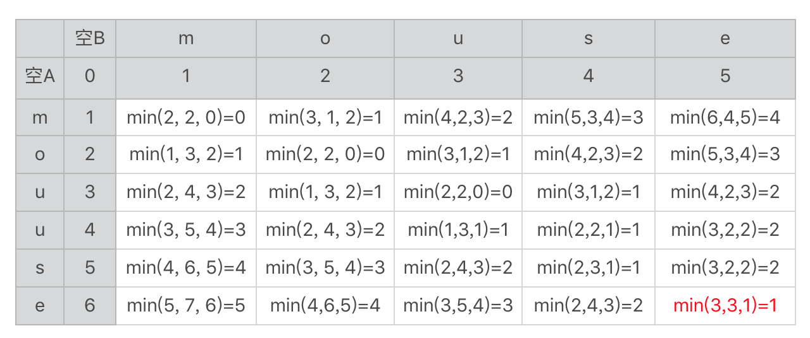
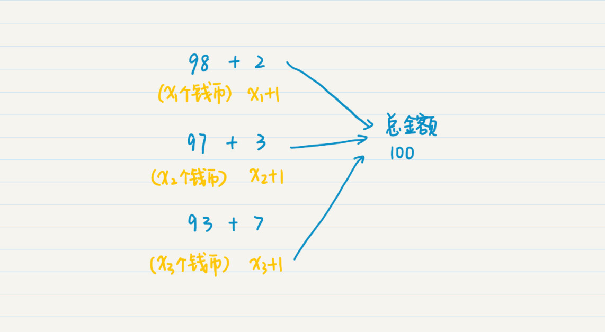
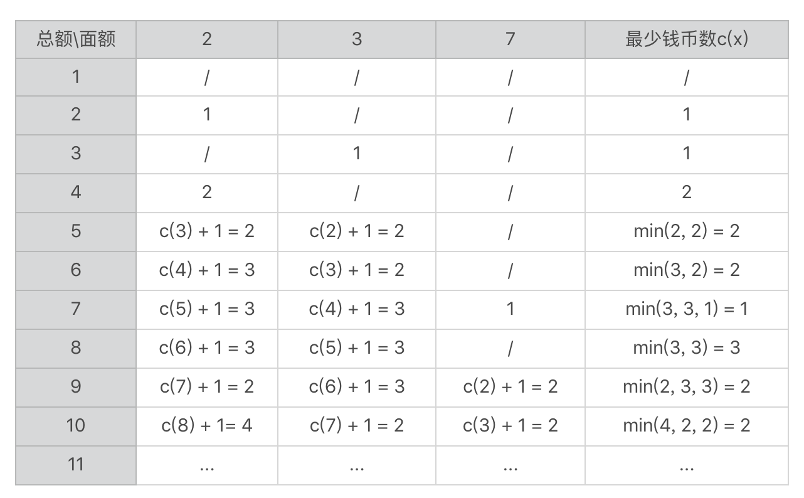

你好，我是黄申。

上一节，我从查询推荐的业务需求出发，介绍了编辑距离的概念，今天我们要基于此，来获得状态转移方程，然后才能进行实际的编码实现。

## 状态转移方程和编程实现

上一节我讲到了使用状态转移表来展示各个子串之间的关系，以及编辑距离的推导。不过，我没有完成那张表格。现在我把它补全，你可以和我的结果对照一下。

这里面求最小值的 min 函数里有三个参数，分别对应我们上节讲的三种情况的编辑距离，分别是：A 串插入、B 串插入（A 串删除）和替换字符。在表格的右下角我标出了两个字符串的编辑距离 1。

概念和分析过程你都理解了，作为程序员，最终还是要落脚在编码上，我这里带你做些编码前的准备工作。

我们假设字符数组 A\[\]和 B\[\]分别表示字符串 A 和 B，A\[i\]表示字符串 A 中第 i 个位置的字符，B\[i\]表示字符串 B 中第 i 个位置的字符。二维数组 d\[,\]表示刚刚用于推导的二维表格，而 d\[i,j\]表示这张表格中第 i 行、第 j 列求得的最终编辑距离。函数 r(i, j) 表示替换时产生的编辑距离。如果 A\[i\]和 B\[j\]相同，函数的返回值为 0，否则返回值为 1。

有了这些定义，下面我们用迭代来表达上述的推导过程。

如果 i 为 0，且 j 也为 0，那么 d\[i, j\]为 0。

如果 i 为 0，且 j 大于 0，那么 d\[i, j\]为 j。

如果 i 大于 0，且 j 为 0，那么 d\[i, j\]为 i。

如果 i 大于 0，且 j 大于 0，那么 d\[i, j\]=min(d\[i-1, j\] + 1, d\[i, j-1\] + 1, d\[i-1, j-1\] + r(i, j))。

这里面最关键的一步是 d\[i, j\]=min(d\[i-1, j\] + 1, d\[i, j-1\] + 1, d\[i-1, j-1\] + r(i, j))。这个表达式表示的是动态规划中从上一个状态到下一个状态之间可能存在的一些变化，以及基于这些变化的最终决策结果。我们把这样的表达式称为状态转移方程。我上节最开始就说过，在所有动态规划的解法中，状态转移方程是关键，所以你一定要掌握它。

有了状态转移方程，我们就可以很清晰地用数学的方式，来描述状态转移及其对应的决策过程，而且，有了状态转移方程，具体的编码其实就很容易了。基于编辑距离的状态转移方程，我在这里列出了一种编码的实现，你可以看看。

我们首先要定义函数的参数和返回值，你需要注意判断一下 a 和 b 为 null 的情况。

public class Lesson10\_1 {

\* @Description: 使用状态转移方程，计算两个字符串之间的编辑距离

\* @param a\-第一个字符串，b-第二个字符串

\* @return int\-两者之间的编辑距离

\*/

public static int getStrDistance(String a, String b) {

if (a == null || b == null) return -1;

然后，初始化状态转移表。我用 int 型的二维数组来表示这个状态转移表，并对 i 为 0 且 j 大于 0 的元素，以及 i 大于 0 且 j 为 0 的元素，赋予相应的初始值。

int\[\]\[\] d = new int\[a.length() + 1\]\[b.length() + 1\];

for (int j = 0; j <= b.length(); j++) {

d\[0\]\[j\] = j;

}

for (int i = 0; i <= a.length(); i++) {

d\[i\]\[0\] = i;

}

我这里实现的时候，i 和 j 都是从 0 开始，所以我计算的 d\[i+1, j+1\]，而不是 d\[i, j\]。而 d\[i+1, j+1\] = min(d\[i, j+1\] + 1, d\[i+1, j\] + 1, d\[i, j\] + r(i, j)。

// 实现状态转移方程

// 请注意由于Java语言实现的关系，代码里的状态转移是从d\[i, j\]到d\[i+1, j+1\]，而不是从d\[i-1, j-1\]到d\[i, j\]。本质上是一样的。

for (int i = 0; i < a.length(); i++) {

for (int j = 0; j < b.length(); j++) {

int r = 0;

if (a.charAt(i) != b.charAt(j)) {

r = 1;

}

int first\_append = d\[i\]\[j + 1\] + 1;

int second\_append = d\[i + 1\]\[j\] + 1;

int replace = d\[i\]\[j\] + r;

int min = Math.min(first\_append, second\_append);

min = Math.min(min, replace);

d\[i + 1\]\[j + 1\] = min;

}

}

return d\[a.length()\]\[b.length()\];

}

}

最后，我们用测试代码测试不同字符串之间的编辑距离。

public static void main(String\[\] args) {

System.out.println(Lesson10\_1.getStrDistance("mouse", "mouuse"));

}

从推导的表格和最终的代码可以看出，我们相互比较长度为 m 和 n 的两个字符串，一共需要求 mxn 个子问题，因此计算量是 mxn 这个数量级。和排列法的 m^n 相比，这已经降低太多太多了。

我们现在可以快速计算出编辑距离，所以就能使用这个距离作为衡量字符串之间相似度的一个标准，然后就可以进行查询推荐了。

到这里，使用动态规划来实现的编辑距离其实就讲完了。我把两个字符串比较的问题，分解成很多子串进行比较的子问题，然后使用状态转移方程来描述状态（也就是子问题）之间的关系，并根据问题的定义，保留最小的值作为当前的编辑距离，直到过程结束。

如果我们使用动态规划法来实现编辑距离的测算，那就能确保查询推荐的效率和效果。不过，基于编辑距离的算法也有局限性，它只适用于拉丁语系的相似度衡量，所以通常只用于英文或者拼音相关的查询。如果是在中文这种亚洲语系中，差一个汉字（或字符）语义就会差很远，所以并不适合使用基于编辑距离的算法。

## 实战演练：钱币组合的新问题

和排列组合等穷举的方法相比，动态规划法关注发现某种最优解。如果一个问题无需求出所有可能的解，而是要找到满足一定条件的最优解，那么你就可以思考一下，是否能使用动态规划来降低求解的工作量。

还记得之前我们提到的新版舍罕王奖赏的故事吗？国王需要支付一定数量的赏金，而宰相要列出所有可能的钱币组合，这使用了排列组合的思想。如果这个问题再变化为“给定总金额和可能的钱币面额，能否找出钱币数量最少的奖赏方式？”，那么我们是否就可以使用动态规划呢？

思路和之前是类似的。我们先把这个问题分解成很多更小金额的子问题，然后试图找出状态转移方程。如果增加一枚钱币 c，那么当前钱币的总数量就是增加 c 之前的钱币总数再加上当前这枚。举个例子，假设这里我们有三种面额的钱币，2 元、3 元和 7 元。为了凑满 100 元的总金额，我们有三种选择。

第一种，总和 98 元的钱币，加上 1 枚 2 元的钱币。如果凑到 98 元的最少币数是 ，那么增加一枚 2 元后就是 ( + 1) 枚。

第二种，总和 97 元的钱币，加上 1 枚 3 元的钱币。如果凑到 97 元的最少币数是 ，那么增加一枚 3 元后就是 ( + 1) 枚。

第三种，总和 93 元的钱币，加上 1 枚 7 元的钱币。如果凑到 93 元的最少币数是 ，那么增加一枚 7 元后就是 ( + 1) 枚。

比较一下以上三种情况的钱币总数，取最小的那个就是总额为 100 元时，最小的钱币数。换句话说，由于奖赏的总金额是固定的，所以最后选择的那枚钱币的面额，将决定到上一步为止的金额，同时也决定了上一步为止钱币的最少数量。根据这个，我们可以得出如下状态转移方程：

其中，c\[i\]表示总额为 i 的时候，所需要的最少钱币数，其中 j=1,2,3,…,n，表示 n 种面额的钱币，value\[j\]表示第 j 种钱币的面额。c\[i - values(j)\]表示选择第 j 种钱币的时候，上一步为止最少的钱币数。需要注意的是，i - value(j) 需要大于等于 0，而且 c\[0\] = 0。

我这里使用这个状态转移方程，做些推导，具体的数据你可以看下面这个表格。表格每一行表示奖赏的总额，前 3 列表示 3 种钱币的面额，最后一列记录最少的钱币数量。表中的“/”表示不可能，或者说无解。

这张状态转移表同样可以帮助你来理解状态转移方程的正确性。一旦状态转移方程确定了，要编写代码来实现就不难了。

## 小结

通过这两节的内容，我讲述了动态规划主要的思想和应用。如果仅仅看这两个案例，也许你觉得动态规划不难理解。不过，在实际应用中，你可能会产生这些疑问：什么时候该用动态规划？这个问题可以用动态规划解决啊，为什么我没想到？我这里就讲一些我个人的经验。

首先，如果一个问题有很多种可能，看上去需要使用排列或组合的思想，但是最终求的只是某种最优解（例如最小值、最大值、最短子串、最长子串等等），那么你不妨试试是否可以使用动态规划。

其次，状态转移方程是个关键。你可以用状态转移表来帮助自己理解整个过程。如果能找到准确的转移方程，那么离最终的代码实现就不远了。当然，最好的方式，还是结合工作中的项目，不断地实践，尝试，然后总结。

## 思考题

对于总金额固定、找出最少钱币数的题目，用循环或者递归的方式该如何进行编码呢？

欢迎在留言区交作业，并写下你今天的学习笔记。你可以点击“请朋友读”，把今天的内容分享给你的好友，和他一起精进。

动态规划在实际问题中的应用是本文的重点。首先，通过编辑距离和钱币组合问题的案例，生动展示了动态规划的思想和实际编程实现。文章详细介绍了状态转移方程的推导过程，并给出了具体的实现方法，帮助读者理解动态规划的应用。作者还提供了编辑距离的Java编程示例，进一步展示了动态规划在实际编码中的应用。其次，针对钱币组合问题，作者通过分解问题、推导状态转移方程和绘制状态转移表的方式，阐述了动态规划的应用场景。最后，文章总结了动态规划的应用经验，指出了在解决问题时应该考虑使用动态规划的情况，并提出了思考题，引发读者的思考和交流。整体而言，本文通过具体案例和编程实现，生动地展示了动态规划在实际问题中的应用，为读者提供了深入理解和实践的机会。