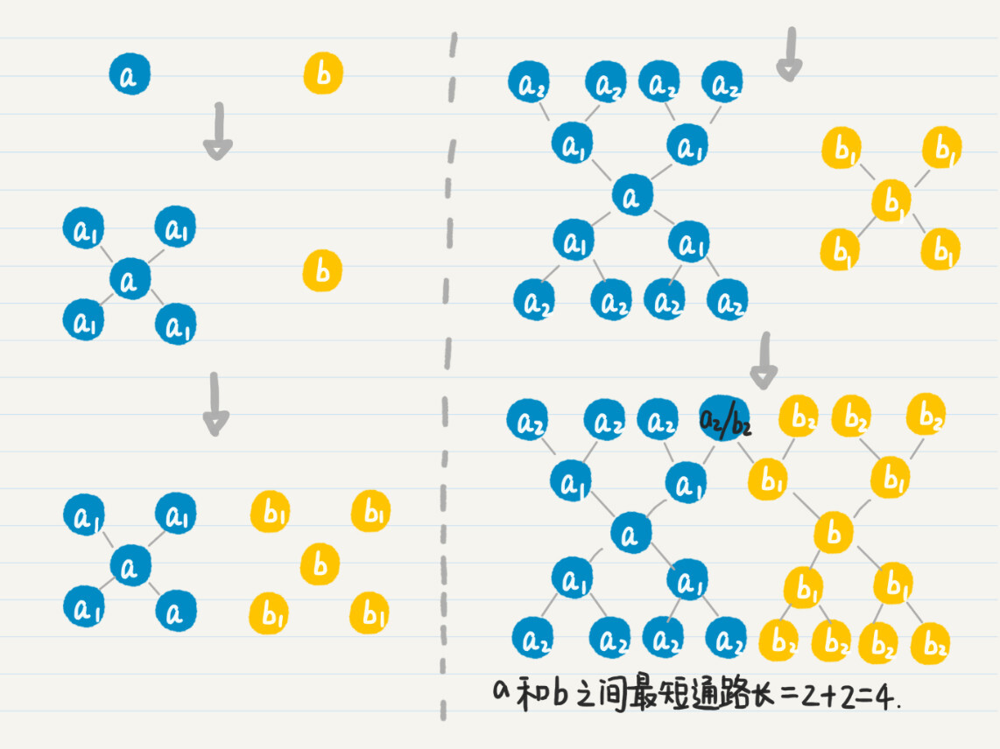
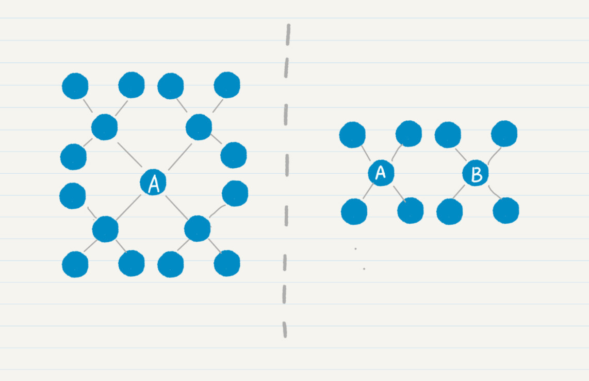
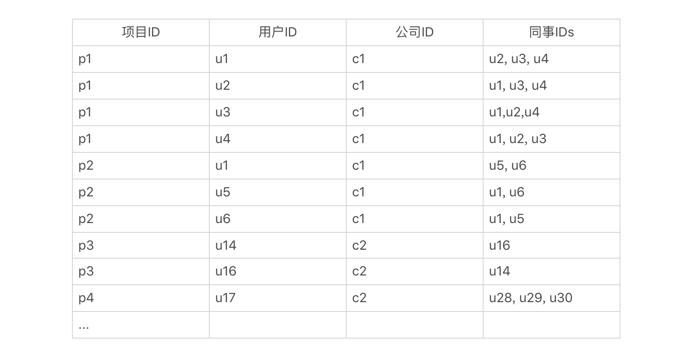
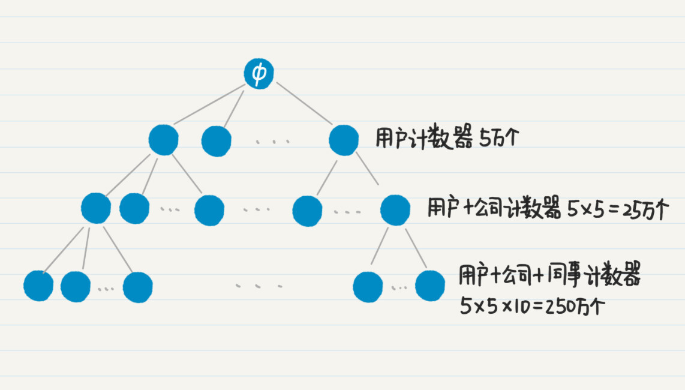
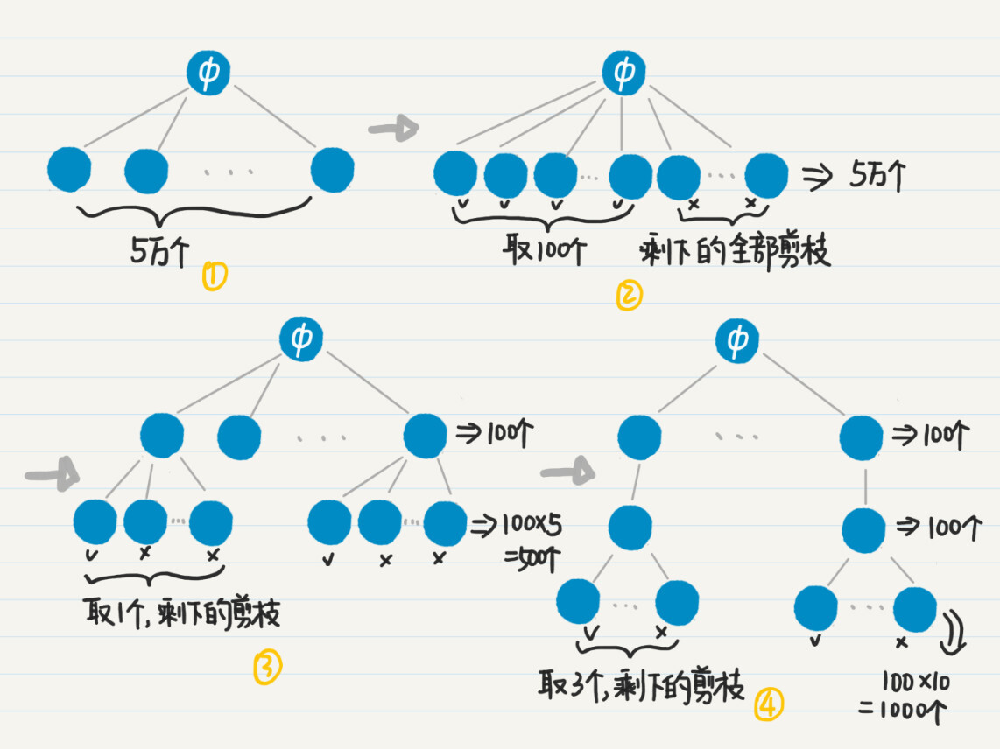
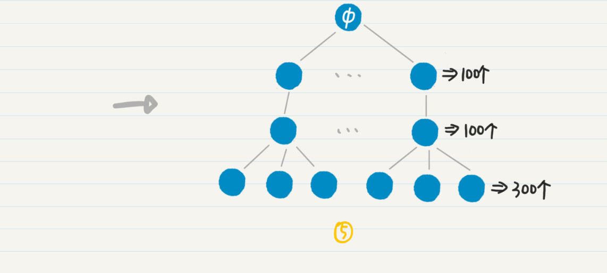

你好，我是黄申。

上一讲，我们通过社交好友的关系，介绍了为什么需要广度优先策略，以及如何通过队列来实现它。有了广度优先搜索，我们就可以知道某个用户的一度、二度、三度等好友是谁。不过，在社交网络中，还有一个经常碰到的问题，那就是给定两个用户，如何确定他们之间的关系有多紧密？

最直接的方法是，使用这两人是几度好友，来衡量他们关系的紧密程度。今天，我就这个问题，来聊聊广度优先策略的一种扩展：双向广度优先搜索，以及这种策略在工程中的应用。

## 如何更高效地求出两个用户间的最短路径？

基本的做法是，从其中一个人出发，进行广度优先搜索，看看另一个人是否在其中。如果不幸的话，两个人相距六度，那么即使是广度优先搜索，同样要达到万亿级的数量。

那究竟该如何更高效地求得两个用户的最短路径呢？我们先看看，影响效率的问题在哪里？很显然，随着社会关系的度数增加，好友数量是呈指数级增长的。所以，如果我们可以控制这种指数级的增长，那么就可以控制潜在好友的数量，达到提升效率的目的。

如何控制这种增长呢？我这里介绍一种“双向广度优先搜索”。它巧妙地运用了两个方向的广度优先搜索，大幅降低了搜索的度数。现在我就带你看下，这个方法的核心思想。

假设有两个人 、。

我们首先从 出发，进行广度优先搜索，记录 的所有一度好友 ，然后看点 是否出现在集合 中。

如果没有，就再从 出发，进行广度优先搜索，记录所有一度好友 ，然后看 和 是否出现在 和 的并集中。

如果没有，就回到 ，继续从它出发的广度优先搜索，记录所有二度好友 ，然后看 和 是否出现在 、 和 三者的并集中。

如果没有，就回到 ，继续从它出发的广度优先搜索。

如此轮流下去，直到找到 的好友和 的好友的交集。

如果有交集，就表明这个交集里的点到 和 都是通路。

我们假设 在这个交集中，那么把 到 的通路长度和 到 的通路长度相加，得到的就是从 到 的最短通路长（这个命题可以用反证法证明），也就是两者为几度好友。这个过程有点复杂，我画了一张图帮助你来理解。

思路你应该都清楚了，现在我们来看看如何用代码来实现。

要想实现双向广度优先搜索，首先我们要把结点类 Node 稍作修改，增加一个变量 degrees。这个变量是 HashMap 类型，用于存放从不同用户出发，到当前用户是第几度结点。比如说，当前结点是 4，从结点 1 到结点 4 是 3 度，结点 2 到结点 4 是 2 度，结点 3 到结点 4 是 4 度，那么结点 4 的 degrees 变量存放的就是如下映射：

有了变量 degrees，我们就能随时知道某个点和两个出发点各自相距多少。所以，在发现交集之后，根据交集中的点和两个出发点各自相距多少，就能很快地算出最短通路的长度。理解了这点之后，我们在原有的 Node 结点内增加 degrees 变量的定义和初始化。

public class Node {

......

public HashMap<Integer, Integer> degrees;

public Node(int id) {

......

degrees = new HashMap<>();

degrees.put(id, 0);

}

}

为了让双向广度优先搜索的代码可读性更好，我们可以先实现两个模块化的函数：getNextDegreeFriend 和 hasOverlap。函数 getNextDegreeFriend 是根据给定的队列，查找和起始点相距度数为指定值的所有好友。而函数 hasOverlap 用来判断两个集合是不是有交集。有了这些模块化的函数，双向广度优先搜索的代码就更直观了。

在函数一开始，我们先进行边界条件判断。

\* @Description: 通过双向广度优先搜索，查找两人之间最短通路的长度

\* @param user\_nodes-用户的结点；user\_id\_a-用户a的ID；user\_id\_b-用户b的ID

\* @return void

\*/

public static int bi\_bfs(Node\[\] user\_nodes, int user\_id\_a, int user\_id\_b) {

if (user\_id\_a > user\_nodes.length || user\_id\_b > user\_nodes.length) return -1;

if (user\_id\_a == user\_id\_b) return 0;

由于同时从两个用户的结点出发，对于所有，有两条搜索的路径，我们都需要初始化两个用于广度优先搜索的队列，以及两个用于存放已经被访问结点的 HashSet。

Queue<Integer\> queue\_a = new LinkedList<Integer\>();

Queue<Integer\> queue\_b = new LinkedList<Integer\>();

queue\_a.offer(user\_id\_a);

HashSet<Integer\> visited\_a = new HashSet<>();

visited\_a.add(user\_id\_a);

queue\_b.offer(user\_id\_b);

HashSet<Integer\> visited\_b = new HashSet<>();

visited\_b.add(user\_id\_b);

接下来要做的是，从两个结点出发，沿着各自的方向，每次广度优先搜索一度，并查找是不是存在重叠的好友。

int degree\_a \= 0, degree\_b = 0, max\_degree = 20;

while ((degree\_a + degree\_b) < max\_degree) {

degree\_a ++;

getNextDegreeFriend(user\_id\_a, user\_nodes, queue\_a, visited\_a, degree\_a);

if (hasOverlap(visited\_a, visited\_b)) return (degree\_a + degree\_b);

degree\_b ++;

getNextDegreeFriend(user\_id\_b, user\_nodes, queue\_b, visited\_b, degree\_b);

if (hasOverlap(visited\_a, visited\_b)) return (degree\_a + degree\_b);

}

return -1;

}

你可以同时实现单向广度优先搜索和双向广度优先搜索，然后通过实验来比较两者的执行时间，看看哪个更短。如果实验的数据量足够大（比如说结点在 1 万以上，边在 5 万以上），你应该能发现，双向的方法对时间和内存的消耗都更少。

为什么双向搜索的效率更高呢？我以平均好友度数为 4，给你举例讲解。

左边的图表示从结点 单向搜索走 2 步，右边的图表示分别从结点 和 双向搜索各走 1 步。很明显，左边的结点有 16 个，明显多于右边的 8 个结点。而且，随着每人认识的好友数、搜索路径的增加，这种差距会更加明显。

我们假设每个地球人平均认识 100 个人，如果两个人相距六度，单向广度优先搜索要遍历 100^6=1 万亿左右的人。如果是双向广度优先搜索，那么两边各自搜索的人只有 100^3=100 万。

当然，你可能会说，单向广度优先搜索之后查找匹配用户的开销更小啊。的确如此，假设我们要知道结点 和 之间的最短路径，单向搜索意味着要在 的 1 万亿个好友中查找 。如果采用双向搜索的策略，从结点 和 出发进行广度优先搜索，每个方向会产生 100 万的好友，那么需要比较这两组 100 万的好友是否有交集。

假设我们使用哈希表来存储 的 1 万亿个好友，并把搜索 是否存在其中的耗时记作 x，而把判断两组 100 万好友是否有交集的耗时记为 y，那么通常 x<y。

不过，综合考虑广度优先搜索出来的好友数量，双向广度优先搜索还是更有效。为什么这么说呢？稍后介绍算法复杂度的概念和衡量方法时，我会具体来分析这个例子。

广度优先搜索的应用场景有很多，下面我来说说这种策略的一个应用。

## 如何实现更有效地嵌套型聚合？

广度优先策略可以帮助我们大幅优化数据分析中的聚合操作。聚合是数据分析中一个很常见的操作，它会根据一定的条件把记录聚集成不同的分组，以便我们统计每个分组里的信息。目前，SQL 语言中的 GROUP BY 语句，Python 和 Spark 语言中 data frame 的 groupby 函数，Solr 的 facet 查询和 ElasticSearch 的 aggregation 查询，都可以实现聚合的功能。

我们可以嵌套使用不同的聚合，获得层级型的统计结果。但是，实际上，针对一个规模超大的数据集，聚合的嵌套可能会导致性能严重下降。这里我来谈谈如何利用广度优先的策略，对这个问题进行优化。

首先，我用一个具体的例子来给你讲讲，什么是多级嵌套的聚合，以及为什么它会产生严重的性能问题。

这里我列举了一个数据表，它描述了一个社交网络中，每个人的职业经历。字段包括项目的 ID、用户 ID、公司 ID 和同事的 IDs。

对于这张表，我们可以进行三层嵌套的聚集。第一级是根据用户 ID 来聚，获取每位用户一共参与了多少项目。第二级是根据公司 ID 来聚，获取每位用户在每家公司参与了多少项目。第三级根据同事 ID 来聚，获取每位用户在每家公司，和每位同事共同参与了多少项目。最终结果应该是类似下面这样的：

用户u88，总共50个项目（包括在公司c42中的10个，c26中的8个...）

在公司c42中，参与10个项目（包括和u120共事的4个，和u99共事的3个...）

和u120共同参与4个项目

和u99共同参与3个项目

和u72共同参与3个项目

在公司c26中，参与了8个项目

和u145共同参与5个项目

和u128共同参与3个项目

（用户u88在其他公司的项目...）

用户u66，总共47个项目

在公司c28中，参与了16个项目

和u65共同参与了5个项目

(用户u66的剩余数据...）

...

（其他用户的数据...）

为了实现这种嵌套式的聚合统计，你会怎么来设计呢？看起来挺复杂的，其实我们可以用最简单的排列的思想，分别为“每个用户”“每个用户 + 每个公司”“每个用户 + 每个公司 + 每位同事”，生成很多很多的计数器。可是，如果用户的数量非常大，那么这个“很多”就会成为一个可怕的数字。

我们假设这个社交网有 5 万用户，每位用户平均在 5 家公司工作过，而用户在每家公司平均有 10 名共事的同事，那么针对用户的计数器有 5 万个，针对“每个用户 + 每个公司”的计数器有 25 万个，而到了“每个用户 + 每个公司 + 每位同事”的计数器，就已经达到 250 万个了，三个层级总共需要 280 万计数器。

我们假设一个计数器是 4 个字节，那么 280 万个计数器就需要消耗超过 10M 的内存。对于高并发、低延迟的实时性服务，如果每个请求都要消耗 10M 内存，很容易就导致服务器崩溃。另外，实时性的服务，往往只需要前若干个结果就足以满足需求了。在这种情况下，完全基于排列的设计就有优化的空间了。

从刚才那张图中，其实我们就能想到一些优化的思路。

对于只需要返回前若干结果的应用场景，我们可以对图中的树状结构进行剪枝，去掉绝大部分不需要的结点和边，这样就能节省大量的内存和 CPU 计算。

比如，如果我们只需要返回前 100 个参与项目最多的用户，那么就没有必要按照深度优先的策略，去扩展树中高度为 2 和 3 的结点了，而是应该使用广度优先策略，首先找出所有高度为 1 的结点，根据项目数量进行排序，然后只取出前 100 个，把计数器的数量从 5 万个一下子降到 100 个。

以此类推，我们还可以控制高度为 2 和 3 的结点之数量。如果我们只要看前 100 位用户，每位用户只看排名第一的公司，而每家公司只看合作最多的 3 名同事，那么最终计数器数量就只有 50000+100x5+100x1x10=51500。只有文字还是不太好懂，我画了一张图，帮你理解这个过程。

如果一个项目用到排列组合的思想，我们需要在程序里使用大量的变量，来保存数据或者进行计算，这会导致内存和 CPU 使用量的急剧增加。在允许的情况下，我们可以考虑使用广度优先策略，对排列组合所生成的树进行优化。这样，我们就可以有效地缩减树中靠近根的结点数量，避免之后树的爆炸性生长。

## 小结

广度优先搜索，相对于深度优先搜索，没有函数的嵌套调用和回溯操作，所以运行速度比较快。但是，随着搜索过程的进行，广度优先需要在队列中存放新遇到的所有结点，因此占用的存储空间通常比深度优先搜索多。

相比之下，深度优先搜索法只保留用于回溯的结点，而扩展完的结点会从栈中弹出并被删除。所以深度优先搜索占用空间相对较少。不过，深度优先搜索的速度比较慢，而并不适合查找结点之间的最短路径这类的应用。

## 思考题

今天所说的双向广度优先比单向广度优先更高效，其实是要基于一个前提条件的。你能否说出，在什么情况下，单向广度优先更高效呢？针对这种情况，又该如何优化双向广度优先呢？

欢迎在留言区交作业，并写下你今天的学习笔记。你可以点击“请朋友读”，把今天的内容分享给你的好友，和他一起精进。

广度优先搜索在数据分析中的应用是一种常见的操作，但多级嵌套的聚合可能导致性能下降。本文介绍了如何利用广度优先策略优化多级嵌套的聚合操作，以及如何通过剪枝和优化树状结构来节省内存和CPU计算。文章还探讨了广度优先搜索相对于深度优先搜索的优势和劣势，以及双向广度优先搜索相对于单向广度优先搜索的高效性。读者可以从中了解到如何运用广度优先策略来优化数据分析中的聚合操作，以及在何种情况下单向广度优先搜索更高效，以及如何优化双向广度优先搜索。