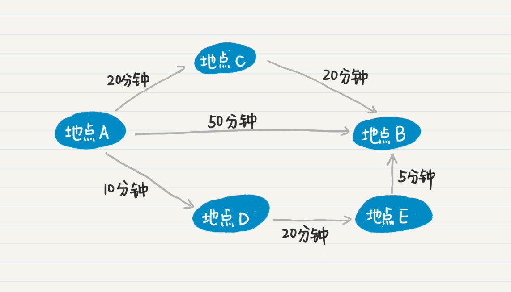
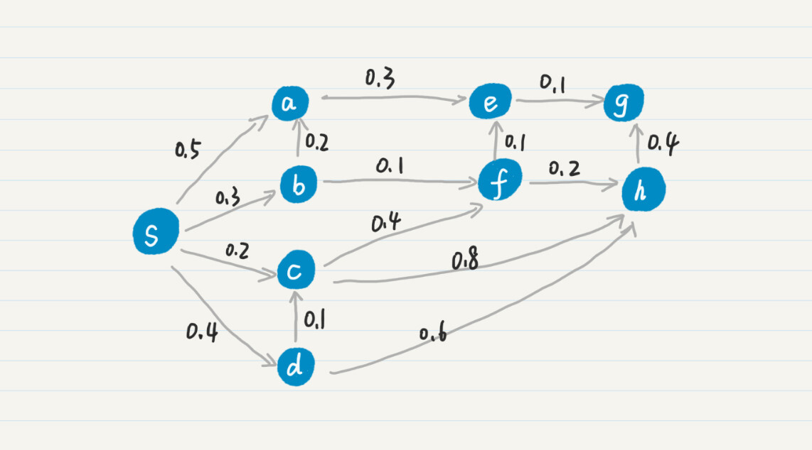
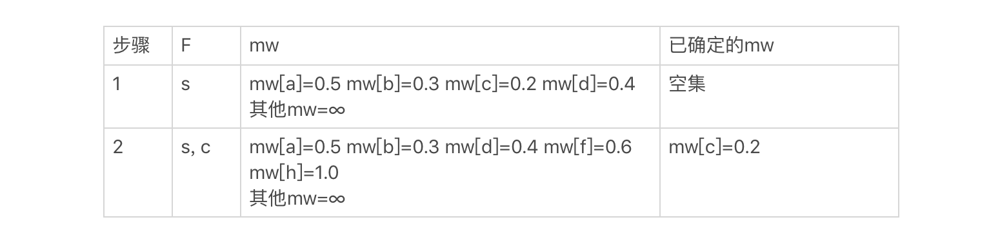
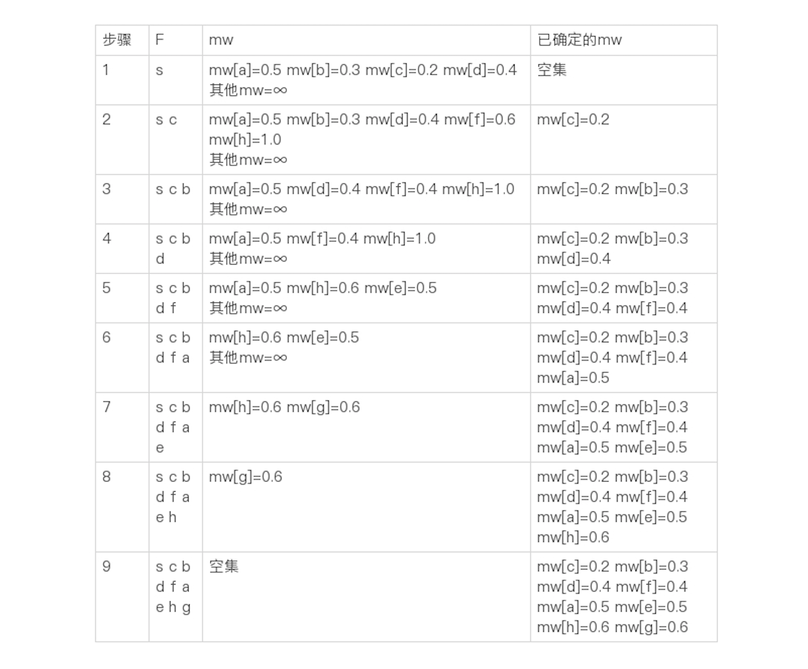
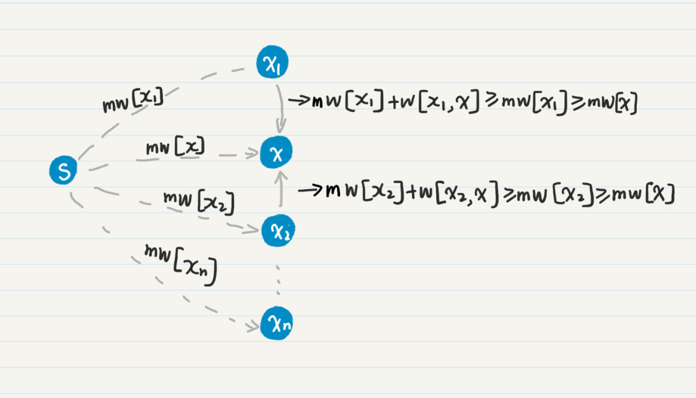
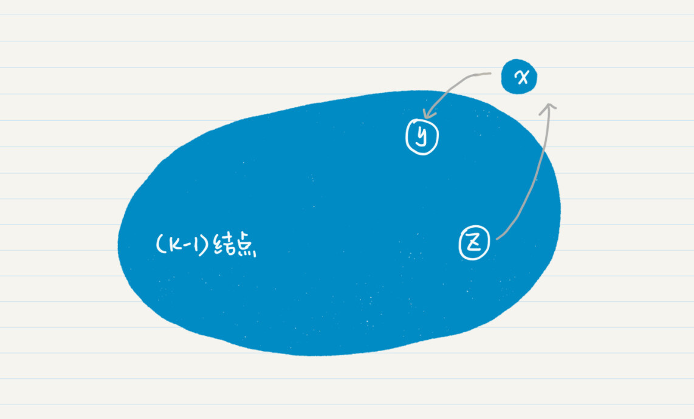

你好，我是黄申。

我们经常使用手机上的地图导航 App，查找出行的路线。那计算机是如何在多个选择中找到最优解呢？换句话说，计算机是如何挑选出最佳路线的呢？

前几节，我们讲了数学中非常重要的图论中的概念，图，尤其是树中的广度优先搜索。在广度优先的策略中，因为社交网络中的关系是双向的，所以我们直接用无向边来求解图中任意两点的最短通路。

这里，我们依旧可以用图来解决这个问题，但是，影响到达最终目的地的因素有很多，比如出行的交通工具、行驶的距离、每条道路的交通状况等等，因此，我们需要赋予到达目的地的每条边，不同的权重。而我们想求的最佳路线，其实就是各边权重之和最小的通路。

我们前面说了，广度优先搜索只测量通路的长度，而不考虑每条边上的权重。那么广度优先搜索就无法高效地完成这个任务了。那我们能否把它改造或者优化一下呢？

我们需要先把交通地图转为图的模型。图中的每个结点表示一个地点，每条边表示一条道路或者交通工具的路线。其中，边是有向的，表示单行道等情况；其次，边是有权重的。

假设你关心的是路上所花费的时间，那么权重就是从一点到另一点所花费的时间；如果你关心的是距离，那么权重就是两点之间的物理距离。这样，我们就把交通导航转换成图论中的一个问题：在边有权重的图中，如何让计算机查找最优通路？

## 基于广度优先或深度优先搜索的方法

我们以寻找耗时最短的路线为例来看看。

一旦我们把地图转换成了图的模型，就可以运用广度优先搜索，计算从某个出发点，到图中任意一个其他结点的总耗时。

基本思路是，从出发点开始，广度优先遍历每个点，当遍历到某个点的时候，如果该点还没有耗时的记录，记下当前这条通路的耗时。如果该点之前已经有耗时记录了，那就比较当前这条通路的耗时是不是比之前少。如果是，那就用当前的替换掉之前的记录。

实际上，地图导航和之前社交网络最大的不同在于，每个结点被访问了一次还是多次。在之前的社交网络的案例中，使用广度优先策略时，对每个结点的首次访问就能获得最短通路，因此每个结点只需要被访问一次，这也是为什么广度优先比深度优先更有效。

而在地图导航的案例中，从出发点到某个目的地结点，可能有不同的通路，也就意味着耗时不同。而耗时是通路上每条边的权重决定的，而不是通路的长度。因此，为了获取达到某个点的最短时间，我们必须遍历所有可能的路线，来取得最小值。这也就是说，我们对某些结点的访问可能有多次。

我画了一张图，方便你理解多条通路对最终结果的影响。这张图中有 A、B、C、D、E 五个结点，分别表示不同的地点。

从这个图中可以看出，从 A 点出发到目的地 B 点，一共有三条路线。

如果你直接从 A 点到 B 点，度数为 1，需要 50 分钟。

从 A 点到 C 点再到 B 点，虽然度数为 2，但总共只要 40 分钟。

从 A 点到 D 点，到 E 点，再到最后的 B 点，虽然度数为 3，但是总耗时只有 35 分钟，比其他所有的路线更优。

这种情形之下，使用广度优先找到的最短通路，不一定是最优的路线。所以，对于在地图上查找最优路线的问题，无论是广度优先还是深度优先的策略，都需要遍历所有可能的路线，然后取最优的解。

在遍历所有可能的路线时，有几个问题需要注意。

第一，由于要遍历所有可能的通路，因此一个点可能会被访问多次。当然，这个“多次“是指某个结点出现在不同通路中，而不是多次出现在同一条通路中。因为我们不想让用户总是兜圈子，所以需要避免回路。

第二，如果某个结点 x 和起始点 s 之间存在多个通路，每当 x 到 s 之间的最优路线被更新之后，我们还需要更新所有和 x 相邻的结点之最优路线，计算复杂度会很高。

## 一个优化的版本：Dijkstra 算法

无论是广度优先还是深度优先的实现，算法对每个结点的访问都可能多于一次。而访问多次，就意味着要消耗更多的计算机资源。那么，有没有可能在保证最终结果是正确的情况下，尽可能地减少访问结点的次数，来提升算法的效率呢？

首先，我们思考一下，对于某些结点，是不是可以提前获得到达它们的最终的解（例如最短耗时、最短距离、最低价格等等），从而把它们提前移出遍历的清单？如果有，是哪些结点呢？什么时候可以把它们移除呢？Dijkstra 算法要登场了！它简直就是为了解决这些问题量身定制的。

Dijkstra 算法的核心思想是，对于某个结点，如果我们已经发现了最优的通路，那么就无需在将来的步骤中，再次考虑这个结点。Dijkstra 算法很巧妙地找到这种点，而且能确保已经为它找到了最优路径。

### 1.Dijkstra 算法的主要步骤

让我们先来看看 Dijkstra 算法的主要步骤，然后再来理解，它究竟是如何确定哪些结点已经拥有了最优解。

首先你需要了解几个符号。

第一个是 source，我们用它表示图中的起始点，缩写是 s。

然后是 weight，表示二维数组，保存了任意边的权重，缩写为 w。w\[m, n\]表示从结点 m 到结点 n 的有向边之权重，大于等于 0。如果 m 到 n 有多条边，而且权重各自不同，那么取权重最小的那条边。

接下来是 min\_weight，表示一维数组，保存了从 s 到任意结点的最小权重，缩写为 mw。假设从 s 到某个结点 m 有多条通路，而每条通路的权重是这条通路上所有边的权重之和，那么 mw\[m\]就表示这些通路权重中的最小值。mw\[s\]=0，表示起始点到自己的最小权重为 0。

最后是 Finish，表示已经找到最小权重的结点之集合，缩写为 F。一旦结点被放入集合 F，这个结点就不再参与将来的计算。

初始的时候，Dijkstra 算法会做三件事情。第一，把起始点 s 的最小权重赋为 0，也就是 mw\[s\] = 0。第二，往集合 F 里添加结点 s，F 包含且仅包含 s。第三，假设结点 s 能直接到达的边集合为 M，对于其中的每一个对端节点 m，则把 mw\[m\]设为 w\[s, m\]，同时对于所有其他 s 不能直接到达的结点，将通路的权重设为无穷大。

然后，Dijkstra 算法会重复下列两个步骤。

第一步，查找最小 mw。从 mw 数组选择最小值，则这个值就是起始点 s 到所对应的结点的最小权重，并且把这个点加入到 F 中，针对这个点的计算就算完成了。

比如，当前 mw 中最小的值是 mw\[x\]=10，那么结点 s 到结点 x 的最小权重就是 10，并且把结点 x 放入集合 F，将来没有必要再考虑点 x，mw\[x\]可能的最小值也就确定为 10 了。

第二步，更新权重。然后，我们看看，新加入 F 的结点 x，是不是可以直接到达其他结点。如果是，看看通过 x 到达其他点的通路权重，是否比这些点当前的 mw 更小，如果是，那么就替换这些点在 mw 中的值。

例如，x 可以直接到达 y，那么把 (mw\[x\] + w\[x, y\]) 和 mw\[y\]比较，如果 (mw\[x\] + w\[x, y\]) 的值更小，那么把 mw\[y\]更新为这个更小的值，而我们把 x 称为 y 的前驱结点。

然后，重复上述两步，再次从 mw 中找出最小值，此时要求 mw 对应的结点不属于 F，重复上述动作，直到集合 F 包含了图的所有结点，也就是说，没有结点需要处理了。

字面描述有些抽象，我用一个具体的例子来解释一下。你可以看我画的这个图。

我们把结点 s 放入集合 F。同 s 直接相连的结点有 a、b、c 和 d，我把它们的 mw 更新为 w 数组中的值，就可以得到如下结果：

然后，我们从 mw 选出最小的值 0.2，把对应的结点 c 加入集合 F，并更新和 c 直接相连的结点 f、h 的 mw 值，得到如下结果：

然后，我们从 mw 选出最小的值 0.3，把对应的结点 b 加入集合 F，并更新和 b 直接相连的结点 a 和 f 的 mw 值。以此逐步类推，可以得到如下的最终结果：

你可以试着自己从头到尾推导一下，看看结果是不是和我的一致。

说到这里，你可能会产生一个疑问：Dijkstra 算法提前把一些结点排除在计算之外，而且没有遍历全部可能的路径，那么它是如何确保找到最优路径的呢？

下面，我们就来看看这个问题的答案。Dijkstra 算法的步骤看上去有点复杂，不过其中最关键的两步是：第一个是每次选择最小的 mw；第二个是，假设被选中的最小 mw，所对应的结点是 x，那么查看和 x 直接相连的结点，并更新它们的 mw。

### 2\. 为什么每次都要选择最小的 mw？

最小的、非无穷大的 mw 值，对应的结点是还没有加入 F 集合的、且和 s 有通路的那些结点。假设当前 mw 数组中最小的值是 mw\[x\]，对应的结点是 x。如果边的权重都是正值，那么通路上的权重之和是单调递增的，所以其他通路的权重之和一定大于当前的 mw\[x\]，因此即使存在其他的通路，其权重也会比 mw\[x\]大。

你可以结合这个图，来理解我刚才这段话。

图中的虚线表示省去了通路中间的若干结点。mw\[x\]是当前 mw 数组中的最小值，所以它小于等于任何一个 mw\[xn\]，其中 xn 不等于 x。

我们假设存在另一个通路，通过 达到 x，那么通路的权重总和为 mw\[\] + w\[, x\] ≥ mw\[\] ≥ mw\[x\]。所以我们可以得到一个结论：拥有最小 mw 值的结点 x 不可能再找到更小的 mw 值，可以把它放入“已完成“的集合 F。

这就是为什么每次都要选择最小的 mw 值，并认为对应的结点已经完成了计算。和广度优先或者深度优先的搜索相比，Dijkstra 算法可以避免对某些结点，重复而且无效的访问。因此，每次选择最小的 mw，就可以提升了搜索的效率。

### 3\. 为什么每次都要看 x 直接相连的结点？

我们已经确定 mw\[x\]是从点 s 到点 x 的最小权重，那么就可以把这个确定的值传播到和 x 直接相连、而且不在 F 中的结点。通过这一步，我们就可以获得从点 s 到这些点、而且经过 x 的通路中最小的那个权重。我画了张图帮助你理解。

在这个图中，x 直接相连 ，，…，。从点 s 到点 x 的 mw\[x\]已经确定了，那么对于从 s 到 yn 的所有通路，只有两种可能，经过 x 和不经过 x。如果这条通路经过 x，那么其权重的最小值就是 mw’\[\] = mw\[x\] + w\[x, \]中的一个（1≤i≤n），我们只需要把这个值和其他未经过 x 结点的通路之权重对比就足够了。这就是为什么每次要更新和 x 直接相连的结点之 mw。

这一步和广度优先策略中的查找某个结点的所有相邻结点类似。但是，之后，Dijkstra 算法重复挑选最小权重的步骤，既没有遵从广度优先，也没有遵从深度优先。即便如此，它仍然保证了不会遗漏任意一点和起始点 s 之间、拥有最小权重的通路，从而保证了搜索的覆盖率。你可能会奇怪，这是如何得到保证的？我使用数学归纳法，来证明一下。

你还记得数学归纳法的一般步骤吗？刚好借由这个例子我们也来复习一下。

我们的命题是，对于任意一个点，Dijkstra 算法都可以找到它和起始点 s 之间拥有最小权重的通路。

首先，当 n=1 的时候，也就是只有起始点 s 和另一个终止点的时候，Dijkstra 算法的初始化阶段的第 3 步，保证了命题的成立。

然后，我们假设 n=k-1 的时候命题成立，同时需要证明 n=k 的时候命题也成立。命题在 n=k-1 时成立，表明从点 s 到 k-1 个终点的任何一个时，Dijkstra 算法都能找到拥有最小权重的通路。那么再增加一个结点 x，Dijkstra 算法同样可以为包含 x 的 k 个终点找到最小权重通路。

这里我们只需要考虑 x 和这 k-1 个点连通的情况。因为如果不连通，就没有必要考虑 x 了。既然连通，x 可能会指向之前 k-1 个结点，也有可能被这 k-1 个结点所指向。假设 x 指向了 y，而 z 指向了 x，y 和 z 都是之前 k-1 个结点中的一员。

我们先来看 x 对 y 的影响。如果 x 不在从 s 到 y 的最小权重通路上，那么 x 的加入并不影响 mw\[y\]的最终结果。如果 x 在从 s 到 y 的最小权重通路上，那么就意味着 mw\[x\] + w\[x, y\]≤mw’\[y\]，mw’表示没有引入结点 x 的时候，mw 的值。

所以有 mw\[x\]≤mw’\[y\]，这就意味着 Dijkstra 算法在查找最小 mw 的步骤中，会在 mw’\[y\]之前挑出 mw\[x\]，也就是找到了从 s 到 y，且经过 x 的最小权重通路。

我们再来看 z 对 x 的影响。假设有多个 z 指向 x，分别是 , , …,，从 s 到 x 的通路必定会经过这 m 个 z 结点中的一个。Dijkstra 算法中找最小 mw 的步骤，一定会遍历 mw\[\]（1<=i<=m），而更新权重的步骤，可以并保证从 (mw\[\] + w\[, x\]) 中找出最小值，最终找到从 s 到 x 的最优通路。

有了详细的推导，想要写出代码就不难了。我这里只给你说几点需要注意的地方。

在自动生成图的函数中，你需要把广度优先搜索的相应代码做两处修改。第一，现在边是有向的了，所以生成的边只需要添加一次；第二，要给边赋予一个权重值，例如可以把边的权重设置为\[0,1.0) 之间的 float 型数值。

为了更好地模块化，你可以实现两个函数：findGeoWithMinWeight 和 updateWeight。它们分别对应于我之前提到的最重要的两步：每次选择最小的 mw；更新和 x 直接相连的结点之 mw。

每次查找最小 mw 的时候，我们需要跳过已经完成的结点，只考虑那些不在 F 集合中的点。这也是 Dijkstra 算法比较高效的原因。此外，如果你想输出最优路径上的每个结点，那么在 updateWeight 函数中就要记录每个结点的前驱结点。

如果你能跟着我进行一步步的推导，并且手写代码进行练习，相信你对 Dijkstra 算法会有更深刻的印象。

## 小结

我们使用 Dijkstra 算法来查找地图中两点之间的最短路径，而今天我所介绍的 Dijkstra 使用了更为抽象的“权重”。如果我们把结点作为地理位置，边的权重设置为路上所花费的时间，那么 Dijkstra 算法就能帮助我们找到，任意两个点之间耗时最短的路线。

除了时间之外，你也可以对图的边设置其他类型的权重，比如距离、价格，这样 Dijkstra 算法可以让用户找到地图任意两点之间的最短路线，或者出行的最低价格等等。有的时候，边的权重越大越好，比如观光车开过某条路线的车票收入。对于这种情况，Dijkstra 算法就需要调整一下，每次找到最大的 mw，更新邻近结点时也要找更大的值。所以，你只要掌握核心的思路就可以了，具体的实现可以根据情况去灵活调整。

## 思考题

今天的思考题和地图数据的特殊情况有关。

如果边的权重是负数，我们还能用今天讲的 Dijkstra 算法吗？

如果地图中存在多条最优路径，也就是说多条路径的权重和都是相等的，那么我刚刚介绍的 Dijkstra 算法应该如何修改呢？

欢迎在留言区交作业，并写下你今天的学习笔记。你可以点击“请朋友读”，把今天的内容分享给你的好友，和他一起精进。

利用图论中的算法解决地图导航中的最优路线问题是一项重要的技术挑战。本文重点介绍了Dijkstra算法的原理和应用。Dijkstra算法通过选择最小权重结点和更新权重来寻找最优路径，避免了对某些结点的重复无效访问，从而提升了搜索的效率。文章通过数学归纳法证明了Dijkstra算法可以找到任意两点之间的最小权重通路，为读者提供了深入理解该算法的思路。此外，文章还提到了Dijkstra算法在不同权重设置下的灵活应用，如寻找最短时间、最低价格等最优路径。最后，作者提出了两个思考题，引发读者对算法的进一步思考和讨论。通过本文的总结，读者可以快速了解Dijkstra算法的核心思想和应用，以及其在解决最优路线问题中的优势。