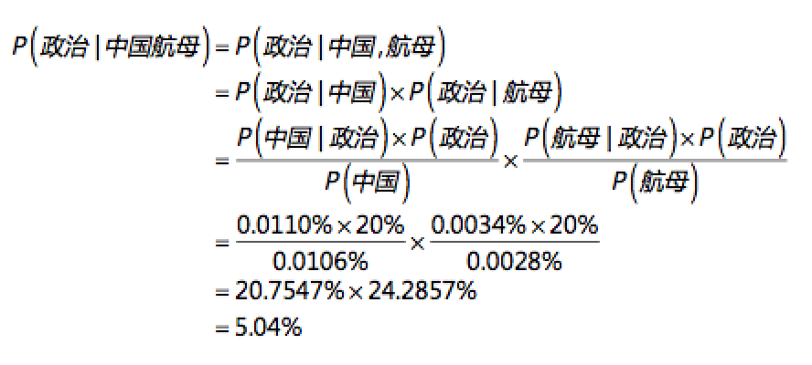
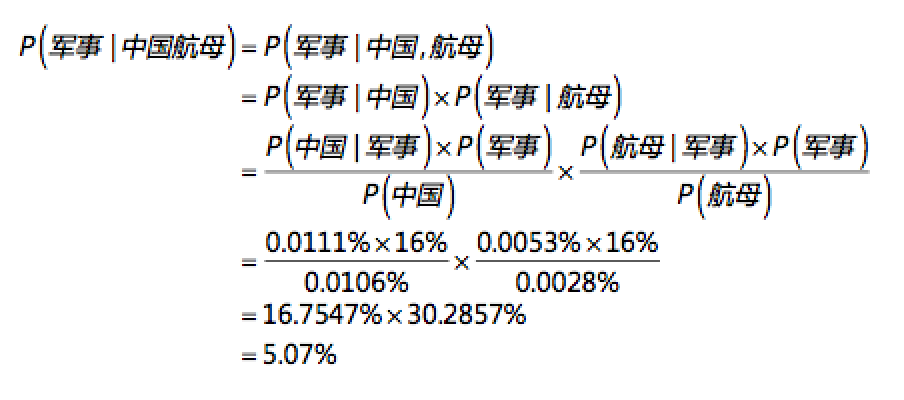
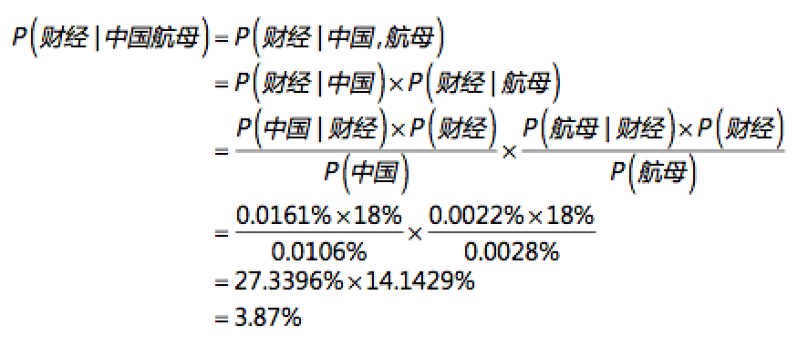
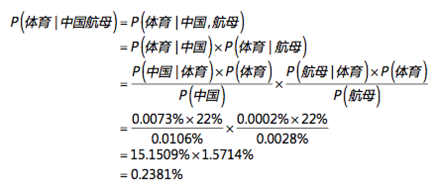

你好，我是黄申。

你平时应该见过手机 App 推送的新闻吧？你有没有觉得这些 App 的推荐算法很神奇？它们竟然可以根据你的喜好来推荐新闻。想要实现这些推荐算法，有一个非常重要的步骤就是给新闻分类。可是，新闻头条这种综合性的平台，需要处理的新闻都是海量的，我们不可能完全靠人工手动处理这些事情。这个时候，我们就要用到计算机技术，来对文本进行自动分类。

上一节，我给你介绍了如何利用朴素贝叶斯方法，教会计算机进行最基本的水果分类。基于水果分类，今天我们继续深入分类这个话题，告诉你如何利用自然语言处理和朴素贝叶斯方法，对新闻这种长篇文本进行分类。

## 0.1 文本分类系统的基本框架

想要实现一个完整的文本分类系统，我们通常需要进行这些步骤：

### 0.1.1 1\. 采集训练样本

对于每个数据对象，我们必须告诉计算机，它属于哪个分类。上一节的水果案例里，我们给每个水果打上“苹果”“甜橙”和“西瓜”的标签，这就是采集训练样本。

同样，我们可以给每一篇新闻打上标签，也就是说，我们首先要分辨某条新闻是什么类型的，比如是政治的、军事的、财经的、体育的，还是娱乐的等等。这一点非常关键，因为分类标签就相当于计算机所要学习的标准答案，其质量高低直接决定了计算机的分类效果。此外，我们也可以在一开始就预留一些训练样本，专门用于测试分类的效果。

### 0.1.2 2\. 预处理自然语言

在水果的案例中，当我们把这些水果的特征值提取出来后，能很容易地将它们的属性转化成计算机所能处理的数据，可是这一步对于文本而言就没有那么容易了。好在专家们已经发明出了一套相对成熟的方法，包括词包（bag of words）、分词、词干（Stemming）和归一化（Normalization）、停用词（Stopword）、同义词（Synonyms）和扩展词处理。这里你只需要了解有这么些方法就可以了，我们使用这些方法的目的就是让计算机能够理解文本，所以如果你对刚才提到的这些专业词汇比较陌生，完全不用担心，这并不会影响对后面知识的理解。

### 0.1.3 3\. 训练模型

训练模型就是算法通过训练数据进行模型拟合的过程。对于朴素贝叶斯方法而言，训练的过程就是要获取每个分类的先验概率、每个属性的先验概率以及给定某个分类时，出现某个属性的条件概率。

### 0.1.4 4\. 实时分类预测

算法模型在训练完毕后，根据新数据的属性来预测它属于哪个分类的过程。对于朴素贝叶斯方法而言，分类预测的过程就是根据训练阶段所获得的先验概率和条件概率，来预估给定一系列属性的情况下属于某个分类的后验概率。

整个流程大致可以用下图来描述：

这四个步骤你大致了解就可以了，这里面有两点我会重点讲一下，一是对文本中的自然语言进行预处理，并从文本集合建立字典；另一个是如何使用建好的字典，统计朴素贝叶斯方法所需的数据。自然语言的预处理是让计算机“理解”人类语言的关键步骤，如果没有这一步，计算机就无法将大量的自然语言转换成自己可以处理的数据。而条件概率和先验概率是朴素贝叶斯方法所必需的，因此如何准确地统计它们也是需要详细解释的。

## 0.2 基于自然语言的预处理

和之前的水果案例相比，新闻这种文本数据最大的区别在于，它包含了大量的自然语言。那么如何让计算机理解自然语言呢？我们的计算机体系没有思维，要理解人类的语言在现阶段是不现实的。但是，我们仍然可以对自然语言进行适当的处理，将其变为机器所能处理的数据。

首先，我们要知道，文本的重要属性是什么，这样我们才能提取出它的特征。怎么才能知道哪些属性是重要的呢？

我举个例子，假如说，有人给你一篇几千字的文章，让你在 10 秒钟之内说出文章大意，你会怎么办？我想大部分人的解决方案是“找关键词”！没错，我们也可以教给计算机同样的办法。而计算机处理文本的基本单位就是字和单词，这就是人们最常用的方法：词袋（Bag of words）模型。

这种模型会忽略文本中的词语出现的顺序以及相应的语法，将整篇文章仅仅看作是一个大量单词的组合。文本中每个词的出现都是独立的，不依赖于其他词的出现情况。讲到这里，你有没有发现在词包模型中，所有单词相互之间是独立的，这个假设和朴素贝叶斯模型的独立假设是不是一致呀？

没错！这里我们就可以很巧妙地将朴素贝叶斯和文本处理结合起来了。不过先不要急，我们还要掌握一些方法，才能将文本中的长篇大论处理成关键词。

### 0.2.1 1\. 分词

计算机处理自然语言的基本单位是单词和词组。对于英语等拉丁语系的语言来说，单词之间是以空格作为自然分界符的，所以我们可以直接使用空格对句子进行分割，然后来获取每个单词。但是，中文、日文、韩文这些语言在书写的时候，词和词之间并没有空格可以进行自然分界，所以我们就需要使用一些算法，来估计词语之间的划分，我们将这个过程称为分词。

这里有一个给中文句子分词的例子，你可以看一看。

分词前：今天我们一起来学习计算机学科中的数学知识

分词后：今天 我们 一起 来 学习 计算机 学科 中 的 数学 知识

是不是觉得给句子分词很简单？这是因为你的中文水平比较高，你想想，计算机怎么才能知道如何分词呢？我们有很多现成的分词模型可以使用。我这里介绍两种目前比较主流的分词模型，你只需要了解就行。

第一种是基于字符串匹配。其实就是扫描字符串。如果发现字符串的子串和词相同，就算匹配成功。匹配规则通常是“正向最大匹配”“逆向最大匹配”“长词优先”。这些算法的优点是只需使用基于字典的匹配，因此计算复杂度低；缺点是处理歧义词效果不佳。

第二种是基于统计和机器学习。这类分词基于人工标注的词性和统计特征，对中文进行建模。训练阶段，根据标注好的语料对模型参数进行估计。在分词阶段再通过模型计算各种分词出现的概率，将概率最大的分词作为最终结果。常见的序列标注模型有隐马尔科夫模型（HMM，Hidden Markov Model）和条件随机场（CRF，Conditional Random Field），我们后面章节会讲到，这里我先不展开。

### 0.2.2 2\. 取词干和归一化

我们刚才说了，相对中文而言，英文完全不需要考虑分词。不过它也有中文不具有的单复数、各种时态，因此它需要考虑取词干（stemming）。取词干的目标就是为了减少词的变化形式，将派生词转化为基本形式，就像下面这样：

将am，is，are，was，were全部转换为be

将car，cars，car’s，cars’全部转换为car

最后，我们还要考虑大小写转化和多种拼写（例如 color 和 colour）这样的统一化，我们把这种做法称为归一化。

### 0.2.3 3\. 停用词

无论何种语言，都会存在一些不影响（或基本不影响）相关性的词。有的时候干脆可以指定一个叫停用词（stop word）的字典，直接将这些词过滤，不予以考虑。例如英文中的 a、an、the、that、is、good、bad 等。中文“的、个、你、我、他、好、坏”等。

如此一来，我们可以在基本不损失语义的情况下，减少数据文件的大小，提高计算机处理的效率。当然，也要注意停用词的使用场景，例如用户观点分析，good 和 bad 这样的形容词反而成为了关键。不仅不能过滤，反而要加大它们的权重。

### 0.2.4 4\. 同义词和扩展词

不同的地域或者不同时代，会导致人们对于同样的物品叫法也不同。例如，在中国北方“番茄”应该叫“西红柿”，而台湾地区将“菠萝”称为“凤梨”。对于计算机而言，需要意识到这两个词是等价的。添加同义词就是一个很好的手段。我们可以维护如下一个同义词的词典：

番茄，西红柿

菠萝，凤梨

洋山芋，土豆

泡面，方便面，速食面，快餐面

山芋，红薯

鼠标，滑鼠

……

有了这样的词典，当看到文本中出现“番茄”关键词的时候，计算机系统就会将其等同于“西红柿”这个词。有的时候我们还需要扩展词。如果简单地将 Dove 分别和多芬、德芙简单地等价，那么多芬和德芙这两个完全不同的品牌也变成了同义词，这样做明显是有问题的。那么我们可以采用扩展关系，当系统看到文本中的“多芬”时将其等同于“Dove”，看到“德芙”时将其等同于“Dove”。但是看到“Dove”的时候并不将其等同于“多芬”或“德芙”。

通过词包模型的假设，以及上述这些自然语言处理的方法，我们可以将整篇的文字，切分为一个个的单词，这些是表示文章的关键属性。你不难发现，每个单词可以作为文章的属性，而通过这些单词的词频（出现的频率），我们很容易进行概率的统计。下面我对分类的先验概率、单词的先验概率、某个分类下某个单词的条件概率分别给出了示例。

在上表中，你会发现某些单词从未在某个分类中出现，例如“航母”这个词从未在“体育”和“娱乐”这两个分类中出现。对于这种情况，我们可以使用平滑（smoothing）的技术，将其词频或条件概率设置为一个极小的值。这里，我设置了最小的词频，也就是 1。

有了这些单词属性以及相应的概率统计，下一步就是如何使用朴素贝叶斯模型进行文本的分类了。

## 0.3 运用朴素贝叶斯模型

首先我们先来回顾下，上一节推导的朴素贝叶斯公式。

在新闻分类中，o 就表示一篇文章，而 c 表示新闻的种类（包括政治、军事、财经等等）。而属性字段 f 就是我们从文档集而建立的各种单词。公式等号左边的 P(c|f) 就是待分类新闻中，出现单词 f 时，该新闻属于类别 c 的概率。而等号右边的 P(f|c) 是根据训练数据统计，得到分类 c 中出现单词 f 的概率。P( c ) 是分类 c 在新闻训练数据中出现的概率，P(f) 是单词 f 在训练样本中出现的概率。

我们用刚才表格中的数据来计算下“中国航母”这个短语属于每个分类的概率。

可以看出来，“中国航母”这个短语本身属于“政治”和“军事”分类的可能性最高，而属于“财经”的可能性最低。需要注意的是，我在上述公式使用了中文词便于你的理解，在真正的实现中，我们需要将中文词和中文分类名称转换为数字型的 ID，以提高系统的效率。

当然，一篇文章所包含的不同的单词数量要远远大于 2 个，之前如果我们只看“中国航母”这个短语，那么它属于“政治”和“军事”的概率基本一致。如果我们考虑更长的文章（也就是更多的单词），那么这个情况也许就会发生变化。为了支持更多的单词，我们将上述公式扩展为：

这里需要注意一个很实际的问题：文章的篇幅很长，常常会导致非常多的 P(f|c) 连续乘积。而 P(f|c) 通常是非常小的数值，因此最后的乘积将快速趋近于 0 以至于计算机无法识别。这里可以使用我们之前提到的一些数学手法进行转换，比如取 log，将小数转换为绝对值大于 1 的负数。这样的转换，虽然会改变每篇文章属于每个分类的概率的绝对值，但是并不会改变这些概率的相对大小。

## 0.4 总结

在这一讲中，我讲了一个文本分类系统的几个关键步骤，其中最重要的是自然语言的处理和分类模型的训练和预测。

自然语言的处理是关键的预处理步骤，它将文本转换成计算机所能处理的数据。常见方法包括中文分词，英文的取词干和归一化，还有适用于各种语言的停用词、同义词和扩展词等。如果不考虑这些词出现的先后顺序，以及表达的深层次语义，那么我们就可以使用词包的方法，将大段的文章和语句转化成单词所组成的集合。之后，我们就能统计每个单词属于每个分类的条件概率，以及分类和单词的先验概率。

一旦将文章表示为单词的集合，我们就会发现，朴素贝叶斯的模型非常适合文章的分类。因为所有单词出现的词频都是离散值，非常适合统计概率。此外，许多新闻之类的文章本身也是跨了多个领域，因此有可能属于多个分类，朴素贝叶斯也能支持这点。我们针对“中国航母”这个短语进行了测试，发现其属于“政治”和“军事”分类的可能性最高。不过要注意的是，文章可能包含非常多的单词，朴素贝叶斯模型中的连续乘积会导致过小的值，甚至计算机都无法处理。为了避免这种情况，我们可以使用 log 的数学变换。

## 0.5 思考题

你也许已经通过“中国航母”这个简单的例子，见识到了计算机自动分类的神奇功效。使用同样的分类模型和概率分布，你能否计算一下“美国电影”属于政治、军事、财经、体育和娱乐分类的概率，分别是多少？

欢迎留言和我分享，也欢迎你在留言区写下今天的学习笔记。你可以点击“请朋友读”，把今天的内容分享给你的好友，和他一起精进。

本文介绍了利用朴素贝叶斯方法对新闻进行分类的基本原理和方法。首先，文章讨论了构建文本分类系统的基本框架，包括采集训练样本、预处理自然语言、训练模型和实时分类预测。其中，预处理自然语言包括分词、取词干和归一化以及停用词的处理。其次，文章强调了文本数据的重要属性以及如何提取特征，介绍了词包模型和分词的方法。此外，还介绍了中文分词的两种主流模型：基于字符串匹配和基于统计和机器学习。文章强调了朴素贝叶斯方法和文本处理的结合，以及如何使用建好的字典统计朴素贝叶斯方法所需的数据。最后，通过朴素贝叶斯模型进行文本的分类，文章提供了详细的技术指导和示例。整体而言，本文深入浅出地介绍了利用朴素贝叶斯方法对新闻进行分类的关键步骤和技术特点，为读者提供了清晰的技术指导。