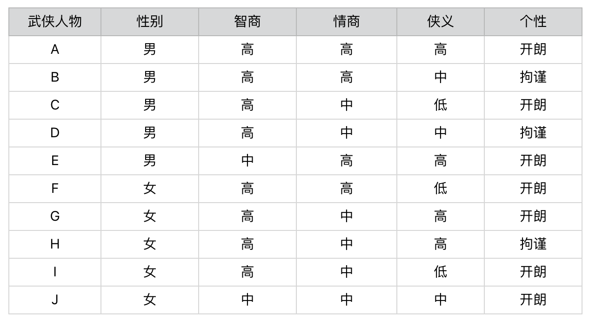
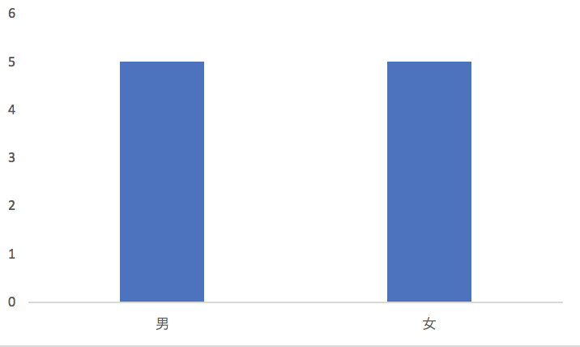
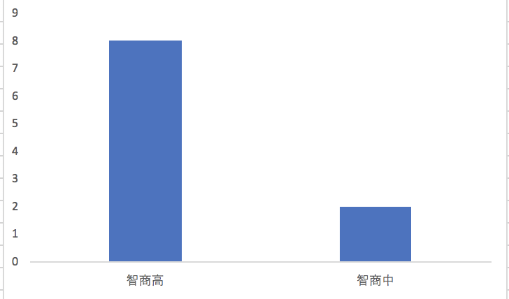
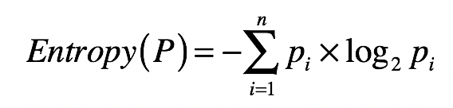
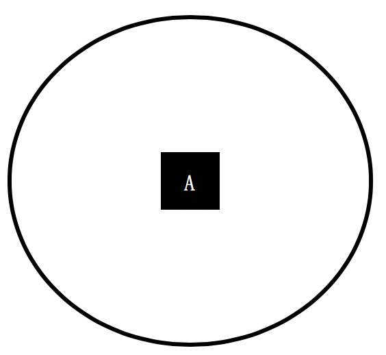
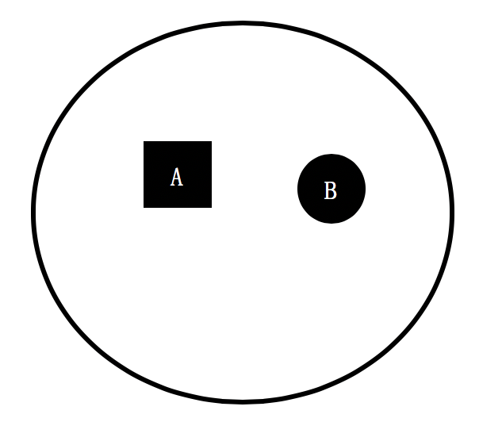
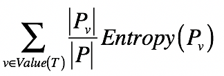
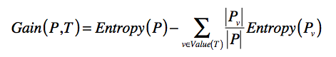

你好，我是黄申。

之前和你聊了概率在朴素贝叶斯分类算法中的应用。其实，概率在很多像信息论这样的应用数学领域都有广泛的应用。信息论最初就是运用概率和统计的方法，来研究信息传递的。最近几十年，人们逐步开始使用信息论的概念和思想，来描述机器学习领域中的概率分布，并衡量概率分布之间的相似性。随之而来的是，人们发明了不少相关的机器学习算法。所以接下来的几节，我来介绍一些基于信息论知识的内容。

信息论的概念比较枯燥，为了让你更轻松地学习，让我从一个生动的案例开始。最近我在朋友圈看到一个小游戏，叫“测一测你是金庸笔下的哪个人物？”。玩这个游戏的步骤是，先做几道题，然后根据你的答案，生成对应的结果。下面是我几位朋友答题之后得到的结果。

这种测试挺好玩的，而且好像有很多类似的，比如测星座啊、测运势啊等等。那你知道这种心理或者性格测试的题目是怎么设计的吗？

通常，这种心理测试会有一个题库，包含了许多小题目，也就是从不同的方面，来测试人的性格。不过，针对特定的测试目标，我们可能没必要让被测者回答所有的问题。那么，问卷设计者应该如何选择合适的题目，才能在读者回答尽量少的问题的同时，相对准确地测出自己是什么“性格”呢？这里，我们就需要引入基于概率分布的信息熵的概念，来解决这个问题。

## 什么是信息熵？

我还是拿刚刚那个“测测你是哪个武侠人物”的小游戏举例子。我设计了一个测试题，你可以看看下面这个图表。这个表里一共有 10 个人物。每个人物都有性别、智商、情商、侠义和个性共 5 个属性。相应地，我会设计 5 道题目分别测试这 5 个属性所占的比例。最后，将测出的 5 个属性和答案中的武侠人物对照，就可以找到最接近的答案，也就是被测者对应的武侠人物。

这个过程非常简单，你应该很容易就能理解。在这个设计过程中，起决定性作用的环节其实就是，如何设计这 5 道题目。比如，题目的先后顺序会不会直接影响要回答问题的数量？每个问题在人物划分上，是否有着不同的区分能力？这些都是信息熵要解决的问题。

我们先来看，这里的区分能力指的是什么呢？每一个问题都会将被测试者划分为不同的人物分组。如果某个问题将属于不同人物分组的被测者，尽可能地划分到了相应的分组，那么我们认为这个问题的区分能力较强。相反，如果某个问题无法将属于不同人物分组的被测者划分开来，那么我们认为这个问题的区分能力较弱。为了帮你进一步理解，我们先来比较一下“性别”和“智商”这两个属性。

首先，性别属性将武侠人物平均地划分为一半一半，也就是说“男”和“女”出现的先验概率是各 50%。如果我们假设被测试的人群，其男女性别的概率分布也是 50% 和 50%，那么关于性别的测试题，就能将被测者的群体大致等分。

我们再来看智商属性。我们也将武侠人物划分为 2 个小集合，不过“智商高”的先验概率是 80%，而“智商中等”的先验概率只有 20%。同样，我们假设被测试的人群，其智商的概率分布也是类似地，那么经过关于智商的测试题之后，仍然有 80% 左右的不同人物还是属于同一个集合，并没有被区分开来。因此，我们可以认为关于“智商”的测试题，在对人物进行分组这个问题上，其能力要弱于“性别”的测试题。

上述这些是不是都很简单？这些都是我们按照感觉，或者说经验来划分的。现在，我们试着用两个科学的度量指标，信息熵（Entropy）和信息增益（Information Gain），来衡量每道题目的区分能力。

首先，怎么来理解信息熵呢？信息熵，我们通常简称为熵，其实就是用来刻画给定集合的纯净度的一个指标。你可能要问了，那纯净度是啥呢？我举个例子给你解释一下。比如说，一个集合里的元素全部是属于同一个分组，这个时候就表示最纯净，我们就说熵为 0；如果这个集合里的元素是来自不同的分组，那么熵是大于 0 的值。其具体的计算公式如下：

其中， 表示集合中分组的数量， 表示属于第 个分组的元素在集合中出现的概率。

你可能要问了，这个公式是怎么来的呢？想要解释这个，我们还要从信息量说起。熵的公式是用来计算某个随机变量的信息量之期望，而信息量是信息论中的一个度量，简单来说就是，当我们观察到某个随机变量的具体值时，接收到了多少信息。而我们接收到的信息量跟发生事件的概率有关。事情发生的概率越大，产生的信息量越小；事情发生的概率越小，产生的信息量越大。

因此，我们想要设计一个能够描述信息量的函数，就要同时考虑到下面这三个特点：

信息量应该为正数；

一个事件的信息量和它发生的概率成反比；

与 的对数有关。其中 表示 的信息量， 表示 出现的概率。假设有两个不相关的事件 和 ，我们观察到这两个事件同时发生时获得的信息量，应该等于这两个事件各自发生时获得的信息量之和，用公式表达出来就是 。之前我们说过，如果 是两个不相关的事件，那么就有 。

依照上述这三点，我们可以设计出信息量公式：。函数 log 的使用是体现了 和 的对数关系（我们可以使用其他大于 1 的数字作为对数的底，我这里使用 2 只是约定俗成。而最开始的负号是为了保证信息量为正）。这个公式可以量化随机变量某种取值时，所产生的信息量。最后，加上计算随机变量不同可能性所产生的信息量之期望，我们就得到了熵的公式。

从集合和分组的角度来说，如果一个集合里的元素趋向于落在同一分组里，那么告诉你某个元素属于哪个分组的信息量就越小，整个集合的熵也越小，换句话说，整个集合就越“纯净”。相反，如果一个集合里的元素趋向于分散在不同分组里，那么告诉你某个元素属于哪个分组的信息量就越大，整个集合的熵也越大，换句话说，整个集合就越“混乱”。

为了帮你理解运用，这里我再举几个例子帮助你更好地消化这个公式。我们首先来看一个集合，它只包含了来自 A 组的元素。

那么集合中分组的数量 为 1，A 分组的元素在集合中出现的概率为 100%，所以这个集合的熵为 -100%\*log(100%, 2) = 0。

我们再来看另一个集合，它只包含了来自 A 组和 B 组的元素，其中 A、B 两组元素数量一样多，各占一半。

那么集合中分组的数量 为 2，A 和 B 分组的元素在集合中出现的概率各为 50%，所以这个集合的熵为 2\*(-50%\*log(50%, 2)) = 1，高于刚才那个集合。

从上述两个集合的对比可以看出，一个集合中所包含的分组越多、元素在这些分组里分布得越均匀，熵值也越大。而熵值表示了纯净的程度，或者从相反的角度来说，是混乱的程度。

好了，你已经知道单个集合的熵是如何计算的了。那么，如果将一个集合划分成多个更小的集合之后，又该如何根据这些小集合，来计算整体的熵呢？之前我们提到了信息量和熵具有加和的性质，所以对于包含多个集合的更大集合，它的信息量期望值是可以通过每个小集合的信息量期望值来推算的。具体来说，我们可以使用如下公式：

其中， 表示一种划分， 表示划分后其中某个小集合， 表示某个小集合的熵，而 表示某个小集合出现的概率。所以这个公式其实就表示，对于多个小集合而言，其整体的熵等于各个小集合之熵的加权平均。而每个小集合的权重是其在整体中出现的概率。

我用个例子进一步解释这个公式。假设 A、B、C 三个集合是一个大的整体，我们现在将 C 组的元素和 A、B 组分开。

根据之前单个集合的熵计算，A 和 B 组元素所组成的小集合，它的熵是 1。而 C 组没有和其他组混合，所形成的小集合其熵为 0。在计算前两个小集合的整体熵时，A 组和 B 组形成的集合出现的概率为 ，而 C 组形成的集合出现概率为 ，所有整体熵 。

## 什么是信息增益？

如果我们将划分前后的整体熵做个对比，你会发现划分后的整体熵要小于划分之前的整体熵。这是因为每次划分，都可能将不同分组的元素区分开来，降低划分后每个小集合的混乱程度，也就是降低它们的熵。我们将划分后整体熵的下降，称为信息增益（Information Gain）。如果划分后整体熵下降得越多，信息增益就越大。我列出公式以便你理解。

其中 T 表示当前选择的特征， 表示选择特征 之前的熵， 表示特征 取值为 分组的熵。减号后面的部分表示选择 T 做决策之后，各种取值加权平均后整体的熵。

表示两个熵值之差，越大表示信息增益越多，应该选择这维特征 。

我们把这个概念放到咱们的小游戏里就是，如果一个测试问题能够将来自不同分组的人物尽量的分开，也就是该划分对应的信息增益越高，那么我们就认为其区分能力越高，提供的信息含量也越多。好，说到这里，让我们从游戏的最开始出发，比较一下有关性别和智商的两个测试题。

在提出任何问题之前，我们无法知道被测者属于哪位武侠人物，因此所有被测者属于同一个集合。假设被测者的概率分布和这 10 位武侠人物的先验概率分布相同，那么被测者集合的熵为 10\*(-1 \* 0.1 \* log(0.1, 2))=3.32。

通过性别的测试问题对人物进行划分后，我们得到了两个更小的集合，每个小集合都包含 5 种不同的人物分组，因此每个小集合的熵是 (-1 \* 5 \* 0.2 \* log(0.2, 2)) = 2.32，两个小集合的整体熵是 0.5 \* 2.32 + 0.5 \* 2.32 = 2.32。因此使用性别的测试题后，信息增益是 3.32 - 2.32 = 1。

而通过智商的测试问题对人物分组后，我们也得到了两个小集合，一个包含了 8 种人物，另一个包含了 2 种人物。包含 8 种人物的小集合其熵是 (-1\* 8 \* 0.125 \* log(0.125, 2)) = 3，包含 2 种人物的小集合其熵是 (-1\* 2 \* 0.5 \* log(0.5, 2)) = 1。两个小集合的整体熵是 0.8 \* 3 + 0.2 \* 1 = 2.6。因此使用智商的测试题后，信息增益是 3.32 - 2.6 = 0.72，低于基于性别的测试。所以，我们可以得出结论，有关性别的测试题比有关智商的测试题更具有区分能力。

信息增益和信息熵是紧密相关的。如果说信息熵衡量了某个状态下，每个分组的纯净程度或者说混乱程度，那么信息增益就是比较了不同状态下，信息熵的差异程度。

## 总结

这一讲中，我们从一个有趣的人物性格测试开始，探讨了如何高效率地进行问卷调查。其中主要包含了两个要点：信息熵和信息增益。熵的计算是基于集合内各组元素分布的概率来进行的。而信息增益是集合划分前后整体熵的差值。对某个集合进行划分，都会将其中元素细分到更小的集合，而每个细分的集合纯净度就会提高，整体熵就会下降，其中下降的部分就是信息增益。

了解信息熵和信息增益的定义之后，我们可以用它们来安排测试问题的先后顺序。其核心的思路是，利用信息增益找出区分力最强的测试题。如果一道测试题可以将来自不同分组的元素分隔开来，那么就说它是有区分力的。如果分隔后，每个细分的集合其熵越趋近于 0，那么我们说这个测试题的区分力越强。

## 思考题

假设一个集合包含了 64 个元素，而每个元素的分类都互不相同，那么这个集合的信息熵是多少？仔细观察一下你所计算的结果，和二进制有没有什么联系？

欢迎留言和我分享，也欢迎你在留言区写下今天的学习笔记。你可以点击“请朋友读”，把今天的内容分享给你的好友，和他一起精进。

本文介绍了信息熵在心理测试中的应用，以及信息论的概念和思想在机器学习领域的广泛应用。作者通过一个有趣的小游戏示例，展示了如何利用信息熵设计心理测试题目，以尽量少的问题准确测出被测试者的性格。文章重点介绍了信息熵的概念和应用，以及基于概率分布的信息熵的概念。通过对信息熵的解释和计算公式的详细阐述，读者可以了解信息熵在题目选择中的重要性，以及如何利用信息熵来衡量心理测试题目的区分能力。整体而言，本文深入浅出地介绍了信息熵的概念和应用，对于对信息论和心理测试感兴趣的读者具有很高的参考价值。文章通过具体的例子和公式阐述了信息增益的概念，以及如何利用信息增益来安排测试问题的先后顺序，找出区分力最强的测试题。通过对信息增益的解释和示例分析，读者可以深入理解信息增益的重要性，以及如何利用它来提高问卷调查的效率。整体而言，本文通过生动的例子和清晰的逻辑，深入浅出地介绍了信息熵和信息增益的概念及应用，对于对机器学习和问卷调查感兴趣的读者具有很高的参考价值。