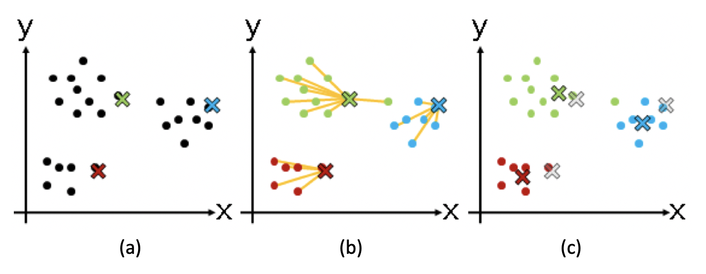
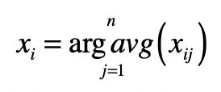

你好，我是黄申。

前两节，我讲了向量空间模型，以及如何在信息检索领域中运用向量空间模型。向量空间模型提供了衡量向量之间的距离或者相似度的机制，而这种机制可以衡量查询和被查询数据之间的相似程度，而对于文本检索来说，查询和文档之间的相似程度可作为文档的相关性。

实际上，除了文档的相关性，距离或者相似度还可以用在机器学习的算法中。今天，我们就来聊聊如何在聚类算法中使用向量空间模型，并最终实现过滤重复文章。

## 聚类算法

在概率统计模块中，我们介绍了分类（Classification/Categorization）和回归（Regression）这两种监督式学习（Supervised Learning）。监督式学习通过训练资料学习并建立一个模型，并依此模型对新的实例进行预测。

不过，在实际场景中，我们常常会遇到另一种更为复杂的情况。这时候不存在任何关于样本的先验知识，而是需要机器在没人指导的情形下，去将很多东西进行归类。由于缺乏训练样本，这种学习被称为“非监督学习”（Unsupervised Learning），也就是我们通常所说的聚类（Clustering）。在这种学习体系中，系统必须通过一种有效的方法发现样本的内在相似性，并把数据对象以群组（Cluster）的形式进行划分。

谈到相似性，你可能已经想到了利用特征向量和向量空间模型，这确实是可行的方法。不过，为了让你全面了解在整个非监督式学习中，如何运用向量空间，让我先从一个具体的聚类算法开始。

这个算法的名称是 K 均值（K-Means）聚类算法，它让我们可以在一个任意多的数据上，得到一个事先定好群组数量（K）的聚类结果。这种算法的中心思想是：尽量最大化总的群组内相似度，同时尽量最小化群组之间的相似度。群组内或群组间的相似度，是通过各个成员和群组质心相比较来确定的。想法很简单，但是在样本数量达到一定规模后，希望通过排列组合所有的群组划分，来找到最大总群组内的相似度几乎是不可能的。于是人们提出如下的求近似解的方法。

从 N 个数据对象中随机选取 k 个对象作为质心，这里每个群组的质心定义是，群组内所有成员对象的平均值。因为是第一轮，所以第 i 个群组的质心就是第 i 个对象，而且这时候我们只有这一个组员。

对剩余的对象，测量它和每个质心的相似度，并把它归到最近的质心所属的群组。这里我们可以说距离，也可以说相似度，只是两者呈现反比关系。

重新计算已经得到的各个群组的质心。这里质心的计算是关键，如果使用特征向量来表示的数据对象，那么最基本的方法是取群组内成员的特征向量，将它们的平均值作为质心的向量表示。

迭代上面的第 2 步和第 3 步，直至新的质心与原质心相等或相差之值小于指定阈值，算法结束。

我以二维空间为例子，画张图来展示一下数据对象聚类的过程。

在这张图中，( a )、( b )、( c ) 三步分别展示了质心和群组逐步调整的过程。我们一一来看。(a) 步骤是选择初始质心，质心用不同颜色的 x 表示；( b ) 步骤开始进行聚类，把点分配到最近的质心所在的组；( c ) 步骤重新计算每个群组的质心，你会发现 x 的位置发生了改变。之后就是如此重复，进入下一轮聚类。

总的来说，K 均值算法是通过不断迭代、调整 K 个聚类质心的算法。而质心或者群组的中心点，是通过求群组所包含的成员之平均值来计算的。

## 使用向量空间进行聚类

明白了 K 均值聚类算法的核心思想，再来理解向量空间模型在其中的运用就不难了。我还是以文本聚类为例，讲讲如何使用向量空间模型和聚类算法，去除重复的新闻。

我们在看新闻的时候，一般都希望不断看到新的内容。可是，由于现在的报道渠道非常丰富，经常会出现热点新闻霸占版面的情况。假如我们不想总是看到重复的新闻，应该怎么办呢？有一种做法就是对新闻进行聚类，那么内容非常类似的文章就会被聚到同一个分组，然后对每个分组我们只选择 1 到 2 篇显示就够了。

基本思路确定后，我们可以把整个方法分为三个主要步骤。

第一步，把文档集合都转换成向量的形式。这块我上一节讲过了，你要是不记得了，可以自己回去复习一下。

第二步，使用 K 均值算法对文档集合进行聚类。这个算法的关键是如何确定数据对象和分组质心之间的相似度。针对这点，我们有两个点需要关注。

使用向量空间中的距离或者夹角余弦度量，计算两个向量的相似度。

计算质心的向量。K 均值里，质心是分组里成员的平均值。所以，我们需要求分组里所有文档向量的平均值。求法非常直观，就是分别为每维分量求平均值，我把具体的计算公式列在这里：

其中， 表示向量的第 i 个分量， 表示第 j 个向量的第 个分量，而 表示属于某个分组的所有向量。

第三步，在每个分类中，选出和质心最接近的几篇文章作为代表。而其他的文章作为冗余的内容过滤掉。

下面，我使用 Python 里的 sklearn 库，来展示使用欧氏距离的 K 均值算法。

## Python 中的 K 均值算法

在尝试下面的代码之前，你需要看看自己的机器上是不是已经安装了 scikit-learn。Scikit-learn 是 Python 常用的机器学习库，它提供了大量的机器学习算法的实现和相关的文档，甚至还内置了一些公开数据集，是我们实践机器学习算法的好帮手。

首先，我使用 sklearn 库中的 CountVectorizer，对一个测试的文档集合构建特征，也就是词典。这个测试集合有 7 句话，2 句关于篮球，2 句关于电影，还有 3 句关于游戏。具体代码如下：

from sklearn.feature\_extraction.text import CountVectorizer

corpus = \['I like great basketball game',

'This video game is the best action game I have ever played',

'I really really like basketball',

'How about this movie? Is the plot great?',

'Do you like RPG game?',

'You can try this FPS game',

'The movie is really great, so great! I enjoy the plot'\]

vectorizer = CountVectorizer()

vectors = vectorizer.fit\_transform(corpus)

print('所有的词条（所有维度的特征）')

print(vectorizer.get\_feature\_names())

print('\\n')

print('(文章ID, 词条ID) 词频')

print(vectors)

print('\\n')

从运行的结果中，你可以看到，整个词典里包含了哪些词，以及每个词在每个文档里的词频。

这里，我们希望使用比词频 tf 更好的 tf-idf 机制，TfidfTransformer 可以帮助我们做到这点，代码和注释如下：

from sklearn.feature\_extraction.text import TfidfTransformer

transformer = TfidfTransformer()

tfidf = transformer.fit\_transform(vectorizer.fit\_transform(corpus))

tfidf\_array = tfidf.toarray()

words = vectorizer.get\_feature\_names()

for i in range(len(tfidf\_array)):

print ("\*\*\*\*\*\*\*\*\*第", i + 1, "个文档中，所有词语的tf-idf\*\*\*\*\*\*\*\*\*")

for j in range(len(words)):

print(words\[j\], ' ', tfidf\_array\[i\]\[j\])

print('\\n')

运行的结果展示了每个文档中，每个词的 tfidf 权重，你可以自己手动验算一下。

最后，我们就可以进行 K 均值聚类了。由于有篮球、电影和游戏 3 个类别，我选择的 K 是 3，并在 KMeans 的构造函数中设置 n\_clusters 为 3。

from sklearn.cluster import KMeans

clusters = KMeans(n\_clusters=3)

s = clusters.fit(tfidf\_array)

print('所有质心点的向量')

print(clusters.cluster\_centers\_)

print('\\n')

print('每个文档所属的分组')

print(clusters.labels\_)

dict = {}

for i in range(len(clusters.labels\_)):

label = clusters.labels\_\[i\]

if label not in dict.keys():

dict\[label\] = \[\]

dict\[label\].append(corpus\[i\])

else:

dict\[label\].append(corpus\[i\])

print(dict)

为了帮助你的理解，我输出了每个群组的质心，也就是其中成员向量的平均值。最后，我也输出了 3 个群组中所包含的句子。在我机器上的运行结果显示，系统可以把属于 3 个话题的句子区分开来。如下所示：

{2: \['I like great basketball game', 'I really really like basketball'\], 0: \['This video game is the best action game I have ever played', 'Do you like RPG game?', 'You can try this FPS game'\], 1: \['How about this movie? Is the plot great?', 'The movie is really great, so great! I enjoy the plot'\]}

不过，由于 KMeans 具体的实现可能不一样，而且初始质心的选择也有一定随机性，所以你看到的结果可能稍有不同。

## 总结

这一节，我介绍了如何在机器学习的聚类算法中，使用向量空间模型。在聚类中，数据对象之间的相似度是很关键的。如果我们把样本转换为向量，然后使用向量空间中的距离或者夹角余弦，就很自然的能获得这种相似度，所以向量空间模型和聚类算法可以很容易的结合在一起。

为了给你加深印象，我介绍了一个具体的 K 均值算法，以及向量空间模型在其中所起到的作用，并通过 Python 的 sklearn 代码演示了几个关键的步骤。

向量空间模型和 K 均值算法的结合，虽然简单易懂，但是一开始怎样选择这个群组的数量，是个关键问题。我今天演示的测试数据很小，而且主题划分的也非常明显。所以我选择聚类的数量为 3。

可是在实际项目中，对于一个新的数据集合，选择多少比较合适呢？如果这个 K 值取得太大，群组可能切分太细，每个之间区别不大。如果 K 值取得太小，群组的粒度又太粗，造成群组内差异比较明显。对非监督式的学习来说，这个参数确实难以得到准确预估。我们可以事先在一个较小的数据集合上进行尝试，然后根据结果和应用场景确定一个经验值。

## 思考题

今天我使用的是 sklearn 里的 KMeans 包，它使用了向量间的欧氏距离来进行聚类。你可以尝试实现自己的 K 均值聚类，并使用向量间的夹角余弦作为相似度的度量。

欢迎留言和我分享，也欢迎你在留言区写下今天的学习笔记。你可以点击“请朋友读”，把今天的内容分享给你的好友，和他一起精进。

本文介绍了如何使用向量空间模型和聚类算法来过滤冗余的新闻。文章首先介绍了K均值聚类算法的核心思想，即通过不断迭代、调整聚类质心的算法。然后，结合向量空间模型，详细讲解了如何在文本聚类中使用K均值算法，包括将文档集合转换成向量形式、计算相似度以及选取代表文章等步骤。接着，文章展示了在Python中使用sklearn库实现K均值算法的示例代码，并介绍了CountVectorizer和TfidfTransformer的使用方法。通过本文，读者可以了解到如何利用向量空间模型和聚类算法来处理大量新闻数据，从而过滤掉重复冗余的内容，帮助读者快速获取新的信息内容。文章还提到了K均值聚类的实际应用和参数选择的难点，以及鼓励读者尝试实现自己的K均值聚类并使用夹角余弦作为相似度的度量。整体而言，本文通过简洁清晰的语言和实际代码示例，帮助读者快速了解了向量空间模型和K均值算法的结合应用，以及在实际项目中可能遇到的挑战和解决思路。