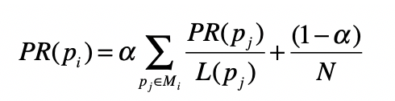
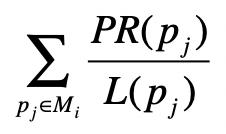
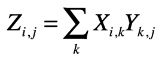
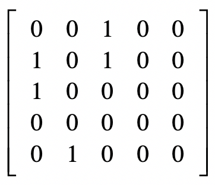
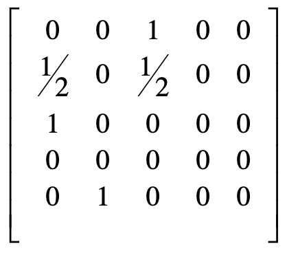
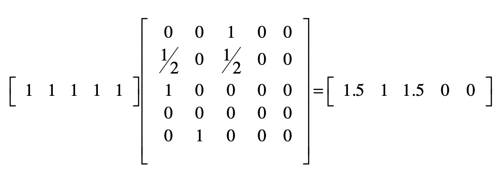
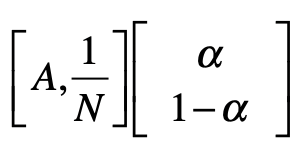
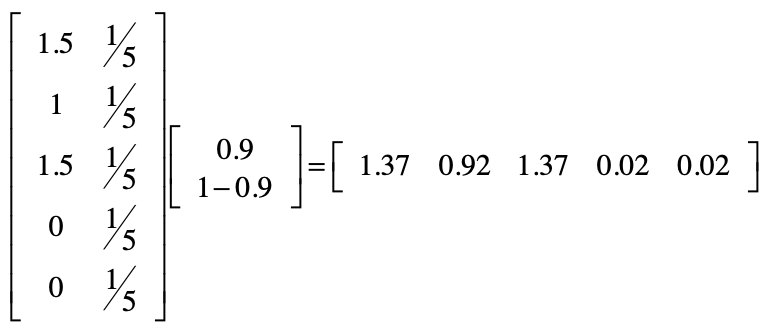

你好，我是黄申。今天我来说说矩阵。

前面我说过，矩阵由多个长度相等的向量组成，其中的每列或者每行就是一个向量。从数据结构的角度来看，我们可以把向量看作一维数组，把矩阵看作二维数组。

具有了二维数组的特性，矩阵就可以表达二元关系了，例如图中结点的邻接关系，或者是用户对物品的评分关系。而通过矩阵上的各种运算操作，我们就可以挖掘这些二元关系，在不同的应用场景下达到不同的目的。今天我就从图的邻接矩阵出发，展示如何使用矩阵计算来实现 PageRank 算法。

## 回顾 PageRank 链接分析算法

在讲马尔科夫模型的时候，我已经介绍了 PageRank 链接分析算法。所以，在展示这个算法和矩阵操作的关系之前，我们快速回顾一下它的核心思想。

PageRank 是基于马尔科夫链的。它假设了一个“随机冲浪者”模型，冲浪者从某张网页出发，根据 Web 图中的链接关系随机访问。在每个步骤中，冲浪者都会从当前网页的链出网页中，随机选取一张作为下一步访问的目标。此外，PageRank 还引入了随机的跳转操作，这意味着冲浪者不是按 Web 图的拓扑结构走下去，只是随机挑选了一张网页进行跳转。

基于之前的假设，PageRank 的公式定义如下：

其中， 表示第 张网页， 是 的入链接集合， 是 集合中的第 张网页。 表示网页 的 PageRank 得分， 表示网页 的出链接数量， 就表示从网页 跳转到 的概率。 是用户不进行随机跳转的概率， 表示所有网页的数量。

PageRank 的计算是采用迭代法实现的：一开始所有网页结点的初始 PageRank 值都可以设置为某个相同的数，例如 1，然后我们通过上面这个公式，得到每个结点新的 PageRank 值。每当一张网页的 PageRank 发生了改变，它也会影响它的出链接所指向的网页，因此我们可以再次使用这个公式，循环地修正每个网页结点的值。由于这是一个马尔科夫过程，所以我们能从理论上证明，所有网页的 PageRank 最终会达到一个稳定的数值。整个证明过程很复杂，这里我们只需要知道这个迭代计算的过程就行了。

## 简化 PageRank 公式

那么，这个计算公式和矩阵操作又有什么联系呢？为了把问题简化，我们暂时不考虑随机跳转的情况，而只考虑用户按照网页间链接进行随机冲浪。那么 PageRank 的公式就简化为：

这个公式只包含了原公式中的 部分。我们再来对比看看矩阵点乘的计算公式。

以上两个公式在形式上是基本一致的。因此，我们可以把 的计算，分解为两个矩阵的点乘。一个矩阵是当前每张网页的 PageRank 得分，另一个矩阵就是邻接矩阵。所谓邻接矩阵，其实就是表示图结点相邻关系的矩阵。

假设 是矩阵中第 行、第 列的元素，那么我们就可以使用 表示从结点 到结点 的连接，放到 PageRank 的应用场景， 就表示网页 到网页 的链接。最原始的邻接矩阵所包含的元素是 0 或 1，0 表示没有链接，而 1 表示有链接。

考虑到 PageRank 里乘积是 ，我们可以对邻接矩阵的每一行进行归一化，用原始的值（0 或 1）除以 ，而 表示有某张网页 的出链接，正好是矩阵中 这一行的和。所以，我们可以对原始的邻接矩阵，进行基于行的归一化，这样就能得到每个元素为 的矩阵，其中 表示矩阵的第 行。注意，这里的归一化是指让所有元素加起来的和为 1。

为了方便你理解，我用下面这个拓扑图作为例子给你详细解释。

基于上面这个图，原始矩阵为：

其中第 i 行、第 j 列的元素值表示从结点 i 到 j 是不是存在链接。如果是，那么这个值为 1；否则就为 0。

按照每一行的和，分别对每一行进行归一化之后的矩阵就变为：

有了上述这个邻接矩阵，我们就可以开始最简单的 PageRank 计算。PageRank 的计算是采用迭代法实现的。这里我把初始值都设为 1，并把第一次计算的结果列在这里。

好了，我们已经成功迈出了第一步，但是还需要考虑随机跳转的可能性。

## 考虑随机跳转

经过上面的步骤，我们已经求得 部分。不过，PageRank 引入了随机跳转的机制。这一部分其实也是可以通过矩阵的点乘来实现的。我们把 部分用 表示，那么完整的 PageRank 公式就可以表示为：

于是，我们可以把上述公式分解为如下两个矩阵的点乘：

我们仍然使用前面的例子，来看看经过随机跳转之后，PageRank 值变成了多少。这里 取 0.9。

我们前面提到，PageRank 算法需要迭代式计算。为了避免计算后的数值越来越大甚至溢出，我们可以进行归一化处理，保证所有结点的数值之和为 1。经过这个处理之后，我们得到第一轮的 PageRank 数值，也就是下面这个行向量：

\[0.37027027 0.24864865 0.37027027 0.00540541 0.00540541\]

接下来，我们只需要再重复之前的步骤，直到每个结点的值趋于稳定就可以了。

## 使用 Python 进行实现

说到这里，我已经把如何把整个 PageRank 的计算，转换成多个矩阵的点乘这个过程讲完了。这样一来，我们就可以利用 Python 等科学计算语言提供的库，来完成基于 PageRank 的链接分析。为了展示具体的代码，我以之前的拓扑图为例，给你详细讲述每一步。

首先，我们要进行一些初始化工作，包括设置结点数量、确定随机跳转概率的 、代表拓扑图的邻接矩阵以及存放所有结点 PageRank 值的数组。下面是一段示例代码，在代码中我提供了注释供你参考。

import numpy as np

alpha = 0.9

N = 5

jump = np.full(\[2,1\], \[\[alpha\], \[1\-alpha\]\], dtype=float)

adj = np.full(\[N,N\], \[\[0,0,1,0,0\],\[1,0,1,0,0\],\[1,0,0,0,0\],\[0,0,0,0,0\],\[0,1,0,0,0\]\], dtype=float)

row\_sums = adj.sum(axis=1)

row\_sums\[row\_sums == 0\] = 0.1

adj = adj / row\_sums\[:, np.newaxis\]

pr = np.full(\[1,N\], 1, dtype=float)

之后，我们就能采用迭代法来计算 PageRank 值。一般我们通过比较每个结点最近两次计算的值是否足够接近，来确定数值是不是已经稳定，以及是不是需要结束迭代。这里为简便起见，我使用了固定次数的循环来实现。如果你的拓扑图比较复杂，需要更多次迭代，我把示例代码和注释列在这里。

\# PageRank算法本身是采用迭代方式进行的，当最终的取值趋于稳定后结束。

for i in range(0, 20):

\# 进行点乘，计算Σ(PR(pj)/L(pj))

pr = np.dot(pr, adj)

\# 转置保存Σ(PR(pj)/L(pj))结果的矩阵，并增加长度为N的列向量，其中每个元素的值为1/N，便于下一步的点乘。

pr\_jump = np.full(\[N, 2\], \[\[0, 1/N\]\])

pr\_jump\[:,:-1\] = pr.transpose()

\# 进行点乘，计算α(Σ(PR(pj)/L(pj))) + (1\-α)/N)

pr = np.dot(pr\_jump, jump)

\# 归一化PageRank得分

pr = pr.transpose()

pr = pr / pr.sum()

print("round", i + 1, pr)

如果成功运行了上述两段代码，你就能看到每个结点最终获得的 PageRank 分数是多少。

Python 中还有一些很不错的库，提供了直接构建拓扑图和计算 PageRank 的功能，例如 networkx（https://networkx.github.io/）。你可以尝试使用这种库，构建样例拓扑图并计算每个结点的 PageRank 得分，最后和上述代码所计算的 PageRank 得分进行比较，验证一下上述代码的结果是不是合理。

## 总结

我们可以把向量看作一维数组，把矩阵看作二维数组。矩阵的点乘，是由若干个向量的点乘组成的，所以我们可以通过矩阵的点乘操作，挖掘多组向量两两之间的关系。

今天我们讲了矩阵的点乘操作在 PageRank 算法中的应用。通过表示网页的邻接二元关系，我们可以使用矩阵来计算 PageRank 的得分。在这个应用场景下，矩阵点乘体现了多个马尔科夫过程中的状态转移。

矩阵点乘和其他运算操作，还可以运用在很多其他的领域。例如，我在上一节介绍 K 均值聚类算法时，就提到了需要计算某个数据点向量、其他数据点向量之间的距离或者相似度，以及使用多个数据点向量的平均值来获得质心点的向量，这些都可以通过矩阵操作来完成。

另外，在协同过滤的推荐中，我们可以使用矩阵点乘，来实现多个用户或者物品之间的相似程度，以及聚集后的相似程度所导致的最终推荐结果。下一节，我会使用矩阵来表示用户和物品的二元关系，并通过矩阵来计算协同过滤的结果。

## 思考题

在介绍 PageRank 算法时，我提到了它的计算是一个迭代的过程。这一节我使用了固定次数的循环来实现这一点。请尝试使用计算前后两次 PageRank 数值的差，来判断是否需要结束迭代。（提示：你可以使用矩阵元素对应的减法，以及在第 3 讲和加餐 2 中提到的相对误差。）

欢迎留言和我分享，也欢迎你在留言区写下今天的学习笔记。你可以点击“请朋友读”，把今天的内容分享给你的好友，和他一起精进。

本文深入介绍了如何使用矩阵操作进行PageRank计算，通过简洁清晰的语言和具体的示例，帮助读者快速了解了PageRank算法与矩阵操作的关系，以及如何使用Python实现PageRank计算。文章首先回顾了PageRank链接分析算法的核心思想，即基于马尔科夫链的随机冲浪者模型。随后，通过简化PageRank公式并与矩阵点乘的计算公式进行对比，展示了如何将PageRank计算转化为矩阵操作。文章还讨论了考虑随机跳转的情况，并通过矩阵的点乘来实现完整的PageRank公式。最后，以Python代码的形式展示了如何利用科学计算语言提供的库来完成基于PageRank的链接分析。此外，文章还提到了矩阵点乘在其他领域的应用，如K均值聚类算法和协同过滤的推荐。整体而言，本文为读者提供了深入的技术细节和实际操作示例，使其能够全面了解PageRank算法与矩阵操作的关系，以及如何应用于实际计算中。