你好，我是黄申。今天我们来聊聊矩阵操作和推荐算法的关系。

我这里说的推荐，是指为用户提供可靠的建议、并协助用户挑选物品的一种技术。一个好的推荐系统需要建立在海量数据挖掘基础之上，并根据用户所处的情景和兴趣特点，向用户推荐可能感兴趣的信息和商品。

协同过滤（Collaborative Filtering）是经典的推荐算法之一，它充分利用了用户和物品之间已知的关系，为用户提供新的推荐内容。我会从这种二元关系出发，给你讲讲如何使用矩阵计算，来实现协同过滤推荐算法。

## 用矩阵实现推荐系统的核心思想

矩阵中的二维关系，除了可以表达图的邻接关系，还可以表达推荐系统中用户和物品的关系。如果你不懂推荐系统，不用急，我这里先给你简单讲讲它的核心思想。

简单地理解就是，推荐系统会根据用户所处的场景和个人喜好，推荐他们可能感兴趣的信息和商品。比如，你在阅读一部电影的影评时，系统给你推荐了其他“你可能也感兴趣的电影”。可以看出来，推荐系统中至少有 2 个重要的角色：用户和物品。用户是系统的使用者，物品就是将要被推荐的候选对象。

例如，亚马逊网站的顾客就是用户，网站所销售的商品就是物品。需要注意的是，除了用户角色都是现实中的自然人，某些场景下被推荐的物品可能也是现实中的自然人。例如，一个招聘网站会给企业雇主推荐合适的人才，这时候应聘者承担的是物品角色。

而一个好的推荐算法，需要充分挖掘用户和物品之间的关系。我们可以通过矩阵来表示这种二元关系。我这里有一个例子，我们用矩阵 来表示用户对物品喜好程度。

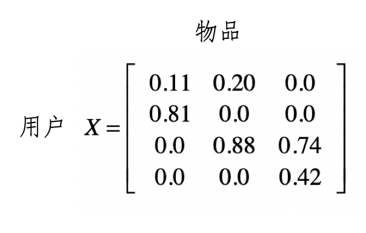

其中第 行是第 个用户的数据，而第 j 列是用户对第 j 个物品的喜好程度。我们用 表示这个数值。这里的喜好程度可以是用户购买商品的次数、对书籍的评分等等。

假设我们用一个 0 到 1 之间的小数表示。有了这种矩阵，我们就可以通过矩阵的操作，充分挖掘用户和物品之间的关系。下面，我会使用经典的协同过滤算法，来讲解矩阵在其中的运用。

在此之前，我们先来看什么是协同过滤。你可以把它理解为最直观的“口口相传”。假设我们愿意接受他人的建议，尤其是很多人都向你建议的时候。其主要思路就是利用已有用户群过去的行为或意见，预测当前用户最可能喜欢哪些东西。根据推荐依据和传播的路径，又可以进一步细分为基于用户的过滤和基于物品的过滤。

## 基于用户的过滤

首先，我们来看基于用户的协同过滤。它是指给定一个用户访问（我们假设有访问就表示有兴趣）物品的数据集合，找出和当前用户历史行为有相似偏好的其他用户，将这些用户组成“近邻”，对于当前用户没有访问过的物品，利用其近邻的访问记录来预测。我画了一张图方便你理解。

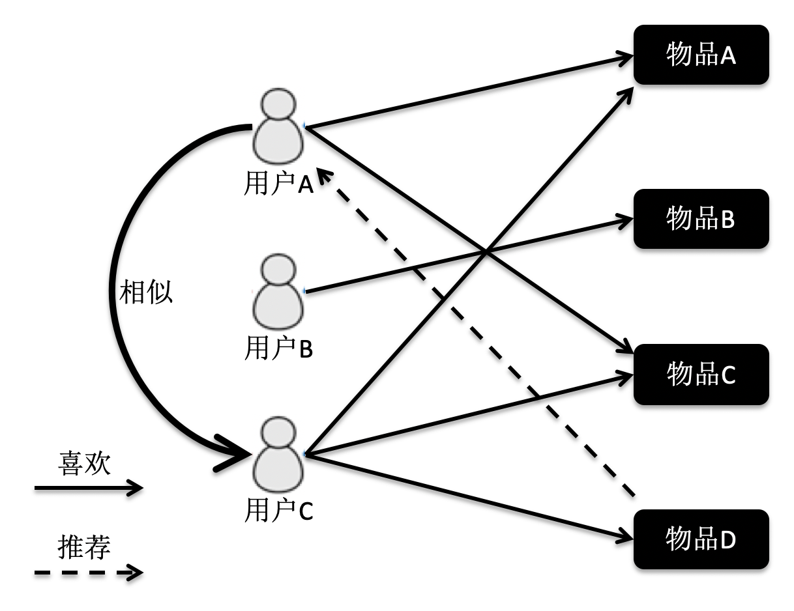

根据这张图的访问关系来看，用户 A 访问了物品 A 和 C，用户 B 访问了物品 B，用户 C 访问了物品 A，C 和 D。我们计算出来，用户 C 是 A 的近邻，而 B 不是。因此系统会更多地向用户 A 推荐用户 C 访问的物品 D。

理解了这个算法的基本概念，我们来看看如何使用公式来表述它。假设有 m 个用户，n 个物品，那么我们就能使用一个 m×n 维的矩阵 来表示用户对物品喜好的二元关系。基于这个二元关系，我们可以列出下面这两个公式：

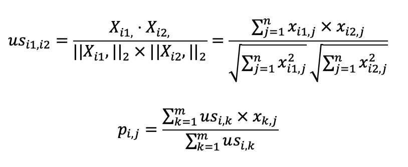

其中，第一个公式比较容易理解，它的核心思想是计算用户和用户之间的相似度。完成了这一步我们就能找到给定用户的“近邻”。

我们可以使用向量空间模型中的距离或者是夹角余弦来处理，在这里我使用了夹角余弦，其中 , 表示用户 和 的相似度，而 , 表示矩阵中第 行的行向量，, 表示矩阵中第 行的行向量。分子是两个表示用户的行向量之点乘，而分母是这两个行向量 范数的乘积。

第二个公式利用第一个公式所计算的用户间相似度，以及用户对物品的喜好度，预测任一个用户对任一个物品的喜好度。其中 表示第 用户对第 个物品的喜好度， 表示用户 和 之间的相似度， 表示用户 对物品 的喜好度。注意这里最终需要除以 ，是为了进行归一化。

从这个公式可以看出，如果 越大， 对最终 的影响越大，反之如果 越小， 对最终 的影响越小，充分体现了“基于相似用户”的推荐。

如果你无法理解如何把这两个公式对应为矩阵操作，没关系，我下面会通过之前介绍的喜好度矩阵 的示例，把这两个公式逐步拆解，并对应到矩阵上的操作，你一看就能明白了。

首先，我们来看第一个关于夹角余弦的公式。

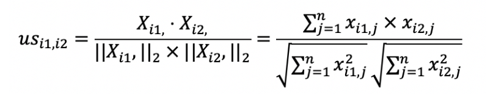

在介绍向量空间模型的时候，我提到夹角余弦可以通过向量的点乘来实现。这对矩阵同样适用，我们可以采用矩阵点乘自身的转置来实现，也就是 。矩阵 的每一行是某个用户的行向量，每个分量表示用户对某个物品的喜好程度。而矩阵 的每一列是某个用户的列向量，每个分量表示用户对某个物品的喜好程度。

我们假设 的结果为矩阵 ，那么 就表示用户 和用户 这两者喜好度向量的点乘结果，它就是夹角余弦公式中的分子。如果 等于 ，那么这个计算值也是夹角余弦公式分母的一部分。从矩阵的角度来看， 中任何一个元素都可能用于夹角余弦公式的分子，而对角线上的值会用于夹角余弦公式的分母。这里我们仍然使用之前的喜好度矩阵示例，来计算矩阵 和矩阵 。

首先我们来看 的计算。

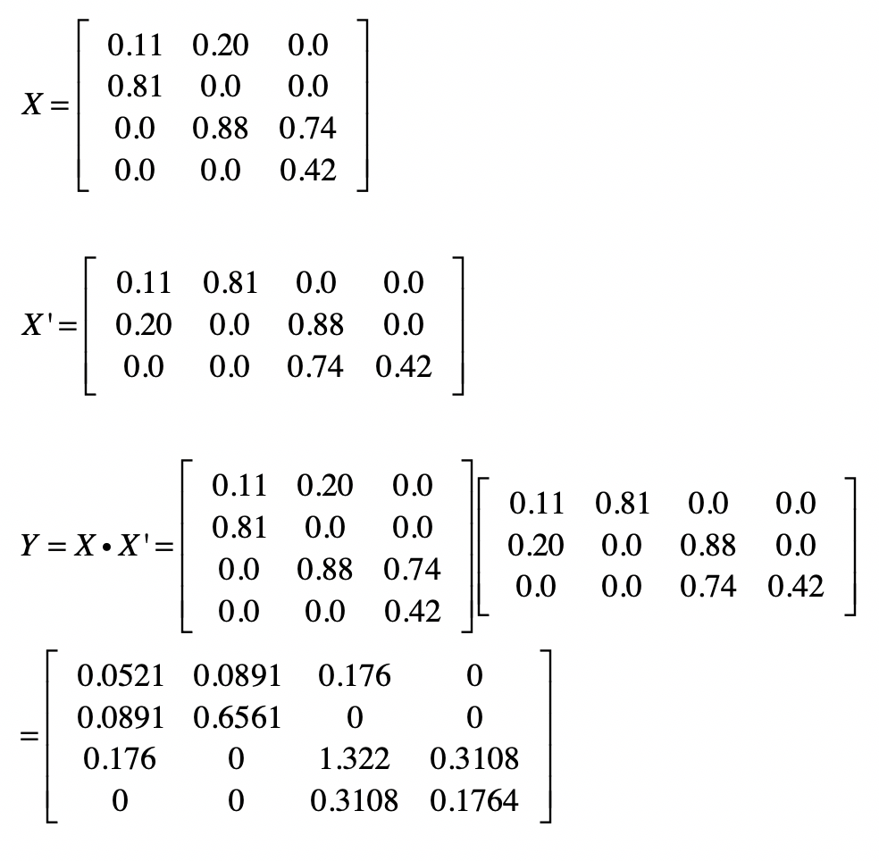

然后我们使用 来计算 。我用下面这张图表示矩阵中的元素和夹角余弦计算的对应关系。

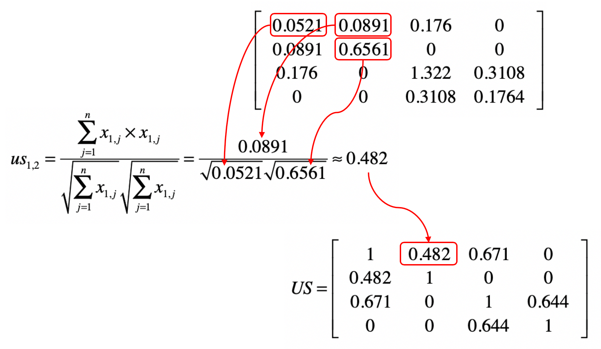

明白了上面这个对应关系，我们就可以利用矩阵 ，获得任意两个用户之间的相似度，并得到一个 m×m 维的相似度矩阵 。矩阵 中 的取值为第 个用户与第 个用户的相似度。这个矩阵是一个沿对角线对称的矩阵。根据夹角余弦的定义， 和 是相等的。通过示例的矩阵 ，我们可以计算矩阵 。我把相应的结果列在了下方。

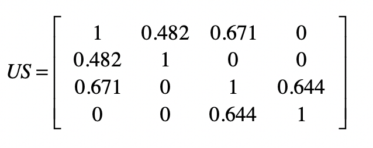

接下来，我们再来看第二个公式。

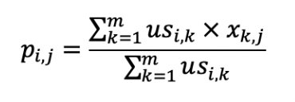

从矩阵的角度来看，现在我们已经得到用户相似度矩阵 ，再加上用户对物品的喜好度矩阵 ，现在需要计算任意用户对任意物品的喜好度推荐矩阵 。

为了实现上面这个公式的分子部分，我们可以使用 和 的点乘。我们假设点乘后的结果矩阵为 。这里我列出了根据示例计算得到的矩阵 。

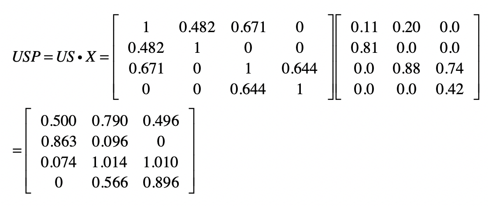

分母部分可以使用 矩阵的按行求和来实现。我们假设按行求和的矩阵为 。根据示例计算就可以得到 。

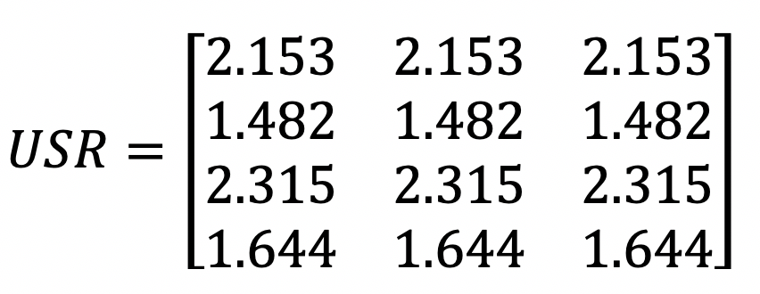

最终，我们使用 和 \* 的元素对应除法，就可以求得矩阵 。

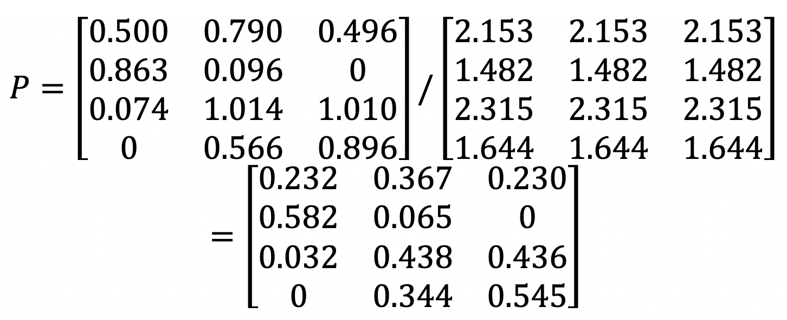

既然已经有 这个喜好度矩阵了，为什么还要计算 这个喜好度矩阵呢？实际上， 是已知的、有限的喜好度。例如用户已经看过的、购买过的、或评过分的物品。而 是我们使用推荐算法预测出来的喜好度。

即使一个用户对某个物品从未看过、买过、或评过分，我们依然可以通过矩阵 ，知道这位用户对这个物品大致的喜好程度，从而根据这个预估的分数进行物品的推荐，这也是协同过滤的基本思想。从根据示例计算的结果也可以看出这点，在原始矩阵 中第 1 个用户对第 3 个物品的喜好度为 0。可是在最终的喜好度推荐矩阵 P 中，第 1 个用户对第 3 个物品的喜好度为 0.278，已经明显大于 0 了，因此我们就可以把物品 3 推荐给用户 1。

上面这种基于用户的协同过滤有个问题，那就是没有考虑到用户的喜好程度是不是具有可比性。假设用户的喜好是根据对商品的评分来决定的，有些用户比较宽容，给所有的商品都打了很高的分，而有些用户比较严苛，给所有商品的打分都很低。分数没有可比性，这就会影响相似用户查找的效果，最终影响推荐结果。这个时候我们可以采用之前介绍的特征值变化，对于原始的喜好度矩阵，按照用户的维度对用户所有的喜好度进行归一化或者标准化处理，然后再进行基于用户的协同过滤。

## 基于物品的过滤

基于物品的协同过滤是指利用物品相似度，而不是用户间的相似度来计算预测值。我同样用图来帮助你理解。

在这张图中，物品 A 和 C 因为都被用户 A 和 B 同时访问，因此它们被认为相似度更高。当用户 C 访问过物品 A 后，系统会更多地向用户推荐物品 C，而不是其他物品。

基于物品的协同过滤同样有两个公式，你可以看一下。

如果你弄明白了基于用户的过滤，那么这两个公式也就不难理解了。第一个公式的核心思想是计算物品和物品之间的相似度，在这里我仍然使用夹角余弦。其中 , 表示物品 和 的相似度，而 表示了 中第 列的列向量，而 表示了 中第 列的列向量。分子是两个表示物品的列向量之点乘，而分母是这两个列向量 范数的乘积。

第二个公式利用第一个公式所计算的物品间相似度，和用户对物品的喜好度，预测任一个用户对任一个物品的喜好度。其中 表示第 用户对第 个物品的喜好度， 表示用户 对物品 的喜好度， 表示物品 和 之间的相似度，注意这里除以 是为了进行归一化。从这个公式可以看出，如果 越大， 对最终 的影响越大，反之如果 越小， 对最终 的影响越小，充分体现了“基于相似物品”的推荐。

类似地，用户喜好程度的不一致性，同样会影响相似物品查找的效果，并最终影响推荐结果。我们也需要对于原始的喜好度矩阵，按照用户的维度对用户的所有喜好度，进行归一化或者标准化处理。

## 总结

今天我首先简要地介绍了推荐系统的概念和主要思想。为了给用户提供可靠的结果，推荐系统需要充分挖掘历史数据中，用户和物品之间的关系。协同过滤的推荐算法就很好地体现了这一点。

一旦涉及用户和物品的这种二元关系，矩阵就有用武之地了。我通过矩阵来表示用户和物品的关系，并通过矩阵计算来获得协同过滤的结果。协同过滤分为基于用户的过滤和基于物品的过滤两种，它们的核心思想都是相同的，因此矩阵操作也是类似的。在这两个应用场景下，矩阵点乘体现了多个用户或者物品之间的相似程度，以及聚集后的相似程度所导致的最终推荐结果。

当然，基于用户和物品间关系的推荐算法有很多，对矩阵的操作也远远不止点乘、按行求和、元素对应乘除法。我后面会介绍如何使用矩阵的主成分分析或奇异值分解，来进行物品的推荐。

## 思考题

我在介绍推荐算法时，提到了基于物品的协同过滤。请参照基于用户的协同过滤，写出相应的矩阵操作步骤。

欢迎留言和我分享，也欢迎你在留言区写下今天的学习笔记。你可以点击“请朋友读”，把今天的内容分享给你的好友，和他一起精进。

推荐系统中的矩阵操作在协同过滤推荐算法中的应用是本文的核心内容。文章首先介绍了推荐系统的基本思想，即通过挖掘用户和物品之间的关系，向用户推荐可能感兴趣的信息和商品。然后详细阐述了如何使用矩阵计算来实现协同过滤推荐算法，包括基于用户的过滤和基于物品的过滤。基于用户的过滤通过计算用户之间的相似度，利用近邻用户的访问记录来预测当前用户对物品的喜好度。而基于物品的过滤则是通过计算物品之间的相似度，来进行推荐。文章还通过具体的公式和矩阵操作示例，帮助读者理解了如何将算法转化为矩阵操作。此外，文章还提到了在基于用户的协同过滤中，用户喜好程度的可比性问题，并介绍了采用特征值变化对用户喜好度进行归一化或标准化处理的方法。总的来说，本文深入浅出地介绍了协同过滤推荐算法的原理和实现方法，对于理解推荐系统的技术特点具有很高的参考价值。