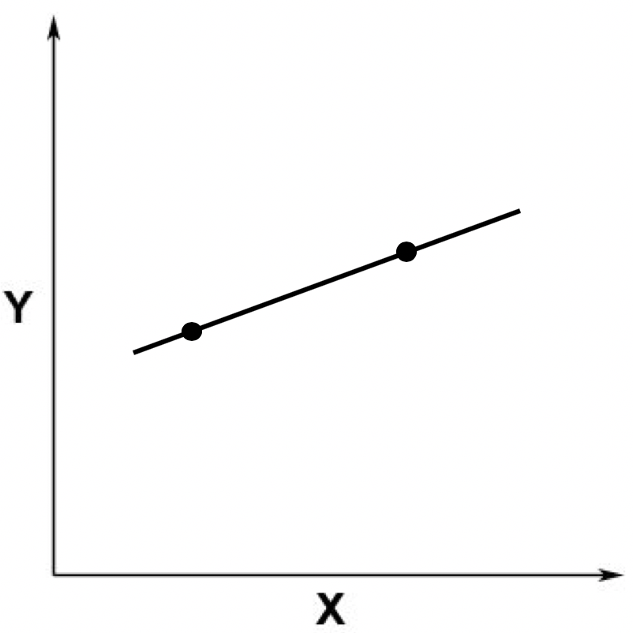
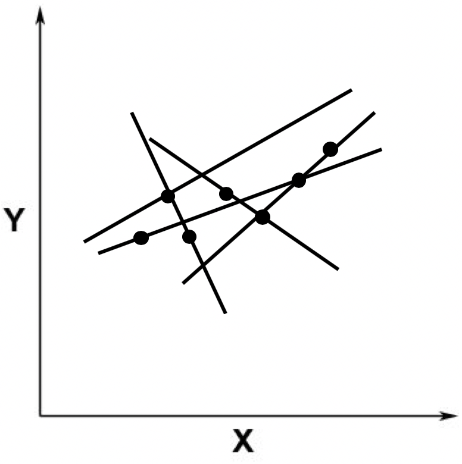
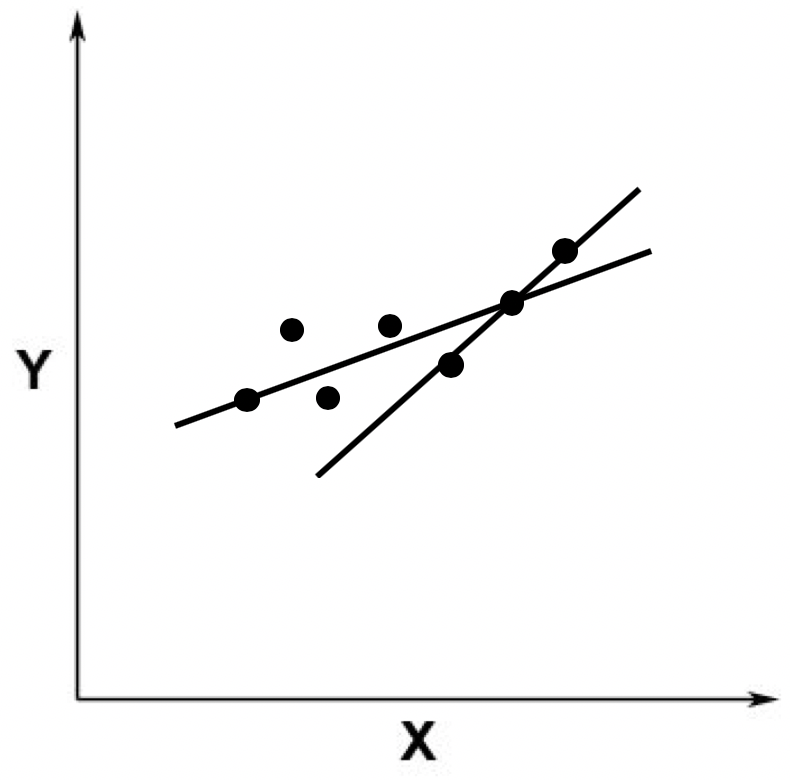
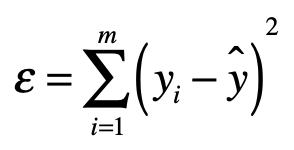
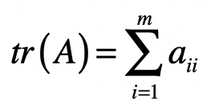
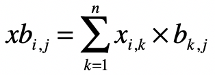
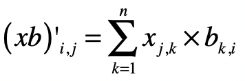
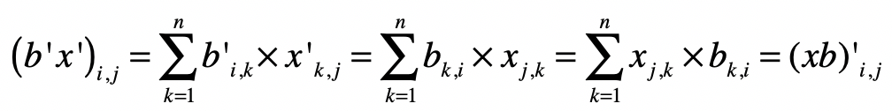

你好，我是黄申。

上一节，我提到了，求解线性回归和普通的线性方程组最大的不同在于误差ε。在求解线性方程组的时候，我们并不考虑误差的存在，因此存在无解的可能。而线性回归允许误差ε的存在，我们要做的就是尽量把ε最小化，并控制在一定范围之内。这样我们就可以求方程的近似解。而这种近似解对于海量的大数据分析来说是非常重要的。

但是现实中的数据一定存在由于各种各样原因所导致的误差，因此即使自变量和因变量之间存在线性关系，也基本上不可能完美符合这种线性关系。总的来说，线性回归分析并不一定需要 100% 精确，而误差ε的存在可以帮助我们降低对精度的要求。通常，多元线性回归会写作：

这里的 是自变量， 是因变量， 是截距，，，…， 是自变量的系数， 是随机误差。

在线性回归中，为了实现最小化 的目标，我们可以使用最小二乘法进行直线的拟合。最小二乘法通过最小化误差的平方和，来寻找和观测数据匹配的最佳函数。由于这些内容有些抽象，下面我会结合一些例子来解释最小二乘法的核心思想，以及如何使用这种方法进行求解。

## 使用观测值拟合

在详细阐述最小二乘法之前，我们先来回顾一下第 32 讲介绍的模型拟合。在监督式学习中，拟合模型其实是指通过模型的假设和训练样本，推导出具体参数的过程。有了这些参数，我们就能对新的数据进行预测。而在线性回归中，我们需要找到观测数据之间的线性关系。

假设我们有两个观测数据，对应于二维空间中的两个点，这两个点可以确定唯一的一条直线，两者呈现线性关系。你可以参考下面这张图。

之后，我们又加入了一个点。这个点不在原来的那条直线上。

这个时候，从线性方程的角度来看，就不存在精确解了。因为没有哪条直线能同时穿过这三个点。这张图片也体现了线性回归分析和求解线性方程组是不一样的，线性回归并不需要求精确解。

如果我们加入更多的观察点，就更是如此了。比如下面这张图。

从上图中你应该可以看出，这根直线不是完全精准地穿过这些点，而只是经过了其中两个，大部分点和这根直线有一定距离。这个时候，线性回归就有用武之地了。

由于我们假设ε的存在，因此在线性回归中，我们允许某条直线只穿过其中少量的点。不过，既然我们允许这种情况发生，那么就存在无穷多这样的直线。比如下面我随便画了几条，都是可以的。

当然，我们从直觉出发，一定不会选取那些远离这些点的直线，而是会选取尽可能靠近这些点的那些线。比如下面这张图里展示的这两条。

好了，既然这样，我们就需要定义哪根线是最优的，以及在给出了最优的定义之后，如何能求解出这条最优的直线呢？最小二乘法可以回答这两个问题，下面我们具体来看。

## 最小二乘法

最小二乘法的主要思想就是求解未知参数，使得理论值与观测值之差（即误差，或者说残差）的平方和达到最小。我们可以使用下面这个公式来描述。

其中， 表示来自数据样本的观测值，而 ^ 是假设的函数的理论值， 就是我们之前提到的误差，在机器学习中也常被称为损失函数，它是观测值和真实值之差的平方和。最小二乘法里的“二乘”就是指的平方操作。有了这个公式，我们的目标就很清楚了，就是要发现使ε最小化时候的参数。

那么最小二乘法是如何利用最小化 的这个条件来求解的呢？让我们从矩阵的角度出发来理解整个过程。

有了上面的定义之后，我们就可以写出最小二乘问题的矩阵形式。

其中 为系数矩阵， 为自变量矩阵， 为因变量矩阵。换句话说，我们要在向量空间中，找到一个 ，使向量 与 之间欧氏距离的平方数最小的 。

结合之前所讲的矩阵点乘知识，我们把上述式子改写为：

其中 表示矩阵 的转置。而 函数表示取对角线上所有元素的和，对于某个矩阵 来说， 的值计算如下：

进一步，根据矩阵的运算法则，我们有：

因此我们可以得到：

我们知道，求最极值问题直接对应的就是导数为 0，因此我对上述的矩阵形式进行求导，得到如下的式子：

如果要 最小，就要满足两个条件。

第一个条件是 为 0，也就是 。

第二个条件是 。

由于 ，所以，第二个条件是满足的。只要 。

我们就能获得 的最小值。从这个条件出发，我们就能求出矩阵 ：

其中 为单位矩阵。而 表示 的逆矩阵。所以，最终系数矩阵为：

## 补充证明和解释

为了保持推导的连贯性，在上述的推导过程中，我跳过了几个步骤的证明。下面我会给出详细的解释，供你更深入的学习和研究。

### 步骤 a：

### 证明：

对于 中的每个元素 ，有：

而对于 中的每个元素 ，有：

对于 中的每个元素有：

$b’{i,k}=b{k,i}$

中的每个元素有：

$x’{k,j}=x{j,k}$

那么，对于 中的每个元素 ，就有：

所以有 。

### 步骤 b：

### 证明：

和步骤 a 类似，对于 中的每个元素 有：

### 步骤 c：

### 证明：

同理，可以证明：

### 步骤 d：

### 证明：

### 步骤 e：

常量对于变量求导为 0，例如：

好了，弄明白了这些细节上的证明，你就能更好地理解最小二乘法中的推导步骤。不过，你可能还是会奇怪，为什么最终要对矩阵求导数来求ε的最小值。最后，我们就聊聊如何使用求导获取极小值。

极值是一个函数的极大值或极小值。如果一个函数在一点的某个邻域内每个地方都有确定的值，而该点所对应的值是最大（小）的，那么这函数在该点的值就是一个极大（小）值。而函数的极值可以通过它的一阶和二阶导数来确定。

对于一元可微函数 ，它在某点 有极值的充分必要条件是 在 的邻域上一阶可导，在 处二阶可导，且一阶导数 ，二阶导数 。其中 和 分别表示一阶导数和二阶导数。

在一阶导数 的情况下，如果 ，则 在 取得极大值；如果 ，则 在 取得极小值。这就是为什么在求矩阵 的时候，我们要求 为 ，并且 的导数要大于 ，这样我们才能确保求得极小值。

## 总结

今天我们探讨了为什么简单的线性方程组无法满足线性函数拟合的需求，最主要的原因就是现实的观测数据往往不是精确的线性关系，存在一定的误差。我们所要做的就是，在允许一定范围的误差前提下，找到一种线性关系，尽量的满足观察数据，使得我们所定义的误差最小。

最小二乘法通过向量空间的欧氏距离之平方，定义了预测值和真实值之间的误差。在给定自变量和因变量的观测值之后，最小二乘法可以帮助我们推导出所有自变量的系数，并最小化误差。我使用矩阵的形式，为你推导了整个过程。

不过，到目前为止，我们都只是从理论上理解最小二乘法，可能你还没有太深的感触。下一节，我会通过一个具体的例子来逐步进行演算，并使用 Python 代码对最终的结果进行验证。

## 思考题

还记得在 29 讲的线性回归案例吗？我们使用了 Boston Housing 的数据，拟合出了十多个自变量的系数。请使用这些系数，计算 train.csv 中所有样本因变量预测值和真实值之间的误差。你可以使用 Python 代码来实现一下。

欢迎留言和我分享，也欢迎你在留言区写下今天的学习笔记。你可以点击“请朋友读”，把今天的内容分享给你的好友，和他一起精进。

最小二乘法是线性回归中的重要方法，通过最小化误差的平方和来寻找与观测数据最匹配的函数。该方法通过矩阵运算求解未知参数，使得理论值与观测值之差的平方和最小化。在实际数据分析中具有重要意义，能够帮助降低对精度的要求，对大数据分析尤为重要。文章还介绍了极值的概念和如何使用求导获取极小值，以及最小二乘法的理论推导过程。下一步将通过具体例子和Python代码验证最终结果。文章还提出了思考题，要求读者使用Boston Housing数据计算样本因变量预测值和真实值之间的误差。整体而言，本文深入探讨了最小二乘法的原理和应用，为读者提供了理论和实践结合的学习体验。