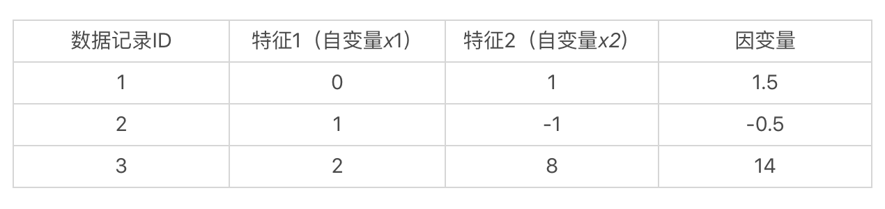
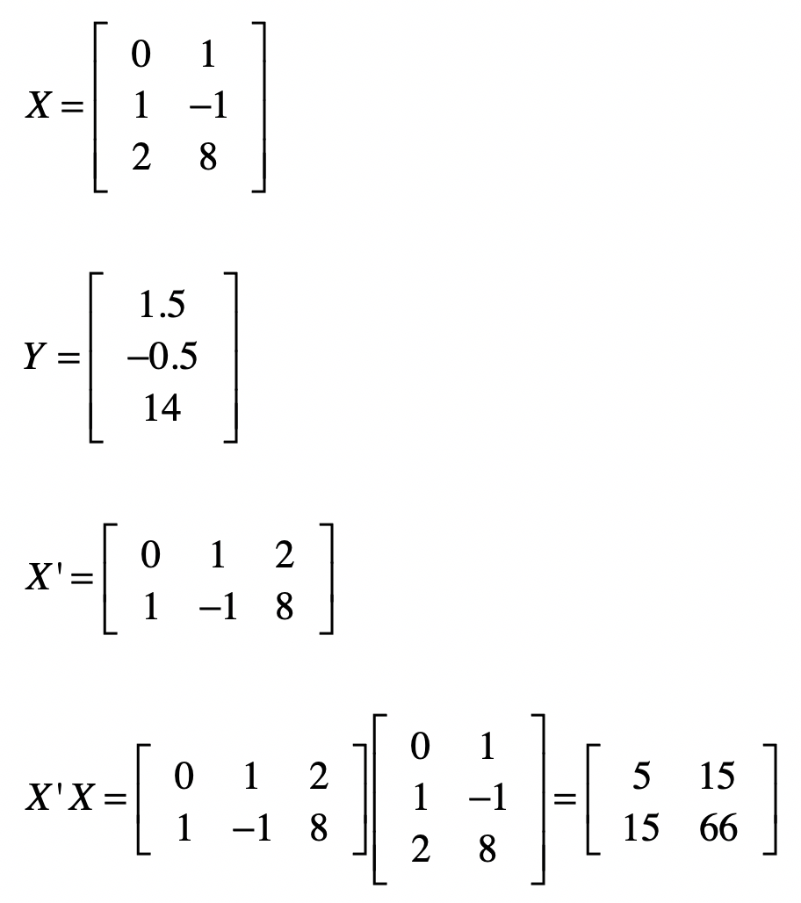
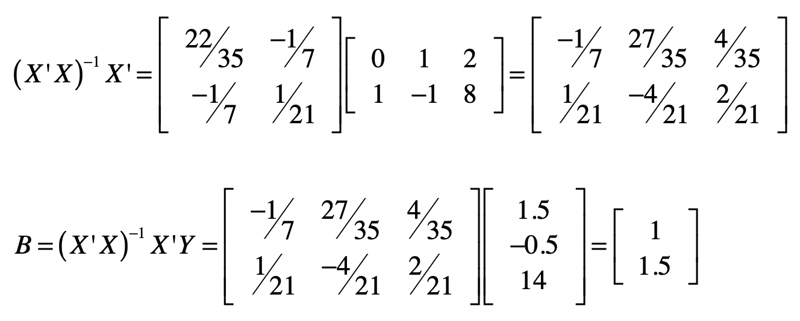
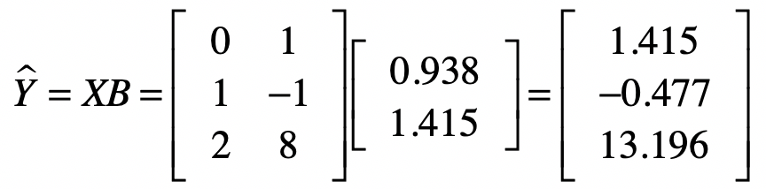
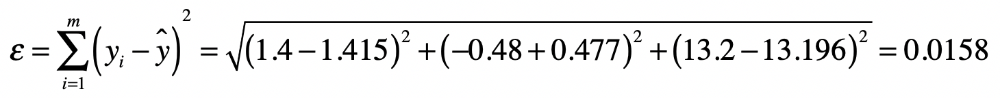
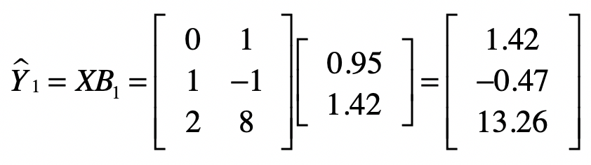
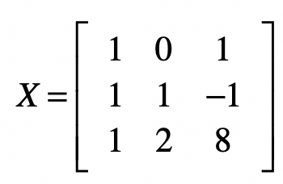

你好，我是黄申。

上一节我们已经解释了最小二乘法的核心思想和具体推导过程。今天我们就用实际的数据操练一下，这样你的印象就会更加深刻。我会使用几个具体的例子，演示一下如何使用最小二乘法的结论，通过观测到的自变量和因变量值，来推算系数，并使用这个系数来进行新的预测。

## 基于最小二乘法的求解

假想我们手头上有一个数据集，里面有 3 条数据记录。每条数据记录有 2 维特征，也就是 2 个自变量，和 1 个因变量。

如果我们假设这些自变量和因变量都是线性的关系，那么我们就可以使用如下这种线性方程，来表示数据集中的样本：

也就是说，我们通过观察数据已知了自变量 、 和因变量 的值，而要求解的是 和 这两个系数。如果我们能求出 和 ，那么在处理新数据的时候，就能根据新的自变量 和 的取值，来预测 的值。

可是我们说过，由实际项目中的数据集所构成的这类方程组，在绝大多数情况下，都没有精确解。所以这个时候我们没法使用之前介绍的高斯消元法，而是要考虑最小二乘法。根据上一节的结论，我们知道对于系数矩阵 ，有：

既然有了这个公式，要求 就不难了，让我们从最基本的几个矩阵开始。

矩阵 的求解稍微繁琐一点。逆矩阵的求法我还没讲解过，之前我们说过线性方程组之中，高斯消元和回代的过程，就是把系数矩阵变为单位矩阵的过程。我们可以利用这点，来求解 。我们把原始的系数矩阵 列在左边，然后把单位矩阵列在右边，像 这种形式，其中 表示单位矩阵。

然后我们对左侧的矩阵进行高斯消元和回代，把左边矩阵 X 变为单位矩阵。同时，我们也把这个相应的矩阵操作运用在右侧。这样当左侧变为单位矩阵之后，那么右侧的矩阵就是原始矩阵 的逆矩阵 ，具体证明如下：

好了，给定下面的 矩阵之后，我们使用上述方法来求 。我把具体的推导过程列在了这里。

求出 之后，我们就可以使用 来计算矩阵 B。

最终，我们求出系数矩阵为 ，也就是说 , 。实际上，这两个数值是精确解。我们用高斯消元也是能获得同样结果的。接下来，让我稍微修改一下 值，让这个方程组没有精确解。

你可以尝试高斯消元法对这个方程组求解，你会发现只要两个方程就能求出解，但是无论是哪两个方程求出的解，都无法满足第三个方程。

那么通过最小二乘法，我们能不能求导一个近似解，保证 \_ε\_ 足够小呢？下面，让我们遵循之前求解 的过程，来计算 。

计算完毕之后，你会发现两个系数的值分别变为 。由于这不是精确解，所以让我们看看有了这系数矩阵 之后，原有的观测数据中，真实值和预测值的差别。

首先我们通过系数矩阵 和自变量矩阵 计算出来预测值。

然后是样本数据中的观测值。这里我们假设这些值是真实值。

根据误差 的定义，我们可以得到：

说到这里，你可能会怀疑，通过最小二乘法所求得的系数 和 ，是不是能让 最小呢？这里，我们随机的修改一下这两个系数，变为 和 ，然后我们再次计算预测的 值和 。

很明显，0.064 是大于之前的 0.0158。

这两次计算预测值 \_y\_ 的过程，其实也是我们使用线性回归，对新的数据进行预测的过程。简短地总结一下，线性回归模型根据大量的训练样本，推算出系数矩阵 ，然后根据新数据的自变量 向量或者矩阵，计算出因变量的值，作为新数据的预测。

## Python 代码实现

这一部分，我们使用 Python 的代码，来验证一下之前的推算结果是不是正确，并看看最小二乘法和 Python sklearn 库中的线性回归，这两种结果的对比。

首先，我们使用 Python numpy 库中的矩阵操作来实现最小二乘法。主要的函数操作涉及矩阵的转置、点乘和求逆。具体的代码和注释我列在了下方。

from numpy import \*

x = mat(\[\[0,1\],\[1,-1\],\[2,8\]\])

y = mat(\[\[1.4\],\[-0.48\],\[13.2\]\])

print("X矩阵的转置X'：\\n", x.transpose())

print("\\nX'点乘X：\\n", x.transpose().dot(x))

print("\\nX'X矩阵的逆\\n", (x.transpose().dot(x)).I)

print("\\nX'X矩阵的逆点乘X'\\n", (x.transpose().dot(x)).I.dot(x.transpose()))

print("\\n系数矩阵B：\\n", (x.transpose().dot(x)).I.dot(x.transpose()).dot(y))

通过上述代码，你可以看到每一步的结果，以及最终的矩阵 。你可以把输出结果和之前手动推算的结果进行对比，看看是不是一致。

除此之外，我们还可把最小二乘法的线性拟合结果和 sklearn 库中的 LinearRegression().fit() 函数的结果相比较，具体的代码和注释我也放在了这里。

import pandas as pd

from sklearn.linear\_model import LinearRegression

df = pd.read\_csv("/Users/shenhuang/Data/test.csv")

df\_features = df.drop(\['y'\], axis=1)

df\_targets = df\['y'\]

print(df\_features, df\_targets)

regression = LinearRegression().fit(df\_features, df\_targets)

print(regression.score(df\_features, df\_targets))

print(regression.intercept\_)

print(regression.coef\_)

其中，test.csv 文件的内容我也列在了这里。

这样写是为了方便我们使用 pandas 读取 csv 文件并加载为 dataframe。

在最终的结果中，1.0 表示拟合程度非常好，而 -0.014545454545452863 表示一个截距，\[0.94909091 1.41454545\]表示系数 和 的值。这个结果和我们最小二乘法的结果有所差别，主要原因是 LinearRegression().fit() 默认考虑了有线性函数存在截距的情况。那么我们使用最小二乘法是不是也可以考虑有截距的情况呢？答案是肯定的，不过我们首先要略微修改一下方程组和矩阵 。如果我们假设有截距存在，那么线性回归方程就要改写为：

其中， 表示截距，而我们这里的方程组用例就要改写为：

而矩阵 要改写为：

然后我们再执行下面这段代码。

from numpy import \*

x = mat(\[\[1,0,1\],\[1,1,-1\],\[1,2,8\]\])

y = mat(\[\[1.4\],\[-0.48\],\[13.2\]\])

print("\\n系数矩阵B：\\n", (x.transpose().dot(x)).I.dot(x.transpose()).dot(y))

你就会得到：

系数矩阵B：

\[\[-0.01454545\]

\[ 0.94909091\]

\[ 1.41454545\]\]

这个结果和 LinearRegression().fit() 的结果就一致了。

需要注意的是，使用线性回归的时候，我们都有一个前提假设，那就是数据的自变量和因变量之间呈现线性关系。如果不是线性关系，那么使用线性模型来拟合的效果一定不好。比如，之前在解释欠拟合的时候，我用过下面这个例子。

上面这张图的数据分布并没有表达线性关系，所以我们需要对原始的数据进行非线性的变换，或者是使用非线性的模型来拟合。

那么，我们如何判断一个数据集是不是能用线性模型表示呢？在线性回归中，我们可以使用决定系数 R2。这个统计指标使用了回归平方和与总平方和之比，是反映模型拟合度的重要指标。它的取值在 0 到 1 之间，越接近于 1 表示拟合的程度越好、数据分布越接近线性关系。随着自变量个数的增加，R2 将不断增大，因此我们还需要考虑方程所包含的自变量个数对 R2 的影响，这个时候可使用校正的决定系数 Rc2。所以，在使用各种科学计算库进行线性回归时，你需要关注 R2 或者 Rc2，来看看是不是一个好的线性拟合。在之前的代码实践中，我们提到的 regression.score 函数，其实就是返回了线性回归的 R2。

## 总结

今天我们使用了具体的案例来推导最小二乘法的计算过程，并用 Python 代码进行了验证。通过最近 3 节的讲解，相信你对线性方程组求精确解、求近似解、以及如何在线性回归中运用这些方法，有了更加深入的理解。

实际上，从广义上来说，最小二乘法不仅可以用于线性回归，还可以用于非线性的回归。其主要思想还是要确保误差ε最小，但是由于现在的函数是非线性的，所以不能使用求多元方程求解的办法来得到参数估计值，而需要采用迭代的优化算法来求解，比如梯度下降法、随机梯度下降法和牛顿法。

## 思考题

我这里给出一个新的方程组，请通过最小二乘法推算出系数的近似解，并使用你熟悉的语言进行验证。

欢迎留言和我分享，也欢迎你在留言区写下今天的学习笔记。你可以点击“请朋友读”，把今天的内容分享给你的好友，和他一起精进。

本文介绍了线性回归模型的基本原理和最小二乘法的实现过程。通过详细的数学推导和Python代码示例，读者可以快速了解如何使用最小二乘法来计算线性回归模型的系数矩阵，并与sklearn库中的线性回归结果进行对比。文章还提到了线性回归模型的前提假设，以及如何使用决定系数R2来判断数据集是否适合使用线性模型。此外，文章还涉及到最小二乘法在非线性回归中的应用，以及提出了一个思考题供读者练习。通过本文的阅读，读者可以深入理解最小二乘法在线性回归中的应用，以及其在非线性回归中的潜在价值。