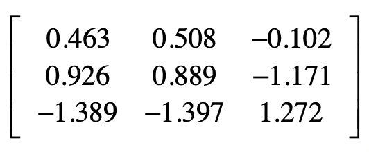

你好，我是黄申，今天我们继续来聊 PCA 主成分分析的下半部分。

上一节，我们讲解了一种特征降维的方法：PCA 主成分分析。这个方法主要是利用不同维度特征之间的协方差，构造一个协方差矩阵，然后获取这个矩阵的特征值和特征向量。根据特征值的大小，我们可以选取那些更为重要的特征向量，或者说主成分。最终，根据这些主成分，我们就可以对原始的数据矩阵进行降维。

PCA 方法的操作步骤有些繁琐，并且背后的理论支持也不是很直观，因此对于初学者来说并不好理解。考虑到这些，我今天会使用一个具体的矩阵示例，详细讲解每一步操作的过程和结果，并辅以基于 Python 的核心代码进行分析验证。除此之外，我还会从多个角度出发，分析 PCA 方法背后的理论，帮助你进一步的理解和记忆。

## 0.1 基于 Python 的案例分析

这么说可能有一些抽象，让我使用一个具体的案例来帮你理解。假设我们有一个样本集合，包含了 3 个样本，每个样本有 3 维特征 ， 和 。


在标准化的时候，需要注意的是，我们的分母都使用 m 而不是 m-1，这是为了和之后 Python 中 sklearn 库的默认实现保持一致。

首先需要获取标准化之后的数据。

第一维特征的数据是 1，2，-3。平均值是 0，方差是

标准化之后第一维特征的数据是 1/2.16=0.463，2/2.16=0.926，-3/2.16=-1.389。以此类推，我们可以获得第二个维度和第三个维度标准化之后的数据。

当然，全部手动计算工作量不小，这时可以让计算机做它擅长的事情：重复性计算。下面的 Python 代码展示了如何对样本矩阵的数据进行标准化。

```
from numpy import \*

from numpy import linalg as LA

from sklearn.preprocessing import scale

x = mat(\[\[1,3,-7\],\[2,5,-14\],\[-3,-7,2\]\])

x\_s = scale(x, with\_mean=True, with\_std=True, axis=0)

print("标准化后的矩阵：", x\_s)
```

其中，scale 函数使用了 axis=0，表示对列进行标准化，因为目前的矩阵排列中，每一列代表一个特征维度，这点需要注意。如果矩阵排列中每一行代表一个特征维度，那么可以使用 axis=1 对行进行标准化。

最终标准化之后的矩阵是这样的：



接下来是协方差的计算。对于第 1 维向量的方差，有

第 1 维和第 2 维向量之间的协方差是

以此类推，我们就可以获得完整的协方差矩阵。同样的，为了减少推算的工作量，我们可以使用 Python 代码获得协方差矩阵。

```
x\_cov = cov(x\_s.transpose())

print("协方差矩阵：\\n", x\_cov, "\\n")
```

和 sklearn 中的标准化函数 scale 有所不同，numpy 中的协方差函数 cov 除以的是 (m-1)，而不是 m。最终完整的协方差矩阵是：


然后，我们要求解协方差矩阵的特征值和特征向量。


最后化简为：

所以 有 3 个近似解，分别是 0、0.0777 和 4.4223。

特征向量的求解过程如果手动推算比较繁琐，我们还是利用 Python 语言直接求出特征值和对应的特征向量。

```
eigVals,eigVects = LA.eig(x\_cov)

print("协方差矩阵的特征值：", eigVals)

print("协方差的特征向量（主成分）：\\n", eigVects, "\\n")
```

我们可以得到三个特征值及它们对应的特征向量。


需要注意，Python 代码输出的特征向量是列向量，而我表格中列出的是行向量。

我使用下面的这段代码，找出特征值最大的特征向量，也就是最重要的主成分，然后利用这个主成分，对原始的样本矩阵进行变换。

```
max\_eigVal = -1

max\_eigVal\_index = -1

for i in range(0, eigVals.size):

if (eigVals\[i\] > max\_eigVal):

max\_eigVal = eigVals\[i\]

max\_eigVal\_index = i

eigVect\_with\_max\_eigVal = eigVects\[:,max\_eigVal\_index\]

print("最大的特征值：", max\_eigVal)

print("最大特征值所对应的特征向量：", eigVect\_with\_max\_eigVal)

print("变换后的数据矩阵：", x\_s.dot(eigVect\_with\_max\_eigVal), "\\n")
```

很明显，最大的特征值是 4.422311507725755，对应的特征向量是\[-0.58077228 -0.57896098 0.57228292\]。变换后的样本矩阵是：


它从原来的 3 个特征维度降为 1 个特征维度了。

Python 的 sklearn 库也实现了 PCA，我们可以通过下面的代码来尝试一下。

```
from sklearn.decomposition import PCA

pca = PCA(n\_components=2)

pca.fit(x\_s)

print("方差（特征值）: ", pca.explained\_variance\_)

print("主成分（特征向量）", pca.components\_)

print("变换后的样本矩阵：", pca.transform(x\_s))

print("信息量: ", pca.explained\_variance\_ratio\_)
```

这段代码中，我把输出的主成分设置为 2，也就是说挑出前 2 个最重要的主成分。相应的，变化后的样本矩阵有 2 个特征维度。


除了输出主成分和变换后的矩阵，sklearn 的 PCA 分析还提供了信息量的数据。

信息量: \[0.98273589 0.01726411\]

它是各个主成分的方差所占的比例，表示第一个主成分包含了原始样本矩阵中的 98.27% 的信息，而第二个主成分包含了原始样本矩阵中的 1.73% 的信息，可想而知，最后一个主成分提供的信息量基本为 0 了，我们可以忽略不计了。如果我们觉得 95% 以上的信息量就足够了，那么就可以只保留第一个主成分，把原始的样本矩阵的特征维度降到 1 维。

当然，学习的更高境界，不是仅仅“知其然”，还要做到“知其所以然”。即使现在你对 PCA 的操作步骤了如指掌，可能还是有不少疑惑，比如，为什么我们要使用协方差矩阵？这个矩阵的特征值和特征向量又表示什么？为什么选择特征值最大的主成分，就能涵盖最多的信息量呢？不用着急，接下来，我会给你做出更透彻的解释，让你不仅明白如何进行 PCA 分析，同时还明白为什么要这么做。

## 0.2 PCA 背后的核心思想

### 0.2.1 为什么要使用协方差矩阵？

首先要回答的第一个问题是，为什么我们要使用样本数据中，各个维度之间的协方差，来构建一个新的协方差矩阵？要弄清楚这一点，首先要回到 PCA 最终的目标：降维。降维就是要去除那些表达信息量少，或者冗余的维度。

我们首先来看如何定义维度的信息量大小。这里我们认为样本在某个特征上的差异就越大，那么这个特征包含的信息量就越大，就越重要。相反，信息量就越小，需要被过滤掉。很自然，我们就能想到使用某维特征的方差来定义样本在这个特征维度上的差异。

另一方面，我们要看如何发现冗余的信息。如果两种特征是有很高的相关性，那我们可以从一个维度的值推算出另一个维度的值，所表达的信息就是重复的。在概率和统计模块，我介绍过多个变量间的相关性，而在实际运用中，我们可以使用皮尔森（Pearson）相关系数，来描述两个变量之间的线性相关程度。这个系数的取值范围是 ，绝对值越大，说明相关性越高，正数表示正相关，负数表示负相关。

我使用下面这张图，来表示正相关和负相关的含义。左侧 曲线和 曲线有非常近似的变化趋势，当 上升 往往也是上升的， 下降 往往也下降，这表示两者有较强的正相关性。右侧 和 两者相反，当 上升的时候， 往往是下降的， 下降的时候， 往往是上升，这表示两者有较强的负相关性。


皮尔森系数计算公式如下：


其中 表示向量维度， 和 分别为两个特征维度 和 在第 个采样上的数值。 和 分别表示两个特征维度上所有样本的均值， 和 分别表示两个特征维度上所有样本的标准差。

我把皮尔森系数的公式稍加变化，你来观察一下皮尔森系数和协方差之间的关系。


你看，变换后的分子不就是协方差吗？而分母类似于标准化数据中的分母。所以在本质上，皮尔森相关系数和数据标准化后的协方差是一致的。

考虑到协方差既可以衡量信息量的大小，也可以衡量不同维度之间的相关性，因此我们就使用各个维度之间的协方差所构成的矩阵，作为 PCA 分析的对象。就如前面所讲述的，这个协方差矩阵主对角线上的元素是各维度上的方差，也就体现了信息量，而其他元素是两两维度间的协方差，也就体现了相关性。

既然协方差矩阵提供了我们所需要的方差和相关性，那么下一步，我们就要考虑对这个矩阵进行怎样的操作了。

### 0.2.2 为什么要计算协方差矩阵的特征值和特征向量？

关于这点，我们可以从两个角度来理解。

第一个角度是对角矩阵。所谓对角矩阵，就是说只有矩阵主对角线之上的元素有非 0 值，而其他元素的值都为 0。我们刚刚解释了协方差矩阵的主对角线上，都是表示信息量的方差，而其他元素都是表示相关性的协方差。既然我们希望尽可能保留大信息量的维度，而去除相关的维度，那么就意味着我们希望对协方差进行对角化，尽可能地使得矩阵只有主对角线上有非 0 元素。

假如我们确实可以把矩阵尽可能地对角化，那么对角化之后的矩阵，它的主对角线上元素就是、或者接近矩阵的特征值，而特征值本身又表示了转换后的方差，也就是信息量。而此时，对应的各个特征向量之间是基本正交的，也就是相关性极低甚至没有相关性。

第二个角度是特征值和特征向量的几何意义。在向量空间中，对某个向量左乘一个矩阵，实际上是对这个向量进行了一次变换。在这个变换的过程中，被左乘的向量主要发生旋转和伸缩这两种变化。如果左乘矩阵对某一个向量或某些向量只发生伸缩变换，不对这些向量产生旋转的效果，那么这些向量就称为这个矩阵的特征向量，而伸缩的比例就是特征值。换句话来说，某个矩阵的特征向量表示了这个矩阵在空间中的变换方向，这些方向都是趋于正交的，而特征值表示每个方向上伸缩的比例。

如果一个特征值很大，那么说明在对应的特征向量所表示的方向上，伸缩幅度很大。这也是为什么，我们需要使用原始的数据去左乘这个特征向量，来获取降维后的新数据。因为这样做可以帮助我们找到一个方向，让它最大程度地包含原有的信息。需要注意的是，这个新的方向，往往不代表原始的特征，而是多个原始特征的组合和缩放。

## 0.3 小结

这两节，我详细讲解了 PCA 主成分分析法，它是一种针对数值型特征、较为通用的降维方法。和特征选择不同，它并不需要监督式学习中的样本标签，而是从不同维度特征之间的关系出发，进行了一系列的操作和分析。主要步骤包括，标准化原始的数据矩阵、构建协方差矩阵、计算这种协方差矩阵的特征值和特征向量、挑选较大特征值所对应的特征向量、进行原始特征数据的转换。如果排名靠前的特征向量，或者说主成分，已经包括了足够的信息量，那么我们就可以通过选择较少的主成分，对原始的样本矩阵进行转换，从而达到降维的目的。

PCA 方法一开始不是很好理解，其主要的原因之一是它背后的核心思想并不是很直观。为此，我详细解释了为什么 PCA 会从标准化和协方差入手来构建协方差矩阵。对于同类的特征来说，标准化之后的协方差就是方差，表示了这一维特征所包含的信息量。而对于不同类的特征来说，标准化之后的协方差体现了这两维特征的相关性。鉴于这两个特性，我们需要求解协方差矩阵的特征值和特征向量。如果你弄清楚了这几个关键点，那么 PCA 方法也就不难理解了。

## 0.4 思考题

到目前为止，我们讲解了两种特征降维的方法。第一，在监督式学习中，基于分类标签的特征选择；第二，基于特征协方差矩阵的 PCA 主成分分析。请尝试从你自己的理解，来说说这两种降维方法各自的优缺点。

欢迎留言和我分享，也欢迎你在留言区写下今天的学习笔记。你可以点击“请朋友读”，把今天的内容分享给你的好友，和他一起精进。


PCA主成分分析是一种常用的降维方法，本文详细介绍了PCA的操作步骤和核心思想。首先，文章通过Python代码实例分析了PCA的操作过程，包括数据标准化、协方差矩阵的计算、特征值和特征向量的求解以及样本矩阵的变换。其次，文章解释了为什么要使用协方差矩阵，以及特征值和特征向量的含义，为什么选择特征值最大的主成分能涵盖最多的信息量。通过这些解释，读者可以更深入地理解PCA方法的原理和应用。整体而言，本文通过具体案例和理论解释相结合的方式，帮助读者快速了解PCA主成分分析的操作步骤和背后的核心思想，为初学者提供了一份有益的学习参考。文章内容深入浅出，适合初学者快速理解PCA的操作步骤和核心思想。