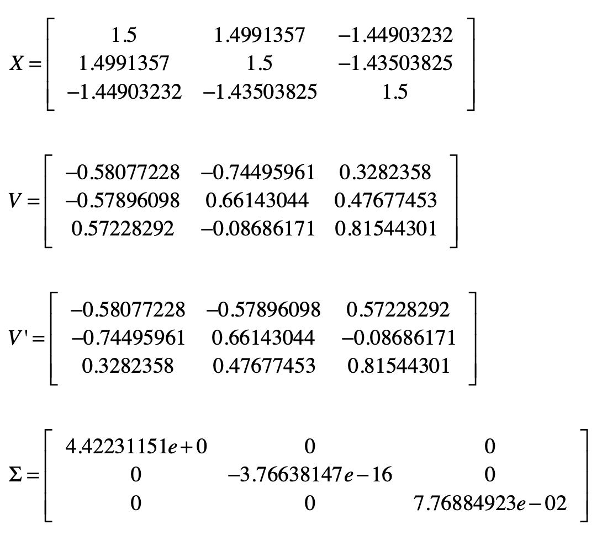
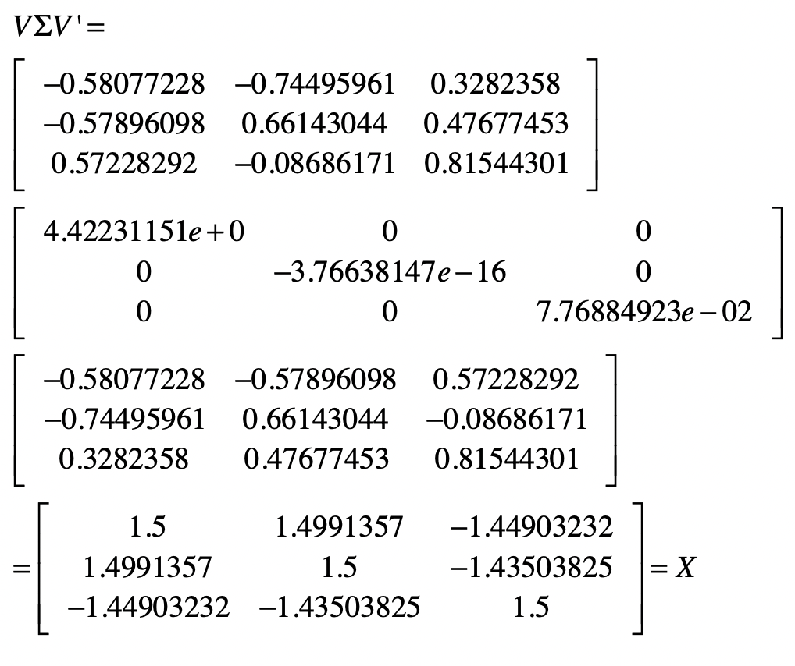
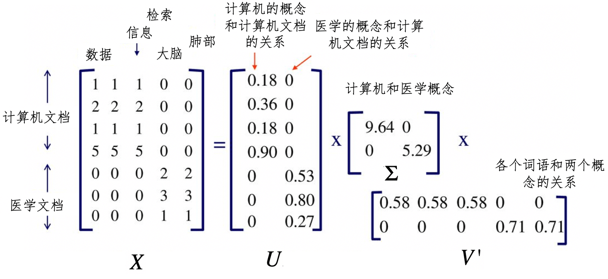

你好，我是黄申。

今天，我们来聊另一种降维的方法，SVD 奇异值分解（Singular Value Decomposition）。它的核心思路和 PCA 不同。PCA 是通过分析不同维度特征之间的协方差，找到包含最多信息量的特征向量，从而实现降维。而 SVD 这种方法试图通过样本矩阵本身的分解，找到一些“潜在的因素”，然后通过把原始的特征维度映射到较少的潜在因素之上，达到降维的目的。

这个方法的思想和步骤有些复杂，它的核心是矩阵分解，首先，让我们从方阵的矩阵分解开始。

## 方阵的特征分解

在解释方阵的分解时，我们会用到两个你可能不太熟悉的概念：方阵和酉矩阵。为了让你更顺畅的理解整个分解的过程，我先给你解释下这两个概念。

方阵（Square Matrix）是一种特殊的矩阵，它的行数和列数相等。如果一个矩阵的行数和列数都是 n，那么我们把它称作 n 阶方阵。

如果一个矩阵和其转置矩阵相乘得到的是单位矩阵，那么它就是一个酉矩阵（Unitary Matrix）。

其中 X’表示 X 的转置，I 表示单位矩阵。换句话说，矩阵 X 为酉矩阵的充分必要条件是 X 的转置矩阵和 X 的逆矩阵相等。

理解这两个概念之后，让我们来观察矩阵的特征值和特征向量。前两节我们介绍了，对于一个 n×n 维的矩阵 ， 维向量 ，标量 ，如果有 。

那么我们就说 是 的特征值， 是 的特征向量，并对应于特征值 。

之前我们说过特征向量表示了矩阵变化的方向，而特征值表示了变化的幅度。实际上，通过特征值和特征矩阵，我们还可以把矩阵 X 进行特征分解（Eigendecomposition）。这里矩阵的特征分解，是指把矩阵分解为由其特征值和特征向量表示的矩阵之积的方法。如果我们求出了矩阵 的 个特征值 ，以及这 个特征值所对应的特征向量 ，那么就有 。

其中， 是这 个特征向量所张成的 n×n 维矩阵，而Σ为这 n 个特征值为主对角线的 n×n 维矩阵。进一步推导，我们可以得到：

如果我们会把 的这 个特征向量进行标准化处理，那么对于每个特征向量 ，就有 ，而这表示 ，此时 V 的 n 个特征向量为标准正交基，满足 ， 也就是说 V 为酉矩阵，有 。这样一来，我们就可以把特征分解表达式写作 。

我们以介绍 PCA 分析时所用的矩阵为例，验证矩阵的特征分解。当时，我们有一个：

下面我们需要证明 成立，我把推算的过程写在下面了。

讲到这里，相信你对矩阵的特征分解有了一定程度的认识。可是，矩阵 必须为对称方阵才能进行有实数解的特征分解。那么如果 不是方阵，那么应该如何进行矩阵的分解呢？这个时候就需要用到奇异值分解 SVD 了。

## 矩阵的奇异值分解

SVD 分解和特征分解相比，在形式上是类似的。假设矩阵 是一个 m×n 维的矩阵，那么 的 SVD 为 。

不同的地方在于，SVD 并不要求要分解的矩阵为方阵，所以这里的 和 并不是互为逆矩阵。其中 是一个 m×m 维的矩阵， 是一个 n×n 维的矩阵。而 是一个 m×n 维的矩阵，对于 来说，只有主对角线之上的元素可以为非 ，其他元素都是 ，而主对角线上的每个元素就称为奇异值。 和 都是酉矩阵，即满足 。

现在问题来了，我们应该如何求出，用于 SVD 分解的 这三个矩阵呢？之所以不能使用有实数解的特征分解，是因为此时矩阵 X 不是对称的方阵。我们可以把 的转置 和 做矩阵乘法，得到一个 n×n 维的对称方阵 。这个时候，我们就能对 这个对称方阵进行特征分解了，得到的特征值和特征向量满足 。

这样一来，我们就得到了矩阵 的 个特征值和对应的 个特征向量 。通过 的所有特征向量构造一个 n×n 维的矩阵 ，这就是上述 SVD 公式里面的 矩阵了。通常我们把 中的每个特征向量叫作 的右奇异向量。

同样的道理，如果我们把 X 和 X’做矩阵乘法，那么会得到一个 m×m 维的方阵 XX’。由于 XX’也是方阵，因此我们同样可以对它进行特征分解，得到的特征值和特征向量满足 。

类似地，我们得到了矩阵 的 m 个特征值和对应的 m 个特征向量 。通过 XX’的所有特征向量构造一个 m×m 的矩阵 。这就是上述 SVD 公式里面的 矩阵了。通常，我们把 U 中的每个特征向量叫作 X 的左奇异向量。

现在，包含左右奇异向量的 和 都求解出来了，只剩下奇异值矩阵 了。之前我提到， 除了对角线上是奇异值之外，其他位置的元素都是 ，所以我们只需要求出每个奇异值 就可以了。这个解可以通过下面的公式推导求得：

由于 是酉矩阵，所以 ，就有：

其中 和 都是列向量。一旦我们求出了每个奇异值 ，那么就能得到奇异值矩阵 。

通过上述几个步骤，我们就能把一个 mxn 维的实数矩阵，分解成 的形式。说到这里，你可能会疑惑，把矩阵分解成这个形式有什么用呢？实际上，在不同的应用中，这种分解表示了不同的含义。下面，我会使用潜在语义分析的案例，带你看看，在发掘语义关系的时候，SVD 分解起到了怎样的关键作用。

## 潜在语义分析和 SVD

在讲向量空间模型的时候，我解释了文档和词条所组成的矩阵。对于一个大的文档集合，我们首先要构造字典，然后根据字典构造每篇文档的向量，最后通过所有文档的向量构造矩阵。矩阵的行和列分别表示文档和词条。基于这个矩阵、向量空间中的距离、余弦夹角等度量，我们就可以进行基于相似度的信息检索或文档聚类。

不过，最简单的向量空间模型采用的是精确的词条匹配，它没有办法处理词条形态的变化、同义词、近义词等情况。我们需要使用拉丁语系的取词根（Stemming）操作，并手动建立同义词、近义词词典。这些处理方式都需要人类的语义知识，也非常依赖人工的干预。另外，有些词语并不是同义词或者近义词，但是相互之间也是有语义关系的。例如“学生”“老师”“学校”“课程”等等。

那么，我们有没有什么模型，可以自动地挖掘在语义层面的信息呢？当然，目前的计算机还没有办法真正理解人类的自然语言，它们需要通过大量的数据，来找到词语之间的关系。下面我们就来看看潜在语义分析 LSA（Latent Semantic Analysis）或者叫潜在语义索引 LSI（Latent Semantic Index）这种方法，是如何做到这点的。

和一般的向量空间模型有所不同，LSA 通过词条和文档所组成的矩阵，发掘词和词之间的语义关系，并过滤掉原始向量空间中存在的一些“噪音”，最终提高信息检索和机器学习算法的精确度。LSA 主要包括以下这些步骤。

第一步，分析文档集合，建立表示文档和词条关系的矩阵。

第二步，对文档 - 词条矩阵进行 SVD 奇异值分解。在 LSA 的应用场景下，分解之后所得到的奇异值σ对应了一个语义上的“概念”，而 值的大小表示这个概念在整个文档集合中的重要程度。 中的左奇异值向量表示了每个文档和这些语义“概念”的关系强弱， 中的右奇异值向量表示每个词条和这些语义“概念”的关系强弱。所以说，SVD 分解把原来的词条 - 文档关系，转换成了词条 - 语义概念 - 文档关系。

我画了一张图帮助你理解这个过程。

在这张图中，我们有一个 7×5 维的矩阵 ，表示 7 个文档和 5 个单词。经过 SVD 分解之后，我们得到了两个主要的语义概念，一个概念描述了计算机领域，另一个概念描述了医学领域。矩阵 U 描述文档和这两个概念之间的关系，而矩阵 描述了各个词语和这两个概念之间的关系。如果要对文档进行检索，我们可以使用 这个降维之后的矩阵，找到哪些文档和计算机领域相关。同样，对于聚类算法，我们也可以使用 U 来判断哪些文档属于同一个类。

第三步，对 SVD 分解后的矩阵进行降维，这个操作和 PCA 主成分分析的降维操作是类似的。

第四步，使用降维后的矩阵重新构建概念 - 文档矩阵，新矩阵中的元素不再表示词条是不是出现在文档中，而是表示某个概念是不是出现在文档中。

总的来说，LSA 的分解，不仅可以帮助我们找到词条之间的语义关系，还可以降低向量空间的维度。在这个基础之上再运行其他的信息检索或者机器学习算法，就更加有效。

## 总结

之前介绍的 PCA 主成分分析，要求矩阵必须是对称的方阵，因此只适用于刻画特征之间关系的协方差矩阵。但是，有的时候我们需要挖掘的是样本和特征之间的关系，例如文档和词条。这个时候矩阵并不是对称的方阵，因此无法直接使用 PCA 分析。

为此，SVD 奇异值分解提供了一种可行的方案。它巧妙地运用了矩阵 X 和自己的转置相乘，生成了两种对称的方阵，并通过这两者的特征分解，获得了 SVD 中的左奇异向量所组成的矩阵 U 和右奇异向量所组成的矩阵 V，并最终推导出奇异值矩阵Σ。这样，SVD 就可以对原始的数据矩阵进行分解，并运用最终的奇异向量进行降维。

我们可以把 SVD 运用在很多场合中，在不同的应用场景下， 和 代表了不同的含义。例如，在 LSA 分析中，通过对词条和文档矩阵的 SVD 分解，我们可以利用Σ获得代表潜在语义的一些概念。而矩阵 表示了这些概念和文档之间的关系，矩阵 表示了这些概念和单个词语之间的关系。

## 思考题

请使用你自己熟悉的语言实现 SVD 分解。（提示：如果使用 Python 等科学计算语言，你可以参考本节所讲述的矩阵分解步骤，也可以使用一些现成的科学计算库。）

欢迎留言和我分享，也欢迎你在留言区写下今天的学习笔记。你可以点击“请朋友读”，把今天的内容分享给你的好友，和他一起精进。

SVD奇异值分解是一种重要的降维方法，通过对文档-词条矩阵进行SVD分解，LSA能够发掘词和词之间的语义关系，并过滤掉原始向量空间中的一些“噪音”，提高信息检索和机器学习算法的精确度。SVD奇异值分解巧妙地运用了矩阵X和自己的转置相乘，生成了两种对称的方阵，并通过这两者的特征分解，获得了SVD中的左奇异向量所组成的矩阵U和右奇异向量所组成的矩阵V，并最终推导出奇异值矩阵Σ。这样，SVD就可以对原始的数据矩阵进行分解，并运用最终的奇异向量进行降维。LSA的分解不仅可以帮助我们找到词条之间的语义关系，还可以降低向量空间的维度，从而更有效地运行其他的信息检索或者机器学习算法。 SVD奇异值分解在不同的应用场景下，$U，V$和$Σ$代表了不同的含义。例如，在LSA分析中，通过对词条和文档矩阵的SVD分解，我们可以利用Σ获得代表潜在语义的一些概念。而矩阵$U$表示了这些概念和文档之间的关系，矩阵$V$表示了这些概念和单个词语之间的关系。 SVD奇异值分解是一种强大的工具，对于理解和处理多维数据具有重要意义。