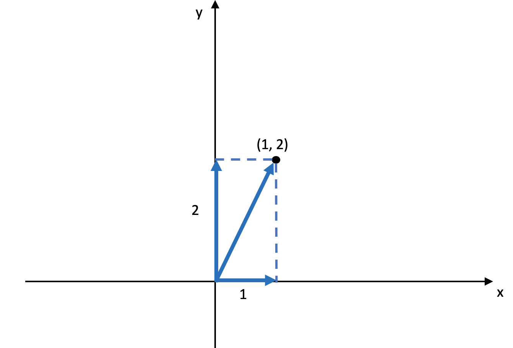
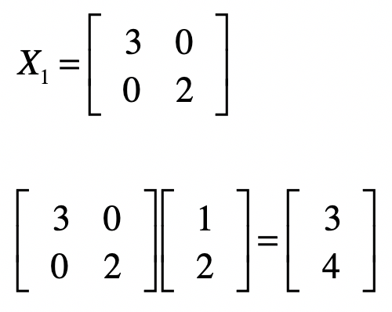
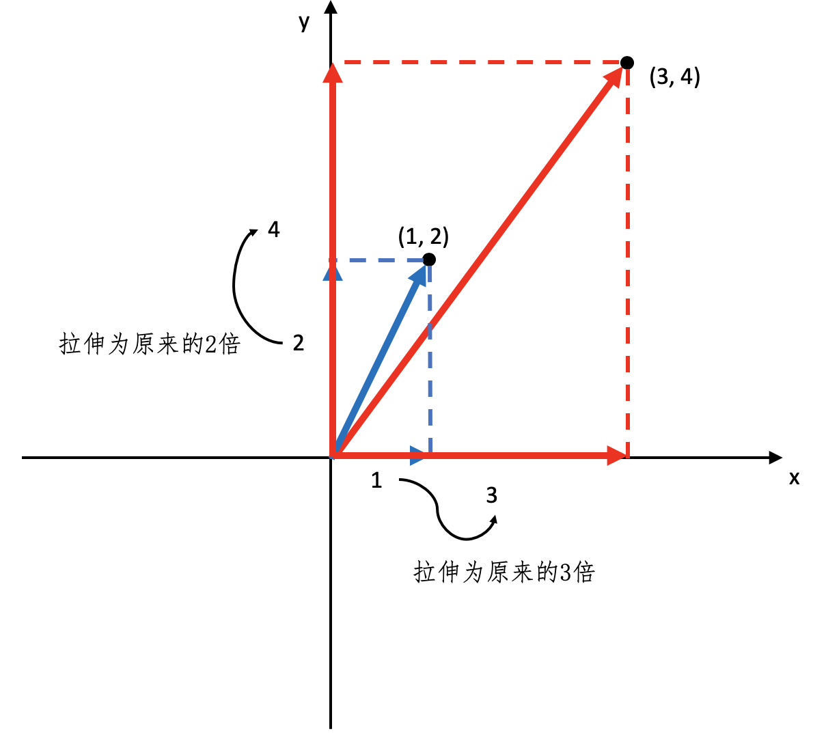
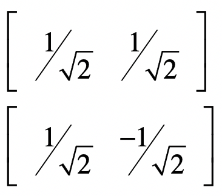
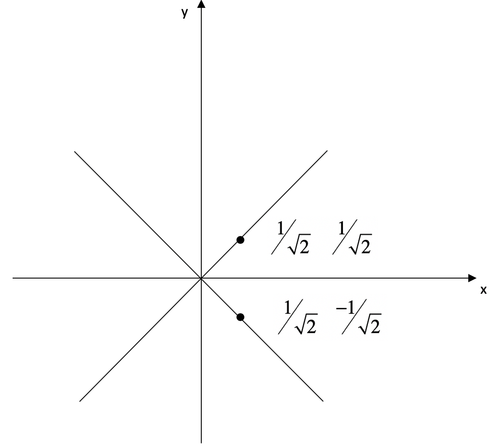
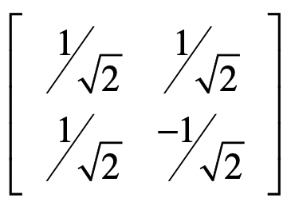
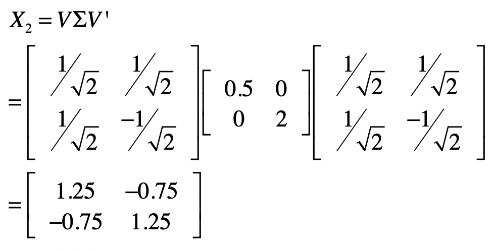
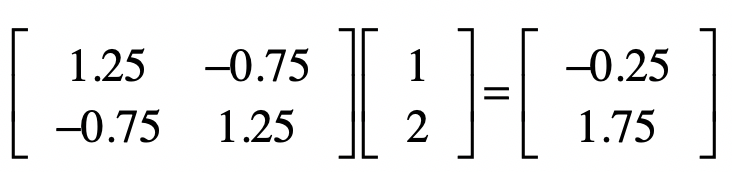
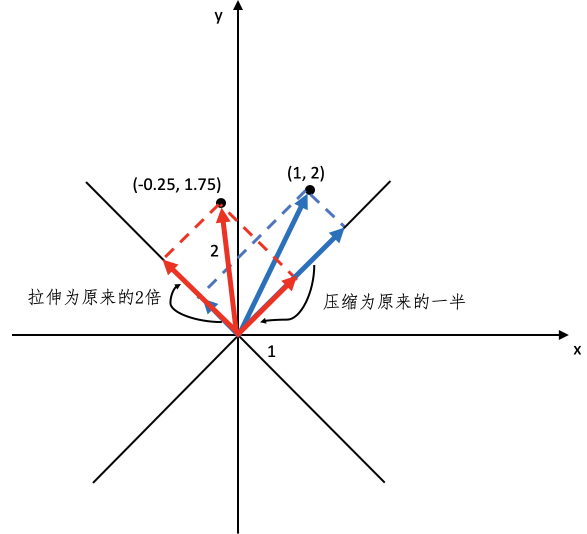

你好，我是黄申。今天是线性代数的答疑和总结。

在这个模块中，我们讲了不少向量、矩阵、线性方程相关的内容。看到大家在留言区的问题，今天我重点说说矩阵乘法的几何意义，以及为什么 SVD 中 的特征向量组成了 矩阵，而 的特征向量组成了 矩阵。最后，我会对整个线性代数的模块做一个总结。

## 矩阵乘法的几何意义

首先，我们来说说矩阵乘法所代表的几何意义。

在阐述 PCA 主成分分析的时候，我们聊过为什么这个方法要研究协方差矩阵的特征值和特征向量。其中，我提到对某个向量左乘一个矩阵，实际上是对这个向量进行了一次变换。某个矩阵的特征向量表示了这个矩阵在空间中的变换方向，这些方向都是正交或者趋于正交的，而特征值表示每个方向上伸缩的比例。今天，我会继续深入这个话题，结合实例，给出更详细地解释。

多维的向量空间很难理解，所以我们还是从最简单的二维空间开始。首先，我们需要明白什么是二维空间中的正交向量。正交向量的定义非常简单，只要两个向量的点乘结果为 0，那么它们就是正交的。在酉矩阵之中，矩阵和矩阵的转置相乘为单位矩阵，只有向量自己点乘自己值为 1，而不同向量之间点乘值为 0，所以不同的向量之间是正交的。

理解了正交向量之后，我们来定义一个二维空间，这个空间的横坐标为 ，纵坐标为 ，空间中的一个点坐标为 ，对于这个点，我们可以把从原点到它的直线投影到 轴和 轴，这个直线在 轴上投影的长度为 1，在 y 轴上投影的长度为 2。我使用下图来表示。

对于这个点，我们使用一个矩阵 左乘这个点的坐标，你可以看看会发生什么。

我们把结果转成坐标系里的点，它的坐标是 ，把从原点到 的直线，和从原点到 的直线进行比较，你会发现直线发生了旋转，而且长度也发生了变化，这就是矩阵左乘所对应的几何意义。我们还可以对这个矩阵 分析一下，看看它到底表示了什么含义，以及为什么它会导致直线的旋转和长度发生变化。

之前我讲过，要看一个矩阵的特征，需要分析它的特征向量和特征值。由于矩阵 是一个对角矩阵，所以特征值很容易求解，分别是 3 和 2。而对应的特征向量是 和 。在二维坐标中，坐标\[1, 0\]实际上表示的是 轴的方向，而\[0, 1\]实际上表示的是 轴的方向。特征值 3 对应特征向量\[1, 0\]就表明在 轴方向拉伸为原来的 3 倍，特征值 2 对应特征向量\[0, 1\]就表明在 轴方向拉伸 2 倍。所以，矩阵 的左乘，就表示把原有向量在 轴上拉伸为原来的 3 倍，而在 轴上拉伸为原来的 2 倍。我用下面这张图来展示。

我们还可以从另一个角度来验证这点，把从原点到 的直线进行分解，我们会发现这个直线在 轴上投影的长度为 3，为原来的 3 倍，而在 轴上投影的长度为 4，为原来的 2 倍。

当然，矩阵的特征向量不一定是 轴和 轴，它们可以是二维空间中任何相互正交的向量。下面，我们再来看一个稍微复杂一点的例子。这次我们从两个正交的向量开始。

我使用下面这张图展示了这两个向量在空间的方向。

然后我用这两个向量构建一个矩阵 。

之所以使用这样一个例子，是因为 是一个酉矩阵，也就是说 ，所以我们可以使用它，外加一个特征值组成的对角矩阵 ，来构建另一个用于测试的矩阵 。我在 SVD 的那一讲，介绍过对称方阵可以进行特征值分解，所以我们可以通过 和 ，获得一个对称方阵 。

我们假设两个特征值分别是 0.5 和 2，所以有：

根据我们之间的解释，如果让这个矩阵 左乘任何一个向量，就是让向量沿 方向压缩一半，而在 方向增加两倍。为了验证这一点，我们让 左乘向量 ，获得新向量：

把这个新的坐标 和原坐标 都放到二维坐标系中，并让它们分别在 和 这两个方向进行投影，然后比较一下投影的长度，你就会发现伸缩的变化了。我使用下面这张图来帮你理解。

弄清楚了矩阵左乘向量的几何意义，那么矩阵左乘矩阵的几何意义也就不难理解了。假设我们让矩阵 左乘矩阵 ，那么可以把右矩阵 看作一堆列向量的集合，而左乘矩阵 就是对每个 中的列向量进行变换。另外，如果二维空间理解了，那么三维、四维直到 维空间就可以以此类推了。

## SVD 分解中的 和 矩阵

在讲解 SVD 奇异值分解的时候，我们解释了 的特征向量组成了 SVD 中的 矩阵，而 的特征向量组成了 SVD 中的 矩阵。不过，我们还没有证明这两点。今天我来说说如何证明它们。首先，我们来看看 矩阵的证明。

其中， 的证明，我们在最小二乘法的讲解过程中证明过。另外， 是酉矩阵，所以 。 是对角矩阵，所以 ，而且 仍然是对角矩阵。

由于 是对角矩阵，所以通过 ，我们可以看出 中的向量就是 的特征向量，而特征值是 对角线上的值。

同理，我们也可以证明 中的向量就是 的特征向量。

从这个证明的过程，我们也发现了，XX’或者 X’X 特征值矩阵等于奇异值矩阵的平方，也就是说我们可以通过求出 X’X 特征值的平方根来求奇异值。

## 总结

回答完两个问题之后，我来总结一下线性代数这个模块。

线性代数最基本的概念包括了向量、矩阵以及对应的操作。向量表示了一组数的概念，非常适合表示一个对象的多维特征，因此被广泛的运用在信息检索和机器学习的领域中。而矩阵又包含了多个向量，所以适合表示多个数据对象的集合。同时，矩阵也可以用于表达二维关系，例如网页的邻接矩阵，用户对物品的喜好程度，关键词在文档中的 tf-idf 等等。

由于向量和矩阵的特性，我们可以把它们运用在很多算法和模型之中。向量空间模型定义了向量之间的距离或者余弦夹角，我们可以利用这些指标来衡量数据对象之间的相似程度，并把这种相似程度用于定义查询和文档之间的相关性，或者是文档聚类时的归属关系。矩阵的运算体现了对多个向量同时进行的操作，比如最常见的左乘，就可以用在计算 PageRank 值，协同过滤中的用户或者物品相似度等等。

当然，矩阵的运用还不只计算数据对象之间的关系。最小二乘法的实现、PCA 主成分的分析、SVD 奇异值的分解也可以基于矩阵的运算。这些都可以帮助我们发现不同维度特征之间的关系，并利用这些关系找到哪些特征更为重要，选择或者创建更为重要的特征。

有的时候，线性代数涉及的公式和推导比较繁琐。在思考的过程中，我们可以把矩阵的操作简化为向量之间的操作，而把向量之间的操作简化为多个变量之间的运算。另外，我们可以多结合实际的案例，结合几何空间、动手推算，甚至可以编程实现某些关键的模块，这些都有利于理解和记忆。

## 思考题

我想听你说说，学习完了编程领域中常用的线性代数知识，你有哪些收获和心得？

欢迎留言和我分享，也欢迎你在留言区写下今天的学习笔记。你可以点击“请朋友读”，把今天的内容分享给你的好友，和他一起精进。

本文深入探讨了矩阵乘法的几何意义，以及SVD中$X'X$的特征向量组成了$V$矩阵，而$XX'$的特征向量组成了$U$矩阵。首先，通过对二维空间中的正交向量和矩阵乘法的几何意义进行详细解释，阐述了矩阵左乘所对应的几何意义。其次，通过实例验证了矩阵左乘的几何意义，以及对矩阵的特征值和特征向量进行分析。接着，通过SVD分解中的$U$和$V$矩阵的证明，阐述了$X'X$的特征向量组成了$V$矩阵，而$XX'$的特征向量组成了$U$矩阵的过程。最后，总结了矩阵左乘矩阵的几何意义，以及SVD分解中的$U$和$V$矩阵的相关内容。 通过本文的阐述，读者可以快速了解矩阵乘法的几何意义，以及SVD中$U$和$V$矩阵的形成过程，为进一步深入学习线性代数提供了重要的基础知识。线性代数最基本的概念包括了向量、矩阵以及对应的操作。向量表示了一组数的概念，非常适合表示一个对象的多维特征，因此被广泛的运用在信息检索和机器学习的领域中。而矩阵又包含了多个向量，所以适合表示多个数据对象的集合。同时，矩阵也可以用于表达二维关系，例如网页的邻接矩阵，用户对物品的喜好程度，关键词在文档中的tf-idf等等。 由于向量和矩阵的特性，我们可以把它们运用在很多算法和模型之中。向量空间模型定义了向量之间的距离或者余弦夹角，我们可以利用这些指标来衡量数据对象之间的相似程度，并把这种相似程度用于定义查询和文档之间的相关性，或者是文档聚类时的归属关系。矩阵的运算体现了对多个向量同时进行的操作，比如最常见的左乘，就可以用在计算PageRank值，协同过滤中的用户或者物品相似度等等。 当然，矩阵的运用还不只计算数据对象之间的关系。最小二乘法的实现、PCA主成分的分析、SVD奇异值的分解也可以基于矩阵的运算。这些都可以帮助我们发现不同维度特征之间的关系，并利用这些关系找到哪些特征更为重要，选择或者创建更为重要的特征。 有的时候，线性代数涉及的公式和推导比较繁琐。在思考的过程中，我们可以把矩阵的操作简化为向量之间的操作，而把向量之间的操作简化为多个变量之间的运算。另外，我们可以多结合实际的案例，结合几何空间、动手推算，甚至可以编程实现某些关键的模块，这些都有利于理解和记忆。