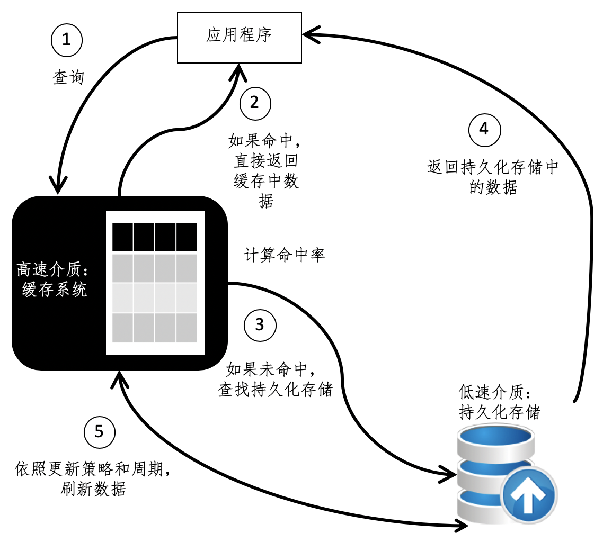
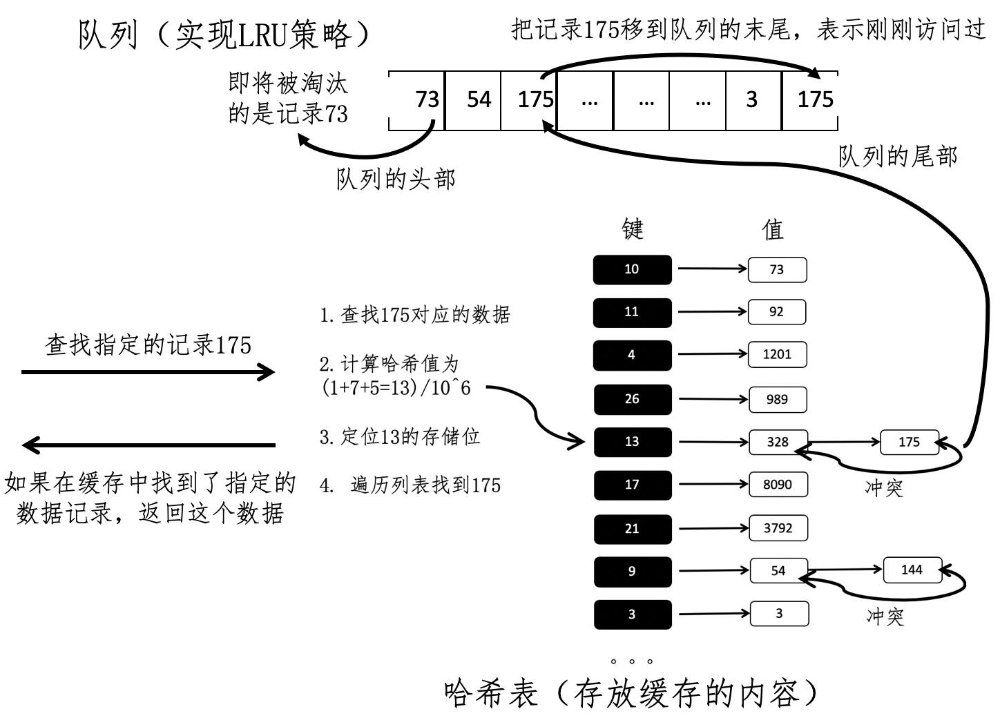

你好，我是黄申。

经过前三大模块的学习，我带你纵览了数学在各个计算机编程领域的重要应用。离散数学是基础数据结构和编程算法的基石，而概率统计论和线性代数，是很多信息检索和机器学习算法的核心。

因此，今天开始，我会综合性地运用之前所讲解的一些知识，设计并实现一些更有实用性的核心模块或者原型系统。通过这种基于案例的讲解，我们可以融会贯通不同的数学知识，并打造更加高效、更加智能的计算机系统。首先，让我们从一个缓存系统入手，开始综合应用篇的学习。

## 什么是缓存系统？

缓存（Cache）是计算机系统里非常重要的发明之一，它在编程领域中有非常非常多的应用。小到电脑的中央处理器（CPU）、主板、显卡等硬件，大到大规模的互联网站点，都在广泛使用缓存来提升速度。而在网站的架构设计中，一般不会像 PC 电脑那样采用高速的缓存介质，而是采用普通的服务器内存。但是网站架构所使用的内存容量大得多，至少是数个吉字节 （GB）。

我们可以把缓存定义为数据交换的缓冲区。它的读取速度远远高于普通存储介质，可以帮助系统更快地运行。当某个应用需要读取数据时，会优先从缓存中查找需要的内容，如果找到了则直接获取，这个效率要比读取普通存储更高。如果缓存中没有发现需要的内容，再到普通存储中寻找。

理解了缓存的概念和重要性之后，我们来看下缓存设计的几个主要考量因素。

第一个因素是硬件的性能。缓存的应用场景非常广泛，因此没有绝对的条件来定义何种性能可以达到缓存的资格，我们只要确保以高速读取介质可以充当相对低速的介质的缓冲。

第二个因素是命中率。缓存之所以能提升访问速度，主要是因为能从高速介质读取，这种情况我们称为“命中”（Hit）。但是，高速介质的成本是非常昂贵的，而且一般也不支持持久化存储，因此放入数据的容量必须受到限制，只能是全局信息的一部分。那么，一定是有部分数据无法在缓存中读取，而必须要到原始的存储中查找，这种情况称之为“错过”（Missed）。

我们通常使用能够在缓存中查找到数据的次数（），除以整体的数据访问次数（）计算命中率。如果命中率高，系统能够频繁地获取已经在缓存中驻留的数据，速度会明显提升。

接下来的问题就是，如何在缓存容量有限的情况下，尽可能的提升命中率呢？人们开始研究缓存的淘汰算法，通过某种机制将缓存中可能无用的数据剔除，然后向剔除后空余的空间中补充将来可能会访问的数据。

最基本的策略包括最少使用 LFU（Least Frequently Used）策略和最久未用 LRU（Least Recently Used）策略。LFU 会记录每个缓存对象被使用的频率，并将使用次数最少的对象剔除。LRU 会记录每个缓存对象最近使用的时间，并将使用时间点最久远的对象给剔除。很显然，我们都希望缓存的命中率越高越好。

第三个因素是更新周期。虽然缓存处理的效率非常高，但是，被访问的数据不会一成不变，对于变化速度很快的数据，我们需要将变动主动更新到缓存中，或者让原有内容失效，否则用户将读取到过时的内容。在无法及时更新数据的情况下，高命中率反而变成了坏事，轻则影响用户交互的体验，重则会导致应用逻辑的错误。

为了方便你的理解，我使用下面这张图，来展现这几个主要因素之间的关系，以及缓存系统的工作流程。

## 如何设计一个缓存系统？

了解这些基本概念之后，我们就可以开始设计自己的缓存系统了。今天，我重点讲解如何使用哈希表和队列，来设计一个基于最久未用 LRU 策略的缓存。

从缓存系统的工作流程可以看出，首先我们需要确认某个被请求的数据，是不是存在于缓存系统中。对于这个功能，哈希表是非常适合的。第 2 讲我讲过哈希的概念，我们可以通过哈希值计算快速定位，加快查找的速度。不论哈希表中有多少数据，读取、插入和删除操作只需要耗费接近常量的时间，也就是 O (1) 的时间复杂度 ，这正好满足了缓存高速运作的需求。

在第 18 讲，我讲了用数组和链表来构造哈希表。在很多编程语言中，哈希表的实现采用的是链地址哈希表。这种方法的主要思想是，先分配一个很大的数组空间，而数组中的每一个元素都是一个链表的头部。随后，我们就可以根据哈希函数算出的哈希值（也叫哈希的 key），找到数组的某个元素及对应的链表，然后把数据添加到这个链表中。之所以要这样设计，是因为存在哈希冲突。所以，我们要尽量找到一个合理的哈希函数，减少冲突发生的机会，提升检索的效率。

接下来，我们来聊聊缓存淘汰的策略。这里我们使用 LRU 最久未用策略。在这种策略中，系统会根据数据最近一次的使用时间来排序，使用时间最久远的对象会被淘汰。考虑到这个特性，我们可以使用队列。我在讲解广度优先搜索策略时，谈到了队列。这是一种先进先出的数据结构，先进入队列的元素会优先得到处理。如果充分利用队列的特点，我们就很容易找到上一次使用时间最久的数据，具体的实现过程如下。

第一，根据缓存的大小，设置队列的最大值。通常的做法是使用缓存里所能存放数据记录量的上限，作为队列里结点的总数的上限，两者保持一致。

第二，每次访问一个数据后，查看是不是已经存在一个队列中的结点对应于这个数据。如果不是，创造一个对应于这个数据的队列结点，加入队列尾部。如果是，把这个数据所对应的队列结点重新放入队列的尾部。需要注意，这一点是至关重要的。因为这种操作可以保证上一次访问时间最久的数据，所对应的结点永远在队列的头部。

第三，如果队列已满，我们就需要淘汰一些缓存中的数据。由于队列里的结点和缓存中的数据记录量是一致的，所以队列里的结点数达到上限值，也就意味着缓存也已经满了。刚刚提到，由于第二点的操作，我们只需要移除队列头部的结点就可以了。

综合上述关于哈希表和队列的讨论，我们可以画出下面这张框架图。

从这张图可以看到，我们使用哈希表来存放需要被缓存的内容，然后使用队列来实现 LRU 策略。每当数据请求进来的时候，缓存系统首先检查数据记录是不是已经存在哈希表中。如果不存在，那么就返回没有查找到，不会对哈希表和队列进行任何的改变；如果已经存在，就直接从哈希表读取并返回。

与此同时，在队列中进行相应的操作，标记对应记录最后访问的次序。队列头部的结点，对应即将被淘汰的记录。如果缓存或者说队列已满，而我们又需要插入新的缓存数据，那么就需要移除队列头部的结点，以及它所对应的哈希表结点。

接下来，我们结合这张图，以请求数据记录 175 为例，详细看看在这个框架中，每一步是如何运作的。

这里的哈希表所使用的散列函数非常简单，是把数据的所有位数加起来，再对一个非常大的数值例如 10^6 求余。那么，175 的哈希值就是 (1+7+5)/10^6=13。通过哈希值 13 找到对应的链表，然后进行遍历找到记录 175。这个时候我们已经完成了从缓存中获取数据。

不过，由于使用了 LRU 策略来淘汰旧的数据，所以还需要对保存访问状态的队列进行必要的操作。检查队列，我们发现表示 175 的结点已经在队列之中了，说明最近这条数据已经被访问过，所以我们要把这个结点挪到队列的最后，让它远离被淘汰的命运。

我们再来看另一个例子，假设这次需要获取的是数据记录 1228，这条记录并不在缓存之中，因此除了从低速介质返回获取的记录，我们还要把这个数据记录放入缓存区，并更新保存访问状态的队列。和记录 175 不同的是，1228 最近没有被访问过，所以我们需要在队列的末尾增加一个表示 1201 的结点。这个时候，队列已经满了，我们需要让队列头部的结点 73 出队，然后把相应的记录 73 从哈希表中删除，最后把记录 1228 插入到哈希表中作为缓存。

## 总结

当今的计算机系统中，缓存扮演着非常重要的角色，小到 CPU，大到互联网站点，我们都需要使用缓存来提升系统性能。基于哈希的数据结构可以帮助我们快速的获取数据，所以非常适合运用在缓存系统之中。

不过，缓存都需要相对昂贵的硬件来实现，因此大小受到限制。所以，我们需要使用不同的策略来淘汰不经常使用的内容，取而代之一些更有可能被使用的内容，增加缓存的命中率，进而提升缓存的使用效果。为了实现这个目标，人们提出了多种淘汰的策略，包括 LRU 和 LFU。

综合上面两点，我们提出一种结合哈希表和队列的缓存设计方案。哈希表负责快速的存储和更新被缓存的内容，而队列负责管理最近被访问的状态，并告知系统哪些数据是要被淘汰并从哈希表中移除。

## 思考题

请根据今天所讲解的设计思想，尝试编码实现一个基于 LRU 淘汰策略的缓存。哈希表部分可以直接使用编程语言所提供的哈希类数据结构。

欢迎留言和我分享，也欢迎你在留言区写下今天的学习笔记。你可以点击“请朋友读”，把今天的内容分享给你的好友，和他一起精进。

缓存系统在计算机领域扮演着重要角色，通过高效的访问方式提升系统速度。本文介绍了缓存系统的概念和设计考量因素。首先，缓存被定义为数据交换的缓冲区，其读取速度远高于普通存储介质，能够帮助系统更快地运行。硬件性能、命中率和更新周期是缓存设计的主要考量因素。命中率的提升可以通过缓存淘汰算法实现，如LFU和LRU策略。另外，及时更新数据对于变化速度快的数据至关重要，以避免用户读取到过时内容。通过深入了解这些因素之间的关系，读者可以更好地理解缓存系统的工作流程和重要性。 在设计缓存系统时，哈希表和队列是关键的数据结构。哈希表能够快速存储和更新被缓存的内容，而队列则负责管理最近被访问的状态，并告知系统哪些数据需要被淘汰并从哈希表中移除。通过结合哈希表和队列，可以实现基于LRU淘汰策略的缓存设计方案。这种设计思想能够帮助读者快速了解如何利用哈希表和队列来设计高效的缓存系统，提升系统性能。 总的来说，缓存在计算机系统中扮演着重要角色，而基于哈希表和队列的设计思想能够帮助实现高效的缓存系统，提升系统性能。读者可以通过本文了解到缓存系统的重要性以及如何利用哈希表和队列来设计缓存系统，从而加深对缓存系统工作原理的理解。