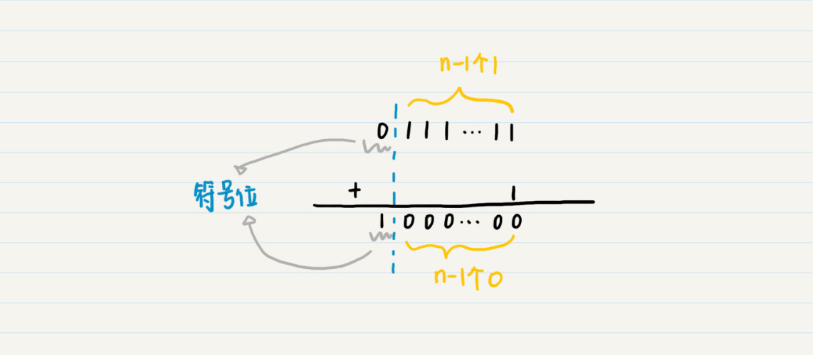
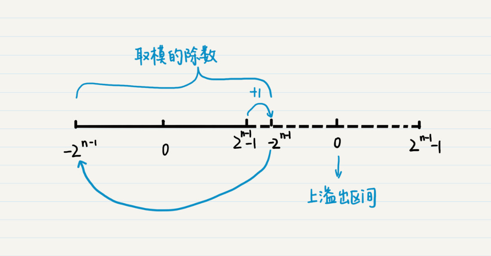
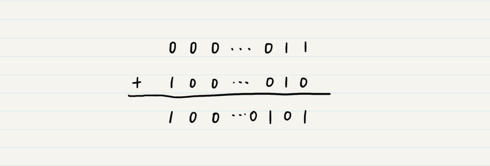
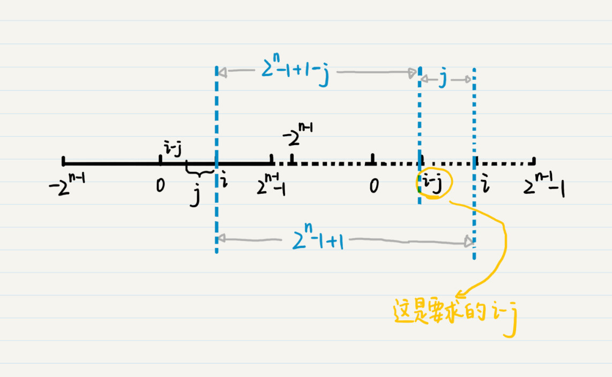
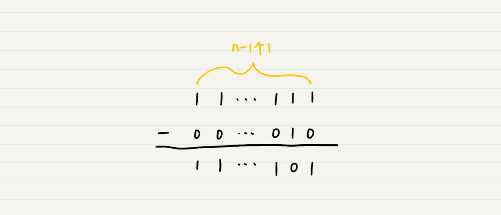
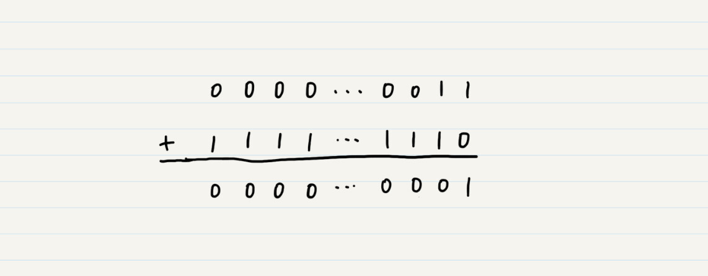

你好，我是黄申。欢迎来到第一次课外加餐时间。

专栏已经更新了几讲，看到这么多人在留言区写下自己的疑惑和观点，我非常开心。很多同学在留言里提出了很多非常好的问题，所以我决定每隔一段时间，对留言里的疑问、有代表性的问题做个集中的解答，也是对我们主线内容做一个补充，希望对你有帮助。

## 什么是符号位？为什么要有符号位？

在第 1 讲里，我介绍了十进制数转二进制数。这里面很多人对逻辑右移和算术右移中提到的符号位和补码有疑惑。这里面涉及了几个重要的概念，包括符号位、溢出、原码、反码和补码。我详细讲一下这几个点的来龙去脉。

首先我们来看，什么是符号位，为什么要有符号位？用一句话来概括就是，符号位是有符号二进制数中的最高位，我们需要它来表示负数。

在实际的硬件系统中，计算机 CPU 的运算器只实现了加法器，而没有实现减法器。那么计算机如何做减法呢？我们可以通过加上一个负数来达到这个目的。比如，3-2 可以看作 3+(-2)。因此，负数的表示对于计算机中的二进制减法至关重要。

那么，接下来的问题就是，如何让计算机理解哪些是正数，哪些是负数呢？为此，人们把二进制数分为有符号数（signed）和无符号数（unsigned）。

如果是有符号数，那么最高位就是符号位。当符号位为 0 时，表示该数值为正数；当符号位为 1 时，表示该数值为负数。例如一个 8 位的有符号位二进制数 10100010，最高位是 1，这就表示它是一个负数。

如果是无符号数，那么最高位就不是符号位，而是二进制数字的一部分，例如一个 8 位的无符号位二进制数 10100010，我们可以通过第 1 讲讲过的内容，换算出它所对应的十进制数是 162。由于没有表示负数的符号位，所有无符号位的二进制都代表正数。

有些编程语言，比如 Java，它所有和数字相关的数据类型都是有符号位的；而有些编程语言，比如 C 语言，它有诸如 unsigned int 这种无符号位的数据类型。

下面我们来看，什么是溢出？

在数学的理论中，数字可以有无穷大，也有无穷小。可是，现实中的计算机系统，总有一个物理上的极限（比如说晶体管的大小和数量），因此不可能表示无穷大或者无穷小的数字。对计算机而言，无论是何种数据类型，都有一个上限和下限。

在 Java 中，int 型是 32 位，它的最大值也就是上限是 2^31-1（最高位是符号位，所以是 2 的 31 次方而不是 32 次方），最小值也就是下限是 -2^31。而 long 型是 64 位，它的最大值，也就是上限是 2^63-1；最小值，也就是下限是 -2^63。

对于 n 位的数字类型，符号位是 1，后面 n-1 位全是 0，我们把这种情形表示为 -2^(n-1) ，而不是 2^(n-1)。一旦某个数字超过了这些限定，就会发生溢出。如果超出上限，就叫上溢出（overflow）。如果超出了下限，就叫下溢出（underflow）。

那么溢出之后会发生什么呢？我以上溢出为例来给你解释。

n 位数字的最大的正值，其符号位为 0，剩下的 n-1 位都为 1，再增大一个就变为了符号位为 1，剩下的 n-1 位都为 0。而符号位是 1，后面 n-1 位全是 0，我们已经说过这表示 -2^(n-1)。

那么就是说，上溢出之后，又从下限开始，最大的数值加 1，就变成了最小的数值，周而复始，这不就是余数和取模的概念吗？下面这个图可以帮助你理解。

其中右半部分的虚线表示已经溢出的区间，而为了方便你理解，我将溢出后所对应的数字也标在了虚线的区间里。由此可以看到，所以说，计算机数据的溢出，就相当于取模。而用于取模的除数就是数据类型的上限减去下限的值，再加上 1，也就是 (2^(n-1)-1)-(-2^(n-1))+1=2x2^(n-1)-1+1=2^n-1+1。

你可能会好奇，这个除数为什么不直接写成 2^n 呢？这是因为 2^n 已经是 n+1 位了，已经超出了 n 位所能表示的范围。

## 二进制的原码、反码及补码

理解了符号位和溢出，我接下来说说，什么是二进制的原码、反码和补码，以及我们为什么需要它们。

原码就是我们看到的二进制的原始表示。对于有符号的二进制来说，原码的最高位是符号位，而其余的位用来表示该数字绝对值的二进制。所以 +2 的原码是 000…010，-2 的的原码是 100.…010。

那么我们是不是可以直接使用负数的原码来进行减法计算呢？答案是否定的。我还是以 3+(-2) 为例。

假设我们使用 Java 中的 32 位整型来表示 2，它的二进制是 000…010。最低的两位是 10，前面的高位都是 0。如果我们使用 -2 的原码，也就是 100…010，然后我们把 3 的二进制原码 000…011 和 -2 的二进制原码 100…010 相加，会得到 100…0101。具体计算你可以看我画的这张图。

二进制编码上的加减法和十进制类似，只不过，在加法中，十进制是满 10 才进一位，二进制加法中只要满 2 就进位；同样，在减法中，二进制借位后相当于 2 而不是 10。

相加后的结果是二进制 100…0101，它的最高位是 1，表示负数，而最低的 3 位是 101，表示 5，所以结果就是 -5 的原码了，而 3+(-2) 应该等于 1，两者不符。

如果负数的原码并不适用于减法操作，那该怎么办呢？这个问题的解答还要依赖计算机的溢出机制。

我刚刚介绍了溢出以及取模的特性，我们可以充分利用这一点，对计算机里的减法进行变换。假设有 i-j，其中 j 为正数。如果 i-j 加上取模的除数，那么会形成溢出，并正好能够获得我们想要的 i-j 的运算结果。如果我说的还是不太好理解，你可以参考下面这张图。

我们把这个过程用表达式写出来就是 i-j=(i-j)+(2^n-1+1)=i+(2^n-1-j+1)。

其中 2^n-1 的二进制码在不考虑符号位的情况下是 n-1 位的 1，那么 2^n-1-2 的结果就是下面这样的：

从结果可以观察出来，所谓 2^n-1-j 相当于对正数 j 的二进制原码，除了符号位之外按位取反（0 变 1，1 变 0）。由于负数 -j 和正数 j 的原码，除了符号位之外都是相同的，所以，2^n-1-j 也相当于对负数 -j 的二进制原码，除了符号位之外按位取反。我们把 2^n-1-j 所对应的编码称为负数 -j 的反码。所以，-2 的反码就是 1111…1101。

有了反码的定义，那么就可以得出 i-j=i+(2^n-1-j+1)=i 的原码 +(-j 的反码)+1。

如果我们把 -j 的反码加上 1 定义为 -j 的补码，就可以得到 i-j=i 的原码 +(-j 的补码)。

由于正数的加法无需负数的加法这样的变换，因此正数的原码、反码和补码三者都是一样的。最终，我们可以得到 i-j=i 的补码 +(-j 的补码)。

换句话说，计算机可以通过补码，正确地运算二进制减法。我们再来用 3+(-2) 来验证一下。正数 3 的补码仍然是 0000…0011，-2 的补码是 1111…1110，两者相加，最后得到了正确的结果 1 的二进制。

可见，溢出本来是计算机数据类型的一种局限性，但在负数的加法上，它倒是可以帮我们大忙。

最后，给你留一道思考题吧。理解了负数的原码、反码和补码之后，你能算算看，8 位的有符号位二进制数 10100010，对应的是哪个十进制数吗？

好了，关于二进制的补充内容就到这里了。欢迎你继续留言给我。你也可以点击“请朋友读”，把今天的内容分享给你的好友，和他一起精进。

计算机中的二进制数表示涉及符号位、溢出、原码、反码和补码等重要概念。符号位用于表示正负数，而溢出则是计算机数据类型的一种局限性。原码是二进制的原始表示，而反码和补码则是为了解决负数的加法问题而引入的。通过补码，计算机可以正确地运算二进制减法。这些概念对于理解计算机中的二进制运算非常重要。文章通过具体的例子和图示，生动地解释了这些概念的应用和意义。读者可以通过本文了解到二进制数的表示方式及其运算规则，从而更好地理解计算机中的数据处理过程。