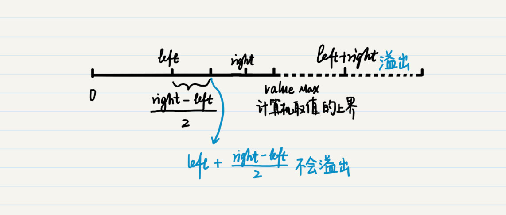

你好，我是黄申。欢迎来到第二次课外加餐时间。

## 0.1 位操作的应用实例

留言里很多同学对位操作比较感兴趣，我这里通过计算机中的位操作的几个应用，来帮你理解位操作。

### 0.1.1 1\. 验证奇偶数

在第 2 节里，我提到了，奇偶数其实也是余数的应用。编程中，我们也可以用位运算来判断奇偶数。

仔细观察，你会发现偶数的二进制最后一位总是 0，而奇数的二进制最后一位总是 1，因此对于给定的某个数字，我们可以把它的二进制和数字 1 的二进制进行按位“与”的操作，取得这个数字的二进制最后一位，然后再进行判断。

我这里写了一段代码，比较了使用位运算和模运算的效率，我统计了进行 1 亿次奇偶数判断，使用这两种方法各花了多少毫秒。如果在你的机器上两者花费的时间差不多，你可以尝试增加统计的次数。在我的机器上测试下来，同样次数的奇偶判断，使用位运算的方法耗时明显更低。

public class Lesson1\_append1 {

public static void main(String\[\] args) {

int even\_cnt \= 0, odd\_cnt = 0;

long start \= 0, end = 0;

start = System.currentTimeMillis();

for (int i \= 0; i < 100000000; i++) {

if((i & 1) == 0){

even\_cnt ++;

}else{

odd\_cnt ++;

}

}

end = System.currentTimeMillis();

System.out.println(end - start);

System.out.println(even\_cnt + " " + odd\_cnt);

even\_cnt = 0;

odd\_cnt = 0;

start = 0;

end = 0;

start = System.currentTimeMillis();

for (int i \= 0; i < 100000000; i++) {

if((i % 2) == 0){

even\_cnt ++;

}else{

odd\_cnt ++;

}

}

end = System.currentTimeMillis();

System.out.println(end - start);

System.out.println(even\_cnt + " " + odd\_cnt);

}

}

### 0.1.2 2\. 交换两个数字

你应该知道，要想在计算机中交换两个变量的值，通常都需要一个中间变量，来临时存放被交换的值。不过，利用异或的特性，我们就可以避免这个中间变量。具体的代码如下：

x = (x ^ y);

y = x ^ y;

x = x ^ y;

把第一步代入第二步中，可以得到：

y = (x ^ y) ^ y = x ^ (y ^ y) = x ^ 0 = x

把第一步和第二步的结果代入第三步中，可以得到：

x = (x ^ y) ^ x = (x ^ x) ^ y = 0 ^ y = y

这里用到异或的两个特性，第一个是两个相等的数的异或为 0，比如 x^x= 0；第二个是任何一个数和 0 异或之后，还是这个数不变，比如 0^y=y。

### 0.1.3 3\. 集合操作

集合和逻辑的概念是紧密相连的，因此集合的操作也可以通过位的逻辑操作来实现。

假设我们有两个集合{1, 3, 8}和{4, 8}。我们先把这两个集合转为两个 8 位的二进制数，从右往左以 1 到 8 依次来编号。

如果某个数字在集合中，相应的位置 1，否则置 0。那么第一个集合就可以转换为 10000101，第二个集合可以转换为 10001000。那么这两个二进制数的按位与就是 10000000，只有第 8 位是 1，代表了两个集合的交为{8}。而这两个二进制数的按位或就是 10001101，第 8 位、第 4 位、第 3 位和第 1 位是 1，代表了两个集合的并为{1, 3, 4, 8}。

说到这里，不禁让我想起 Elasticsearch 的 BitSet。我曾经使用 Elasticsearch 这个开源的搜索引擎来实现电商平台的搜索。

当时为了提升查询的效率，我使用了 Elasticsearch 的 Filter 查询。我研究了一下这个 Filter 查询的原理，发现它并没有考虑各种文档的相关性得分，因此它可以把文档匹配关键字的情况，转换成了一个 BitSet。

你可以把 BitSet 想成一个巨大的位数组。每一位对应了某篇文档是否和给定的关键词匹配，如果匹配，这一位就置 1，否则就置 0。每个关键词都可以拥有一个 BitSet，用于表示哪些文档和这个关键词匹配。那么要查看同时命中多个关键词的文档有哪些，就是对多个 BitSet 求交集。利用上面介绍的按位与，这点是很容易实现的，而且效率相当之高。

## 0.2 二分查找时的两个细节

第 3 节我介绍了迭代法，并讲解了相关的代码实现。其中，有两个细节我在这里补充说明一下。

第一个是关于中间值的计算。我优化了两处代码，分别是 Lesson3\_2 的第 16 行和 Lesson3\_3 的第 22 行。

其中，Lesson3\_2 的第 16 行由原来的：

double middle = (min + max) / 2;

改为：

double middle = min + (max - min) / 2;

Lesson3\_3 的第 22 行由原来的：

int middle \= (left + right) / 2;

改为：

int middle \= left + (right \- left) / 2;

这两处改动的初衷都是一样的，是为了避免溢出。在第一篇加餐中，介绍负数的加法时，我已经解释了什么是溢出。那这里为什么会发生溢出呢？我以第二处代码为例来讲解下。

从理论上来说，(left+right)/2=left+(right-left)/2。可是，我们之前说过，计算机系统有自身的局限性，无论是何种数据类型，都有一个上限或者下限。一旦某个数字超过了这些限定，就会发生溢出。

对于变量 left 和 right 而言，在定义的时候都指定了数据类型，因此不会超出范围。可是，left+right 的和就不一定了。从下图可以看出，当 left 和 right 都已经很接近某个数据类型的最大值时，两者的和就会超过这个最大值，发生上溢出。这也是为什么最好不用通过 (left+right)/2 来求两者的中间值。

那么为什么 left + (right -left)/2 就不会溢出呢？首先，right 是没有超过最大值的，那么 (right -left)/2 自然也就没有超过范围，即使 left 加上了 (right -left)/2，也不会超过 right 的值，所以运算的整个过程都不会产生溢出。

第二个是关于误差百分比和绝对误差。在 Lesson3\_2 中有这么一行：

double delta \= Math.abs((square / n) \- 1);

这里我使用了误差的百分比，也就是误差值占输入值 n 的比例。其实绝对误差也是可以的，不过我在这里考虑了 n 的大小。比如，如果 n 是一个很小的正整数，比如个位数，那么误差可能要精确到 0.00001。但是如果 n 是一个很大的数呢？比如几个亿，那么精确到 0.00001 可能没有多大必要，也许精确到 0.1 也就可以了。所以，使用误差的百分比可以避免由于不同的 n，导致的迭代次数有过大差异。

由于这里 n 是大于 1 的正整数，所以可以直接拿平方值 square 去除以 n。否则，我们要单独判断 n 为 0 的情况，并使用绝对误差。

## 0.3 关于迭代法、数学归纳法和递归

从第 3 节到第 6 节，我连续介绍了迭代法、数学归纳法、递归。这些概念之间存在相互联系，又不完全一样，很多同学对此也有一些疑惑。所以，这里我来帮你梳理一下。

迭代法和递归都是通过不断反复的步骤，计算数值或进行操作的方法。迭代一般适合正向思维，而递归一般适合逆向思维。而递归回溯的时候，也体现了正向递推的思维。它们本身都是抽象的流程，可以有不同的编程实现。

对于某些重复性的计算，数学归纳法可以从理论上证明某个结论是否成立。如果成立，它可以大大节约迭代法中数值计算部分的时间。不过，在使用数学归纳法之前，我们需要通过一些数学知识，假设命题，并证明该命题成立。

对于那些无法使用数学归纳法来证明的迭代问题，我们可以通过编程实现。这里需要注意的是，广义上来说，递归也是迭代法的一种。不过，在计算机编程中，我们所提到的迭代是一种具体的编程实现，是指使用循环来实现的正向递推，而递归是指使用函数的嵌套调用来实现的逆向递推。当然，两种实现通常是可以相互转换的。

循环的实现很容易理解，对硬件资源的开销比较小。不过，循环更适合“单线剧情”，例如计算 2^n，n!，1+2+3+…+n 等等。而对于存在很多“分支剧情”的复杂案例而言，使用递归调用更加合适。

利用函数的嵌套调用，递归编程可以存储很多中间变量。我们可以很轻松地跟踪不同的分支，而所有这些对程序员基本是透明的。如果这时使用循环，我们不得不自己创建并保存很多中间变量。当然，正是由于这个特性，递归比较消耗硬件资源。

递归编程本身就体现了分治的思想，这个思想还可以延伸到集群的分布式架构中。最近几年比较主流的 MapReduce 框架也体现了这种思想。

综合上面说的几点，你可以大致遵循这样的原则：

如果一个问题可以被迭代法解决，而且是有关数值计算的，那你就看看是否可以假设命题，并优先考虑使用数学归纳法来证明；

如果需要借助计算机，那么优先考虑是否可以使用循环来实现。如果问题本身过于复杂，再考虑函数的嵌套调用，是否可以通过递归将问题逐级简化；

如果数据量过大，可以考虑采用分治思想的分布式系统来处理。

最后，给你留一道思考题吧。

在 1 到 n 的数字中，有且只有唯一的一个数字 m 重复出现了，其它的数字都只出现一次。请把这个数字找出来。提示：可以充分利用异或的两个特性。

好了，前面 6 讲的补充内容就到这里了。欢迎你留言给我。你也可以点击“请朋友读”，把今天的内容分享给你的好友，和他一起精进。

本文通过三个实例展示了位操作的技术特点和应用场景。首先，位操作可以高效地判断奇偶数，展示了位操作的高效性。其次，利用异或运算可以实现在计算机中交换两个数字的值，避免了使用中间变量，提高了效率。最后，通过集合的二进制表示和位运算，展示了位操作在集合操作中的应用，以及在Elasticsearch中的实际应用场景。此外，还介绍了二分查找中的两个细节，分别是避免溢出的计算中间值和误差百分比的应用。这些实例充分展示了位操作在计算机编程中的重要性和实用性。文章还介绍了迭代法、数学归纳法和递归的概念及其联系，以及它们在计算机编程中的应用。文章最后提出了一个思考题，引发读者思考。