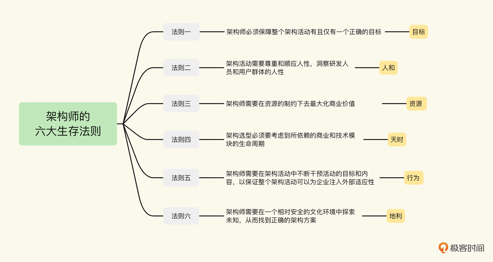
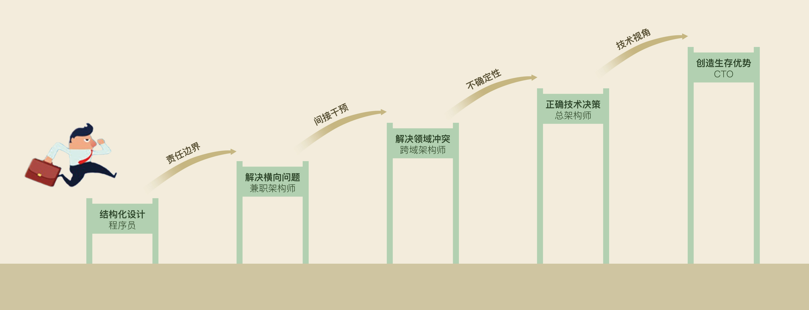

# 1 开篇定义
架构师不仅需要关注当下流行什么，要选择什么方案、用什么开源框架。
一个以架构师为职业的人，更需要有战略意图和思考力，比如：
+ 在一个架构活动中到底应该关注什么？干预什么？
+ 如何通过架构方案为团队或企业创造价值？
+ 如何在各种资源条件的制约下，去实现架构目标？
+ 如何通过价值创造让自己变得不可或缺？

# 2 建立你的架构师成长战略
要想在架构师这个职业上超越别人，你必须要尽早建立好你的架构师成长战略。
所谓战略意图，就是拥有与其资源和能力极不相称的雄心壮志。你把公司换成马斯克、乔布斯和蔡志忠等人，或者你身上，这句话同样适用。每个想达到顶峰的人，都应该有自己的战略意图。
哈莫与帕哈拉德还特别提到，只有这种极度的不相称性，才会让一个公司愿意突破常规，为自己创造机会，成功挑战不可能。

**假设你有做一个全球顶尖架构师的战略意图，那么我可以帮你把这个战略意图设计得更完美一点儿。**

# 3 总纲

## 3.1 六大生存法则
生存法则，就是你作为架构师必须要尊重的一些原则。如果违背，你指导的架构活动可能会面临巨大的失误，而你作为一个架构师的生存也会受到威胁。

影响架构活动成败的因素，主要有六个，分别是：
+ 目标
+ 输入
+ 输出
+ 商业和技术环境
+ 文化环境 
+ 架构活动本身

## 3.2 价值创造
价值创造指的是，从大型架构项目实施层面上考虑，你作为架构师必须要关注和干预一些重要的节点，然后在这个过程中去创造自己的增量价值。
架构活动分成八个节点：
+ 环境搭建
+ 目标确认
+ 可行性探索
+ 架构规划
+ 项目启动 
+ 阶段交付
+ 全面上线
+ 复盘

## 3.3 职业规划与成长
我把架构师的成长分解成五种能力，分别是
+ 单个模块的设计能力 
+ 解决横向问题的能力
+ 解决跨领域冲突的能力
+ 全局性技术决策的能力
+ 通过技术带来生存优势的能力

同时，我也把架构师的成长角色分为四种，分别是兼职架构师、跨域架构师、总架构师和 CTO。我会结合自己在这些角色中的经历和观察总结，提出助你突破障碍、完成能力跃迁的具体建议。**做架构师，战略意图很重要！**

## 3.4 思考力
思考力，在我看来这是一个架构师生存最核心的能力，甚至可以说是未来任何职业的核心能力。

我只能提供一些我和团队提升思考质量的方法，包括逻辑思维、批判思维、逆向工程、反思、跨越边界和数据分析。这些概念比较抽象，所以我会通过大大小小的案例来示范我常用的思考路径，提高你的认知。