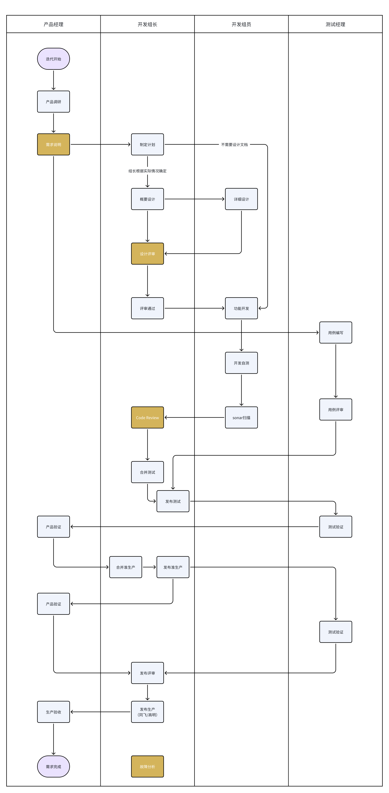

# 1 版本历史
- 1.0 舒小龙 2025.08.15 初始版本

# 2 岗位职责说明

## 2.1 开发组长

| 阶段    | 工作         | 产出       | 说明                                 |
| ----- | ---------- | -------- | ---------------------------------- |
| 迭代开始  | 理解需求       | 需求评审结果   | 参与需求说明                             |
| 迭代开始  | 迭代任务拆分     | tapd任务   | 拆解需求，在tapd中创建任务                    |
| 设计开始  | 编写概要设计     | 概要设计     | 对小组开发内容进行设计                        |
| 设计完成  | 组织详设评审     | 评审结果     | 组织相关人员进行详设评审                       |
| 功能点完成 | CodeReview | 评审结果     | merge request到测试分支时，组织开发、架构、相关人员评审 |
| 合并申请  | merge 审核   | 合并到测试、PP | 检查代码并合并到制定环境                       |
| 发布评审  | 组织发布评审     |          | 检查发布内容，配置修改等                       |
|       | 故障复盘       | 复盘报告     | 出现影响业务的bug时，组织复盘                   |
## 2.2 开发组员
| 阶段         | 工作     | 产出            | 说明                                   |
| ---------- | ------ | ------------- | ------------------------------------ |
| 迭代开始       | 需求理解   | 评审结果          | 参与需求说明会                              |
| 迭代开始       | 确认任务   |               | 理解分配任务与需求的关系                         |
| 详设开始       | 编写详细设计 | 详细设计          | 对自己开发需求，尽享详细设计                       |
| 详设完成       | 详设评审   | 评审提问          |                                      |
| 开发开始       | 创建本地分支 | 本地分支          | 一般从master创建，过程代码不直接提交                |
| 功能点完成      | 提交代码   | Commit注释      | 根据版本管理规范，与tapd任务ID关联                 |
| 功能点完成      | 手动扫描   | 扫描报告          | 扫描本地代码是否符合规范，并修改                     |
| 功能点完成      | 申请合并分支 | mrege request |                                      |
| CodeReview | 代码评审   | 评审答疑          | 提出代码评审，由组长组织评审，开发按照CodeReview流程宣讲、答疑 |
## 2.3 测试配合
| 阶段    | 工作   | 产出  | 说明              |
| ----- | ---- | --- | --------------- |
| 测试发布  | 版本部署 |     | 收集配置变更、数据库脚本，发布 |
| 预生产发布 | 版本部署 |     | 收集配置变更、数据库脚本，发布 |

# 3 团队协作
统一使用 TAPD 管理研发进度

### 3.1.1 开发任务
1. 需求：产品创建
2. 前后端子需求：开发组长创建
3. 任务：开发组员创建
4. 缺陷：测试创建
开发人员领取 需求 或 缺陷，作为自己开发任务的起点、依据。
### 3.1.2 工时记录
1. 每天的工时消耗，记录到 TAPD  
2. 没有对应需求的，找产品、开发组长创建

# 4 版本管理
## 4.1 分支管理
| 环境   | 发布分支           | 合并人  | 备注                                          |
| ---- | -------------- | ---- | ------------------------------------------- |
| dev  | develop-merge  | 开发组员 |                                             |
| test | test-merge     | 开发组长 |                                             |
| pp   | release-{迭代日期} | 开发组长 | pp不保留跨迭代代码                                  |
| prod | master         | 开发组长 | 由release-{迭代日期}合并到master<br><br>以后规划由pp镜像升级 |

## 4.2 GitLab 分支命名
正常需求：feature-{20240919}-{需求编号}-内容说明
+ 默认基于master分支创建

线上问题：hotfix-{日期}-{bug编号}-内容说明
+ 默认基于master分支创建

正常发布：release-{日期}
+ 默认基于master分支创建

## 4.3 代码提交

### 4.3.1 提交作者名字
> 规范提交作者名字，便于追溯  
```
查看

git config user.name

全局设置

git config --global user.name "你的企微名字"

按项目设置，必须在项目目录执行

git config user.name "你的企微名字"
```

## 4.4 数据库脚本管理
> TODO

# 5 代码评审
## 5.1 发起评审
1. 开发组长发起评审  
2. 邀请兄弟部门参加（至少一人）  
3. 邀请架构组参加  
   - a. 架构组抽查  
   - b. 2 次/组/月  
4. 开发者在 Merge Request 中将参会人员添加为 Reviewer


## 5.2 评审流程
1. 检查 Sonar 报告  
2. 代码实现宣讲、解释  
3. 在 GitLab Merge Request 中记录问题  
   - a. 易于阅读  
   - b. 符合编码规范  
   - c. 逻辑检查  
   - d. 安全审查  
   - e. 性能审查  
4. 开发者回应、修改


# 6 故障复盘
## 6.1 典型问题处理记录
> 线上问题处理后，针对典型场景，记录到知识库  
> 模版：....

## 6.2 生产复盘报告
**触发条件：**  
1. 造成生产数据错误  
2. 造成业务阻塞，6 小时内不能修复  

**事后要求：**  
编写复盘报告，并由（组长）组织复盘会议。  
> 复盘报告模版：....

# 7 附录一：命名规则
## 7.1 项目命名
- 统一为 `iflorens`，所有服务名前缀均为 `iflorens`

## 7.2 服务命名
- 统一为小写英文字母

| **服务名**   | **完整服务名称**         | **说明** |
| --------- | ------------------ | ------ |
| contract  | iflorens-contract  | 合同服务   |
| container | iflorens-container | 箱管服务   |
| mnr       | iflorens-mnr       | 修箱服务   |
| ram       | iflorens-ram       | 用户中心   |
| file      | iflorens-file      | 文件服务   |
| sync      | iflorens-sync      | 数据同步   |

## 7.3 模块命名
- 趋势：以 package 形式存在的模块转化为服务

| **服务名**   | **模块名** | **说明**                                  |
| --------- | ------- | --------------------------------------- |
| contract  | ctm     | 合同管理（Contract Management）               |
| contract  | mcm     | 客商管理（Merchant Management）               |
| container | odm     | 订单管理（Order Management）                  |
| container | mvm     | 动态管理（Movement Management）               |
| container | mrm     | 修箱管理（Maintenance and Repair Management） |
## 7.4 环境名称
| **环境名称** | **说明**                 |
| -------- | ---------------------- |
| dev      | 开发环境，开发人员集成测试          |
| test     | 测试环境，测试人员专用环境          |
| pp       | 预生产环境，用于用户测试预计下个版本发布内容 |
| prod     | 生产环境，正式环境              |

## 7.5 数据库命名
- 格式：数据库名称 = {服务名称}-{环境名称}
  - 开发环境: `iflorens-mdm-dev`  
  - 测试环境: `iflorens-mdm-test`  
  - 预生产环境: `iflorens-mdm-pp`  
  - 生产环境: `iflorens-mdm-prod`

## 7.6 表命名
表命名={服务名｜模块名}-{业务名}-{修饰名}
1. 模块名：根据3.3定义的模块名
2. 业务名：根据表所表达的业务名
3. 修饰名：根据表的从属关系修饰

如：订单管理模块下的订单和订单明细
订单：order，odm_order
订单明细：order_detail，odm_order_detail

## 7.7 表公共字段
| **字段名**     | **类型**         | **标题** | **说明**                    |
| ----------- | -------------- | ------ | ------------------------- |
| id          | int8           | 表主键    | 数据的主键                     |
| create_name | varchar(50)    | 创建人姓名  | 创建人的姓名，在新增数据时自动赋值         |
| create_by   | varchar(50)    | 创建人账号  | 创建人的login name，在新增数据时自动赋值 |
| update_name | varchar(50)    | 修改人姓名  | 修改人的姓名，在修改数据时自动赋值         |
| update_by   | varchar(50)    | 修改人账号  | 修改人的login name，在修改数据时自动赋值 |
| create_time | timestamptz(6) | 创建时间   | 数据创建的时间                   |
| update_time | timestamptz(6) | 修改时间   | 数据修改的时间                   |
| version     | int4           | 行版本号   | 行版本号，用于乐观锁判断，更新时自动增加      |
| is_void     | int2           | 是否删除   | 逻辑删除标识，有这个字段时此表是逻辑删除      |

## 7.8 表结构设计
表结构设计时命名：
1. 字段名统一采用小写，名词间采用_（下划线）分开
2. 需要提供PS对应的表结构以及映射关系，需要尽量保持一致以便后续数据可以进行同步
3. 表需要有主键，主键统一采用长整型类型，名称为：id

## 7.9 S3 桶命名规范
iFlorens中使用到S3进行文件存储

桶名的统一名称规范为：{服务名}-{环境名称}，如：

| **服务名**   | **Dev环境**     | **Test环境**     | **PP环境**     | **PROD环境**     |
| --------- | ------------- | -------------- | ------------ | -------------- |
| mdm       | mdm-dev       | mdm-test       | mdm-pp       | mdm-prod       |
| contract  | contract-dev  | contract-test  | contract-pp  | contract-prod  |
| container | container-dev | container-test | container-pp | container-prod |
| ram       | ram-dev       | ram-test       | ram-pp       | ram-prod       |

## 7.10 MQ 队列命名
队列名=Topic\_{服务名｜模块名}\_{业务名}\_{环境名}
1. 服务名：根据3.2定义的服务名
2. 业务名：根据队列消息所表达的业务名
3. 环境名：根据3.4定义的环境名
如：Topic_iflorens_mvm_sendMail_dev
1. iflorens_mvm：箱动态服务
2. sendMail：发送邮件
3. Dev：开发环境使用

## 7.11 Redis Key 命名
键名={服务名|模块名}\_{业务名}\_{描述}
如：odm_booking_orderNo
